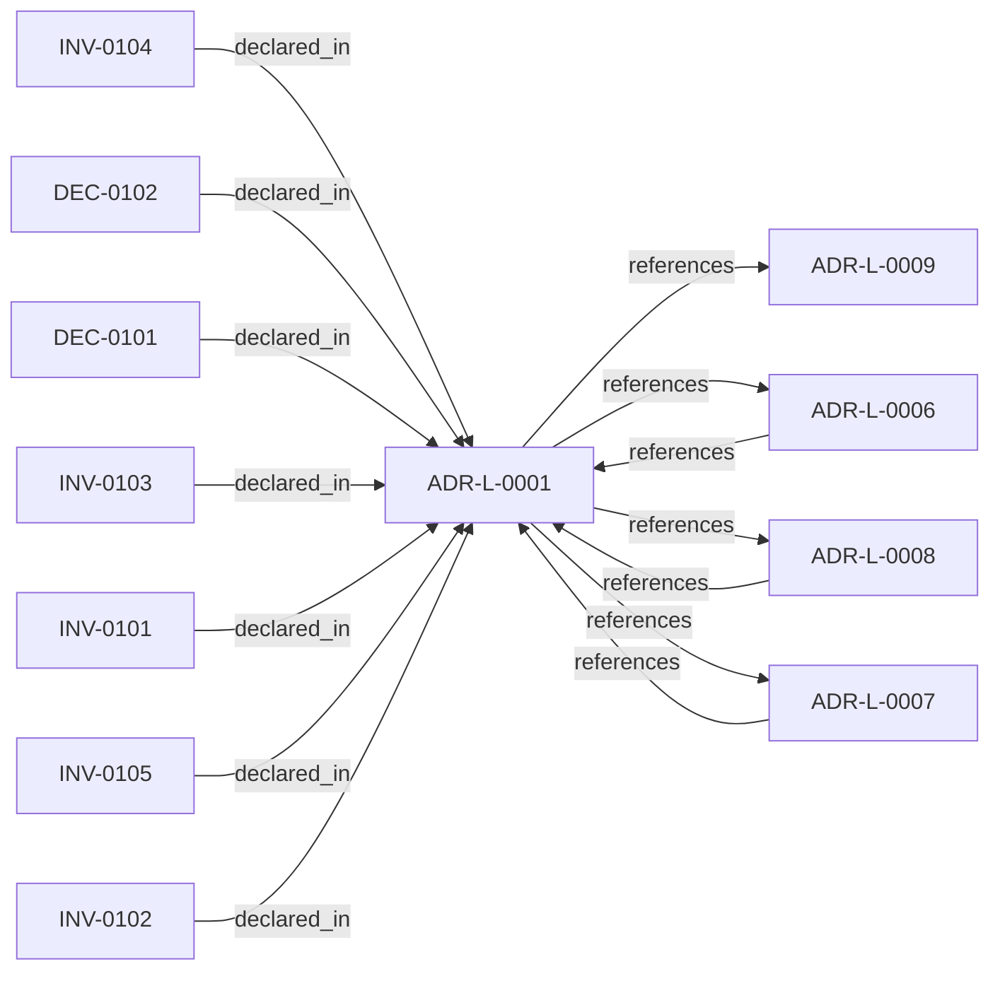

<!--
integrity_schema_version: 1
generated: deterministic_projection_v1
artifact_kind: rendered_adr_markdown
generator_id: adr-projection-markdown
generator_version: 2
hash_algorithm: sha256
source_hash: 0dc245ed03b4583358635a3c2963369494b5f6068da1a60d6a43f1cb755e6d82
rendered_hash: 149b8ecfe35d939c4a4d441ff36c6871e225cb1cbec30bdc58cf142237bb741c
-->

# ADR-L-0001: Deterministic Extraction Over ML-Based Inference

**Status:** accepted  
**Created:** 2025-12-19  
**Modified:** 2026-03-29  
**Authors:** Erik Gallmann, ste-spec  
**Domains:** extraction, documentation-state, recon  
**Tags:** deterministic-extraction, ast, reproducibility, ai-doc-fabric  
**Alias name:** deterministic-extraction-over-ml-based-inference  

## Context

AI-DOC Fabric must extract architectural elements from source code. Candidate approaches
include deterministic extraction (language-native AST parsers and explicit framework
patterns) versus ML-based inference (embeddings, LLMs, probabilistic models).

The choice affects reproducibility of extraction results, auditability of outputs,
operational complexity and cost, confidence in query results, and the ability to explain
why something was extracted. Enterprise documentation requires high confidence that
reported dependencies reflect actual code rather than probabilistic inference.

Legacy human projection: `adrs/published/ADR-001-deterministic-extraction.md` (accepted
2025-12-19). Related machine ADRs: **ADR-L-0006** (explicit unknowns), **ADR-L-0007**
(slice identity), **ADR-L-0008** (correctness and consistency contract).

**ste-spec entity id convention (this ADR):** `DEC-01xx`, `INV-01xx`, and `GAP-01xx`
use the leading `01` digit group to tie decisions, invariants, and gaps to **legacy
ADR-001** / machine **ADR-L-0001**. The separate **ADR-L-1001–1009** kernel governance
series uses other numeric blocks (for example `DEC-61xx`, `INV-50xx`) and is unrelated
to this `01xx` allocation.

## Relationship graph

## Related ADRs

### ADR-L-0006 — Explicit Unknowns Over Inference

**Relationships:**
- 01a04e96-1f5a-73a4-8e3f-bef43b56c052 -[:references]-> this ADR
- this ADR -[:references]-> 01a04e96-1f5a-73a4-8e3f-bef43b56c052

**Context:** When extractors cannot fully determine relationships or properties, the system must not
silently guess. This ADR-L encodes explicit **unknowns** alongside known facts.

[Open projection](ADR-L-0006-explicit-unknowns-over-inference.md)
### ADR-L-0007 — Slice Identity Strategy

**Relationships:**
- 01a04e96-1f5a-7ea8-b832-ea3972a2f81e -[:references]-> this ADR
- this ADR -[:references]-> 01a04e96-1f5a-7ea8-b832-ea3972a2f81e

**Context:** Slices require unique, stable, deterministic identifiers derived from **observable**
semantic anchors (contracts, paths, source paths, table names) rather than volatile
implementation labels alone.

[Open projection](ADR-L-0007-slice-identity-strategy.md)
### ADR-L-0008 — Correctness and Consistency Contract

**Relationships:**
- 01a04e96-1f5a-7a29-b11e-4fe242be290c -[:references]-> this ADR
- this ADR -[:references]-> 01a04e96-1f5a-7a29-b11e-4fe242be290c

**Context:** Defines user-visible **correctness** and **consistency** guarantees for Fabric
documentation-state queried over extracted and asserted facts, including partial
failures, overlapping reconciliation jobs, provenance coexistence, and multi-region
eventual consistency.

[Open projection](ADR-L-0008-correctness-and-consistency-contract.md)
### ADR-L-0009 — Assertion Precedence Model

**Relationships:**
- this ADR -[:references]-> 01a04e96-1f5a-70b0-a91f-0d25282f542c

**Context:** Manual assertions and deterministic extraction can describe the same elements. The model
preserves both with provenance, surfaces contradictions, requires evidence for human
claims, and supports time-bounded validity.

[Open projection](ADR-L-0009-assertion-precedence-model.md)

## Invariants

### INV-0101

**Statement:** Architecture slice generation from source code MUST be deterministic: identical inputs
(source artifacts, extractor configuration, extractor version) MUST produce
identical slice outputs.
  
**Scope:** global  
**Enforcement:** must (test)  
**Verification:** automated

**Rationale:**
Enables regression tests, auditability, and confident reprocessing when extractor logic improves.

### INV-0102

**Statement:** Extractors MUST use language-native parsing and explicit pattern rules for framework
and API detection; they MUST produce identical outputs for identical inputs per INV-0101.
  
**Scope:** global  
**Enforcement:** must (design)  
**Verification:** manual

**Rationale:**
Implements the concrete extractor discipline implied by deterministic extraction.

### INV-0103

**Statement:** The extraction graph MUST NOT assert architectural relationships using embeddings,
probabilistic models, or LLM inference over source code or extraction artifacts.
  
**Scope:** global  
**Enforcement:** must (policy)  
**Verification:** audit

**Rationale:**
Preserves auditability and prevents silent probabilistic graph mutation.

### INV-0104

**Statement:** When an LLM participates in natural-language query translation, it MUST NOT receive
extraction results as input for constructing or modifying architecture slices; failure
to translate MUST fall back to structured query paths without inventing graph content.
  
**Scope:** global  
**Enforcement:** must (design)  
**Verification:** audit

**Rationale:**
Keeps DEC-0102 compatible with deterministic slice authority.

### INV-0105

**Statement:** When deterministic rules cannot observe a relationship or element, the system MUST
record explicit unknowns per **ADR-L-0006** rather than inferring or guessing.
  
**Scope:** global  
**Enforcement:** must (policy)  
**Verification:** automated

**Rationale:**
Aligns extraction behavior with explicit-unknown semantics and downstream truth contracts.

## Decisions

### DEC-0101: Use deterministic extraction exclusively for generating architecture slices from source code

**Rationale:**
Fabric will use deterministic extraction only for slice generation from source.
Extractors parse code with language-native AST tooling and detect framework usage
through explicit rules (illustrative examples in the legacy ADR: Python `ast.parse`,
TypeScript Compiler API, JavaParser/JDT, `go/parser`; explicit patterns such as
FastAPI/Express/Spring route decorators).

Probabilistic matching is out of scope for graph construction: no embeddings for code
similarity, no LLM inference for architectural relationships, no supervised ML for
element typing in the extraction graph.

**Alternatives Considered:**

- **LLM-based code understanding**: Non-deterministic outputs, hallucination risk, cost and latency at codebase scale,
weak auditability for enterprise stakeholders who require explainable, repeatable
extractions for critical documentation.

- **Embedding-based similarity**: Similarity does not imply architectural dependency; threshold tuning is fragile;
proximity does not explain why a link exists.

- **Hybrid AST plus ML for ambiguity**: Dual systems increase maintenance and inconsistency (some slices deterministic,
others probabilistic); ambiguity boundaries become arbitrary; explicit unknowns are
preferable to incorrect inference.

- **General-purpose static analysis tools as primary extractors**: Not designed for architecture slice taxonomy; insufficient metadata for slice model;
heterogeneous per-language tooling; licensing constraints. Such tools may still feed
inputs to custom extractors without becoming the primary extraction mechanism.

**Consequences:**

**Positive:**
- Identical source and extractor version yield identical outputs (regression testing, auditable reprocessing).
- Every slice traces to file, line, and extractor logic (explainability).
- No model drift, retraining, or GPU inference path for extraction graph construction.
- Lower operational cost and faster extraction versus ML inference for graph edges.

**Negative:**
- Cannot infer relationships absent observable patterns (dynamic loading, reflection, uncodified convention).
- Per-language and per-framework extractor development and maintenance burden.
- Ambiguity yields explicit unknowns rather than guessed edges; dynamic systems may look incomplete without manual assertions.
- Mainstream framework coverage is easiest; niche or legacy stacks need bespoke extractors.

### DEC-0102: Optional natural-language query translation may use an LLM as a one-way query translator

**Rationale:**
An intelligence service MAY translate natural language into structured queries using an
LLM. The LLM sees the query (and metadata needed for translation), not extraction
results, and translation is one-way into a structured query with fail-closed fallback
when translation fails. This boundary keeps slice construction deterministic while
allowing conversational interfaces upstream of structured retrieval.

**Consequences:**

**Positive:**
- Structured query path remains deterministic; LLM is not an extractor for graph edges.

**Negative:**
- Translation quality and availability still depend on the NL translation component and must fail closed.

## Gaps

### GAP-0101: Further align extraction query surfaces with Architecture IR assertion payloads when schemas land

**Impact:** low  
**Blocking:** No

### GAP-0102: Formal performance SLOs for per-file extraction (legacy target cited sub-100ms for small files)

**Impact:** low  
**Blocking:** No

---

*Generated from ADR-L-0001 by ADR Architecture Kit*