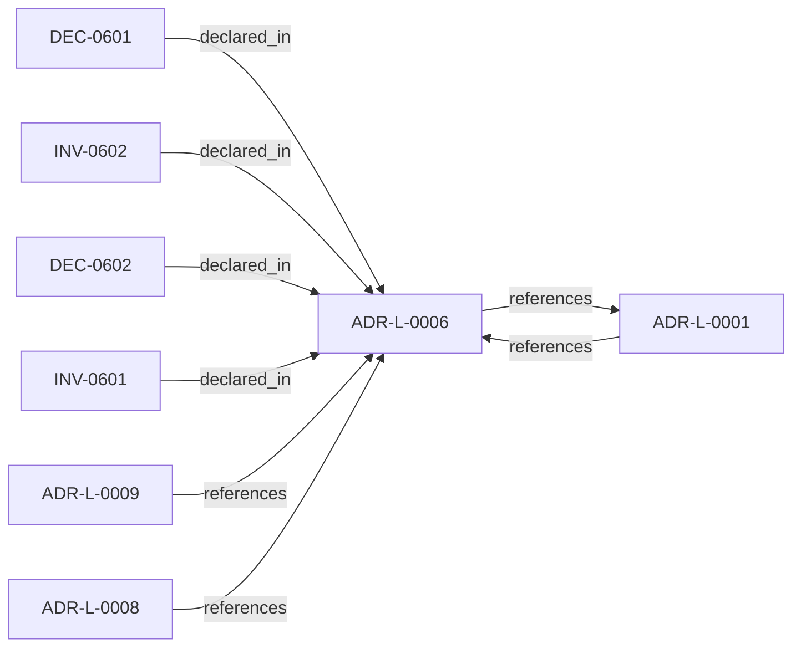

<!--
integrity_schema_version: 1
generated: deterministic_projection_v1
artifact_kind: rendered_adr_markdown
generator_id: adr-projection-markdown
generator_version: 2
hash_algorithm: sha256
source_hash: 792085bdce4b8a8f11f24835663b2f48918af53b6f1105b3bfb08ad85a874004
rendered_hash: c158680e7f08e36b56a25e63a19cddb7d870036befe9fac34139444204d55f44
-->

# ADR-L-0006: Explicit Unknowns Over Inference

**Status:** accepted  
**Created:** 2025-12-19  
**Modified:** 2026-03-29  
**Authors:** Erik Gallmann, ste-spec  
**Domains:** extraction, documentation-state, recon  
**Tags:** unknowns, transparency, extraction  
**Alias name:** explicit-unknowns-over-inference  

## Context

When extractors cannot fully determine relationships or properties, the system must not
silently guess. This ADR-L encodes explicit **unknowns** alongside known facts.

Legacy human projection: `adrs/published/ADR-006-explicit-unknowns.md`. Aligns with
**ADR-L-0001** (deterministic extraction; unknowns when patterns are not observable).

**Reconciliation vs ADR-L-100x:** **coexist-with-precedence** — kernel governance ADRs
(1001–1009) govern admission and documentation-state authority at the STE kernel
boundary; this ADR governs **Fabric extraction and slice truth** semantics. If a
conflict appears, kernel governance precedes for **admission**, this ADR for **slice
unknown recording** unless explicitly merged in a future ADR-L.

## Relationship graph

## Related ADRs

### ADR-L-0001 — Deterministic Extraction Over ML-Based Inference

**Relationships:**
- 01a04e96-1f5a-765c-b22f-a35555c5da2c -[:references]-> this ADR
- this ADR -[:references]-> 01a04e96-1f5a-765c-b22f-a35555c5da2c

**Context:** AI-DOC Fabric must extract architectural elements from source code. Candidate approaches
include deterministic extraction (language-native AST parsers and explicit framework
patterns) versus ML-based inference (embeddings, LLMs, probabilistic models).

[Open projection](ADR-L-0001-deterministic-extraction-over-ml-based-inference.md)
### ADR-L-0008 — Correctness and Consistency Contract

**Relationships:**
- 01a04e96-1f5a-7a29-b11e-4fe242be290c -[:references]-> this ADR

**Context:** Defines user-visible **correctness** and **consistency** guarantees for Fabric
documentation-state queried over extracted and asserted facts, including partial
failures, overlapping reconciliation jobs, provenance coexistence, and multi-region
eventual consistency.

[Open projection](ADR-L-0008-correctness-and-consistency-contract.md)
### ADR-L-0009 — Assertion Precedence Model

**Relationships:**
- 01a04e96-1f5a-70b0-a91f-0d25282f542c -[:references]-> this ADR

**Context:** Manual assertions and deterministic extraction can describe the same elements. The model
preserves both with provenance, surfaces contradictions, requires evidence for human
claims, and supports time-bounded validity.

[Open projection](ADR-L-0009-assertion-precedence-model.md)

## Invariants

### INV-0601

**Statement:** When extraction cannot determine a relationship or property that belongs in the slice
model, the system MUST record an explicit unknown rather than inventing a definitive
edge or attribute from heuristics alone.
  
**Scope:** global  
**Enforcement:** must (policy)  
**Verification:** audit

**Rationale:**
Preserves honesty and aligns with ADR-L-0001 prohibition on probabilistic graph assertions.

### INV-0602

**Statement:** Unknowns MUST be first-order records in the slice documentation contract (queryable and
attributable), not only log lines or informal notes.
  
**Scope:** global  
**Enforcement:** must (design)  
**Verification:** manual

**Rationale:**
Ensures unknowns are visible to APIs, audits, and humans—not buried in logs.

## Decisions

### DEC-0601: Track extraction unknowns with the same rigor as known elements

**Rationale:**
Fabric MUST represent gaps explicitly so consumers can trust query results and
prioritize extractor work. Rejected alternatives: heuristic inference (hides
uncertainty), omitting elements (loses partial knowledge), vague low-confidence flags
(not actionable).

**Alternatives Considered:**

- **Heuristic inference for gaps**: Produces false positives and indistinguishable provenance versus deterministic extraction.

- **Omit elements when extraction is incomplete**: Loses partial information and visibility into gaps.

- **Whole-slice low-confidence flag only**: Too coarse to query, assert against, or prioritize fixes.

**Consequences:**

**Positive:**
- Honest, queryable representation of limits

**Negative:**
- Incomplete graphs and user education burden

### DEC-0602: Use categorized unknown records attached to slices

**Rationale:**
Unknowns SHOULD carry a stable category (e.g. opaque boundary, unsupported language,
incomplete extraction, manual assertion needed) and descriptive context so reporting
and APIs can filter and aggregate. Operational surfaces (HTTP APIs, event feeds) are
implementation details outside this ADR-L.

**Consequences:**

**Positive:**
- Gap visibility drives extractor prioritization

**Negative:**
- Requires consistent category vocabulary maintenance

## Gaps

### GAP-0601: Normative machine schema for unknown records in Architecture IR

**Impact:** medium  
**Blocking:** No

### GAP-0602: Cross-link to ADR-L-0009 when assertion precedence is machine-encoded

**Impact:** low  
**Blocking:** No

---

*Generated from ADR-L-0006 by ADR Architecture Kit*