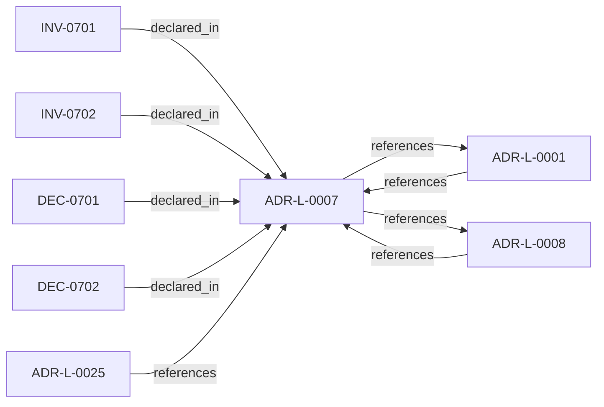

<!--
integrity_schema_version: 1
generated: deterministic_projection_v1
artifact_kind: rendered_adr_markdown
generator_id: adr-projection-markdown
generator_version: 2
hash_algorithm: sha256
source_hash: c6e80329ab6cb1f2d193149e7be55bd0d84a3eacba038dee5523dff8f6fcaf0e
rendered_hash: 3206c02c46b9b70cff8ec91376e15917f0a48163c6e26f669ae96d79fe12ff31
-->

# ADR-L-0007: Slice Identity Strategy

**Status:** accepted  
**Created:** 2025-12-19  
**Modified:** 2026-03-29  
**Authors:** Erik Gallmann, ste-spec  
**Domains:** extraction, documentation-state, recon  
**Tags:** identity, determinism, slices  
**Alias name:** slice-identity-strategy  

## Context

Slices require unique, stable, deterministic identifiers derived from **observable**
semantic anchors (contracts, paths, source paths, table names) rather than volatile
implementation labels alone.

Legacy human projection: `adrs/published/ADR-007-slice-identity-strategy.md`.

**Reconciliation vs ADR-L-100x:** **coexist-with-precedence** — this ADR defines **Fabric
slice identity** for extraction and documentation-state; **Architecture IR** and
contract layers may define additional canonical identity rules. On conflict, IR
contract precedence for **IR element identity** is resolved in contract ADRs (e.g.
future migrated ADR-035); slice identity rules here remain authoritative for **extractor
output identity** unless explicitly superseded.

## Relationship graph

## Related ADRs

### ADR-L-0001 — Deterministic Extraction Over ML-Based Inference

**Relationships:**
- 01a04e96-1f5a-765c-b22f-a35555c5da2c -[:references]-> this ADR
- this ADR -[:references]-> 01a04e96-1f5a-765c-b22f-a35555c5da2c

**Context:** AI-DOC Fabric must extract architectural elements from source code. Candidate approaches
include deterministic extraction (language-native AST parsers and explicit framework
patterns) versus ML-based inference (embeddings, LLMs, probabilistic models).

[Open projection](ADR-L-0001-deterministic-extraction-over-ml-based-inference.md)
### ADR-L-0008 — Correctness and Consistency Contract

**Relationships:**
- 01a04e96-1f5a-7a29-b11e-4fe242be290c -[:references]-> this ADR
- this ADR -[:references]-> 01a04e96-1f5a-7a29-b11e-4fe242be290c

**Context:** Defines user-visible **correctness** and **consistency** guarantees for Fabric
documentation-state queried over extracted and asserted facts, including partial
failures, overlapping reconciliation jobs, provenance coexistence, and multi-region
eventual consistency.

[Open projection](ADR-L-0008-correctness-and-consistency-contract.md)
### ADR-L-0025 — Environment Semantics

**Relationships:**
- 01a04e96-1f5b-78b8-972b-af0c783ef246 -[:references]-> this ADR

**Context:** Environment is a mandatory, opaque identifier partitioning canonical state and
attestations. Fabric governance defines allowed values; Gateway enforces exact
case-sensitive equality between Context Bundle and Fabric Attestation; no inference,
defaults, aliases, or hierarchy in v1.

[Open projection](ADR-L-0025-environment-semantics.md)

## Invariants

### INV-0701

**Statement:** Given the same source artifact inputs and extractor version, identity derivation for
a slice MUST be deterministic and reproducible.
  
**Scope:** global  
**Enforcement:** must (test)  
**Verification:** automated

**Rationale:**
Required for regression testing, environment diffs, and ADR-L-0001 determinism.

### INV-0702

**Statement:** Identity derivation MUST prefer observable contract anchors (routes, table names,
source paths, integration targets, config keys) over volatile implementation labels
when those anchors are available.
  
**Scope:** global  
**Enforcement:** must (design)  
**Verification:** manual

**Rationale:**
Reduces spurious identity churn on refactors that do not change consumer-visible contracts.

## Decisions

### DEC-0701: Derive slice identity per domain using observable semantic anchors

**Rationale:**
API endpoints use method plus normalized path; data entities prefer declared table or
schema-qualified names; graph elements use stable source paths; integration clients use service
or base identity; configuration uses stable keys. Identities are normalized
(lowercase, hyphenation) with explicit collision handling. This prioritizes **semantic
stability** over renames of functions or type names when observable anchors are
unchanged.

**Alternatives Considered:**

- **Content hash identity**: Unstable across refactors; not human-readable; breaks meaningful diffs.

- **User-annotated ids only**: Adoption friction and inconsistency; still needs fallback derivation.

- **Function or type name as sole identity**: Spurious churn on refactor; weak for multi-endpoint handlers.

- **UUID with persistent map**: Non-deterministic across environments without shared state.

**Consequences:**

**Positive:**
- Deterministic, debuggable identities aligned to consumer contracts

**Negative:**
- Extractor-specific domain logic and edge-case judgment

### DEC-0702: Define normalization and collision handling for derived identities

**Rationale:**
Normalize case and punctuation; avoid duplicate hyphens; disambiguate rare collisions
with explicit suffixes and warnings for manual review.

**Consequences:**

**Positive:**
- Predictable string forms across extractors

**Negative:**
- Requires consistent implementation and tests

## Gaps

### GAP-0701: Formal IR mapping when slice identity rules and IR ontology diverge

**Impact:** medium  
**Blocking:** No

---

*Generated from ADR-L-0007 by ADR Architecture Kit*