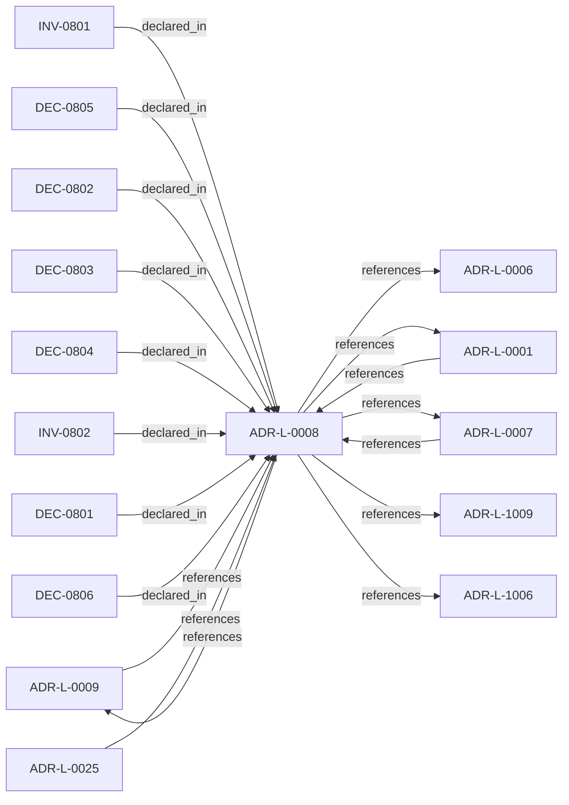

<!--
integrity_schema_version: 1
generated: deterministic_projection_v1
artifact_kind: rendered_adr_markdown
generator_id: adr-projection-markdown
generator_version: 2
hash_algorithm: sha256
source_hash: fde25b036432a4d2e4c6cbc3888e5ae3d09f12c446428dacc59f7d113f85d84d
rendered_hash: 6663a338138d8446cac5cc525ff72421b5b899593e6c4c255e91f3bcb98fc480
-->

# ADR-L-0008: Correctness and Consistency Contract

**Status:** accepted  
**Created:** 2025-12-19  
**Modified:** 2026-03-29  
**Authors:** Erik Gallmann, ste-spec  
**Domains:** documentation-state, recon, queries  
**Tags:** consistency, correctness, provenance  
**Alias name:** correctness-and-consistency-contract  

## Context

Defines user-visible **correctness** and **consistency** guarantees for Fabric
documentation-state queried over extracted and asserted facts, including partial
failures, overlapping reconciliation jobs, provenance coexistence, and multi-region
eventual consistency.

Legacy human projection: `adrs/published/ADR-008-correctness-consistency-contract.md`.

**Reconciliation vs ADR-L-100x:** **coexist-with-precedence** — ADR-L-1006 (evidence
authority) and ADR-L-1009 (kernel decision contract) govern **kernel** admission and
caller contracts; this ADR governs **Fabric query and documentation-state consistency**
semantics. Kernel fail-closed rules override Fabric query defaults when both apply at a
shared boundary; otherwise coexist with explicit documentation in consuming services.

## Relationship graph

## Related ADRs

### ADR-L-0001 — Deterministic Extraction Over ML-Based Inference

**Relationships:**
- 01a04e96-1f5a-765c-b22f-a35555c5da2c -[:references]-> this ADR
- this ADR -[:references]-> 01a04e96-1f5a-765c-b22f-a35555c5da2c

**Context:** AI-DOC Fabric must extract architectural elements from source code. Candidate approaches
include deterministic extraction (language-native AST parsers and explicit framework
patterns) versus ML-based inference (embeddings, LLMs, probabilistic models).

[Open projection](ADR-L-0001-deterministic-extraction-over-ml-based-inference.md)
### ADR-L-0006 — Explicit Unknowns Over Inference

**Relationships:**
- this ADR -[:references]-> 01a04e96-1f5a-73a4-8e3f-bef43b56c052

**Context:** When extractors cannot fully determine relationships or properties, the system must not
silently guess. This ADR-L encodes explicit **unknowns** alongside known facts.

[Open projection](ADR-L-0006-explicit-unknowns-over-inference.md)
### ADR-L-0007 — Slice Identity Strategy

**Relationships:**
- 01a04e96-1f5a-7ea8-b832-ea3972a2f81e -[:references]-> this ADR
- this ADR -[:references]-> 01a04e96-1f5a-7ea8-b832-ea3972a2f81e

**Context:** Slices require unique, stable, deterministic identifiers derived from **observable**
semantic anchors (contracts, paths, source paths, table names) rather than volatile
implementation labels alone.

[Open projection](ADR-L-0007-slice-identity-strategy.md)
### ADR-L-0009 — Assertion Precedence Model

**Relationships:**
- 01a04e96-1f5a-70b0-a91f-0d25282f542c -[:references]-> this ADR
- this ADR -[:references]-> 01a04e96-1f5a-70b0-a91f-0d25282f542c

**Context:** Manual assertions and deterministic extraction can describe the same elements. The model
preserves both with provenance, surfaces contradictions, requires evidence for human
claims, and supports time-bounded validity.

[Open projection](ADR-L-0009-assertion-precedence-model.md)
### ADR-L-0025 — Environment Semantics

**Relationships:**
- 01a04e96-1f5b-78b8-972b-af0c783ef246 -[:references]-> this ADR

**Context:** Environment is a mandatory, opaque identifier partitioning canonical state and
attestations. Fabric governance defines allowed values; Gateway enforces exact
case-sensitive equality between Context Bundle and Fabric Attestation; no inference,
defaults, aliases, or hierarchy in v1.

[Open projection](ADR-L-0025-environment-semantics.md)
### ADR-L-1006 — Evidence Authority Model

**Relationships:**
- this ADR -[:references]-> 01a04e96-1f5d-78e4-b527-64a4a9e9e2b5

**Context:** Runtime evidence is authoritative as **factual observation** within its contract, not as
a replacement for normative architecture declared in ste-spec and documentation-state.
When evidence contradicts IR or ADR meaning, the kernel MUST categorize contradiction as
drift or assessment finding; it MUST NOT silently rewrite normative sources.

[Open projection](ADR-L-1006-evidence-authority-model.md)
### ADR-L-1009 — Kernel Decision Contract

**Relationships:**
- this ADR -[:references]-> 01a04e96-1f5d-7793-873c-136f29f470be

**Context:** This ADR-L defines the normative **inputs** and **outputs** of a kernel admission
decision and the invariants that make decisions auditable and reproducible. It is the
architectural predecessor to future schemas and integration contracts; it does not specify wire formats.

[Open projection](ADR-L-1009-kernel-decision-contract.md)

## Invariants

### INV-0801

**Statement:** Partial extraction MUST NOT silently drop successful slices; failures MUST be
visible via partial status, unknowns, or equivalent documented signals.
  
**Scope:** global  
**Enforcement:** must (policy)  
**Verification:** audit

**Rationale:**
Prevents silent data loss and aligns partial failure semantics with ADR-L-0006.

### INV-0802

**Statement:** Query responses that combine extracted and asserted facts MUST retain provenance
sufficient to filter or explain conflicts unless a superseding ADR-L defines
automatic precedence.
  
**Scope:** global  
**Enforcement:** must (design)  
**Verification:** manual

**Rationale:**
Preserves trust and debuggability when human and extractor knowledge diverge.

## Decisions

### DEC-0801: Define slice correctness as faithful reflection of source artifacts at a version

**Rationale:**
Correctness ties to deterministic extraction, provenance, and validation practices;
runtime behavior parity and guaranteed completeness are out of scope for extraction
truth claims.

**Consequences:**

**Positive:**
- Clear expectations for trust in extracted slices

**Negative:**
- Users must treat unknowns and limits explicitly

### DEC-0802: Adopt eventual consistency with version- and environment-scoped reads

**Rationale:**
Queries are consistent within a declared version snapshot after extraction completes
for that version; environment queries follow last completed extraction; cross-region
reads may lag within bounded windows; no read-your-writes guarantee immediately after
triggering extraction.

**Consequences:**

**Positive:**
- Matches common distributed storage patterns for documentation use cases

**Negative:**
- Clients must wait on completion signals for freshness

### DEC-0803: Isolate partial extraction failures per artifact with explicit partial status

**Rationale:**
Successful files produce slices; failures are recorded with unknowns and diagnostics;
completion signals report partial status rather than failing the whole repository
silently.

**Consequences:**

**Positive:**
- Partial value delivery with transparent gaps

**Negative:**
- Clients must handle partial graphs

### DEC-0804: Use last-completed job wins for overlapping reconciliations with immutable versions

**Rationale:**
Concurrent jobs are allowed; slice versions are immutable; current pointers advance to
the latest completed job per environment with auditable job metadata.

**Consequences:**

**Positive:**
- Simple operational model without distributed locks

**Negative:**
- Rare counterintuitive ordering when long jobs overlap short jobs

### DEC-0805: Store extracted and asserted facts with provenance; surface conflicts without automatic override

**Rationale:**
Neither source automatically wins; queries can filter by provenance; conflicts are
visible for human resolution (detailed precedence may be extended by ADR-L-0009).

**Consequences:**

**Positive:**
- Preserves human domain knowledge alongside extraction

**Negative:**
- Manual resolution burden when conflicts exist

### DEC-0806: Multi-region active-active with bounded replication lag

**Rationale:**
Regional reads may be briefly stale; last-writer-wins applies to rare conflicts;
acceptable for documentation-state availability trade-offs.

**Consequences:**

**Positive:**
- High availability

**Negative:**
- Visible transient divergence across regions

## Gaps

### GAP-0801: Further align query conflict taxonomy with kernel denial categories when needed

**Impact:** low  
**Blocking:** No

### GAP-0802: Quantitative lag SLOs and storage technology references belong in ADR-PS/PC

**Impact:** low  
**Blocking:** No

---

*Generated from ADR-L-0008 by ADR Architecture Kit*