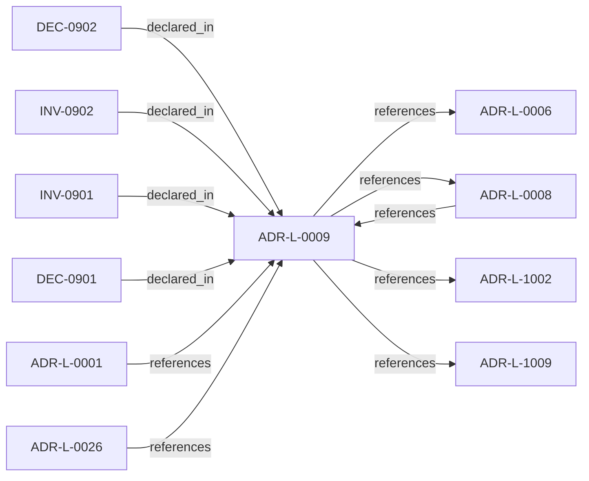

<!--
integrity_schema_version: 1
generated: deterministic_projection_v1
artifact_kind: rendered_adr_markdown
generator_id: adr-projection-markdown
generator_version: 2
hash_algorithm: sha256
source_hash: 8fd588969e93286639f29fbf4120265712ed05e055835333e44e3f590e8af8d9
rendered_hash: 4c24c773c78c6faecb2b2135c89e2525ff10d1572b912a0ed1d0da52f664848a
-->

# ADR-L-0009: Assertion Precedence Model

**Status:** accepted  
**Created:** 2025-12-19  
**Modified:** 2026-03-29  
**Authors:** Erik Gallmann, ste-spec  
**Domains:** documentation-state, extraction, queries  
**Tags:** assertions, provenance, conflicts  
**Alias name:** assertion-precedence-model  

## Context

Manual assertions and deterministic extraction can describe the same elements. The model
preserves both with provenance, surfaces contradictions, requires evidence for human
claims, and supports time-bounded validity.

Legacy: `adrs/published/ADR-009-assertion-precedence-model.md`.

**Reconciliation vs ADR-L-100x:** **coexist-with-precedence** — refines provenance and
conflict surfacing for Fabric queries (**ADR-L-0008**); kernel admission contracts
(**ADR-L-1002**, **ADR-L-1009**) govern the kernel boundary when both apply.

## Relationship graph

## Related ADRs

### ADR-L-0001 — Deterministic Extraction Over ML-Based Inference

**Relationships:**
- 01a04e96-1f5a-765c-b22f-a35555c5da2c -[:references]-> this ADR

**Context:** AI-DOC Fabric must extract architectural elements from source code. Candidate approaches
include deterministic extraction (language-native AST parsers and explicit framework
patterns) versus ML-based inference (embeddings, LLMs, probabilistic models).

[Open projection](ADR-L-0001-deterministic-extraction-over-ml-based-inference.md)
### ADR-L-0006 — Explicit Unknowns Over Inference

**Relationships:**
- this ADR -[:references]-> 01a04e96-1f5a-73a4-8e3f-bef43b56c052

**Context:** When extractors cannot fully determine relationships or properties, the system must not
silently guess. This ADR-L encodes explicit **unknowns** alongside known facts.

[Open projection](ADR-L-0006-explicit-unknowns-over-inference.md)
### ADR-L-0008 — Correctness and Consistency Contract

**Relationships:**
- 01a04e96-1f5a-7a29-b11e-4fe242be290c -[:references]-> this ADR
- this ADR -[:references]-> 01a04e96-1f5a-7a29-b11e-4fe242be290c

**Context:** Defines user-visible **correctness** and **consistency** guarantees for Fabric
documentation-state queried over extracted and asserted facts, including partial
failures, overlapping reconciliation jobs, provenance coexistence, and multi-region
eventual consistency.

[Open projection](ADR-L-0008-correctness-and-consistency-contract.md)
### ADR-L-0026 — Invariant Conflict Detection Semantics

**Relationships:**
- 01a04e96-1f5b-7f70-b03f-807ea0fe6694 -[:references]-> this ADR

**Context:** For v1, Fabric performs conflict detection when creating attestations and signs a
`conflict_status` field (`none` or `detected`). Gateway verifies the attestation and
enforces denial when conflicts are attested; Gateway MUST NOT implement independent
invariant content parsing for conflict detection.

[Open projection](ADR-L-0026-invariant-conflict-detection-semantics.md)
### ADR-L-1002 — Architecture Admission Model

**Relationships:**
- this ADR -[:references]-> 01a04e96-1f5c-73c9-ad1f-df05ef43cae1

**Context:** Admission decides whether a **requested action** may proceed under declared
architecture truth (IR), factual evidence, governance posture, and active rules.
This ADR-L defines the semantic meaning of allowed, denied, conditional, and warned
admission postures and the **input closure** required to reach a decision.

[Open projection](ADR-L-1002-architecture-admission-model.md)
### ADR-L-1009 — Kernel Decision Contract

**Relationships:**
- this ADR -[:references]-> 01a04e96-1f5d-7793-873c-136f29f470be

**Context:** This ADR-L defines the normative **inputs** and **outputs** of a kernel admission
decision and the invariants that make decisions auditable and reproducible. It is the
architectural predecessor to future schemas and integration contracts; it does not specify wire formats.

[Open projection](ADR-L-1009-kernel-decision-contract.md)

## Invariants

### INV-0901

**Statement:** Manual assertions MUST carry provenance sufficient to identify the asserting party,
scope, and evidentiary reference before admission into authoritative query surfaces.
  
**Scope:** global  
**Enforcement:** must (policy)  
**Verification:** audit

**Rationale:**
Prevents unattested human overrides from masquerading as canonical facts.

### INV-0902

**Statement:** When extracted and asserted facts contradict, query responses MUST surface the
conflict with both provenances unless a superseding ADR-L defines automatic precedence.
  
**Scope:** global  
**Enforcement:** must (design)  
**Verification:** manual

**Rationale:**
Aligns with transparency commitments in ADR-L-0008.

## Decisions

### DEC-0901: Coexist extracted and asserted facts with explicit conflict surfacing

**Rationale:**
Store both sources with provenance; default queries return both; contradictions
appear in a dedicated conflicts section; users resolve disputes—no silent automatic
winner between extractor and human in the general case.

**Consequences:**

**Positive:**
- Auditable dual sources of truth

**Negative:**
- Requires client handling of conflicts

### DEC-0902: Require evidence, actor, scope, and optional expiry for manual assertions

**Rationale:**
Assertions without evidence are rejected; optional `valid_until` excludes stale
claims from default query results while preserving history when explicitly requested.

**Consequences:**

**Positive:**
- Governance and auditability for human overrides

**Negative:**
- Higher submission friction for assertions

## Gaps

### GAP-0901: Machine schema for assertion payloads and conflict records in Architecture IR

**Impact:** medium  
**Blocking:** No

---

*Generated from ADR-L-0009 by ADR Architecture Kit*