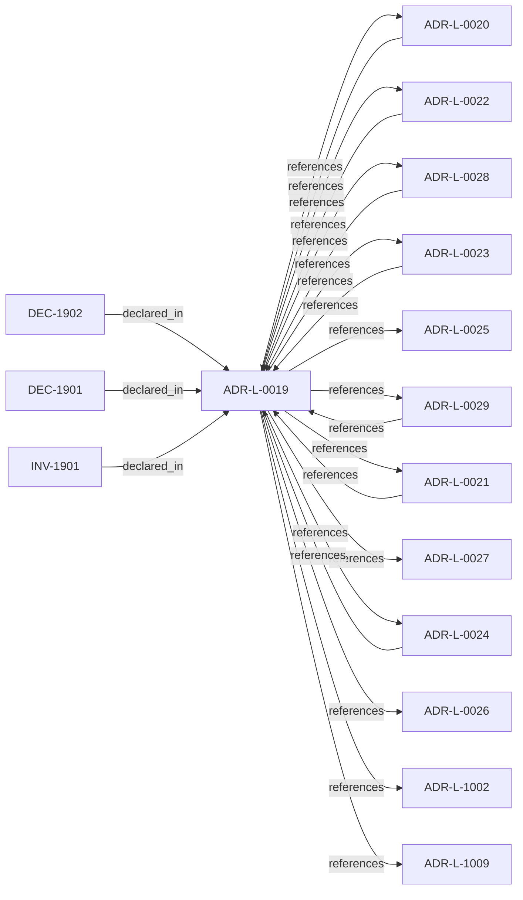

<!--
integrity_schema_version: 1
generated: deterministic_projection_v1
artifact_kind: rendered_adr_markdown
generator_id: adr-projection-markdown
generator_version: 2
hash_algorithm: sha256
source_hash: 5c3059ece9f17d77a5282fdf5e951d29a0c8013ccbf8f43e99bd77c037f5fcf5
rendered_hash: 833fa5489b1d8359097b3b7fd5b153ff167b0348620c3686ed1adf4aa17cefe5
-->

# ADR-L-0019: Gateway Authority and Signing Model

**Status:** accepted  
**Created:** 2025-12-23  
**Modified:** 2026-03-29  
**Authors:** Erik Gallmann, ste-spec  
**Domains:** governance, gateway  
**Tags:** signing, enforcement, gateway  
**Alias name:** gateway-authority-and-signing-model  

## Context

STE Gateway verifies ORG-signed inputs and enforces eligibility; it does **not** attest
canonical truth or sign canonical artifacts. Eligibility outcomes are ephemeral and
unsigned.

Legacy: `adrs/published/ADR-019-gateway-authority-signing.md`.

**Reconciliation vs ADR-L-100x:** **coexist-with-precedence** — **ADR-L-1009** kernel
decision contract and **ADR-L-1002** admission semantics govern STE-wide kernel
narratives; this ADR pins **gateway signing and attestation boundaries** for the STE
system model. On overlap, document precedence in consuming specs (e.g. execution model).

## Relationship graph

## Related ADRs

### ADR-L-0020 — ORG-Level Signing Scope

**Relationships:**
- 01a04e96-1f5a-720a-bc3f-d1ce4bde0816 -[:references]-> this ADR
- this ADR -[:references]-> 01a04e96-1f5a-720a-bc3f-d1ce4bde0816

**Context:** ORG-level signing applies only to artifacts that establish or ratify **canonical truth**;
ephemeral enforcement outputs, workspace-local bundles, and derived indexes are out of
scope for ORG signing.

[Open projection](ADR-L-0020-org-level-signing-scope.md)
### ADR-L-0021 — Gateway Trust Verification Model

**Relationships:**
- 01a04e96-1f5b-7a30-ad3e-e3e11989eed7 -[:references]-> this ADR
- this ADR -[:references]-> 01a04e96-1f5b-7a30-ad3e-e3e11989eed7

**Context:** Gateway is not a trust-registry principal; trust checks run per eligibility evaluation;
registry outages fail execution closed; bootstrap material only anchors registry
verification; cached trust cannot authorize execution.

[Open projection](ADR-L-0021-gateway-trust-verification-model.md)
### ADR-L-0022 — Fail-Closed Semantics and Enforcement Scope

**Relationships:**
- 01a04e96-1f5b-74cc-9a3d-921d80842047 -[:references]-> this ADR
- this ADR -[:references]-> 01a04e96-1f5b-74cc-9a3d-921d80842047

**Context:** Authoritative execution eligibility and canonical promotion require complete, successful
validation. Fail-closed halts authoritative actions when prerequisites cannot be verified;
it does not require total system unavailability. Non-authoritative inspection may continue
under explicit degraded labeling.

[Open projection](ADR-L-0022-fail-closed-semantics-and-enforcement-scope.md)
### ADR-L-0023 — Validation Timing and Responsibility

**Relationships:**
- 01a04e96-1f5b-788c-8306-d10c9fe24eaa -[:references]-> this ADR
- this ADR -[:references]-> 01a04e96-1f5b-788c-8306-d10c9fe24eaa

**Context:** Validation occurs at merge-time (ADF), pre-execution (Gateway), and locally (Runtime).
Only Gateway may authorize execution; ADF blocks canonical promotion; Runtime checks are
advisory for eligibility. Normalized outcomes treat INDETERMINATE as blocking for
authoritative paths.

[Open projection](ADR-L-0023-validation-timing-and-responsibility.md)
### ADR-L-0024 — Cross-Component Contracts and Execution Eligibility Interface

**Relationships:**
- 01a04e96-1f5b-7e90-9f2d-79f60b81c807 -[:references]-> this ADR
- this ADR -[:references]-> 01a04e96-1f5b-7e90-9f2d-79f60b81c807

**Context:** Gateway is a pure validator over a complete Context Bundle; Runtime (with ADF-produced
artifacts) supplies completeness. Requests use references and integrity bindings; responses
are structured with stable reason codes. Execution blocks synchronously until ALLOW.

[Open projection](ADR-L-0024-cross-component-contracts-and-execution-eligibility-interface.md)
### ADR-L-0025 — Environment Semantics

**Relationships:**
- this ADR -[:references]-> 01a04e96-1f5b-78b8-972b-af0c783ef246

**Context:** Environment is a mandatory, opaque identifier partitioning canonical state and
attestations. Fabric governance defines allowed values; Gateway enforces exact
case-sensitive equality between Context Bundle and Fabric Attestation; no inference,
defaults, aliases, or hierarchy in v1.

[Open projection](ADR-L-0025-environment-semantics.md)
### ADR-L-0026 — Invariant Conflict Detection Semantics

**Relationships:**
- this ADR -[:references]-> 01a04e96-1f5b-7f70-b03f-807ea0fe6694

**Context:** For v1, Fabric performs conflict detection when creating attestations and signs a
`conflict_status` field (`none` or `detected`). Gateway verifies the attestation and
enforces denial when conflicts are attested; Gateway MUST NOT implement independent
invariant content parsing for conflict detection.

[Open projection](ADR-L-0026-invariant-conflict-detection-semantics.md)
### ADR-L-0027 — Scope Semantics and Versioning

**Relationships:**
- this ADR -[:references]-> 01a04e96-1f5b-7d37-8038-1c811fc5261b

**Context:** Scope is a colon-delimited hierarchical identifier participating in authority checks.
Version 1 uses exact string equality; version 2 uses segment-prefix matching with
most-specific authority resolution and denial on equal-depth ambiguity. Trust Registry
and Context Bundle must declare `scope_semantics_version` consistently.

[Open projection](ADR-L-0027-scope-semantics-and-versioning.md)
### ADR-L-0028 — AI-DOC Fabric and Gateway Authority Boundaries

**Relationships:**
- 01a04e96-1f5b-7551-992f-4be395920f16 -[:references]-> this ADR
- this ADR -[:references]-> 01a04e96-1f5b-7551-992f-4be395920f16

**Context:** Fabric is the sole canonical state authority, invariant resolver, conflict detector for
attested bundles, and signer of Fabric Attestations. Gateway is a pure verifier that does
not query Fabric during eligibility evaluation. Runtime assembles and transports bundles
and attestations without substituting Fabric authority.

[Open projection](ADR-L-0028-ai-doc-fabric-and-gateway-authority-boundaries.md)
### ADR-L-0029 — Gateway Enforcement Authority

**Relationships:**
- 01a04e96-1f5b-797b-b73b-27a64590210d -[:references]-> this ADR
- this ADR -[:references]-> 01a04e96-1f5b-797b-b73b-27a64590210d

**Context:** Gateway holds Enforcement Authority: verify ORG-signed material, consult trust registry,
evaluate eligibility prerequisites, emit ephemeral unsigned decisions. It is distinct
from ORG attestation authority which signs durable canonical artifacts.

[Open projection](ADR-L-0029-gateway-enforcement-authority.md)
### ADR-L-1002 — Architecture Admission Model

**Relationships:**
- this ADR -[:references]-> 01a04e96-1f5c-73c9-ad1f-df05ef43cae1

**Context:** Admission decides whether a **requested action** may proceed under declared
architecture truth (IR), factual evidence, governance posture, and active rules.
This ADR-L defines the semantic meaning of allowed, denied, conditional, and warned
admission postures and the **input closure** required to reach a decision.

[Open projection](ADR-L-1002-architecture-admission-model.md)
### ADR-L-1009 — Kernel Decision Contract

**Relationships:**
- this ADR -[:references]-> 01a04e96-1f5d-7793-873c-136f29f470be

**Context:** This ADR-L defines the normative **inputs** and **outputs** of a kernel admission
decision and the invariants that make decisions auditable and reproducible. It is the
architectural predecessor to future schemas and integration contracts; it does not specify wire formats.

[Open projection](ADR-L-1009-kernel-decision-contract.md)

## Invariants

### INV-1901

**Statement:** The Gateway MUST NOT sign canonical artifacts or eligibility outcomes as substitutes
for ORG attestation of canonical truth.
  
**Scope:** global  
**Enforcement:** must (policy)  
**Verification:** audit

**Rationale:**
Preserves authority scarcity and non-repudiation semantics for canonical publishers.

## Decisions

### DEC-1901: Gateway holds ORG-scoped enforcement authority, not ORG attestation authority

**Rationale:**
Gateway verifies signatures and enforces constraints using ORG-signed canonical
material; it does not mint canonical artifacts, populate trust registries, or sign
eligibility decisions as durable truth.

**Consequences:**

**Positive:**
- Clear separation of verification vs attestation

**Negative:**
- Implementations cannot use Gateway keys as ORG signing keys

### DEC-1902: Treat execution eligibility outcomes as ephemeral, unsigned enforcement results

**Rationale:**
Eligibility answers are short-lived, derived deterministically from signed inputs, and
logged for audit without becoming canonical attestations.

**Consequences:**

**Positive:**
- Avoids false equivalence with immutable canonical state

**Negative:**
- Consumers cannot treat eligibility receipts as long-lived proofs without context

## Gaps

### GAP-1901: Map STE-System section references to machine cross-links in handbook/runtime

**Impact:** low  
**Blocking:** No

---

*Generated from ADR-L-0019 by ADR Architecture Kit*