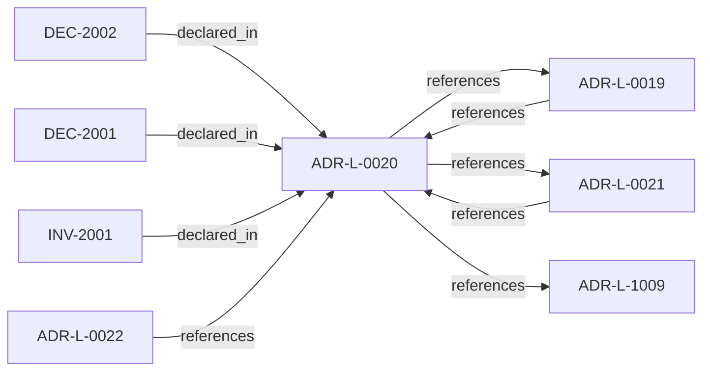

<!--
integrity_schema_version: 1
generated: deterministic_projection_v1
artifact_kind: rendered_adr_markdown
generator_id: adr-projection-markdown
generator_version: 2
hash_algorithm: sha256
source_hash: b770cc1f165af4af61e74a6c006f7471f6d478ebb25930edb77af09fcc772e9c
rendered_hash: 7f885b2a69658e530304de32a57b228f040ea66cd489d07cc043b041434a0dbd
-->

# ADR-L-0020: ORG-Level Signing Scope

**Status:** accepted  
**Created:** 2025-12-23  
**Modified:** 2026-03-29  
**Authors:** Erik Gallmann, ste-spec  
**Domains:** governance, signing  
**Tags:** org-authority, signing-scope  
**Alias name:** org-level-signing-scope  

## Context

ORG-level signing applies only to artifacts that establish or ratify **canonical truth**;
ephemeral enforcement outputs, workspace-local bundles, and derived indexes are out of
scope for ORG signing.

Legacy: `adrs/published/ADR-020-org-signing-scope.md`.

**Reconciliation vs ADR-L-100x:** **coexist-with-precedence** — complements **ADR-L-1009**
on fail-closed caller contracts; this ADR defines **what must be ORG-signed** versus
derived or ephemeral artifacts.

## Relationship graph

## Related ADRs

### ADR-L-0019 — Gateway Authority and Signing Model

**Relationships:**
- 01a04e96-1f5a-7af0-a138-a306f7b93157 -[:references]-> this ADR
- this ADR -[:references]-> 01a04e96-1f5a-7af0-a138-a306f7b93157

**Context:** STE Gateway verifies ORG-signed inputs and enforces eligibility; it does **not** attest
canonical truth or sign canonical artifacts. Eligibility outcomes are ephemeral and
unsigned.

[Open projection](ADR-L-0019-gateway-authority-and-signing-model.md)
### ADR-L-0021 — Gateway Trust Verification Model

**Relationships:**
- 01a04e96-1f5b-7a30-ad3e-e3e11989eed7 -[:references]-> this ADR
- this ADR -[:references]-> 01a04e96-1f5b-7a30-ad3e-e3e11989eed7

**Context:** Gateway is not a trust-registry principal; trust checks run per eligibility evaluation;
registry outages fail execution closed; bootstrap material only anchors registry
verification; cached trust cannot authorize execution.

[Open projection](ADR-L-0021-gateway-trust-verification-model.md)
### ADR-L-0022 — Fail-Closed Semantics and Enforcement Scope

**Relationships:**
- 01a04e96-1f5b-74cc-9a3d-921d80842047 -[:references]-> this ADR

**Context:** Authoritative execution eligibility and canonical promotion require complete, successful
validation. Fail-closed halts authoritative actions when prerequisites cannot be verified;
it does not require total system unavailability. Non-authoritative inspection may continue
under explicit degraded labeling.

[Open projection](ADR-L-0022-fail-closed-semantics-and-enforcement-scope.md)
### ADR-L-1009 — Kernel Decision Contract

**Relationships:**
- this ADR -[:references]-> 01a04e96-1f5d-7793-873c-136f29f470be

**Context:** This ADR-L defines the normative **inputs** and **outputs** of a kernel admission
decision and the invariants that make decisions auditable and reproducible. It is the
architectural predecessor to future schemas and integration contracts; it does not specify wire formats.

[Open projection](ADR-L-1009-kernel-decision-contract.md)

## Invariants

### INV-2001

**Statement:** ORG signing requirements MUST NOT be expanded to cover derived query results,
enforcement-only outcomes, or caches without a new ADR-L that documents the rationale.
  
**Scope:** global  
**Enforcement:** must (policy)  
**Verification:** audit

**Rationale:**
Keeps ORG signatures meaningful as canonical-truth signals.

## Decisions

### DEC-2001: Require ORG signing only for canonical invariants, canonical artifacts, trust registry operations, and canonicalization events

**Rationale:**
Limits ORG keys to durable attestation surfaces; excludes eligibility decisions,
derived graph indexes, caches, and typical Context Bundle payloads except where other
ADRs require Human/PROJECT signing.

**Consequences:**

**Positive:**
- Prevents authority inflation across operational outputs

**Negative:**
- Implementers must classify artifacts carefully

### DEC-2002: Exclude ephemeral enforcement outcomes and derived state from mandatory ORG signing

**Rationale:**
Derived and short-lived results must remain verifiable from signed inputs without
expanding ORG signing to every computation.

**Consequences:**

**Positive:**
- Operational simplicity at the enforcement boundary

**Negative:**
- Requires clear labeling of non-canonical outputs

## Gaps

### GAP-2001: Enumerate artifact kinds in Architecture IR that require ORG signatures

**Impact:** medium  
**Blocking:** No

---

*Generated from ADR-L-0020 by ADR Architecture Kit*