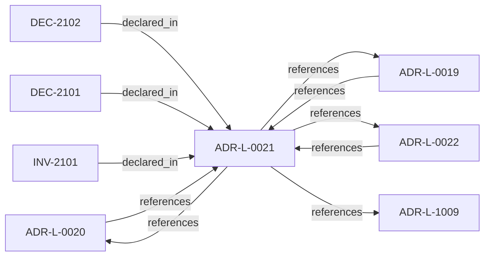

<!--
integrity_schema_version: 1
generated: deterministic_projection_v1
artifact_kind: rendered_adr_markdown
generator_id: adr-projection-markdown
generator_version: 2
hash_algorithm: sha256
source_hash: b770cc1f165af4af61e74a6c006f7471f6d478ebb25930edb77af09fcc772e9c
rendered_hash: 0dc24ba061b2d5c219a3da6c8f8ef2fe05597a467918e26f0f63539cde463cf7
-->

# ADR-L-0021: Gateway Trust Verification Model

**Status:** accepted  
**Created:** 2025-12-23  
**Modified:** 2026-03-29  
**Authors:** Erik Gallmann, ste-spec  
**Domains:** governance, gateway  
**Tags:** trust-registry, fail-closed  
**Alias name:** gateway-trust-verification-model  

## Context

Gateway is not a trust-registry principal; trust checks run per eligibility evaluation;
registry outages fail execution closed; bootstrap material only anchors registry
verification; cached trust cannot authorize execution.

Legacy: `adrs/published/ADR-021-gateway-trust-verification.md`.

**Reconciliation vs ADR-L-100x:** **coexist-with-precedence** — **ADR-L-1009** states
kernel fail-closed posture; this ADR specializes **Gateway trust verification** mechanics.

## Relationship graph

## Related ADRs

### ADR-L-0019 — Gateway Authority and Signing Model

**Relationships:**
- 01a04e96-1f5a-7af0-a138-a306f7b93157 -[:references]-> this ADR
- this ADR -[:references]-> 01a04e96-1f5a-7af0-a138-a306f7b93157

**Context:** STE Gateway verifies ORG-signed inputs and enforces eligibility; it does **not** attest
canonical truth or sign canonical artifacts. Eligibility outcomes are ephemeral and
unsigned.

[Open projection](ADR-L-0019-gateway-authority-and-signing-model.md)
### ADR-L-0020 — ORG-Level Signing Scope

**Relationships:**
- 01a04e96-1f5a-720a-bc3f-d1ce4bde0816 -[:references]-> this ADR
- this ADR -[:references]-> 01a04e96-1f5a-720a-bc3f-d1ce4bde0816

**Context:** ORG-level signing applies only to artifacts that establish or ratify **canonical truth**;
ephemeral enforcement outputs, workspace-local bundles, and derived indexes are out of
scope for ORG signing.

[Open projection](ADR-L-0020-org-level-signing-scope.md)
### ADR-L-0022 — Fail-Closed Semantics and Enforcement Scope

**Relationships:**
- 01a04e96-1f5b-74cc-9a3d-921d80842047 -[:references]-> this ADR
- this ADR -[:references]-> 01a04e96-1f5b-74cc-9a3d-921d80842047

**Context:** Authoritative execution eligibility and canonical promotion require complete, successful
validation. Fail-closed halts authoritative actions when prerequisites cannot be verified;
it does not require total system unavailability. Non-authoritative inspection may continue
under explicit degraded labeling.

[Open projection](ADR-L-0022-fail-closed-semantics-and-enforcement-scope.md)
### ADR-L-1009 — Kernel Decision Contract

**Relationships:**
- this ADR -[:references]-> 01a04e96-1f5d-7793-873c-136f29f470be

**Context:** This ADR-L defines the normative **inputs** and **outputs** of a kernel admission
decision and the invariants that make decisions auditable and reproducible. It is the
architectural predecessor to future schemas and integration contracts; it does not specify wire formats.

[Open projection](ADR-L-1009-kernel-decision-contract.md)

## Invariants

### INV-2101

**Statement:** Cached trust material MUST NOT be used to approve execution eligibility; if used for
read-only paths, outputs MUST be marked non-authoritative and canonical promotion MUST
be blocked.
  
**Scope:** global  
**Enforcement:** must (policy)  
**Verification:** audit

**Rationale:**
Mitigates revocation and staleness attacks.

## Decisions

### DEC-2101: Gateway is not a Trust Registry principal and performs per-request trust verification

**Rationale:**
Avoids self-referential trust entries and ensures revocations and expirations are
respected at evaluation time.

**Consequences:**

**Positive:**
- Contemporaneous trust decisions

**Negative:**
- Higher verification load per request

### DEC-2102: Fail closed when the Trust Registry is unavailable; bootstrap keys only verify the registry; cache cannot authorize execution

**Rationale:**
Prevents stale or offline trust from authorizing execution; read-only degraded modes
must be explicitly non-authoritative.

**Consequences:**

**Positive:**
- Stronger security posture

**Negative:**
- Availability coupling to registry health

## Gaps

### GAP-2101: Physical deployment patterns for registry HA belong in ADR-PS when authored

**Impact:** low  
**Blocking:** No

---

*Generated from ADR-L-0021 by ADR Architecture Kit*