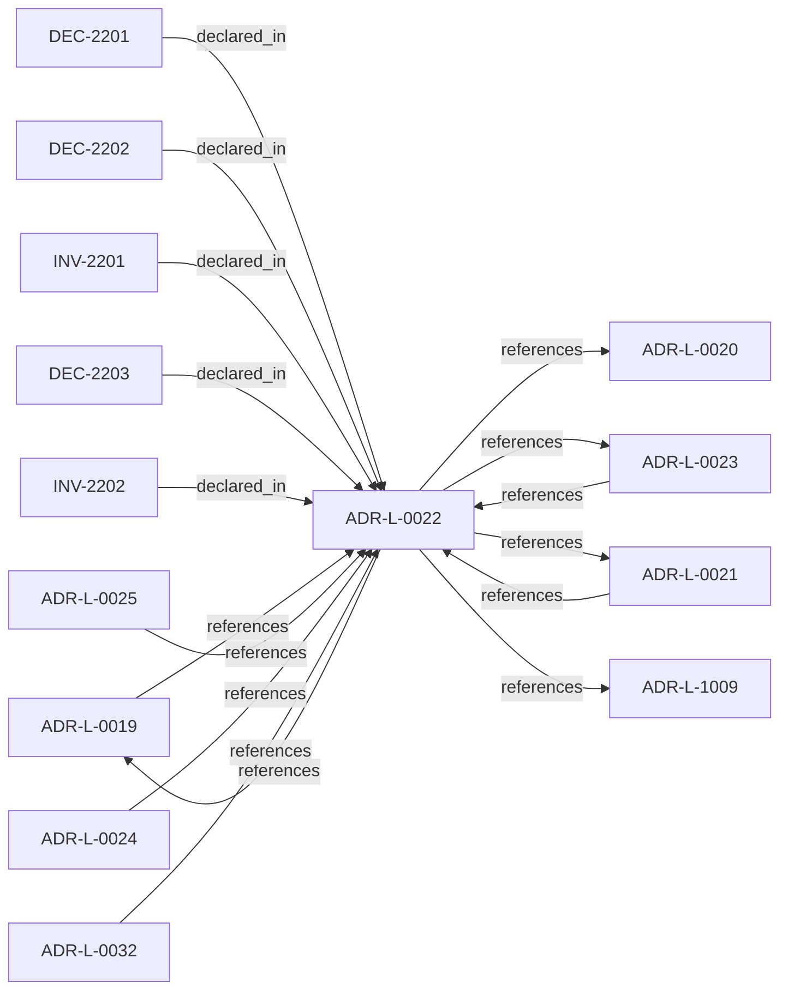

<!--
integrity_schema_version: 1
generated: deterministic_projection_v1
artifact_kind: rendered_adr_markdown
generator_id: adr-projection-markdown
generator_version: 2
hash_algorithm: sha256
source_hash: 34d88bd2e7bbf47b0eccd1f3128b63fa8ca028657fe8148187e65d43de645be6
rendered_hash: 1bb703b8eecf387016d789f37b7f0915215fdf4c5312cdb36ea850c724b672f3
-->

# ADR-L-0022: Fail-Closed Semantics and Enforcement Scope

**Status:** accepted  
**Created:** 2025-12-23  
**Modified:** 2026-03-29  
**Authors:** Erik Gallmann, ste-spec  
**Domains:** gateway, enforcement  
**Tags:** fail-closed, enforcement  
**Alias name:** fail-closed-semantics-and-enforcement-scope  

## Context

Authoritative execution eligibility and canonical promotion require complete, successful
validation. Fail-closed halts authoritative actions when prerequisites cannot be verified;
it does not require total system unavailability. Non-authoritative inspection may continue
under explicit degraded labeling.

Legacy: `adrs/published/ADR-022-fail-closed-enforcement-scope.md`.

**Reconciliation vs ADR-L-100x:** **coexist-with-precedence** — **ADR-L-1009** defines the
kernel decision contract; this ADR defines STE-system-wide fail-closed triggers and
non-bypass rules at the Gateway / promotion boundary.

## Relationship graph

## Related ADRs

### ADR-L-0019 — Gateway Authority and Signing Model

**Relationships:**
- 01a04e96-1f5a-7af0-a138-a306f7b93157 -[:references]-> this ADR
- this ADR -[:references]-> 01a04e96-1f5a-7af0-a138-a306f7b93157

**Context:** STE Gateway verifies ORG-signed inputs and enforces eligibility; it does **not** attest
canonical truth or sign canonical artifacts. Eligibility outcomes are ephemeral and
unsigned.

[Open projection](ADR-L-0019-gateway-authority-and-signing-model.md)
### ADR-L-0020 — ORG-Level Signing Scope

**Relationships:**
- this ADR -[:references]-> 01a04e96-1f5a-720a-bc3f-d1ce4bde0816

**Context:** ORG-level signing applies only to artifacts that establish or ratify **canonical truth**;
ephemeral enforcement outputs, workspace-local bundles, and derived indexes are out of
scope for ORG signing.

[Open projection](ADR-L-0020-org-level-signing-scope.md)
### ADR-L-0021 — Gateway Trust Verification Model

**Relationships:**
- 01a04e96-1f5b-7a30-ad3e-e3e11989eed7 -[:references]-> this ADR
- this ADR -[:references]-> 01a04e96-1f5b-7a30-ad3e-e3e11989eed7

**Context:** Gateway is not a trust-registry principal; trust checks run per eligibility evaluation;
registry outages fail execution closed; bootstrap material only anchors registry
verification; cached trust cannot authorize execution.

[Open projection](ADR-L-0021-gateway-trust-verification-model.md)
### ADR-L-0023 — Validation Timing and Responsibility

**Relationships:**
- 01a04e96-1f5b-788c-8306-d10c9fe24eaa -[:references]-> this ADR
- this ADR -[:references]-> 01a04e96-1f5b-788c-8306-d10c9fe24eaa

**Context:** Validation occurs at merge-time (ADF), pre-execution (Gateway), and locally (Runtime).
Only Gateway may authorize execution; ADF blocks canonical promotion; Runtime checks are
advisory for eligibility. Normalized outcomes treat INDETERMINATE as blocking for
authoritative paths.

[Open projection](ADR-L-0023-validation-timing-and-responsibility.md)
### ADR-L-0024 — Cross-Component Contracts and Execution Eligibility Interface

**Relationships:**
- 01a04e96-1f5b-7e90-9f2d-79f60b81c807 -[:references]-> this ADR

**Context:** Gateway is a pure validator over a complete Context Bundle; Runtime (with ADF-produced
artifacts) supplies completeness. Requests use references and integrity bindings; responses
are structured with stable reason codes. Execution blocks synchronously until ALLOW.

[Open projection](ADR-L-0024-cross-component-contracts-and-execution-eligibility-interface.md)
### ADR-L-0025 — Environment Semantics

**Relationships:**
- 01a04e96-1f5b-78b8-972b-af0c783ef246 -[:references]-> this ADR

**Context:** Environment is a mandatory, opaque identifier partitioning canonical state and
attestations. Fabric governance defines allowed values; Gateway enforces exact
case-sensitive equality between Context Bundle and Fabric Attestation; no inference,
defaults, aliases, or hierarchy in v1.

[Open projection](ADR-L-0025-environment-semantics.md)
### ADR-L-0032 — Fail-Closed Enforcement Model

**Relationships:**
- 01a04e96-1f5b-7ece-bf1f-4f6ac80361f5 -[:references]-> this ADR

**Context:** Invalid, unavailable, malformed, or semantically inconsistent runtime evidence and
related publication inputs are fail-closed at the **kernel** boundary before permissive
admission outcomes. Schema validity alone is insufficient for conformance.

[Open projection](ADR-L-0032-fail-closed-enforcement-model.md)
### ADR-L-1009 — Kernel Decision Contract

**Relationships:**
- this ADR -[:references]-> 01a04e96-1f5d-7793-873c-136f29f470be

**Context:** This ADR-L defines the normative **inputs** and **outputs** of a kernel admission
decision and the invariants that make decisions auditable and reproducible. It is the
architectural predecessor to future schemas and integration contracts; it does not specify wire formats.

[Open projection](ADR-L-1009-kernel-decision-contract.md)

## Invariants

### INV-2201

**Statement:** If any prerequisite for execution eligibility or canonical promotion cannot be fully
validated, the implementation MUST deny the authoritative action (fail closed).
  
**Scope:** global  
**Enforcement:** must (policy)  
**Verification:** audit

**Rationale:**
Matches eligibility and promotion algorithms that treat indeterminacy as denial.

### INV-2202

**Statement:** Read-only evaluation paths used while fail-closed is active MUST NOT approve execution
eligibility or canonical promotion and MUST surface degraded, non-authoritative status.
  
**Scope:** global  
**Enforcement:** must (policy)  
**Verification:** audit

**Rationale:**
Prevents inspection modes from becoming shadow approval channels.

## Decisions

### DEC-2201: Apply fail-closed to execution eligibility and canonical promotion when validation is incomplete, failed, or indeterminate

**Rationale:**
Partial or best-effort validation would undermine determinism and authority scarcity;
authoritative actions require full verification.

**Consequences:**

**Positive:**
- Unambiguous correctness boundary

**Negative:**
- Stricter availability coupling for authoritative paths

### DEC-2202: Prohibit bypass of fail-closed via operator override, emergency modes, environment-specific relaxation, or best-effort execution

**Rationale:**
Any bypass introduces implicit trust and non-deterministic enforcement.

**Consequences:**

**Positive:**
- No hidden weakening of guarantees

**Negative:**
- No discretionary override at the enforcement boundary

### DEC-2203: Allow read-only inspection under fail-closed only when outputs are explicitly non-authoritative and audit-logged

**Rationale:**
Operators need diagnostics without granting execution or promotion.

**Consequences:**

**Positive:**
- Debuggability without correctness compromise

**Negative:**
- Requires clear degraded signaling in implementations

## Gaps

### GAP-2201: Operational SLAs and retry semantics remain out of band for this ADR-L

**Impact:** low  
**Blocking:** No

---

*Generated from ADR-L-0022 by ADR Architecture Kit*