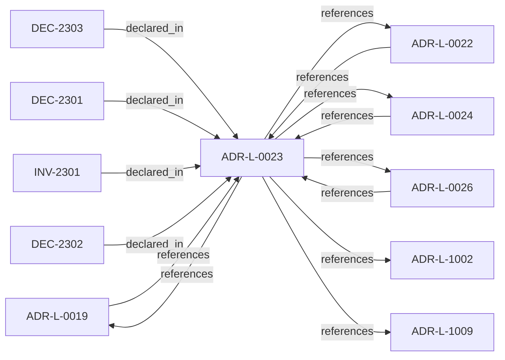

<!--
integrity_schema_version: 1
generated: deterministic_projection_v1
artifact_kind: rendered_adr_markdown
generator_id: adr-projection-markdown
generator_version: 2
hash_algorithm: sha256
source_hash: eef2e38999b73d2fea60a0250cdf84957162be760c682e7fbf4874ccde779784
rendered_hash: 67e35ce328fe4c17bdac4e49300b7157e57f6ed65f62c88bc62854505fa6e125
-->

# ADR-L-0023: Validation Timing and Responsibility

**Status:** accepted  
**Created:** 2025-12-23  
**Modified:** 2026-03-29  
**Authors:** Erik Gallmann, ste-spec  
**Domains:** gateway, validation  
**Tags:** lifecycle, eligibility  
**Alias name:** validation-timing-and-responsibility  

## Context

Validation occurs at merge-time (ADF), pre-execution (Gateway), and locally (Runtime).
Only Gateway may authorize execution; ADF blocks canonical promotion; Runtime checks are
advisory for eligibility. Normalized outcomes treat INDETERMINATE as blocking for
authoritative paths.

Legacy: `adrs/published/ADR-023-validation-timing-responsibility.md`.

**Reconciliation vs ADR-L-100x:** **coexist-with-precedence** — **ADR-L-1002** admission
semantics and **ADR-L-1009** caller contracts apply at the kernel documentation boundary;
this ADR assigns **STE-system component responsibilities** for validation stages.

**Reconciliation vs ADR-L-0026:** Gateway normative conflict handling is **verification of
Fabric-attested conflict status**, not independent content parsing (see ADR-L-0026).

## Relationship graph

## Related ADRs

### ADR-L-0019 — Gateway Authority and Signing Model

**Relationships:**
- 01a04e96-1f5a-7af0-a138-a306f7b93157 -[:references]-> this ADR
- this ADR -[:references]-> 01a04e96-1f5a-7af0-a138-a306f7b93157

**Context:** STE Gateway verifies ORG-signed inputs and enforces eligibility; it does **not** attest
canonical truth or sign canonical artifacts. Eligibility outcomes are ephemeral and
unsigned.

[Open projection](ADR-L-0019-gateway-authority-and-signing-model.md)
### ADR-L-0022 — Fail-Closed Semantics and Enforcement Scope

**Relationships:**
- 01a04e96-1f5b-74cc-9a3d-921d80842047 -[:references]-> this ADR
- this ADR -[:references]-> 01a04e96-1f5b-74cc-9a3d-921d80842047

**Context:** Authoritative execution eligibility and canonical promotion require complete, successful
validation. Fail-closed halts authoritative actions when prerequisites cannot be verified;
it does not require total system unavailability. Non-authoritative inspection may continue
under explicit degraded labeling.

[Open projection](ADR-L-0022-fail-closed-semantics-and-enforcement-scope.md)
### ADR-L-0024 — Cross-Component Contracts and Execution Eligibility Interface

**Relationships:**
- 01a04e96-1f5b-7e90-9f2d-79f60b81c807 -[:references]-> this ADR
- this ADR -[:references]-> 01a04e96-1f5b-7e90-9f2d-79f60b81c807

**Context:** Gateway is a pure validator over a complete Context Bundle; Runtime (with ADF-produced
artifacts) supplies completeness. Requests use references and integrity bindings; responses
are structured with stable reason codes. Execution blocks synchronously until ALLOW.

[Open projection](ADR-L-0024-cross-component-contracts-and-execution-eligibility-interface.md)
### ADR-L-0026 — Invariant Conflict Detection Semantics

**Relationships:**
- 01a04e96-1f5b-7f70-b03f-807ea0fe6694 -[:references]-> this ADR
- this ADR -[:references]-> 01a04e96-1f5b-7f70-b03f-807ea0fe6694

**Context:** For v1, Fabric performs conflict detection when creating attestations and signs a
`conflict_status` field (`none` or `detected`). Gateway verifies the attestation and
enforces denial when conflicts are attested; Gateway MUST NOT implement independent
invariant content parsing for conflict detection.

[Open projection](ADR-L-0026-invariant-conflict-detection-semantics.md)
### ADR-L-1002 — Architecture Admission Model

**Relationships:**
- this ADR -[:references]-> 01a04e96-1f5c-73c9-ad1f-df05ef43cae1

**Context:** Admission decides whether a **requested action** may proceed under declared
architecture truth (IR), factual evidence, governance posture, and active rules.
This ADR-L defines the semantic meaning of allowed, denied, conditional, and warned
admission postures and the **input closure** required to reach a decision.

[Open projection](ADR-L-1002-architecture-admission-model.md)
### ADR-L-1009 — Kernel Decision Contract

**Relationships:**
- this ADR -[:references]-> 01a04e96-1f5d-7793-873c-136f29f470be

**Context:** This ADR-L defines the normative **inputs** and **outputs** of a kernel admission
decision and the invariants that make decisions auditable and reproducible. It is the
architectural predecessor to future schemas and integration contracts; it does not specify wire formats.

[Open projection](ADR-L-1009-kernel-decision-contract.md)

## Invariants

### INV-2301

**Statement:** No component other than Gateway MAY treat local or merge-time validation success as
sufficient to authorize execution eligibility when Gateway has not returned an explicit
ALLOW outcome per contract.
  
**Scope:** global  
**Enforcement:** must (policy)  
**Verification:** audit

**Rationale:**
Preserves synchronous enforcement at the Gateway boundary.

## Decisions

### DEC-2301: Assign ADF merge-time validation to canonical promotion blocking only; Gateway sole execution approval; Runtime local checks advisory only

**Rationale:**
Prevents Runtime self-approval and clarifies layered enforcement.

**Consequences:**

**Positive:**
- Single authoritative execution gate

**Negative:**
- Runtime cannot substitute for Gateway

### DEC-2302: Normalize validation outcomes; treat INDETERMINATE as FAIL for execution eligibility and canonical promotion

**Rationale:**
Eliminates ambiguous partial success for authoritative transitions.

**Consequences:**

**Positive:**
- Aligns with fail-closed posture

**Negative:**
- Transient validation issues block promotion or execution

### DEC-2303: Require normative invariant conflict verification at Gateway during eligibility; allow optional preventative detection at ADF merge-time

**Rationale:**
Gateway remains the definitive enforcement boundary; ADF may fail fast before publication.

**Consequences:**

**Positive:**
- Clear normative vs preventative split

**Negative:**
- Algorithmic detail delegated to Fabric attestation model (ADR-L-0026)

## Gaps

### GAP-2301: Machine schemas for validation result envelopes in Architecture IR

**Impact:** medium  
**Blocking:** No

---

*Generated from ADR-L-0023 by ADR Architecture Kit*