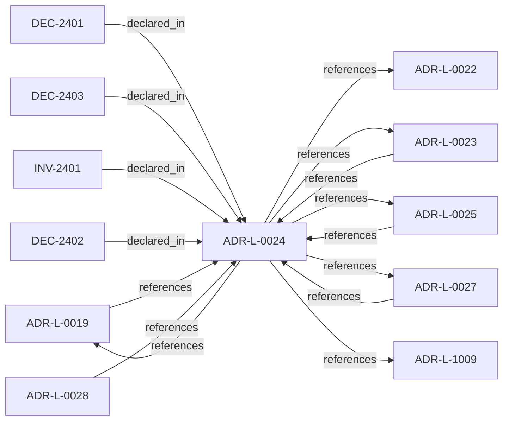

<!--
integrity_schema_version: 1
generated: deterministic_projection_v1
artifact_kind: rendered_adr_markdown
generator_id: adr-projection-markdown
generator_version: 2
hash_algorithm: sha256
source_hash: ec555860d049cf682a5d68f10cffd3c68104715313edcae6eb958973819d0a9f
rendered_hash: 2b2ef8b6279003d61e6f57805443958639e4f3aa009b98595933431a0ba51bc4
-->

# ADR-L-0024: Cross-Component Contracts and Execution Eligibility Interface

**Status:** accepted  
**Created:** 2025-12-23  
**Modified:** 2026-03-29  
**Authors:** Erik Gallmann, ste-spec  
**Domains:** gateway, runtime  
**Tags:** contracts, context-bundle  
**Alias name:** cross-component-contracts-and-execution-eligibility-interface  

## Context

Gateway is a pure validator over a complete Context Bundle; Runtime (with ADF-produced
artifacts) supplies completeness. Requests use references and integrity bindings; responses
are structured with stable reason codes. Execution blocks synchronously until ALLOW.

Legacy: `adrs/published/ADR-024-cross-component-contracts.md`.

**Reconciliation vs ADR-L-100x:** **coexist-with-precedence** — **ADR-L-1009** shapes
kernel-facing decision vocabulary; this ADR defines **Runtime–Gateway** eligibility
envelopes and reason-code stability for the STE system model.

## Relationship graph

## Related ADRs

### ADR-L-0019 — Gateway Authority and Signing Model

**Relationships:**
- 01a04e96-1f5a-7af0-a138-a306f7b93157 -[:references]-> this ADR
- this ADR -[:references]-> 01a04e96-1f5a-7af0-a138-a306f7b93157

**Context:** STE Gateway verifies ORG-signed inputs and enforces eligibility; it does **not** attest
canonical truth or sign canonical artifacts. Eligibility outcomes are ephemeral and
unsigned.

[Open projection](ADR-L-0019-gateway-authority-and-signing-model.md)
### ADR-L-0022 — Fail-Closed Semantics and Enforcement Scope

**Relationships:**
- this ADR -[:references]-> 01a04e96-1f5b-74cc-9a3d-921d80842047

**Context:** Authoritative execution eligibility and canonical promotion require complete, successful
validation. Fail-closed halts authoritative actions when prerequisites cannot be verified;
it does not require total system unavailability. Non-authoritative inspection may continue
under explicit degraded labeling.

[Open projection](ADR-L-0022-fail-closed-semantics-and-enforcement-scope.md)
### ADR-L-0023 — Validation Timing and Responsibility

**Relationships:**
- 01a04e96-1f5b-788c-8306-d10c9fe24eaa -[:references]-> this ADR
- this ADR -[:references]-> 01a04e96-1f5b-788c-8306-d10c9fe24eaa

**Context:** Validation occurs at merge-time (ADF), pre-execution (Gateway), and locally (Runtime).
Only Gateway may authorize execution; ADF blocks canonical promotion; Runtime checks are
advisory for eligibility. Normalized outcomes treat INDETERMINATE as blocking for
authoritative paths.

[Open projection](ADR-L-0023-validation-timing-and-responsibility.md)
### ADR-L-0025 — Environment Semantics

**Relationships:**
- 01a04e96-1f5b-78b8-972b-af0c783ef246 -[:references]-> this ADR
- this ADR -[:references]-> 01a04e96-1f5b-78b8-972b-af0c783ef246

**Context:** Environment is a mandatory, opaque identifier partitioning canonical state and
attestations. Fabric governance defines allowed values; Gateway enforces exact
case-sensitive equality between Context Bundle and Fabric Attestation; no inference,
defaults, aliases, or hierarchy in v1.

[Open projection](ADR-L-0025-environment-semantics.md)
### ADR-L-0027 — Scope Semantics and Versioning

**Relationships:**
- 01a04e96-1f5b-7d37-8038-1c811fc5261b -[:references]-> this ADR
- this ADR -[:references]-> 01a04e96-1f5b-7d37-8038-1c811fc5261b

**Context:** Scope is a colon-delimited hierarchical identifier participating in authority checks.
Version 1 uses exact string equality; version 2 uses segment-prefix matching with
most-specific authority resolution and denial on equal-depth ambiguity. Trust Registry
and Context Bundle must declare `scope_semantics_version` consistently.

[Open projection](ADR-L-0027-scope-semantics-and-versioning.md)
### ADR-L-0028 — AI-DOC Fabric and Gateway Authority Boundaries

**Relationships:**
- 01a04e96-1f5b-7551-992f-4be395920f16 -[:references]-> this ADR

**Context:** Fabric is the sole canonical state authority, invariant resolver, conflict detector for
attested bundles, and signer of Fabric Attestations. Gateway is a pure verifier that does
not query Fabric during eligibility evaluation. Runtime assembles and transports bundles
and attestations without substituting Fabric authority.

[Open projection](ADR-L-0028-ai-doc-fabric-and-gateway-authority-boundaries.md)
### ADR-L-1009 — Kernel Decision Contract

**Relationships:**
- this ADR -[:references]-> 01a04e96-1f5d-7793-873c-136f29f470be

**Context:** This ADR-L defines the normative **inputs** and **outputs** of a kernel admission
decision and the invariants that make decisions auditable and reproducible. It is the
architectural predecessor to future schemas and integration contracts; it does not specify wire formats.

[Open projection](ADR-L-1009-kernel-decision-contract.md)

## Invariants

### INV-2401

**Statement:** Execution MUST NOT begin until Gateway returns ALLOW; optimistic or asynchronous
eligibility patterns that proceed before ALLOW are forbidden for authoritative execution.
  
**Scope:** global  
**Enforcement:** must (policy)  
**Verification:** audit

**Rationale:**
Prevents time-of-check to time-of-use gaps.

## Decisions

### DEC-2401: Gateway MUST NOT modify, enrich, infer, or complete eligibility requests; incomplete input fails closed

**Rationale:**
Preserves deterministic evaluation and audit reconstruction from submitted bundles alone.

**Consequences:**

**Positive:**
- Reproducible eligibility decisions

**Negative:**
- Callers must supply complete envelopes

### DEC-2402: Runtime or Runtime-plus-ADF constructs the complete Context Bundle; Gateway resolves references from authoritative stores and verifies independently

**Rationale:**
Separates construction from verification and prevents blind trust in upstream validation summaries.

**Consequences:**

**Positive:**
- Independent verification at the boundary

**Negative:**
- Duplicate verification work at Gateway

### DEC-2403: Require structured eligibility responses with ALLOW, DENY, or INDETERMINATE; map INDETERMINATE to denial for execution; use stable reason codes

**Rationale:**
Enables machine-actionable handling and aligns with normalized outcomes (ADR-L-0023).

**Consequences:**

**Positive:**
- Deterministic client behavior

**Negative:**
- Reason-code taxonomy must evolve carefully

## Gaps

### GAP-2401: Transport and serialization formats remain implementation-specific if contract semantics are preserved

**Impact:** low  
**Blocking:** No

---

*Generated from ADR-L-0024 by ADR Architecture Kit*