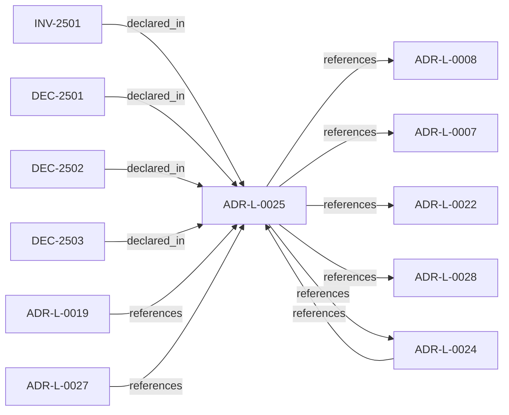

<!--
integrity_schema_version: 1
generated: deterministic_projection_v1
artifact_kind: rendered_adr_markdown
generator_id: adr-projection-markdown
generator_version: 2
hash_algorithm: sha256
source_hash: 23b7b95cc798b9c4db4344900b2b8de64ac2f3f539f879e76053aa2f77bb3206
rendered_hash: 0a895a3ebfc9a76a1386fd8ff17d2f707a468b965f3524a362b4c026da9a3358
-->

# ADR-L-0025: Environment Semantics

**Status:** accepted  
**Created:** 2025-12-29  
**Modified:** 2026-03-29  
**Authors:** Erik Gallmann, ste-spec  
**Domains:** gateway, fabric  
**Tags:** environment, canonical-state  
**Alias name:** environment-semantics  

## Context

Environment is a mandatory, opaque identifier partitioning canonical state and
attestations. Fabric governance defines allowed values; Gateway enforces exact
case-sensitive equality between Context Bundle and Fabric Attestation; no inference,
defaults, aliases, or hierarchy in v1.

Legacy: `adrs/published/ADR-025-environment-semantics.md`.

**Reconciliation vs ADR-L-100x:** **coexist-with-precedence** — environment is a
**STE-system canonical dimension** for eligibility; kernel documentation-state
environments (if any) are orthogonal unless explicitly bridged in a future ADR-L.

## Relationship graph

## Related ADRs

### ADR-L-0007 — Slice Identity Strategy

**Relationships:**
- this ADR -[:references]-> 01a04e96-1f5a-7ea8-b832-ea3972a2f81e

**Context:** Slices require unique, stable, deterministic identifiers derived from **observable**
semantic anchors (contracts, paths, source paths, table names) rather than volatile
implementation labels alone.

[Open projection](ADR-L-0007-slice-identity-strategy.md)
### ADR-L-0008 — Correctness and Consistency Contract

**Relationships:**
- this ADR -[:references]-> 01a04e96-1f5a-7a29-b11e-4fe242be290c

**Context:** Defines user-visible **correctness** and **consistency** guarantees for Fabric
documentation-state queried over extracted and asserted facts, including partial
failures, overlapping reconciliation jobs, provenance coexistence, and multi-region
eventual consistency.

[Open projection](ADR-L-0008-correctness-and-consistency-contract.md)
### ADR-L-0019 — Gateway Authority and Signing Model

**Relationships:**
- 01a04e96-1f5a-7af0-a138-a306f7b93157 -[:references]-> this ADR

**Context:** STE Gateway verifies ORG-signed inputs and enforces eligibility; it does **not** attest
canonical truth or sign canonical artifacts. Eligibility outcomes are ephemeral and
unsigned.

[Open projection](ADR-L-0019-gateway-authority-and-signing-model.md)
### ADR-L-0022 — Fail-Closed Semantics and Enforcement Scope

**Relationships:**
- this ADR -[:references]-> 01a04e96-1f5b-74cc-9a3d-921d80842047

**Context:** Authoritative execution eligibility and canonical promotion require complete, successful
validation. Fail-closed halts authoritative actions when prerequisites cannot be verified;
it does not require total system unavailability. Non-authoritative inspection may continue
under explicit degraded labeling.

[Open projection](ADR-L-0022-fail-closed-semantics-and-enforcement-scope.md)
### ADR-L-0024 — Cross-Component Contracts and Execution Eligibility Interface

**Relationships:**
- 01a04e96-1f5b-7e90-9f2d-79f60b81c807 -[:references]-> this ADR
- this ADR -[:references]-> 01a04e96-1f5b-7e90-9f2d-79f60b81c807

**Context:** Gateway is a pure validator over a complete Context Bundle; Runtime (with ADF-produced
artifacts) supplies completeness. Requests use references and integrity bindings; responses
are structured with stable reason codes. Execution blocks synchronously until ALLOW.

[Open projection](ADR-L-0024-cross-component-contracts-and-execution-eligibility-interface.md)
### ADR-L-0027 — Scope Semantics and Versioning

**Relationships:**
- 01a04e96-1f5b-7d37-8038-1c811fc5261b -[:references]-> this ADR

**Context:** Scope is a colon-delimited hierarchical identifier participating in authority checks.
Version 1 uses exact string equality; version 2 uses segment-prefix matching with
most-specific authority resolution and denial on equal-depth ambiguity. Trust Registry
and Context Bundle must declare `scope_semantics_version` consistently.

[Open projection](ADR-L-0027-scope-semantics-and-versioning.md)
### ADR-L-0028 — AI-DOC Fabric and Gateway Authority Boundaries

**Relationships:**
- this ADR -[:references]-> 01a04e96-1f5b-7551-992f-4be395920f16

**Context:** Fabric is the sole canonical state authority, invariant resolver, conflict detector for
attested bundles, and signer of Fabric Attestations. Gateway is a pure verifier that does
not query Fabric during eligibility evaluation. Runtime assembles and transports bundles
and attestations without substituting Fabric authority.

[Open projection](ADR-L-0028-ai-doc-fabric-and-gateway-authority-boundaries.md)

## Invariants

### INV-2501

**Statement:** Gateway MUST NOT infer, default, case-fold, pattern-match, or hierarchically interpret
environment identifiers for v1 eligibility; only exact equality on declared identifiers
is permitted.
  
**Scope:** global  
**Enforcement:** must (policy)  
**Verification:** audit

**Rationale:**
Preserves determinism claims for eligibility evaluation.

## Decisions

### DEC-2501: Treat environment as a primary canonical dimension with mandatory explicit identifiers in Fabric Attestations and Context Bundles

**Rationale:**
Prevents ambiguous canonical boundaries and cross-environment authorization mistakes.

**Consequences:**

**Positive:**
- Deterministic partition of canonical state

**Negative:**
- No silent defaults for environment

### DEC-2502: Enforce environment equality with exact case-sensitive string match at Gateway; deny on mismatch

**Rationale:**
Exact matching is falsifiable and implementation-neutral for v1.

**Consequences:**

**Positive:**
- Predictable interoperability

**Negative:**
- Naming discipline required across teams

### DEC-2503: Bind environment into signed Fabric Attestation content; prohibit inference from infrastructure or git metadata

**Rationale:**
Stops substitution and hidden derivation of scope.

**Consequences:**

**Positive:**
- Cryptographic binding of scope claims

**Negative:**
- Explicit configuration burden on callers

## Gaps

### GAP-2501: Future ADR-L for hierarchical environments, wildcards, or aliases if needed

**Impact:** low  
**Blocking:** No

---

*Generated from ADR-L-0025 by ADR Architecture Kit*