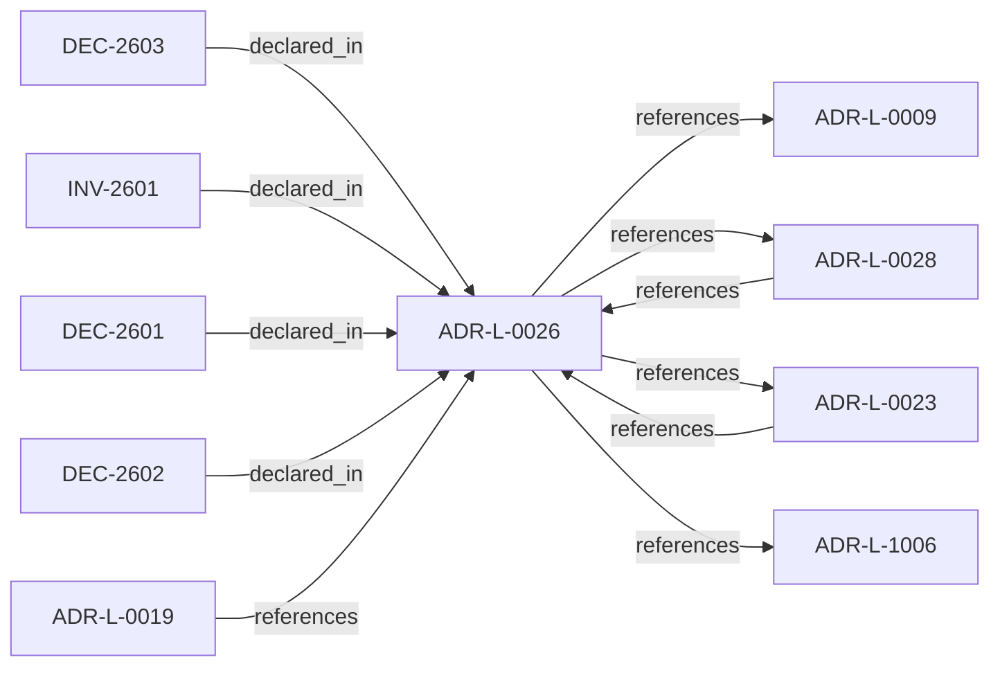

<!--
integrity_schema_version: 1
generated: deterministic_projection_v1
artifact_kind: rendered_adr_markdown
generator_id: adr-projection-markdown
generator_version: 2
hash_algorithm: sha256
source_hash: 0690db30804fb7acc304dbbb53ef7f584efaba31ebeaf3562b7f425a6190c2d5
rendered_hash: 2b71ad8225192c0764c5b3c2a267fc351e152f6d6a497397ffd3199efd48c5eb
-->

# ADR-L-0026: Invariant Conflict Detection Semantics

**Status:** accepted  
**Created:** 2025-12-29  
**Modified:** 2026-03-29  
**Authors:** Erik Gallmann, ste-spec  
**Domains:** fabric, gateway  
**Tags:** invariants, conflicts  
**Alias name:** invariant-conflict-detection-semantics  

## Context

For v1, Fabric performs conflict detection when creating attestations and signs a
`conflict_status` field (`none` or `detected`). Gateway verifies the attestation and
enforces denial when conflicts are attested; Gateway MUST NOT implement independent
invariant content parsing for conflict detection.

Legacy: `adrs/published/ADR-026-invariant-conflict-detection-semantics.md`.

**Reconciliation vs ADR-L-0023:** **merge** — the normative Gateway obligation in
ADR-L-0023 is satisfied by **verifying Fabric-attested conflict status**, not by
recomputing conflicts from raw invariant payloads at Gateway.

**Reconciliation vs ADR-L-100x:** **coexist-with-precedence** — kernel IR may model
invariants separately; this ADR governs **STE eligibility attestation mechanics**.

## Relationship graph

## Related ADRs

### ADR-L-0009 — Assertion Precedence Model

**Relationships:**
- this ADR -[:references]-> 01a04e96-1f5a-70b0-a91f-0d25282f542c

**Context:** Manual assertions and deterministic extraction can describe the same elements. The model
preserves both with provenance, surfaces contradictions, requires evidence for human
claims, and supports time-bounded validity.

[Open projection](ADR-L-0009-assertion-precedence-model.md)
### ADR-L-0019 — Gateway Authority and Signing Model

**Relationships:**
- 01a04e96-1f5a-7af0-a138-a306f7b93157 -[:references]-> this ADR

**Context:** STE Gateway verifies ORG-signed inputs and enforces eligibility; it does **not** attest
canonical truth or sign canonical artifacts. Eligibility outcomes are ephemeral and
unsigned.

[Open projection](ADR-L-0019-gateway-authority-and-signing-model.md)
### ADR-L-0023 — Validation Timing and Responsibility

**Relationships:**
- 01a04e96-1f5b-788c-8306-d10c9fe24eaa -[:references]-> this ADR
- this ADR -[:references]-> 01a04e96-1f5b-788c-8306-d10c9fe24eaa

**Context:** Validation occurs at merge-time (ADF), pre-execution (Gateway), and locally (Runtime).
Only Gateway may authorize execution; ADF blocks canonical promotion; Runtime checks are
advisory for eligibility. Normalized outcomes treat INDETERMINATE as blocking for
authoritative paths.

[Open projection](ADR-L-0023-validation-timing-and-responsibility.md)
### ADR-L-0028 — AI-DOC Fabric and Gateway Authority Boundaries

**Relationships:**
- 01a04e96-1f5b-7551-992f-4be395920f16 -[:references]-> this ADR
- this ADR -[:references]-> 01a04e96-1f5b-7551-992f-4be395920f16

**Context:** Fabric is the sole canonical state authority, invariant resolver, conflict detector for
attested bundles, and signer of Fabric Attestations. Gateway is a pure verifier that does
not query Fabric during eligibility evaluation. Runtime assembles and transports bundles
and attestations without substituting Fabric authority.

[Open projection](ADR-L-0028-ai-doc-fabric-and-gateway-authority-boundaries.md)
### ADR-L-1006 — Evidence Authority Model

**Relationships:**
- this ADR -[:references]-> 01a04e96-1f5d-78e4-b527-64a4a9e9e2b5

**Context:** Runtime evidence is authoritative as **factual observation** within its contract, not as
a replacement for normative architecture declared in ste-spec and documentation-state.
When evidence contradicts IR or ADR meaning, the kernel MUST categorize contradiction as
drift or assessment finding; it MUST NOT silently rewrite normative sources.

[Open projection](ADR-L-1006-evidence-authority-model.md)

## Invariants

### INV-2601

**Statement:** Gateway MUST NOT treat raw invariant payload comparison as authoritative for conflict
detection; authoritative conflict signal is the signed Fabric `conflict_status` field.
  
**Scope:** global  
**Enforcement:** must (policy)  
**Verification:** audit

**Rationale:**
Aligns verifier-only boundary with deterministic enforcement.

## Decisions

### DEC-2601: Define v1 conflict as duplicate canonical invariant identifiers with differing content digests within one Fabric Attestation scope

**Rationale:**
Provides a mechanical, falsifiable conflict predicate without semantic theorem proving.

**Consequences:**

**Positive:**
- Deterministic detection in Fabric

**Negative:**
- Semantic contradictions without ID collision remain out of scope for v1

### DEC-2602: Require signed `conflict_status` on Fabric Attestations; Gateway denies with INVARIANT_CONFLICT when status is detected; missing or invalid status fails closed

**Rationale:**
Keeps Gateway in verifier-only posture while enforcing PREREQ-4 outcomes.

**Consequences:**

**Positive:**
- Stable denial category mapping

**Negative:**
- Fabric must publish consistent attestation fields

### DEC-2603: Forbid Gateway-side conflict algorithms that parse or compare invariant content beyond attestation verification

**Rationale:**
Prevents implementation divergence and hidden state discovery at the boundary.

**Consequences:**

**Positive:**
- Interoperable Gateway behavior

**Negative:**
- Fabric bears detection responsibility

## Gaps

### GAP-2601: Future ADR-L for semantic conflict classes or cross-attestation rules if required

**Impact:** medium  
**Blocking:** No

---

*Generated from ADR-L-0026 by ADR Architecture Kit*