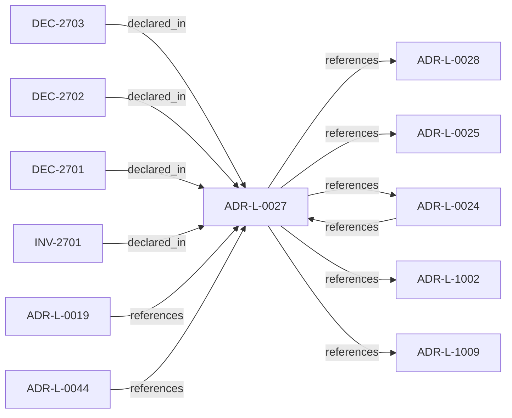

<!--
integrity_schema_version: 1
generated: deterministic_projection_v1
artifact_kind: rendered_adr_markdown
generator_id: adr-projection-markdown
generator_version: 2
hash_algorithm: sha256
source_hash: d1ced69dc1cba1e67a7469c6bdf44c9d734319449d0c2a7c6d166e683616b78c
rendered_hash: 2d10f5bdc35a58ebb47a2018d44cb19e2883b019805dbcf4a8d05db7172f85fc
-->

# ADR-L-0027: Scope Semantics and Versioning

**Status:** accepted  
**Created:** 2025-12-29  
**Modified:** 2026-03-29  
**Authors:** Erik Gallmann, ste-spec  
**Domains:** gateway, trust  
**Tags:** scope, authority  
**Alias name:** scope-semantics-and-versioning  

## Context

Scope is a colon-delimited hierarchical identifier participating in authority checks.
Version 1 uses exact string equality; version 2 uses segment-prefix matching with
most-specific authority resolution and denial on equal-depth ambiguity. Trust Registry
and Context Bundle must declare `scope_semantics_version` consistently.

Legacy: `adrs/published/ADR-027-scope-semantics.md`.

**Reconciliation vs ADR-L-100x:** **coexist-with-precedence** — trust and admission
stories in **ADR-L-1002** / **ADR-L-1009** apply at kernel documentation boundaries;
this ADR defines **STE scope string mechanics** for Gateway checks.

## Relationship graph

## Related ADRs

### ADR-L-0019 — Gateway Authority and Signing Model

**Relationships:**
- 01a04e96-1f5a-7af0-a138-a306f7b93157 -[:references]-> this ADR

**Context:** STE Gateway verifies ORG-signed inputs and enforces eligibility; it does **not** attest
canonical truth or sign canonical artifacts. Eligibility outcomes are ephemeral and
unsigned.

[Open projection](ADR-L-0019-gateway-authority-and-signing-model.md)
### ADR-L-0024 — Cross-Component Contracts and Execution Eligibility Interface

**Relationships:**
- 01a04e96-1f5b-7e90-9f2d-79f60b81c807 -[:references]-> this ADR
- this ADR -[:references]-> 01a04e96-1f5b-7e90-9f2d-79f60b81c807

**Context:** Gateway is a pure validator over a complete Context Bundle; Runtime (with ADF-produced
artifacts) supplies completeness. Requests use references and integrity bindings; responses
are structured with stable reason codes. Execution blocks synchronously until ALLOW.

[Open projection](ADR-L-0024-cross-component-contracts-and-execution-eligibility-interface.md)
### ADR-L-0025 — Environment Semantics

**Relationships:**
- this ADR -[:references]-> 01a04e96-1f5b-78b8-972b-af0c783ef246

**Context:** Environment is a mandatory, opaque identifier partitioning canonical state and
attestations. Fabric governance defines allowed values; Gateway enforces exact
case-sensitive equality between Context Bundle and Fabric Attestation; no inference,
defaults, aliases, or hierarchy in v1.

[Open projection](ADR-L-0025-environment-semantics.md)
### ADR-L-0028 — AI-DOC Fabric and Gateway Authority Boundaries

**Relationships:**
- this ADR -[:references]-> 01a04e96-1f5b-7551-992f-4be395920f16

**Context:** Fabric is the sole canonical state authority, invariant resolver, conflict detector for
attested bundles, and signer of Fabric Attestations. Gateway is a pure verifier that does
not query Fabric during eligibility evaluation. Runtime assembles and transports bundles
and attestations without substituting Fabric authority.

[Open projection](ADR-L-0028-ai-doc-fabric-and-gateway-authority-boundaries.md)
### ADR-L-0044 — Governed Semantic Reasoning Foundation

**Relationships:**
- 01a06490-5b3c-76c0-9da2-abc5d28f8970 -[:references]-> this ADR

**Context:** This ADR promotes the first bounded semantic re-baseline tranche: FD-01,
FD-01-R1, and the NM-01 semantic contents represented by SD-01 through SD-05.
The senior design lock ledger and Design Journal are design evidence only; this
ADR is the accepted authority for the semantic foundation stated here.

[Open projection](ADR-L-0044-governed-semantic-reasoning-foundation.md)
### ADR-L-1002 — Architecture Admission Model

**Relationships:**
- this ADR -[:references]-> 01a04e96-1f5c-73c9-ad1f-df05ef43cae1

**Context:** Admission decides whether a **requested action** may proceed under declared
architecture truth (IR), factual evidence, governance posture, and active rules.
This ADR-L defines the semantic meaning of allowed, denied, conditional, and warned
admission postures and the **input closure** required to reach a decision.

[Open projection](ADR-L-1002-architecture-admission-model.md)
### ADR-L-1009 — Kernel Decision Contract

**Relationships:**
- this ADR -[:references]-> 01a04e96-1f5d-7793-873c-136f29f470be

**Context:** This ADR-L defines the normative **inputs** and **outputs** of a kernel admission
decision and the invariants that make decisions auditable and reproducible. It is the
architectural predecessor to future schemas and integration contracts; it does not specify wire formats.

[Open projection](ADR-L-1009-kernel-decision-contract.md)

## Invariants

### INV-2701

**Statement:** Gateway MUST NOT upgrade or infer `scope_semantics_version`; mismatched declared
versions between Trust Registry and Context Bundle MUST result in denial.
  
**Scope:** global  
**Enforcement:** must (policy)  
**Verification:** audit

**Rationale:**
Prevents silent semantic upgrades.

## Decisions

### DEC-2701: Validate scope grammar (segments of alphanumerics, underscore, hyphen; length and depth limits) and require explicit semantics version per Trust Registry entry and Context Bundle

**Rationale:**
Prevents ambiguous or unbounded scope strings and enables safe evolution.

**Consequences:**

**Positive:**
- Portable scope identifiers

**Negative:**
- Version mismatch becomes a hard denial

### DEC-2702: For version 1, require exact case-sensitive equality between authority scope and claimed scope

**Rationale:**
Minimal deterministic baseline compatible with pre-v2 artifacts when version omitted.

**Consequences:**

**Positive:**
- Simple matching semantics

**Negative:**
- No hierarchical delegation in v1

### DEC-2703: For version 2, require prefix match on segment boundaries; select deepest matching authority; deny with SCOPE_CONFLICT on equal-depth ties

**Rationale:**
Supports delegated authority without regex or fuzzy matching.

**Consequences:**

**Positive:**
- Predictable delegation resolution

**Negative:**
- Registry hygiene required to avoid conflicts

## Gaps

### GAP-2701: Future versions beyond v2 require new ADR-L and explicit version values

**Impact:** low  
**Blocking:** No

---

*Generated from ADR-L-0027 by ADR Architecture Kit*