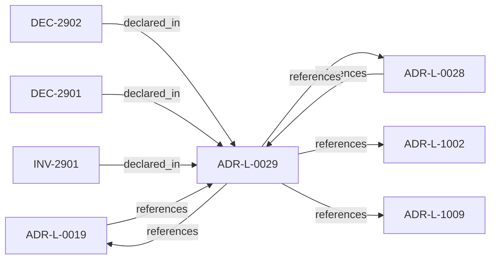

<!--
integrity_schema_version: 1
generated: deterministic_projection_v1
artifact_kind: rendered_adr_markdown
generator_id: adr-projection-markdown
generator_version: 2
hash_algorithm: sha256
source_hash: 0034da30145350749c79a87c2628b2dfdda722a08e8551bcc248c9a41e17747e
rendered_hash: 4ba6349f5e58d48798c696a1202c2b90d02fef21f2ae220e29157cf5aa11cdad
-->

# ADR-L-0029: Gateway Enforcement Authority

**Status:** accepted  
**Created:** 2025-12-30  
**Modified:** 2026-03-29  
**Authors:** Erik Gallmann, ste-spec  
**Domains:** gateway, governance  
**Tags:** enforcement, authority  
**Alias name:** gateway-enforcement-authority  

## Context

Gateway holds Enforcement Authority: verify ORG-signed material, consult trust registry,
evaluate eligibility prerequisites, emit ephemeral unsigned decisions. It is distinct
from ORG attestation authority which signs durable canonical artifacts.

Legacy: `adrs/published/ADR-029-gateway-enforcement-authority.md`.

**Reconciliation vs ADR-L-0019:** **merge** — ADR-L-0019 states ORG-scoped enforcement
without ORG attestation; this ADR names the **Enforcement Authority** kind explicitly for
trust-registry and specification alignment.

**Reconciliation vs ADR-L-100x:** **coexist-with-precedence** — kernel admission models
remain documentation-state focused; this ADR names the **production Gateway** authority
slice for STE eligibility.

## Relationship graph

## Related ADRs

### ADR-L-0019 — Gateway Authority and Signing Model

**Relationships:**
- 01a04e96-1f5a-7af0-a138-a306f7b93157 -[:references]-> this ADR
- this ADR -[:references]-> 01a04e96-1f5a-7af0-a138-a306f7b93157

**Context:** STE Gateway verifies ORG-signed inputs and enforces eligibility; it does **not** attest
canonical truth or sign canonical artifacts. Eligibility outcomes are ephemeral and
unsigned.

[Open projection](ADR-L-0019-gateway-authority-and-signing-model.md)
### ADR-L-0028 — AI-DOC Fabric and Gateway Authority Boundaries

**Relationships:**
- 01a04e96-1f5b-7551-992f-4be395920f16 -[:references]-> this ADR
- this ADR -[:references]-> 01a04e96-1f5b-7551-992f-4be395920f16

**Context:** Fabric is the sole canonical state authority, invariant resolver, conflict detector for
attested bundles, and signer of Fabric Attestations. Gateway is a pure verifier that does
not query Fabric during eligibility evaluation. Runtime assembles and transports bundles
and attestations without substituting Fabric authority.

[Open projection](ADR-L-0028-ai-doc-fabric-and-gateway-authority-boundaries.md)
### ADR-L-1002 — Architecture Admission Model

**Relationships:**
- this ADR -[:references]-> 01a04e96-1f5c-73c9-ad1f-df05ef43cae1

**Context:** Admission decides whether a **requested action** may proceed under declared
architecture truth (IR), factual evidence, governance posture, and active rules.
This ADR-L defines the semantic meaning of allowed, denied, conditional, and warned
admission postures and the **input closure** required to reach a decision.

[Open projection](ADR-L-1002-architecture-admission-model.md)
### ADR-L-1009 — Kernel Decision Contract

**Relationships:**
- this ADR -[:references]-> 01a04e96-1f5d-7793-873c-136f29f470be

**Context:** This ADR-L defines the normative **inputs** and **outputs** of a kernel admission
decision and the invariants that make decisions auditable and reproducible. It is the
architectural predecessor to future schemas and integration contracts; it does not specify wire formats.

[Open projection](ADR-L-1009-kernel-decision-contract.md)

## Invariants

### INV-2901

**Statement:** Gateway MUST NOT be modeled as holding ORG attestation authority to sign canonical
artifacts or Fabric Attestations; its authority is limited to verification and
enforcement per ADR-L-0019 and ADR-L-0028.
  
**Scope:** global  
**Enforcement:** must (policy)  
**Verification:** audit

**Rationale:**
Preserves authority scarcity for canonical publishers.

## Decisions

### DEC-2901: Define Enforcement Authority as Gateway-specific verification and eligibility enforcement without canonical publishing or trust-registry mutation

**Rationale:**
Removes contradiction between ORG signing requirements and Gateway verifier role.

**Consequences:**

**Positive:**
- Clear trust-registry schema direction

**Negative:**
- Implementations must not label Gateway keys as ORG signing keys

### DEC-2902: Keep eligibility outcomes ephemeral and unsigned while retaining audit logs tied to signed inputs

**Rationale:**
Avoids false equivalence between point-in-time enforcement and durable canonical truth.

**Consequences:**

**Positive:**
- Smaller long-lived signing surface

**Negative:**
- Consumers cannot treat decisions as standalone attestations

## Gaps

### GAP-2901: Align specification section references (e.g. §6.1.5) with handbook and ISO-42010 views

**Impact:** low  
**Blocking:** No

---

*Generated from ADR-L-0029 by ADR Architecture Kit*