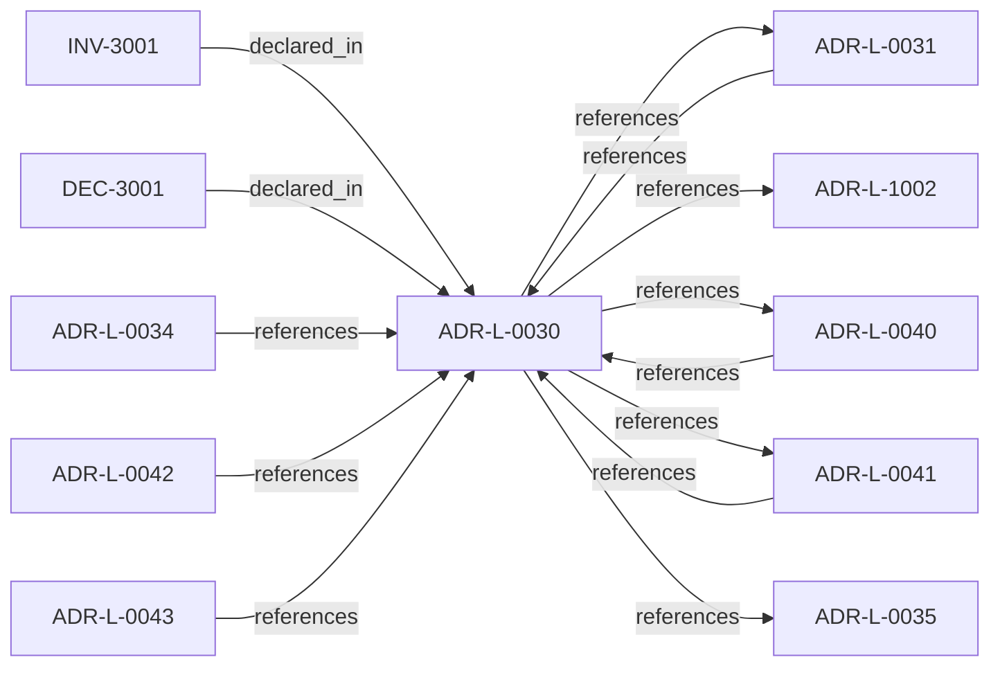

<!--
integrity_schema_version: 1
generated: deterministic_projection_v1
artifact_kind: rendered_adr_markdown
generator_id: adr-projection-markdown
generator_version: 2
hash_algorithm: sha256
source_hash: ad5a34125be475ed2b5264f5f56cc3b3cdeffa751013f0a8cb9e36bd9d15ba0a
rendered_hash: b25d35abccf90b2ce152606eabdbd825513e4654501da6964e6bf026d81e71f7
-->

# ADR-L-0030: Contract Authority in ste-spec

**Status:** accepted  
**Created:** 2025-12-19  
**Modified:** 2026-03-29  
**Authors:** Erik Gallmann, ste-spec  
**Domains:** contracts, governance  
**Tags:** contracts, ste-spec  
**Alias name:** contract-authority-in-ste-spec  

## Context

Cross-repository handoff contracts are governed in **ste-spec**: shape in `contracts/`,
rules in `invariants/`, rationale in ADRs. Runtime and kernel repos remain subordinate
implementation surfaces.

Legacy: `adrs/published/ADR-030-contract-authority-in-ste-spec.md`.

**Reconciliation vs ADR-L-100x:** **coexist-with-precedence** — **ADR-L-1002** defines
admission semantics at the kernel documentation layer; this ADR asserts **ste-spec
ownership of interchange contracts** that admission consumes.

## Relationship graph

## Related ADRs

### ADR-L-0031 — Runtime and Kernel Responsibility Boundary

**Relationships:**
- 01a04e96-1f5b-7c56-bc3f-75fbbc94d42b -[:references]-> this ADR
- this ADR -[:references]-> 01a04e96-1f5b-7c56-bc3f-75fbbc94d42b

**Context:** **ste-runtime** produces factual evidence only. **ste-kernel** is the caller-facing
admission authority at the evaluated System Instance boundary (explicit environment and
evaluation scope).

[Open projection](ADR-L-0031-runtime-and-kernel-responsibility-boundary.md)
### ADR-L-0034 — Rule Projection Envelope Authority

**Relationships:**
- 01a04e96-1f5b-76a7-9f3e-74a771a33e46 -[:references]-> this ADR

**Context:** ste-spec will own the interchange envelope for ADR-bound rule projections and related
attestations under `contracts/rule-projection/` when promoted from draft. Semantic rules
live in `invariants/` (e.g. INV-0010). ste-kernel must not be treated as authoritative
signer or compiler of rule text for these envelopes.

[Open projection](ADR-L-0034-rule-projection-envelope-authority.md)
### ADR-L-0035 — Architecture IR Ontology Authority in ste-spec

**Relationships:**
- this ADR -[:references]-> 01a04e96-1f5c-7fd4-bf3e-ddca6103eae1

**Context:** `architecture/STE-Architecture-Intermediate-Representation.md` is the canonical **semantic**
specification of Architecture IR. Mechanical JSON Schema and compiled enumerations publish
under `contracts/architecture-ir/` per the contract pin. ste-kernel consumes the bundle;
it does not own normative mechanical definitions. Compiler roles are further constrained
by ADR-L-0041.

[Open projection](ADR-L-0035-architecture-ir-ontology-authority-in-ste-spec.md)
### ADR-L-0040 — STE Spine Lifecycle and Authority

**Relationships:**
- 01a04e96-1f5c-78e0-823f-3c915d07acd6 -[:references]-> this ADR
- this ADR -[:references]-> 01a04e96-1f5c-78e0-823f-3c915d07acd6

**Context:** Defines the canonical **Spine** lifecycle stages, system states, authority categories, and
precedence rules tying together ste-spec doctrine, implementation repos, publication,
Architecture IR compilation, kernel admission, runtime evidence, assessment, and
governance. Does not redefine ADR-L-0038 taxonomy, ADR-L-0035 ontology, ADR-L-0031
boundary, or ADR-L-0030 contract authority.

[Open projection](ADR-L-0040-ste-spine-lifecycle-and-authority.md)
### ADR-L-0041 — Compiler, Evidence, and Merge Authority

**Relationships:**
- 01a04e96-1f5c-7e5b-9837-1dea58886565 -[:references]-> this ADR
- this ADR -[:references]-> 01a04e96-1f5c-7e5b-9837-1dea58886565

**Context:** Non-overlapping compiler roles: **adr-architecture-kit** is the authoring compiler for
ADR registries/manifest/rendered views (not a second compiler-of-record for
`ArchitectureEvidence` or normative `Compiled_IR_Document`). **ste-runtime** is runtime
evidence compiler of record. **ste-kernel** merges publication fragments, validates IR,
and emits `KernelAdmissionAssessment` while consuming ste-spec contracts.

[Open projection](ADR-L-0041-compiler-evidence-and-merge-authority.md)
### ADR-L-0042 — Open Standards and Closed Intelligence Boundary

**Relationships:**
- 01a04e96-1f5c-7116-883f-0badde97c759 -[:references]-> this ADR

**Context:** STE adopts **open standards plus closed intelligence**: public specifications define
compatible artifact formats, schemas, interfaces, and deterministic validation surfaces;
proprietary reasoning may remain behind those interfaces.

[Open projection](ADR-L-0042-open-standards-and-closed-intelligence-boundary.md)
### ADR-L-0043 — Context Domain and MVC Lifecycle Boundary

**Relationships:**
- 01a04e96-1f5c-72a7-8a1b-81cf44933af3 -[:references]-> this ADR

**Context:** STE is introducing an experimental model for task-scoped architectural context.
The model treats MVC as a task-scoped architectural reality bundle rather than
generic context reduction. RSS assembles the candidate architectural reality
surface from declared intent, Context Domains, Graph Domains, Linkage Surfaces,
Architecture IR snapshots, task context, and persona context-selection policy.

[Open projection](ADR-L-0043-context-domain-and-mvc-lifecycle-boundary.md)
### ADR-L-1002 — Architecture Admission Model

**Relationships:**
- this ADR -[:references]-> 01a04e96-1f5c-73c9-ad1f-df05ef43cae1

**Context:** Admission decides whether a **requested action** may proceed under declared
architecture truth (IR), factual evidence, governance posture, and active rules.
This ADR-L defines the semantic meaning of allowed, denied, conditional, and warned
admission postures and the **input closure** required to reach a decision.

[Open projection](ADR-L-1002-architecture-admission-model.md)

## Invariants

### INV-3001

**Statement:** Runtime and kernel repositories MUST NOT treat repo-local types, tests, or informal
prose as authoritative over ste-spec `contracts/` and published invariants for the
same handoff surfaces.
  
**Scope:** global  
**Enforcement:** must (policy)  
**Verification:** audit

**Rationale:**
Preserves ADR-L-0030 as the contract authority anchor.

## Decisions

### DEC-3001: Govern cross-repository handoff contract shape in ste-spec `contracts/` and rules in `invariants/`

**Rationale:**
Single normative source for payload structure, semantic rules, and architectural intent
at the runtime/kernel boundary.

**Consequences:**

**Positive:**
- No parallel shadow contract authority in consumer repos

**Negative:**
- Contract evolution requires coordinated ste-spec changes

## Gaps

### GAP-3001: Enumerate every handoff contract family in Architecture IR when catalogs mature

**Impact:** low  
**Blocking:** No

---

*Generated from ADR-L-0030 by ADR Architecture Kit*