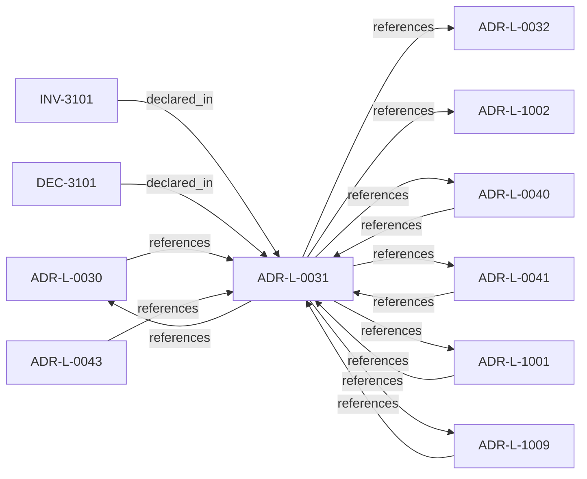

<!--
integrity_schema_version: 1
generated: deterministic_projection_v1
artifact_kind: rendered_adr_markdown
generator_id: adr-projection-markdown
generator_version: 2
hash_algorithm: sha256
source_hash: 476166df97c67127de0647e1ee84ac2cc11c1bcb2c4316438e5c3570d67a3ede
rendered_hash: 80ef68923909cc2e97a520674089bc22e274e148940315ca01f099d3be14a8d7
-->

# ADR-L-0031: Runtime and Kernel Responsibility Boundary

**Status:** accepted  
**Created:** 2025-12-19  
**Modified:** 2026-03-29  
**Authors:** Erik Gallmann, ste-spec  
**Domains:** kernel, runtime  
**Tags:** admission, evidence  
**Alias name:** runtime-and-kernel-responsibility-boundary  

## Context

**ste-runtime** produces factual evidence only. **ste-kernel** is the caller-facing
admission authority at the evaluated System Instance boundary (explicit environment and
evaluation scope).

Legacy: `adrs/published/ADR-031-runtime-kernel-responsibility-boundary.md`.

**Reconciliation vs ADR-L-100x:** **merge** — **ADR-L-1001** action model and
**ADR-L-1002** admission model formalize the same separation for kernel documentation;
this ADR names the **repository roles** (runtime vs kernel) that realize it.

## Relationship graph

## Related ADRs

### ADR-L-0030 — Contract Authority in ste-spec

**Relationships:**
- 01a04e96-1f5b-752a-bb27-9bfbb872ffc6 -[:references]-> this ADR
- this ADR -[:references]-> 01a04e96-1f5b-752a-bb27-9bfbb872ffc6

**Context:** Cross-repository handoff contracts are governed in **ste-spec**: shape in `contracts/`,
rules in `invariants/`, rationale in ADRs. Runtime and kernel repos remain subordinate
implementation surfaces.

[Open projection](ADR-L-0030-contract-authority-in-ste-spec.md)
### ADR-L-0032 — Fail-Closed Enforcement Model

**Relationships:**
- this ADR -[:references]-> 01a04e96-1f5b-7ece-bf1f-4f6ac80361f5

**Context:** Invalid, unavailable, malformed, or semantically inconsistent runtime evidence and
related publication inputs are fail-closed at the **kernel** boundary before permissive
admission outcomes. Schema validity alone is insufficient for conformance.

[Open projection](ADR-L-0032-fail-closed-enforcement-model.md)
### ADR-L-0040 — STE Spine Lifecycle and Authority

**Relationships:**
- 01a04e96-1f5c-78e0-823f-3c915d07acd6 -[:references]-> this ADR
- this ADR -[:references]-> 01a04e96-1f5c-78e0-823f-3c915d07acd6

**Context:** Defines the canonical **Spine** lifecycle stages, system states, authority categories, and
precedence rules tying together ste-spec doctrine, implementation repos, publication,
Architecture IR compilation, kernel admission, runtime evidence, assessment, and
governance. Does not redefine ADR-L-0038 taxonomy, ADR-L-0035 ontology, ADR-L-0031
boundary, or ADR-L-0030 contract authority.

[Open projection](ADR-L-0040-ste-spine-lifecycle-and-authority.md)
### ADR-L-0041 — Compiler, Evidence, and Merge Authority

**Relationships:**
- 01a04e96-1f5c-7e5b-9837-1dea58886565 -[:references]-> this ADR
- this ADR -[:references]-> 01a04e96-1f5c-7e5b-9837-1dea58886565

**Context:** Non-overlapping compiler roles: **adr-architecture-kit** is the authoring compiler for
ADR registries/manifest/rendered views (not a second compiler-of-record for
`ArchitectureEvidence` or normative `Compiled_IR_Document`). **ste-runtime** is runtime
evidence compiler of record. **ste-kernel** merges publication fragments, validates IR,
and emits `KernelAdmissionAssessment` while consuming ste-spec contracts.

[Open projection](ADR-L-0041-compiler-evidence-and-merge-authority.md)
### ADR-L-0043 — Context Domain and MVC Lifecycle Boundary

**Relationships:**
- 01a04e96-1f5c-72a7-8a1b-81cf44933af3 -[:references]-> this ADR

**Context:** STE is introducing an experimental model for task-scoped architectural context.
The model treats MVC as a task-scoped architectural reality bundle rather than
generic context reduction. RSS assembles the candidate architectural reality
surface from declared intent, Context Domains, Graph Domains, Linkage Surfaces,
Architecture IR snapshots, task context, and persona context-selection policy.

[Open projection](ADR-L-0043-context-domain-and-mvc-lifecycle-boundary.md)
### ADR-L-1001 — Architecture Action Model

**Relationships:**
- 01a04e96-1f5c-7eef-9c36-e3ff0be7a77d -[:references]-> this ADR
- this ADR -[:references]-> 01a04e96-1f5c-7eef-9c36-e3ff0be7a77d

**Context:** The kernel does not admit or deny systems in the abstract. Caller-facing admission
evaluates whether a **requested action** on a system (in an explicit environment and
evaluation scope) is allowed, denied, conditional, or warned under declared architecture,
evidence, posture, and rules.

[Open projection](ADR-L-1001-architecture-action-model.md)
### ADR-L-1002 — Architecture Admission Model

**Relationships:**
- this ADR -[:references]-> 01a04e96-1f5c-73c9-ad1f-df05ef43cae1

**Context:** Admission decides whether a **requested action** may proceed under declared
architecture truth (IR), factual evidence, governance posture, and active rules.
This ADR-L defines the semantic meaning of allowed, denied, conditional, and warned
admission postures and the **input closure** required to reach a decision.

[Open projection](ADR-L-1002-architecture-admission-model.md)
### ADR-L-1009 — Kernel Decision Contract

**Relationships:**
- 01a04e96-1f5d-7793-873c-136f29f470be -[:references]-> this ADR
- this ADR -[:references]-> 01a04e96-1f5d-7793-873c-136f29f470be

**Context:** This ADR-L defines the normative **inputs** and **outputs** of a kernel admission
decision and the invariants that make decisions auditable and reproducible. It is the
architectural predecessor to future schemas and integration contracts; it does not specify wire formats.

[Open projection](ADR-L-1009-kernel-decision-contract.md)

## Invariants

### INV-3101

**Statement:** ste-runtime MUST NOT emit caller-facing admission or execution-eligibility decision
semantics; ste-kernel alone emits `KernelAdmissionAssessment` per published contracts.
  
**Scope:** global  
**Enforcement:** must (policy)  
**Verification:** audit

**Rationale:**
Enforces the evidence versus decision split at the boundary.

## Decisions

### DEC-3101: Confine ste-runtime to evidence production; assign caller-facing admission to ste-kernel

**Rationale:**
Keeps runtime factual and kernel authoritative without collapsing shared contracts into
one role.

**Consequences:**

**Positive:**
- Clear handoff semantics

**Negative:**
- Runtime cannot emit admission outcomes

## Gaps

### GAP-3101: Wire-format examples live in contracts; keep ADR-L scoped to authority

**Impact:** low  
**Blocking:** No

---

*Generated from ADR-L-0031 by ADR Architecture Kit*