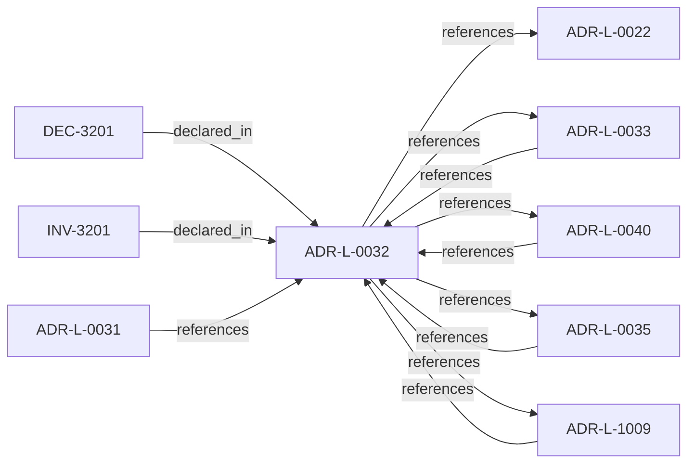

<!--
integrity_schema_version: 1
generated: deterministic_projection_v1
artifact_kind: rendered_adr_markdown
generator_id: adr-projection-markdown
generator_version: 2
hash_algorithm: sha256
source_hash: a3e59697c6853248d442515462365e7a63df0ff54e185ee04a6e0de912ced249
rendered_hash: 71177e5f1679f966d174677705de16616ece6cfc7fa5e4723fc2aaa3cd7c6d30
-->

# ADR-L-0032: Fail-Closed Enforcement Model

**Status:** accepted  
**Created:** 2025-12-19  
**Modified:** 2026-03-29  
**Authors:** Erik Gallmann, ste-spec  
**Domains:** kernel, enforcement  
**Tags:** fail-closed, admission  
**Alias name:** fail-closed-enforcement-model  

## Context

Invalid, unavailable, malformed, or semantically inconsistent runtime evidence and
related publication inputs are fail-closed at the **kernel** boundary before permissive
admission outcomes. Schema validity alone is insufficient for conformance.

Legacy: `adrs/published/ADR-032-fail-closed-enforcement-model.md`.

**Reconciliation vs ADR-L-1009:** **merge** — **ADR-L-1009** states determinism and
fail-closed kernel decision contracts; this ADR applies the same posture specifically to
**runtime evidence and publication inputs** at merge/admission.

**Reconciliation vs ADR-L-0022:** **coexist-with-precedence** — ADR-L-0022 defines STE
Gateway and promotion fail-closed triggers in the broader STE-System model; this ADR
governs the **kernel documentation-state / IR** enforcement chain.

## Relationship graph

## Related ADRs

### ADR-L-0022 — Fail-Closed Semantics and Enforcement Scope

**Relationships:**
- this ADR -[:references]-> 01a04e96-1f5b-74cc-9a3d-921d80842047

**Context:** Authoritative execution eligibility and canonical promotion require complete, successful
validation. Fail-closed halts authoritative actions when prerequisites cannot be verified;
it does not require total system unavailability. Non-authoritative inspection may continue
under explicit degraded labeling.

[Open projection](ADR-L-0022-fail-closed-semantics-and-enforcement-scope.md)
### ADR-L-0031 — Runtime and Kernel Responsibility Boundary

**Relationships:**
- 01a04e96-1f5b-7c56-bc3f-75fbbc94d42b -[:references]-> this ADR

**Context:** **ste-runtime** produces factual evidence only. **ste-kernel** is the caller-facing
admission authority at the evaluated System Instance boundary (explicit environment and
evaluation scope).

[Open projection](ADR-L-0031-runtime-and-kernel-responsibility-boundary.md)
### ADR-L-0033 — Closed-Object Discipline

**Relationships:**
- 01a04e96-1f5b-7efb-a818-9534da2c4cd4 -[:references]-> this ADR
- this ADR -[:references]-> 01a04e96-1f5b-7efb-a818-9534da2c4cd4

**Context:** Runtime/kernel handoff objects are **closed by default**: undeclared fields are not
contract-valid and cannot become hidden semantic or policy channels across repositories.

[Open projection](ADR-L-0033-closed-object-discipline.md)
### ADR-L-0035 — Architecture IR Ontology Authority in ste-spec

**Relationships:**
- 01a04e96-1f5c-7fd4-bf3e-ddca6103eae1 -[:references]-> this ADR
- this ADR -[:references]-> 01a04e96-1f5c-7fd4-bf3e-ddca6103eae1

**Context:** `architecture/STE-Architecture-Intermediate-Representation.md` is the canonical **semantic**
specification of Architecture IR. Mechanical JSON Schema and compiled enumerations publish
under `contracts/architecture-ir/` per the contract pin. ste-kernel consumes the bundle;
it does not own normative mechanical definitions. Compiler roles are further constrained
by ADR-L-0041.

[Open projection](ADR-L-0035-architecture-ir-ontology-authority-in-ste-spec.md)
### ADR-L-0040 — STE Spine Lifecycle and Authority

**Relationships:**
- 01a04e96-1f5c-78e0-823f-3c915d07acd6 -[:references]-> this ADR
- this ADR -[:references]-> 01a04e96-1f5c-78e0-823f-3c915d07acd6

**Context:** Defines the canonical **Spine** lifecycle stages, system states, authority categories, and
precedence rules tying together ste-spec doctrine, implementation repos, publication,
Architecture IR compilation, kernel admission, runtime evidence, assessment, and
governance. Does not redefine ADR-L-0038 taxonomy, ADR-L-0035 ontology, ADR-L-0031
boundary, or ADR-L-0030 contract authority.

[Open projection](ADR-L-0040-ste-spine-lifecycle-and-authority.md)
### ADR-L-1009 — Kernel Decision Contract

**Relationships:**
- 01a04e96-1f5d-7793-873c-136f29f470be -[:references]-> this ADR
- this ADR -[:references]-> 01a04e96-1f5d-7793-873c-136f29f470be

**Context:** This ADR-L defines the normative **inputs** and **outputs** of a kernel admission
decision and the invariants that make decisions auditable and reproducible. It is the
architectural predecessor to future schemas and integration contracts; it does not specify wire formats.

[Open projection](ADR-L-1009-kernel-decision-contract.md)

## Invariants

### INV-3201

**Statement:** Version failures, closed-object shape failures, and semantic invariant failures at the
documented handoff MUST be fail-closed conditions for downstream compilation and
admission per ADR-L-0033 and ADR-L-0035.
  
**Scope:** global  
**Enforcement:** must (policy)  
**Verification:** audit

**Rationale:**
Implements the enforcement link between shape, semantics, and admission.

## Decisions

### DEC-3201: Treat invalid boundary evidence and invalid publication inputs as blocking for compilation and admission

**Rationale:**
Unsupported or semantically invalid evidence must not yield action-eligible admission.

**Consequences:**

**Positive:**
- Trustworthy handoff contract

**Negative:**
- Stricter gating on partial failures

## Gaps

### GAP-3201: Diagnostic richness for denial paths is contract-defined; keep schemas aligned

**Impact:** medium  
**Blocking:** No

---

*Generated from ADR-L-0032 by ADR Architecture Kit*