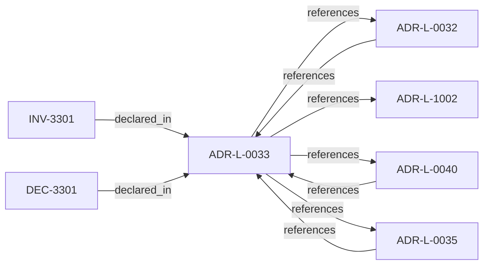

<!--
integrity_schema_version: 1
generated: deterministic_projection_v1
artifact_kind: rendered_adr_markdown
generator_id: adr-projection-markdown
generator_version: 2
hash_algorithm: sha256
source_hash: d20dcc6b2a49b24896c1367e5e8cf91b14b1a6e6077b06300236c2a4d808e623
rendered_hash: 3e102943cee8d278926d46315bd3aa17c4f6c5849ace254db98b723ce3b0d964
-->

# ADR-L-0033: Closed-Object Discipline

**Status:** accepted  
**Created:** 2025-12-19  
**Modified:** 2026-03-29  
**Authors:** Erik Gallmann, ste-spec  
**Domains:** contracts, kernel  
**Tags:** schema, handoff  
**Alias name:** closed-object-discipline  

## Context

Runtime/kernel handoff objects are **closed by default**: undeclared fields are not
contract-valid and cannot become hidden semantic or policy channels across repositories.

Legacy: `adrs/published/ADR-033-closed-object-discipline.md`.

**Reconciliation vs ADR-L-1002:** **coexist-with-precedence** — admission consumes typed
inputs; closed objects prevent undeclared side channels that would undermine admission
predicates.

## Relationship graph

## Related ADRs

### ADR-L-0032 — Fail-Closed Enforcement Model

**Relationships:**
- 01a04e96-1f5b-7ece-bf1f-4f6ac80361f5 -[:references]-> this ADR
- this ADR -[:references]-> 01a04e96-1f5b-7ece-bf1f-4f6ac80361f5

**Context:** Invalid, unavailable, malformed, or semantically inconsistent runtime evidence and
related publication inputs are fail-closed at the **kernel** boundary before permissive
admission outcomes. Schema validity alone is insufficient for conformance.

[Open projection](ADR-L-0032-fail-closed-enforcement-model.md)
### ADR-L-0035 — Architecture IR Ontology Authority in ste-spec

**Relationships:**
- 01a04e96-1f5c-7fd4-bf3e-ddca6103eae1 -[:references]-> this ADR
- this ADR -[:references]-> 01a04e96-1f5c-7fd4-bf3e-ddca6103eae1

**Context:** `architecture/STE-Architecture-Intermediate-Representation.md` is the canonical **semantic**
specification of Architecture IR. Mechanical JSON Schema and compiled enumerations publish
under `contracts/architecture-ir/` per the contract pin. ste-kernel consumes the bundle;
it does not own normative mechanical definitions. Compiler roles are further constrained
by ADR-L-0041.

[Open projection](ADR-L-0035-architecture-ir-ontology-authority-in-ste-spec.md)
### ADR-L-0040 — STE Spine Lifecycle and Authority

**Relationships:**
- 01a04e96-1f5c-78e0-823f-3c915d07acd6 -[:references]-> this ADR
- this ADR -[:references]-> 01a04e96-1f5c-78e0-823f-3c915d07acd6

**Context:** Defines the canonical **Spine** lifecycle stages, system states, authority categories, and
precedence rules tying together ste-spec doctrine, implementation repos, publication,
Architecture IR compilation, kernel admission, runtime evidence, assessment, and
governance. Does not redefine ADR-L-0038 taxonomy, ADR-L-0035 ontology, ADR-L-0031
boundary, or ADR-L-0030 contract authority.

[Open projection](ADR-L-0040-ste-spine-lifecycle-and-authority.md)
### ADR-L-1002 — Architecture Admission Model

**Relationships:**
- this ADR -[:references]-> 01a04e96-1f5c-73c9-ad1f-df05ef43cae1

**Context:** Admission decides whether a **requested action** may proceed under declared
architecture truth (IR), factual evidence, governance posture, and active rules.
This ADR-L defines the semantic meaning of allowed, denied, conditional, and warned
admission postures and the **input closure** required to reach a decision.

[Open projection](ADR-L-1002-architecture-admission-model.md)

## Invariants

### INV-3301

**Statement:** Ad hoc extension fields on closed handoff objects MUST NOT be treated as contract-valid
without an explicit ste-spec contract and invariant update.
  
**Scope:** global  
**Enforcement:** must (policy)  
**Verification:** audit

**Rationale:**
Prevents silent semantic extension.

## Decisions

### DEC-3301: Require closed-object discipline for encoded handoff payloads at the runtime/kernel boundary

**Rationale:**
Bounded objects force explicit contract evolution and deterministic rejection of drift.

**Consequences:**

**Positive:**
- Deterministic producer/consumer conformance

**Negative:**
- Extension requires spec revision

## Gaps

### GAP-3301: Per-contract closedness flags belong in schema metadata and invariants indexes

**Impact:** low  
**Blocking:** No

---

*Generated from ADR-L-0033 by ADR Architecture Kit*