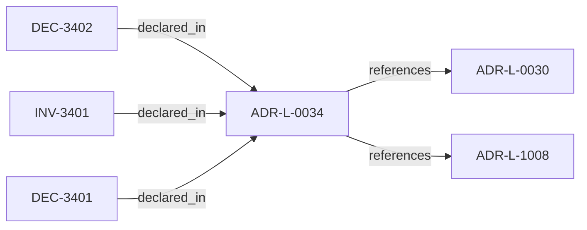

<!--
integrity_schema_version: 1
generated: deterministic_projection_v1
artifact_kind: rendered_adr_markdown
generator_id: adr-projection-markdown
generator_version: 2
hash_algorithm: sha256
source_hash: ef54ef574b448599a59d4c8d66e2e0b8901c18b3d803ede7fc06f82deaeea783
rendered_hash: 90cdaae6379f56acc007a16420d16bbf655984d777b38ec0e3182f41814da5b4
-->

# ADR-L-0034: Rule Projection Envelope Authority

**Status:** proposed  
**Created:** 2025-12-19  
**Modified:** 2026-03-29  
**Authors:** Erik Gallmann, ste-spec  
**Domains:** contracts, governance  
**Tags:** rule-projection, kernel  
**Alias name:** rule-projection-envelope-authority  

## Context

ste-spec will own the interchange envelope for ADR-bound rule projections and related
attestations under `contracts/rule-projection/` when promoted from draft. Semantic rules
live in `invariants/` (e.g. INV-0010). ste-kernel must not be treated as authoritative
signer or compiler of rule text for these envelopes.

Legacy: `adrs/published/ADR-034-rule-projection-envelope-authority.md` (draft contract).

**Reconciliation vs ADR-L-1008:** **coexist-with-precedence** — decision outcome vocabulary
governs admitted decisions; rule-projection envelopes are a **separate durable family**
with rules-engine-side closure.

## Relationship graph

## Related ADRs

### ADR-L-0030 — Contract Authority in ste-spec

**Relationships:**
- this ADR -[:references]-> 01a04e96-1f5b-752a-bb27-9bfbb872ffc6

**Context:** Cross-repository handoff contracts are governed in **ste-spec**: shape in `contracts/`,
rules in `invariants/`, rationale in ADRs. Runtime and kernel repos remain subordinate
implementation surfaces.

[Open projection](ADR-L-0030-contract-authority-in-ste-spec.md)
### ADR-L-1008 — Decision Outcome Model

**Relationships:**
- this ADR -[:references]-> 01a04e96-1f5d-7300-b13f-588156097d46

**Context:** Caller-facing admission emits a small set of canonical outcomes. Each outcome carries
meaning for whether the **requested action** may execute, what remediation is required,
and how warnings differ from hard gates.

[Open projection](ADR-L-1008-decision-outcome-model.md)

## Invariants

### INV-3401

**Statement:** Until the rule-projection envelope family is promoted to accepted contract status,
ste-kernel integrations MUST treat draft schemas as interface-only and MUST NOT imply
normative closure beyond published disclaimers.
  
**Scope:** global  
**Enforcement:** should (policy)  
**Verification:** audit

**Rationale:**
Prevents draft artifacts from becoming shadow normative authority.

## Decisions

### DEC-3401: Centralize rule-projection envelope contract authority in ste-spec once promoted from draft

**Rationale:**
Avoids collapsing integration IR admission and workspace compliance gates into one payload.

**Consequences:**

**Positive:**
- Clear ownership before kernel adapters harden

**Negative:**
- Promotion requires schema stability work

### DEC-3402: Allow kernel to verify, route, or cache rules-engine outputs per contracts without owning rule closure

**Rationale:**
Preserves signing and compilation authority on the rules-engine side for this family.

**Consequences:**

**Positive:**
- Separation of concerns

**Negative:**
- Requires explicit adapter documentation

## Gaps

### GAP-3401: Promotion checklist in ADR-034 legacy prose (stable $id`, tests, index updates)

**Impact:** medium  
**Blocking:** No

---

*Generated from ADR-L-0034 by ADR Architecture Kit*