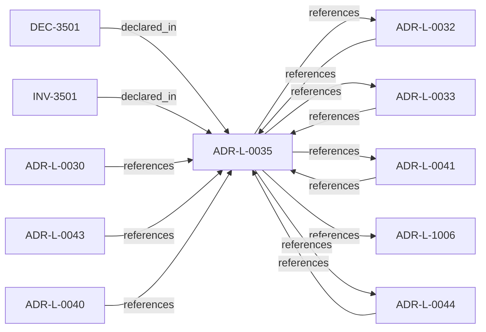

<!--
integrity_schema_version: 1
generated: deterministic_projection_v1
artifact_kind: rendered_adr_markdown
generator_id: adr-projection-markdown
generator_version: 2
hash_algorithm: sha256
source_hash: f38a490c7c15ff1578fe13b83d384e6e9c24f110f9032045643b9413084a706f
rendered_hash: d8f2b817a64c88e94ebe728c84250e99ca75cece5c4d995c8bbd5a3b0a9abbad
-->

# ADR-L-0035: Architecture IR Ontology Authority in ste-spec

**Status:** accepted  
**Created:** 2025-12-19  
**Modified:** 2026-09-02  
**Authors:** Erik Gallmann, ste-spec  
**Domains:** architecture-ir, contracts  
**Tags:** ontology, semantics  
**Alias name:** architecture-ir-ontology-authority-in-ste-spec  

## Context

`architecture/STE-Architecture-Intermediate-Representation.md` is the canonical **semantic**
specification of Architecture IR. Mechanical JSON Schema and compiled enumerations publish
under `contracts/architecture-ir/` per the contract pin. ste-kernel consumes the bundle;
it does not own normative mechanical definitions. Compiler roles are further constrained
by ADR-L-0041.

Legacy: `adrs/published/ADR-035-architecture-ir-ontology-authority.md`.

**Reconciliation vs ADR-L-1006:** **coexist-with-precedence** — evidence authority governs
evidentiary artifacts; this ADR governs **Architecture IR meaning** versus mechanical enums.
**Reconciliation vs ADR-L-0044:** **coexist-with-precedence** — ADR-L-0044 establishes cross-cutting governed-reasoning and normative semantic meaning; this ADR remains the authority for semantic Architecture IR ontology and mechanical realization boundaries. No CE-01 identity or compiled IR identity change is implied.

## Relationship graph

## Related ADRs

### ADR-L-0030 — Contract Authority in ste-spec

**Relationships:**
- 01a04e96-1f5b-752a-bb27-9bfbb872ffc6 -[:references]-> this ADR

**Context:** Cross-repository handoff contracts are governed in **ste-spec**: shape in `contracts/`,
rules in `invariants/`, rationale in ADRs. Runtime and kernel repos remain subordinate
implementation surfaces.

[Open projection](ADR-L-0030-contract-authority-in-ste-spec.md)
### ADR-L-0032 — Fail-Closed Enforcement Model

**Relationships:**
- 01a04e96-1f5b-7ece-bf1f-4f6ac80361f5 -[:references]-> this ADR
- this ADR -[:references]-> 01a04e96-1f5b-7ece-bf1f-4f6ac80361f5

**Context:** Invalid, unavailable, malformed, or semantically inconsistent runtime evidence and
related publication inputs are fail-closed at the **kernel** boundary before permissive
admission outcomes. Schema validity alone is insufficient for conformance.

[Open projection](ADR-L-0032-fail-closed-enforcement-model.md)
### ADR-L-0033 — Closed-Object Discipline

**Relationships:**
- 01a04e96-1f5b-7efb-a818-9534da2c4cd4 -[:references]-> this ADR
- this ADR -[:references]-> 01a04e96-1f5b-7efb-a818-9534da2c4cd4

**Context:** Runtime/kernel handoff objects are **closed by default**: undeclared fields are not
contract-valid and cannot become hidden semantic or policy channels across repositories.

[Open projection](ADR-L-0033-closed-object-discipline.md)
### ADR-L-0040 — STE Spine Lifecycle and Authority

**Relationships:**
- 01a04e96-1f5c-78e0-823f-3c915d07acd6 -[:references]-> this ADR

**Context:** Defines the canonical **Spine** lifecycle stages, system states, authority categories, and
precedence rules tying together ste-spec doctrine, implementation repos, publication,
Architecture IR compilation, kernel admission, runtime evidence, assessment, and
governance. Does not redefine ADR-L-0038 taxonomy, ADR-L-0035 ontology, ADR-L-0031
boundary, or ADR-L-0030 contract authority.

[Open projection](ADR-L-0040-ste-spine-lifecycle-and-authority.md)
### ADR-L-0041 — Compiler, Evidence, and Merge Authority

**Relationships:**
- 01a04e96-1f5c-7e5b-9837-1dea58886565 -[:references]-> this ADR
- this ADR -[:references]-> 01a04e96-1f5c-7e5b-9837-1dea58886565

**Context:** Non-overlapping compiler roles: **adr-architecture-kit** is the authoring compiler for
ADR registries/manifest/rendered views (not a second compiler-of-record for
`ArchitectureEvidence` or normative `Compiled_IR_Document`). **ste-runtime** is runtime
evidence compiler of record. **ste-kernel** merges publication fragments, validates IR,
and emits `KernelAdmissionAssessment` while consuming ste-spec contracts.

[Open projection](ADR-L-0041-compiler-evidence-and-merge-authority.md)
### ADR-L-0043 — Context Domain and MVC Lifecycle Boundary

**Relationships:**
- 01a04e96-1f5c-72a7-8a1b-81cf44933af3 -[:references]-> this ADR

**Context:** STE is introducing an experimental model for task-scoped architectural context.
The model treats MVC as a task-scoped architectural reality bundle rather than
generic context reduction. RSS assembles the candidate architectural reality
surface from declared intent, Context Domains, Graph Domains, Linkage Surfaces,
Architecture IR snapshots, task context, and persona context-selection policy.

[Open projection](ADR-L-0043-context-domain-and-mvc-lifecycle-boundary.md)
### ADR-L-0044 — Governed Semantic Reasoning Foundation

**Relationships:**
- 01a06490-5b3c-76c0-9da2-abc5d28f8970 -[:references]-> this ADR
- this ADR -[:references]-> 01a06490-5b3c-76c0-9da2-abc5d28f8970

**Context:** This ADR promotes the first bounded semantic re-baseline tranche: FD-01,
FD-01-R1, and the NM-01 semantic contents represented by SD-01 through SD-05.
The senior design lock ledger and Design Journal are design evidence only; this
ADR is the accepted authority for the semantic foundation stated here.

[Open projection](ADR-L-0044-governed-semantic-reasoning-foundation.md)
### ADR-L-1006 — Evidence Authority Model

**Relationships:**
- this ADR -[:references]-> 01a04e96-1f5d-78e4-b527-64a4a9e9e2b5

**Context:** Runtime evidence is authoritative as **factual observation** within its contract, not as
a replacement for normative architecture declared in ste-spec and documentation-state.
When evidence contradicts IR or ADR meaning, the kernel MUST categorize contradiction as
drift or assessment finding; it MUST NOT silently rewrite normative sources.

[Open projection](ADR-L-1006-evidence-authority-model.md)

## Invariants

### INV-3501

**Statement:** Extensions to mechanical Architecture IR enumerations MUST be ste-spec contract changes
with pin discipline; semantic additions MAY land in ste-spec prose first with explicit
realization notes.
  
**Scope:** global  
**Enforcement:** must (policy)  
**Verification:** audit

**Rationale:**
Preserves ADR-L-0035 as ontology and mechanical authority anchor.

## Decisions

### DEC-3501: Keep semantic Architecture IR authority in ste-spec prose; keep mechanical schemas and pins in ste-spec contracts

**Rationale:**
Prevents conflating JSON `kind` enums with the full ontology and avoids duplicate schema authority in kernel repos.

**Consequences:**

**Positive:**
- Single cross-repo vocabulary reference

**Negative:**
- Requires disciplined ir_version and schema_id updates

## Gaps

### GAP-3501: Registry surfaces and adapter projections should cite both prose ontology and mechanical pin

**Impact:** low  
**Blocking:** No

---

*Generated from ADR-L-0035 by ADR Architecture Kit*