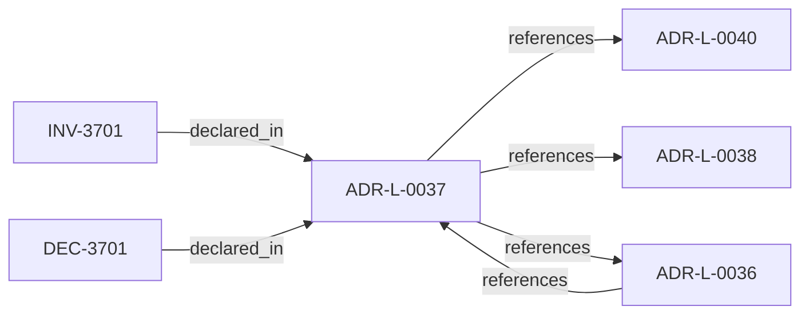

<!--
integrity_schema_version: 1
generated: deterministic_projection_v1
artifact_kind: rendered_adr_markdown
generator_id: adr-projection-markdown
generator_version: 2
hash_algorithm: sha256
source_hash: 2317a4e14ef42d61f4582fc90c10f5234dba0ac92d59fbe7163f31a8688bb5ac
rendered_hash: 6703f29b1db8076695a525a60f3a136e6bc511670bc4d5416cd719060cb1b144
-->

# ADR-L-0037: Repository README Conformance and Reference Implementation

**Status:** accepted  
**Created:** 2025-12-19  
**Modified:** 2026-03-29  
**Authors:** Erik Gallmann, ste-spec  
**Domains:** governance, documentation  
**Tags:** readme, conformance  
**Alias name:** repository-readme-conformance-and-reference-implementation  

## Context

Every STE repository MUST provide a README conforming to ADR-L-0036. README is an
Orientation artifact per ADR-L-0038: non-authoritative, should be versioned, cannot
introduce doctrine, and must cite normative sources for authority claims.

Legacy: `adrs/published/ADR-037-repository-readme-conformance-and-reference-implementation.md`.

**Reconciliation vs ADR-L-100x:** **coexist-with-precedence** — orthogonal to kernel
admission contracts; governs **multi-repo human surfaces** only.

## Relationship graph

## Related ADRs

### ADR-L-0036 — Repository README Contract

**Relationships:**
- 01a04e96-1f5c-7fa8-a63c-a55b509dbca2 -[:references]-> this ADR
- this ADR -[:references]-> 01a04e96-1f5c-7fa8-a63c-a55b509dbca2

**Context:** Every STE repository `README.md` MUST serve as a human-readable architectural boundary
and responsibility description. README is an orientation entry point, subordinate to ADRs,
contracts, invariants, and Architecture IR doctrine.

[Open projection](ADR-L-0036-repository-readme-contract.md)
### ADR-L-0038 — Artifact Taxonomy and Versioning Posture

**Relationships:**
- this ADR -[:references]-> 01a04e96-1f5c-7bf8-893f-f5279ec1ec75

**Context:** STE assigns each artifact a taxonomy **kind** per the ste-spec architecture document that
defines artifact taxonomy and versioning posture (under `architecture/`).
Version-control posture follows that kind, not repository or team preference.
This ADR is canonical for taxonomy and versioning posture; ADR-L-0040 maps kinds into
Spine stages without redefining the taxonomy.

[Open projection](ADR-L-0038-artifact-taxonomy-and-versioning-posture.md)
### ADR-L-0040 — STE Spine Lifecycle and Authority

**Relationships:**
- this ADR -[:references]-> 01a04e96-1f5c-78e0-823f-3c915d07acd6

**Context:** Defines the canonical **Spine** lifecycle stages, system states, authority categories, and
precedence rules tying together ste-spec doctrine, implementation repos, publication,
Architecture IR compilation, kernel admission, runtime evidence, assessment, and
governance. Does not redefine ADR-L-0038 taxonomy, ADR-L-0035 ontology, ADR-L-0031
boundary, or ADR-L-0030 contract authority.

[Open projection](ADR-L-0040-ste-spine-lifecycle-and-authority.md)

## Invariants

### INV-3701

**Statement:** Repository README files MUST remain subordinate to normative artifacts; they MUST NOT
introduce new normative rules, invariants, or contract shapes without an ADR-L or contract change.
  
**Scope:** global  
**Enforcement:** must (policy)  
**Verification:** audit

**Rationale:**
Aligns Orientation posture with ADR-L-0038.

## Decisions

### DEC-3701: Treat ste-spec README as the reference implementation pattern for ADR-L-0036 conformance

**Rationale:**
Provides a concrete converged example after ste-spec refactor.

**Consequences:**

**Positive:**
- System-wide README convergence anchor

**Negative:**
- Reference may lag if ste-spec README changes without updating cross-links

## Gaps

### GAP-3701: Automated linting for README sections is optional tooling outside this ADR-L

**Impact:** low  
**Blocking:** No

---

*Generated from ADR-L-0037 by ADR Architecture Kit*