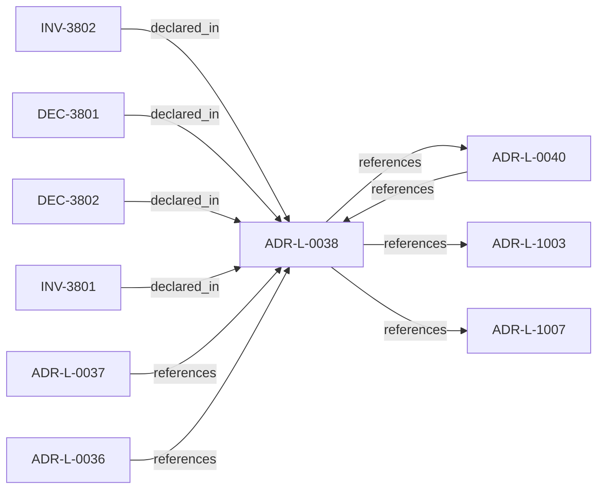

<!--
integrity_schema_version: 1
generated: deterministic_projection_v1
artifact_kind: rendered_adr_markdown
generator_id: adr-projection-markdown
generator_version: 2
hash_algorithm: sha256
source_hash: db9e778034e25d5cb889f9977e703e7bc148496837d82b798f149283973a67c2
rendered_hash: 9e301f4750d74bbf80d9b38ab88467e929c1112ccf2a5e1356948281d568a7f8
-->

# ADR-L-0038: Artifact Taxonomy and Versioning Posture

**Status:** accepted  
**Created:** 2025-12-19  
**Modified:** 2026-03-29  
**Authors:** Erik Gallmann, ste-spec  
**Domains:** governance, taxonomy  
**Tags:** artifacts, versioning  
**Alias name:** artifact-taxonomy-and-versioning-posture  

## Context

STE assigns each artifact a taxonomy **kind** per the ste-spec architecture document that
defines artifact taxonomy and versioning posture (under `architecture/`).
Version-control posture follows that kind, not repository or team preference.
This ADR is canonical for taxonomy and versioning posture; ADR-L-0040 maps kinds into
Spine stages without redefining the taxonomy.

Legacy: ste-spec published **ADR-038** (markdown under `adrs/published/`).

**Reconciliation vs ADR-L-1003 / ADR-L-1007:** **coexist-with-precedence** — governance
posture and Golden models reference artifact participation; ADR-L-0038 remains the
**taxonomy and VCS posture** authority.

## Relationship graph

## Related ADRs

### ADR-L-0036 — Repository README Contract

**Relationships:**
- 01a04e96-1f5c-7fa8-a63c-a55b509dbca2 -[:references]-> this ADR

**Context:** Every STE repository `README.md` MUST serve as a human-readable architectural boundary
and responsibility description. README is an orientation entry point, subordinate to ADRs,
contracts, invariants, and Architecture IR doctrine.

[Open projection](ADR-L-0036-repository-readme-contract.md)
### ADR-L-0037 — Repository README Conformance and Reference Implementation

**Relationships:**
- 01a04e96-1f5c-798e-953b-59dbf5d8cfec -[:references]-> this ADR

**Context:** Every STE repository MUST provide a README conforming to ADR-L-0036. README is an
Orientation artifact per ADR-L-0038: non-authoritative, should be versioned, cannot
introduce doctrine, and must cite normative sources for authority claims.

[Open projection](ADR-L-0037-repository-readme-conformance-and-reference-implementation.md)
### ADR-L-0040 — STE Spine Lifecycle and Authority

**Relationships:**
- 01a04e96-1f5c-78e0-823f-3c915d07acd6 -[:references]-> this ADR
- this ADR -[:references]-> 01a04e96-1f5c-78e0-823f-3c915d07acd6

**Context:** Defines the canonical **Spine** lifecycle stages, system states, authority categories, and
precedence rules tying together ste-spec doctrine, implementation repos, publication,
Architecture IR compilation, kernel admission, runtime evidence, assessment, and
governance. Does not redefine ADR-L-0038 taxonomy, ADR-L-0035 ontology, ADR-L-0031
boundary, or ADR-L-0030 contract authority.

[Open projection](ADR-L-0040-ste-spine-lifecycle-and-authority.md)
### ADR-L-1003 — Governance Posture State Model

**Relationships:**
- this ADR -[:references]-> 01a04e96-1f5c-7ff0-b23d-2ed1f789092f

**Context:** Governance posture constrains what is allowed, what requires explicit approval, what is
restricted, and what is denied independent of any single rule. This model composes with
active rules and promotion flows defined elsewhere (ADR-040 Spine, ste-rules-library).

[Open projection](ADR-L-1003-governance-posture-state-model.md)
### ADR-L-1007 — Golden System Model

**Relationships:**
- this ADR -[:references]-> 01a04e96-1f5d-7507-ba3f-41979e12af8f

**Context:** A Golden system is a designated reference or production-grade posture with stricter
eligibility, evidence, and promotion gates. Golden status is not merely descriptive;
it changes what future promotions and dependent systems may assume.

[Open projection](ADR-L-1007-golden-system-model.md)

## Invariants

### INV-3801

**Statement:** Repositories MUST apply the ste-spec architecture doctrine that defines artifact taxonomy
kinds and versioning posture when determining version-control treatment for STE artifacts.
  
**Scope:** global  
**Enforcement:** must (policy)  
**Verification:** audit

**Rationale:**
Makes the taxonomy document enforceable via ADR-L.

### INV-3802

**Statement:** Spine doctrine and lifecycle projections MUST NOT introduce new top-level taxonomy
kinds or alter VCS posture established in ADR-L-0038 without amending this ADR-L.
  
**Scope:** global  
**Enforcement:** must (policy)  
**Verification:** audit

**Rationale:**
Preserves precedence versus ADR-L-0040.

## Decisions

### DEC-3801: Adopt STE artifact taxonomy kinds (Normative, Implementation, Proof Logic, Derived, Evidence, Reports, Orientation, Internal) with documented VCS posture per architecture doctrine

**Rationale:**
Prevents repositories from drifting on what is source truth versus regenerable output.

**Consequences:**

**Positive:**
- Shared reproducibility expectations

**Negative:**
- Requires discipline when assigning kinds to new outputs

### DEC-3802: Separate version-control posture from normative authority; committing generated artifacts does not make them authoritative

**Rationale:**
Avoids equating git presence with governance authority.

**Consequences:**

**Positive:**
- Clear authority versus storage distinction

**Negative:**
- Requires contributor education

## Gaps

### GAP-3801: Publication artifact exceptions remain labeled in doctrine; track in handbook index

**Impact:** low  
**Blocking:** No

---

*Generated from ADR-L-0038 by ADR Architecture Kit*