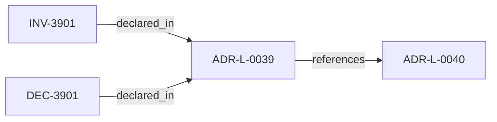

<!--
integrity_schema_version: 1
generated: deterministic_projection_v1
artifact_kind: rendered_adr_markdown
generator_id: adr-projection-markdown
generator_version: 2
hash_algorithm: sha256
source_hash: 599adbf439449320531d69df5cb64474f4bb6c1102fde02a9dd88303f11fef10
rendered_hash: 67617f4335e7041b0e715a69d482843c48252ca7da6348b02a9c5dca4169d233
-->

# ADR-L-0039: Structured Diagram Format (Mermaid)

**Status:** accepted  
**Created:** 2025-12-19  
**Modified:** 2026-03-29  
**Authors:** Erik Gallmann, ste-spec  
**Domains:** documentation, architecture  
**Tags:** mermaid, diagrams  
**Alias name:** structured-diagram-format-mermaid  

## Context

Canonical architecture diagrams in ste-spec MUST use structured, text-based
representation; Mermaid is the standard for canonical diagrams. Diagrams are projections
only and MUST NOT introduce semantics absent from ADRs, contracts, or architecture doctrine.

Legacy: `adrs/published/ADR-039-structured-diagram-format-mermaid.md`.

**Reconciliation vs ADR-L-0040:** **coexist-with-precedence** — Spine lifecycle is defined
in ADR-L-0040; this ADR governs **diagram representation format** for ste-spec projections.

## Relationship graph

## Related ADRs

### ADR-L-0040 — STE Spine Lifecycle and Authority

**Relationships:**
- this ADR -[:references]-> 01a04e96-1f5c-78e0-823f-3c915d07acd6

**Context:** Defines the canonical **Spine** lifecycle stages, system states, authority categories, and
precedence rules tying together ste-spec doctrine, implementation repos, publication,
Architecture IR compilation, kernel admission, runtime evidence, assessment, and
governance. Does not redefine ADR-L-0038 taxonomy, ADR-L-0035 ontology, ADR-L-0031
boundary, or ADR-L-0030 contract authority.

[Open projection](ADR-L-0040-ste-spine-lifecycle-and-authority.md)

## Invariants

### INV-3901

**Statement:** Canonical architecture diagrams MUST NOT be the sole location where a rule, requirement,
or invariant is first defined; authoritative text remains in ADRs, contracts, or doctrine.
  
**Scope:** repository  
**Enforcement:** must (policy)  
**Verification:** manual

**Rationale:**
Prevents diagrams from becoming shadow normative sources.

## Decisions

### DEC-3901: Standardize canonical ste-spec architecture diagrams on Mermaid text sources

**Rationale:**
Reduces format drift and keeps diagrams diffable and reviewable.

**Consequences:**

**Positive:**
- Consistent authoring across architecture docs

**Negative:**
- Styling and CI enforcement remain out of scope here

## Gaps

### GAP-3901: Authoring conventions and CI checks may be added under separate governance

**Impact:** low  
**Blocking:** No

---

*Generated from ADR-L-0039 by ADR Architecture Kit*