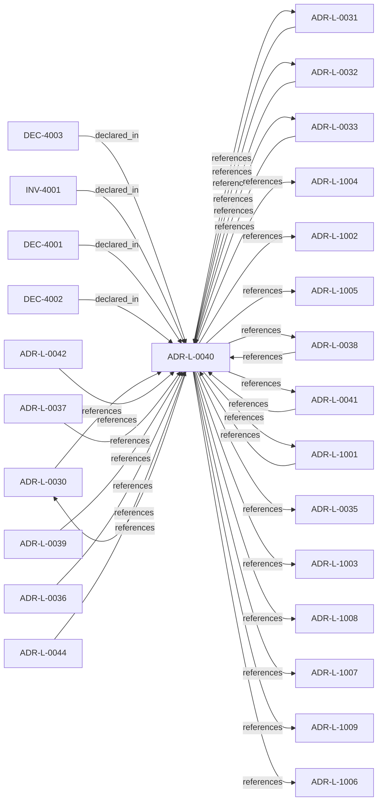

<!--
integrity_schema_version: 1
generated: deterministic_projection_v1
artifact_kind: rendered_adr_markdown
generator_id: adr-projection-markdown
generator_version: 2
hash_algorithm: sha256
source_hash: eab19206ea3c9de36179e41ba204d458094c2dbd5f1b8a11c230b91cd7ac2cd5
rendered_hash: 8ce77884e6ceb462b9f271c27c0007e61b43c9204c5d47978161f8eab01e3455
-->

# ADR-L-0040: STE Spine Lifecycle and Authority

**Status:** accepted  
**Created:** 2025-12-19  
**Modified:** 2026-03-29  
**Authors:** Erik Gallmann, ste-spec  
**Domains:** governance, spine  
**Tags:** lifecycle, authority  
**Alias name:** ste-spine-lifecycle-and-authority  

## Context

Defines the canonical **Spine** lifecycle stages, system states, authority categories, and
precedence rules tying together ste-spec doctrine, implementation repos, publication,
Architecture IR compilation, kernel admission, runtime evidence, assessment, and
governance. Does not redefine ADR-L-0038 taxonomy, ADR-L-0035 ontology, ADR-L-0031
boundary, or ADR-L-0030 contract authority.

Legacy: `adrs/published/ADR-040-ste-spine-lifecycle-and-authority.md`.

**Reconciliation vs ADR-L-1001–1009:** **coexist-with-precedence** — the 100x series
formalizes kernel documentation contracts (actions, admission, posture, freshness, drift,
evidence, Golden, outcomes, decision contract). ADR-L-0040 is the **end-to-end Spine**
model that **uses** those contracts without merging their text.

## Relationship graph

## Related ADRs

### ADR-L-0030 — Contract Authority in ste-spec

**Relationships:**
- 01a04e96-1f5b-752a-bb27-9bfbb872ffc6 -[:references]-> this ADR
- this ADR -[:references]-> 01a04e96-1f5b-752a-bb27-9bfbb872ffc6

**Context:** Cross-repository handoff contracts are governed in **ste-spec**: shape in `contracts/`,
rules in `invariants/`, rationale in ADRs. Runtime and kernel repos remain subordinate
implementation surfaces.

[Open projection](ADR-L-0030-contract-authority-in-ste-spec.md)
### ADR-L-0031 — Runtime and Kernel Responsibility Boundary

**Relationships:**
- 01a04e96-1f5b-7c56-bc3f-75fbbc94d42b -[:references]-> this ADR
- this ADR -[:references]-> 01a04e96-1f5b-7c56-bc3f-75fbbc94d42b

**Context:** **ste-runtime** produces factual evidence only. **ste-kernel** is the caller-facing
admission authority at the evaluated System Instance boundary (explicit environment and
evaluation scope).

[Open projection](ADR-L-0031-runtime-and-kernel-responsibility-boundary.md)
### ADR-L-0032 — Fail-Closed Enforcement Model

**Relationships:**
- 01a04e96-1f5b-7ece-bf1f-4f6ac80361f5 -[:references]-> this ADR
- this ADR -[:references]-> 01a04e96-1f5b-7ece-bf1f-4f6ac80361f5

**Context:** Invalid, unavailable, malformed, or semantically inconsistent runtime evidence and
related publication inputs are fail-closed at the **kernel** boundary before permissive
admission outcomes. Schema validity alone is insufficient for conformance.

[Open projection](ADR-L-0032-fail-closed-enforcement-model.md)
### ADR-L-0033 — Closed-Object Discipline

**Relationships:**
- 01a04e96-1f5b-7efb-a818-9534da2c4cd4 -[:references]-> this ADR
- this ADR -[:references]-> 01a04e96-1f5b-7efb-a818-9534da2c4cd4

**Context:** Runtime/kernel handoff objects are **closed by default**: undeclared fields are not
contract-valid and cannot become hidden semantic or policy channels across repositories.

[Open projection](ADR-L-0033-closed-object-discipline.md)
### ADR-L-0035 — Architecture IR Ontology Authority in ste-spec

**Relationships:**
- this ADR -[:references]-> 01a04e96-1f5c-7fd4-bf3e-ddca6103eae1

**Context:** `architecture/STE-Architecture-Intermediate-Representation.md` is the canonical **semantic**
specification of Architecture IR. Mechanical JSON Schema and compiled enumerations publish
under `contracts/architecture-ir/` per the contract pin. ste-kernel consumes the bundle;
it does not own normative mechanical definitions. Compiler roles are further constrained
by ADR-L-0041.

[Open projection](ADR-L-0035-architecture-ir-ontology-authority-in-ste-spec.md)
### ADR-L-0036 — Repository README Contract

**Relationships:**
- 01a04e96-1f5c-7fa8-a63c-a55b509dbca2 -[:references]-> this ADR

**Context:** Every STE repository `README.md` MUST serve as a human-readable architectural boundary
and responsibility description. README is an orientation entry point, subordinate to ADRs,
contracts, invariants, and Architecture IR doctrine.

[Open projection](ADR-L-0036-repository-readme-contract.md)
### ADR-L-0037 — Repository README Conformance and Reference Implementation

**Relationships:**
- 01a04e96-1f5c-798e-953b-59dbf5d8cfec -[:references]-> this ADR

**Context:** Every STE repository MUST provide a README conforming to ADR-L-0036. README is an
Orientation artifact per ADR-L-0038: non-authoritative, should be versioned, cannot
introduce doctrine, and must cite normative sources for authority claims.

[Open projection](ADR-L-0037-repository-readme-conformance-and-reference-implementation.md)
### ADR-L-0038 — Artifact Taxonomy and Versioning Posture

**Relationships:**
- 01a04e96-1f5c-7bf8-893f-f5279ec1ec75 -[:references]-> this ADR
- this ADR -[:references]-> 01a04e96-1f5c-7bf8-893f-f5279ec1ec75

**Context:** STE assigns each artifact a taxonomy **kind** per the ste-spec architecture document that
defines artifact taxonomy and versioning posture (under `architecture/`).
Version-control posture follows that kind, not repository or team preference.
This ADR is canonical for taxonomy and versioning posture; ADR-L-0040 maps kinds into
Spine stages without redefining the taxonomy.

[Open projection](ADR-L-0038-artifact-taxonomy-and-versioning-posture.md)
### ADR-L-0039 — Structured Diagram Format (Mermaid)

**Relationships:**
- 01a04e96-1f5c-7b22-a63f-3aa84ba7f0c9 -[:references]-> this ADR

**Context:** Canonical architecture diagrams in ste-spec MUST use structured, text-based
representation; Mermaid is the standard for canonical diagrams. Diagrams are projections
only and MUST NOT introduce semantics absent from ADRs, contracts, or architecture doctrine.

[Open projection](ADR-L-0039-structured-diagram-format-mermaid.md)
### ADR-L-0041 — Compiler, Evidence, and Merge Authority

**Relationships:**
- 01a04e96-1f5c-7e5b-9837-1dea58886565 -[:references]-> this ADR
- this ADR -[:references]-> 01a04e96-1f5c-7e5b-9837-1dea58886565

**Context:** Non-overlapping compiler roles: **adr-architecture-kit** is the authoring compiler for
ADR registries/manifest/rendered views (not a second compiler-of-record for
`ArchitectureEvidence` or normative `Compiled_IR_Document`). **ste-runtime** is runtime
evidence compiler of record. **ste-kernel** merges publication fragments, validates IR,
and emits `KernelAdmissionAssessment` while consuming ste-spec contracts.

[Open projection](ADR-L-0041-compiler-evidence-and-merge-authority.md)
### ADR-L-0042 — Open Standards and Closed Intelligence Boundary

**Relationships:**
- 01a04e96-1f5c-7116-883f-0badde97c759 -[:references]-> this ADR

**Context:** STE adopts **open standards plus closed intelligence**: public specifications define
compatible artifact formats, schemas, interfaces, and deterministic validation surfaces;
proprietary reasoning may remain behind those interfaces.

[Open projection](ADR-L-0042-open-standards-and-closed-intelligence-boundary.md)
### ADR-L-0044 — Governed Semantic Reasoning Foundation

**Relationships:**
- 01a06490-5b3c-76c0-9da2-abc5d28f8970 -[:references]-> this ADR

**Context:** This ADR promotes the first bounded semantic re-baseline tranche: FD-01,
FD-01-R1, and the NM-01 semantic contents represented by SD-01 through SD-05.
The senior design lock ledger and Design Journal are design evidence only; this
ADR is the accepted authority for the semantic foundation stated here.

[Open projection](ADR-L-0044-governed-semantic-reasoning-foundation.md)
### ADR-L-1001 — Architecture Action Model

**Relationships:**
- 01a04e96-1f5c-7eef-9c36-e3ff0be7a77d -[:references]-> this ADR
- this ADR -[:references]-> 01a04e96-1f5c-7eef-9c36-e3ff0be7a77d

**Context:** The kernel does not admit or deny systems in the abstract. Caller-facing admission
evaluates whether a **requested action** on a system (in an explicit environment and
evaluation scope) is allowed, denied, conditional, or warned under declared architecture,
evidence, posture, and rules.

[Open projection](ADR-L-1001-architecture-action-model.md)
### ADR-L-1002 — Architecture Admission Model

**Relationships:**
- this ADR -[:references]-> 01a04e96-1f5c-73c9-ad1f-df05ef43cae1

**Context:** Admission decides whether a **requested action** may proceed under declared
architecture truth (IR), factual evidence, governance posture, and active rules.
This ADR-L defines the semantic meaning of allowed, denied, conditional, and warned
admission postures and the **input closure** required to reach a decision.

[Open projection](ADR-L-1002-architecture-admission-model.md)
### ADR-L-1003 — Governance Posture State Model

**Relationships:**
- this ADR -[:references]-> 01a04e96-1f5c-7ff0-b23d-2ed1f789092f

**Context:** Governance posture constrains what is allowed, what requires explicit approval, what is
restricted, and what is denied independent of any single rule. This model composes with
active rules and promotion flows defined elsewhere (ADR-040 Spine, ste-rules-library).

[Open projection](ADR-L-1003-governance-posture-state-model.md)
### ADR-L-1004 — Architecture Freshness Model

**Relationships:**
- this ADR -[:references]-> 01a04e96-1f5c-70ba-9337-084a88667cc5

**Context:** Freshness distinguishes whether integration-state (Architecture IR) and observational
state (evidence) are current enough for the decision at hand. IR freshness and evidence
freshness are distinct signals and MUST NOT be conflated.

[Open projection](ADR-L-1004-architecture-freshness-model.md)
### ADR-L-1005 — Architecture Drift Model

**Relationships:**
- this ADR -[:references]-> 01a04e96-1f5c-7b1e-943d-6db525f77bf0

**Context:** Drift means observable divergence between declared architecture (IR and normative
doctrine), implementation or runtime behavior, and evidence. The kernel MUST categorize
drift into named kinds and map each kind to default admission-aligned outcomes; it
MUST NOT silently reinterpret drift ad hoc.

[Open projection](ADR-L-1005-architecture-drift-model.md)
### ADR-L-1006 — Evidence Authority Model

**Relationships:**
- this ADR -[:references]-> 01a04e96-1f5d-78e4-b527-64a4a9e9e2b5

**Context:** Runtime evidence is authoritative as **factual observation** within its contract, not as
a replacement for normative architecture declared in ste-spec and documentation-state.
When evidence contradicts IR or ADR meaning, the kernel MUST categorize contradiction as
drift or assessment finding; it MUST NOT silently rewrite normative sources.

[Open projection](ADR-L-1006-evidence-authority-model.md)
### ADR-L-1007 — Golden System Model

**Relationships:**
- this ADR -[:references]-> 01a04e96-1f5d-7507-ba3f-41979e12af8f

**Context:** A Golden system is a designated reference or production-grade posture with stricter
eligibility, evidence, and promotion gates. Golden status is not merely descriptive;
it changes what future promotions and dependent systems may assume.

[Open projection](ADR-L-1007-golden-system-model.md)
### ADR-L-1008 — Decision Outcome Model

**Relationships:**
- this ADR -[:references]-> 01a04e96-1f5d-7300-b13f-588156097d46

**Context:** Caller-facing admission emits a small set of canonical outcomes. Each outcome carries
meaning for whether the **requested action** may execute, what remediation is required,
and how warnings differ from hard gates.

[Open projection](ADR-L-1008-decision-outcome-model.md)
### ADR-L-1009 — Kernel Decision Contract

**Relationships:**
- this ADR -[:references]-> 01a04e96-1f5d-7793-873c-136f29f470be

**Context:** This ADR-L defines the normative **inputs** and **outputs** of a kernel admission
decision and the invariants that make decisions auditable and reproducible. It is the
architectural predecessor to future schemas and integration contracts; it does not specify wire formats.

[Open projection](ADR-L-1009-kernel-decision-contract.md)

## Invariants

### INV-4001

**Statement:** Supporting Spine documents in `architecture/` MUST explain or map ADR-L-0040 without
redefining Spine stages, authority ownership, or ADR-L-0038 taxonomy kinds.
  
**Scope:** global  
**Enforcement:** must (policy)  
**Verification:** audit

**Rationale:**
Keeps supporting doctrine subordinate.

## Decisions

### DEC-4001: Define eleven canonical Spine lifecycle stages from Intent Definition through Intent Update and Remediation

**Rationale:**
Provides one explicit end-to-end vocabulary referenced across ste-spec and consumers.

**Consequences:**

**Positive:**
- Shared stage language

**Negative:**
- Narrower local lifecycles remain valid in their scopes

### DEC-4002: Document authority categories (normative, implementation truth, proof, derived, evidence, reports, admission, governance) without transferring ownership via state alone

**Rationale:**
Separates who governs truth from readiness states.

**Consequences:**

**Positive:**
- Clear enforcement and observation loci

**Negative:**
- Requires careful mapping in supporting doctrine

### DEC-4003: Establish precedence on apparent conflicts — ADR-L-0040 controls Spine lifecycle and authority transitions; ADR-L-0038 controls taxonomy and VCS posture; supporting `architecture/` doctrine is subordinate; analysis-only material is non-normative

**Rationale:**
Prevents accidental override via explanatory documents.

**Consequences:**

**Positive:**
- Deterministic interpretation order

**Negative:**
- Supporting docs must avoid contradictory claims

## Gaps

### GAP-4001: Visual projections (e.g. STE-Spine-Lifecycle.md) remain subordinate; regenerate when stages change

**Impact:** low  
**Blocking:** No

---

*Generated from ADR-L-0040 by ADR Architecture Kit*