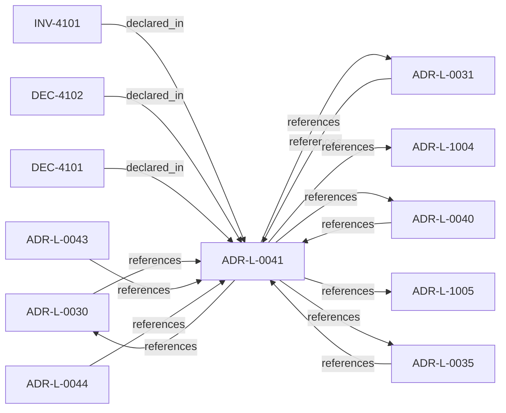

<!--
integrity_schema_version: 1
generated: deterministic_projection_v1
artifact_kind: rendered_adr_markdown
generator_id: adr-projection-markdown
generator_version: 2
hash_algorithm: sha256
source_hash: 5354c6e48eddcab09f58d54b2426fb2e30d1fd5607c1299e57483bc59db45736
rendered_hash: da7664a54bef6bdc929e3da1024146123636c840f237e5d286db29de3642cf6d
-->

# ADR-L-0041: Compiler, Evidence, and Merge Authority

**Status:** accepted  
**Created:** 2025-12-19  
**Modified:** 2026-03-29  
**Authors:** Erik Gallmann, ste-spec  
**Domains:** compilation, governance  
**Tags:** compiler, evidence, kernel  
**Alias name:** compiler-evidence-and-merge-authority  

## Context

Non-overlapping compiler roles: **adr-architecture-kit** is the authoring compiler for
ADR registries/manifest/rendered views (not a second compiler-of-record for
`ArchitectureEvidence` or normative `Compiled_IR_Document`). **ste-runtime** is runtime
evidence compiler of record. **ste-kernel** merges publication fragments, validates IR,
and emits `KernelAdmissionAssessment` while consuming ste-spec contracts.

Legacy: `adrs/published/ADR-041-compiler-and-merge-authority.md`.

**Reconciliation vs ADR-L-1004:** **coexist-with-precedence** — freshness semantics govern
evidence timing; this ADR assigns **who may compile** named artifact families.

**Reconciliation vs ADR-L-1005:** **coexist-with-precedence** — drift detection consumes
compiled views; compiler-of-record boundaries prevent ambiguous duplicate compile stacks.

**Runtime compiler of record:** **ste-runtime** `COMPILER-AUTHORITY.md` — use
`ste architecture compile --project-root <repo-root>` (see **MIGRATION-INVENTORY.md** Phase 5
for a recorded example command and artifact paths).

## Relationship graph

## Related ADRs

### ADR-L-0030 — Contract Authority in ste-spec

**Relationships:**
- 01a04e96-1f5b-752a-bb27-9bfbb872ffc6 -[:references]-> this ADR
- this ADR -[:references]-> 01a04e96-1f5b-752a-bb27-9bfbb872ffc6

**Context:** Cross-repository handoff contracts are governed in **ste-spec**: shape in `contracts/`,
rules in `invariants/`, rationale in ADRs. Runtime and kernel repos remain subordinate
implementation surfaces.

[Open projection](ADR-L-0030-contract-authority-in-ste-spec.md)
### ADR-L-0031 — Runtime and Kernel Responsibility Boundary

**Relationships:**
- 01a04e96-1f5b-7c56-bc3f-75fbbc94d42b -[:references]-> this ADR
- this ADR -[:references]-> 01a04e96-1f5b-7c56-bc3f-75fbbc94d42b

**Context:** **ste-runtime** produces factual evidence only. **ste-kernel** is the caller-facing
admission authority at the evaluated System Instance boundary (explicit environment and
evaluation scope).

[Open projection](ADR-L-0031-runtime-and-kernel-responsibility-boundary.md)
### ADR-L-0035 — Architecture IR Ontology Authority in ste-spec

**Relationships:**
- 01a04e96-1f5c-7fd4-bf3e-ddca6103eae1 -[:references]-> this ADR
- this ADR -[:references]-> 01a04e96-1f5c-7fd4-bf3e-ddca6103eae1

**Context:** `architecture/STE-Architecture-Intermediate-Representation.md` is the canonical **semantic**
specification of Architecture IR. Mechanical JSON Schema and compiled enumerations publish
under `contracts/architecture-ir/` per the contract pin. ste-kernel consumes the bundle;
it does not own normative mechanical definitions. Compiler roles are further constrained
by ADR-L-0041.

[Open projection](ADR-L-0035-architecture-ir-ontology-authority-in-ste-spec.md)
### ADR-L-0040 — STE Spine Lifecycle and Authority

**Relationships:**
- 01a04e96-1f5c-78e0-823f-3c915d07acd6 -[:references]-> this ADR
- this ADR -[:references]-> 01a04e96-1f5c-78e0-823f-3c915d07acd6

**Context:** Defines the canonical **Spine** lifecycle stages, system states, authority categories, and
precedence rules tying together ste-spec doctrine, implementation repos, publication,
Architecture IR compilation, kernel admission, runtime evidence, assessment, and
governance. Does not redefine ADR-L-0038 taxonomy, ADR-L-0035 ontology, ADR-L-0031
boundary, or ADR-L-0030 contract authority.

[Open projection](ADR-L-0040-ste-spine-lifecycle-and-authority.md)
### ADR-L-0043 — Context Domain and MVC Lifecycle Boundary

**Relationships:**
- 01a04e96-1f5c-72a7-8a1b-81cf44933af3 -[:references]-> this ADR

**Context:** STE is introducing an experimental model for task-scoped architectural context.
The model treats MVC as a task-scoped architectural reality bundle rather than
generic context reduction. RSS assembles the candidate architectural reality
surface from declared intent, Context Domains, Graph Domains, Linkage Surfaces,
Architecture IR snapshots, task context, and persona context-selection policy.

[Open projection](ADR-L-0043-context-domain-and-mvc-lifecycle-boundary.md)
### ADR-L-0044 — Governed Semantic Reasoning Foundation

**Relationships:**
- 01a06490-5b3c-76c0-9da2-abc5d28f8970 -[:references]-> this ADR

**Context:** This ADR promotes the first bounded semantic re-baseline tranche: FD-01,
FD-01-R1, and the NM-01 semantic contents represented by SD-01 through SD-05.
The senior design lock ledger and Design Journal are design evidence only; this
ADR is the accepted authority for the semantic foundation stated here.

[Open projection](ADR-L-0044-governed-semantic-reasoning-foundation.md)
### ADR-L-1004 — Architecture Freshness Model

**Relationships:**
- this ADR -[:references]-> 01a04e96-1f5c-70ba-9337-084a88667cc5

**Context:** Freshness distinguishes whether integration-state (Architecture IR) and observational
state (evidence) are current enough for the decision at hand. IR freshness and evidence
freshness are distinct signals and MUST NOT be conflated.

[Open projection](ADR-L-1004-architecture-freshness-model.md)
### ADR-L-1005 — Architecture Drift Model

**Relationships:**
- this ADR -[:references]-> 01a04e96-1f5c-7b1e-943d-6db525f77bf0

**Context:** Drift means observable divergence between declared architecture (IR and normative
doctrine), implementation or runtime behavior, and evidence. The kernel MUST categorize
drift into named kinds and map each kind to default admission-aligned outcomes; it
MUST NOT silently reinterpret drift ad hoc.

[Open projection](ADR-L-1005-architecture-drift-model.md)

## Invariants

### INV-4101

**Statement:** Repositories MUST NOT maintain a second authoritative compile path that redefines ste-spec
contract shapes for `ArchitectureEvidence` or normative Architecture IR schema without an
explicit superseding ADR-L.
  
**Scope:** global  
**Enforcement:** must (policy)  
**Verification:** audit

**Rationale:**
Preserves single normative shape targets for fail-closed enforcement.

## Decisions

### DEC-4101: Assign authoring-time ADR compilation to adr-architecture-kit without claiming runtime ArchitectureEvidence or normative Compiled_IR_Document compiler-of-record roles

**Rationale:**
Prevents parallel truth compilers for the same interchange contracts.

**Consequences:**

**Positive:**
- Clear golden parity versus production compile paths

**Negative:**
- Contributors must use the right tool per task

### DEC-4102: Assign ArchitectureEvidence compilation to ste-runtime; assign IR merge, validation, and admission assessment emission to ste-kernel

**Rationale:**
Keeps evidence factual and kernel decision-bearing per ADR-L-0031.

**Consequences:**

**Positive:**
- Aligns repos with Spine enforcement story

**Negative:**
- Documentation must stay synchronized across three repos

## Gaps

### GAP-4101: Keep ste-runtime CLI install docs aligned when global `ste` npm shim diverges from workspace builds

**Impact:** low  
**Blocking:** No

---

*Generated from ADR-L-0041 by ADR Architecture Kit*