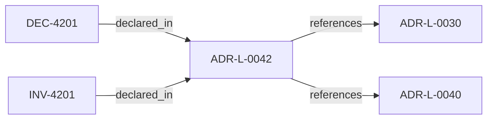

<!--
integrity_schema_version: 1
generated: deterministic_projection_v1
artifact_kind: rendered_adr_markdown
generator_id: adr-projection-markdown
generator_version: 2
hash_algorithm: sha256
source_hash: ec28adc3866b72b839fecf110b68e66828fbe88cf41ea06b36bf24d5c584931e
rendered_hash: e7fefdad57dd47da348dc60fbe8fd00e84313d8ef57971fca85116473dc302b8
-->

# ADR-L-0042: Open Standards and Closed Intelligence Boundary

**Status:** accepted  
**Created:** 2025-12-19  
**Modified:** 2026-03-29  
**Authors:** Erik Gallmann, ste-spec  
**Domains:** governance, architecture  
**Tags:** boundary, standards  
**Alias name:** open-standards-and-closed-intelligence-boundary  

## Context

STE adopts **open standards plus closed intelligence**: public specifications define
compatible artifact formats, schemas, interfaces, and deterministic validation surfaces;
proprietary reasoning may remain behind those interfaces.

Legacy: `adrs/published/ARCHITECTURE_BOUNDARY_DECISION.md` (non-numbered published note).

**Reconciliation vs supporting architecture notes:** **coexist-with-precedence** — see
`architecture/OPEN_CLOSED_BOUNDARY.md` and related architecture notes for expanded prose;
this ADR-L captures the **binding boundary decision** in machine form.

## Relationship graph

## Related ADRs

### ADR-L-0030 — Contract Authority in ste-spec

**Relationships:**
- this ADR -[:references]-> 01a04e96-1f5b-752a-bb27-9bfbb872ffc6

**Context:** Cross-repository handoff contracts are governed in **ste-spec**: shape in `contracts/`,
rules in `invariants/`, rationale in ADRs. Runtime and kernel repos remain subordinate
implementation surfaces.

[Open projection](ADR-L-0030-contract-authority-in-ste-spec.md)
### ADR-L-0040 — STE Spine Lifecycle and Authority

**Relationships:**
- this ADR -[:references]-> 01a04e96-1f5c-78e0-823f-3c915d07acd6

**Context:** Defines the canonical **Spine** lifecycle stages, system states, authority categories, and
precedence rules tying together ste-spec doctrine, implementation repos, publication,
Architecture IR compilation, kernel admission, runtime evidence, assessment, and
governance. Does not redefine ADR-L-0038 taxonomy, ADR-L-0035 ontology, ADR-L-0031
boundary, or ADR-L-0030 contract authority.

[Open projection](ADR-L-0040-ste-spine-lifecycle-and-authority.md)

## Invariants

### INV-4201

**Statement:** New capabilities MUST be classified explicitly as public specification, interface-only
publication, or closed implementation per this boundary before expanding ste-spec contracts.
  
**Scope:** global  
**Enforcement:** should (policy)  
**Verification:** audit

**Rationale:**
Operationalizes downstream planning checks described in the legacy document.

## Decisions

### DEC-4201: Require public, independently verifiable interfaces for handoff artifacts while allowing proprietary intelligence behind those surfaces

**Rationale:**
Enables third-party compatibility without leaking proprietary leverage into public contracts.

**Consequences:**

**Positive:**
- Clear public versus private architectural split

**Negative:**
- Interfaces must be maintained with discipline

## Gaps

### GAP-4201: Link detailed threat and tradeoff narratives from architecture supporting docs

**Impact:** low  
**Blocking:** No

---

*Generated from ADR-L-0042 by ADR Architecture Kit*