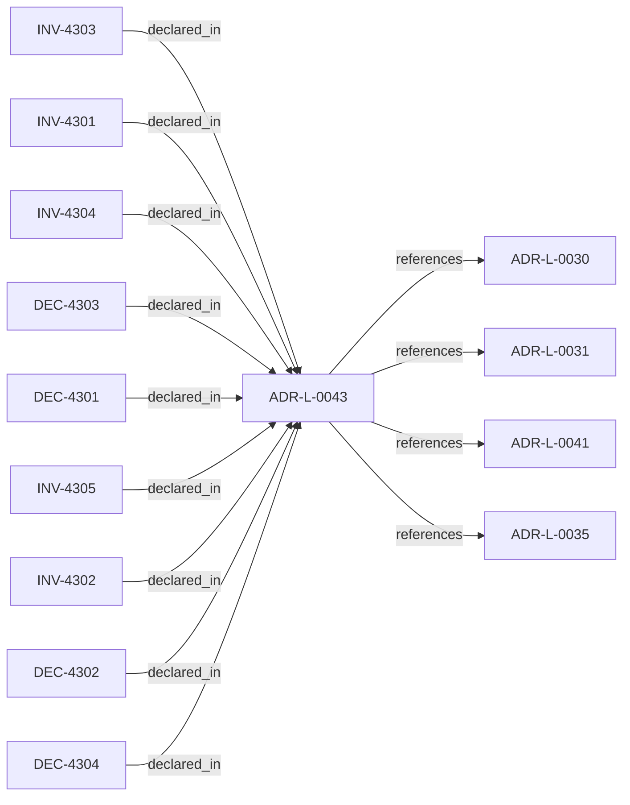

<!--
integrity_schema_version: 1
generated: deterministic_projection_v1
artifact_kind: rendered_adr_markdown
generator_id: adr-projection-markdown
generator_version: 2
hash_algorithm: sha256
source_hash: f3c36f7c030bf9a0519849fddf4bb1c55a27710ca817d0975fcaafb0fbb46500
rendered_hash: e6099690d8f1c7abec6dfc22bdc99ed5619212ec5f4369f9f32ad0607c5dfb23
-->

# ADR-L-0043: Context Domain and MVC Lifecycle Boundary

**Status:** proposed  
**Created:** 2026-05-30  
**Modified:** 2026-05-30  
**Authors:** Erik Gallmann, ste-spec  
**Domains:** architecture-ir, contracts, context, mvc  
**Tags:** context-domain, graph-domain, linkage-surface, mvc, rss  
**Alias name:** context-domain-and-mvc-lifecycle-boundary  

## Context

STE is introducing an experimental model for task-scoped architectural context.
The model treats MVC as a task-scoped architectural reality bundle rather than
generic context reduction. RSS assembles the candidate architectural reality
surface from declared intent, Context Domains, Graph Domains, Linkage Surfaces,
Architecture IR snapshots, task context, and persona context-selection policy.

This ADR does not promote Context Domains into Architecture IR entity kinds and
does not authorize production MVC assembly. It records the boundary needed for
draft contract work under `contracts/graph-domain/`, `contracts/linkage-surface/`,
`contracts/context-domain/`, `contracts/persona/`, and `contracts/mvc/`.

Architecture IR remains the ste-spec-owned semantic authority per ADR-L-0035.
Contract authority remains in ste-spec per ADR-L-0030. Runtime/kernel split and
admission authority remain governed by ADR-L-0031, ADR-L-0041, INV-0001, and
INV-0002.

## Relationship graph

## Related ADRs

### ADR-L-0030 — Contract Authority in ste-spec

**Relationships:**
- this ADR -[:references]-> 01a04e96-1f5b-752a-bb27-9bfbb872ffc6

**Context:** Cross-repository handoff contracts are governed in **ste-spec**: shape in `contracts/`,
rules in `invariants/`, rationale in ADRs. Runtime and kernel repos remain subordinate
implementation surfaces.

[Open projection](ADR-L-0030-contract-authority-in-ste-spec.md)
### ADR-L-0031 — Runtime and Kernel Responsibility Boundary

**Relationships:**
- this ADR -[:references]-> 01a04e96-1f5b-7c56-bc3f-75fbbc94d42b

**Context:** **ste-runtime** produces factual evidence only. **ste-kernel** is the caller-facing
admission authority at the evaluated System Instance boundary (explicit environment and
evaluation scope).

[Open projection](ADR-L-0031-runtime-and-kernel-responsibility-boundary.md)
### ADR-L-0035 — Architecture IR Ontology Authority in ste-spec

**Relationships:**
- this ADR -[:references]-> 01a04e96-1f5c-7fd4-bf3e-ddca6103eae1

**Context:** `architecture/STE-Architecture-Intermediate-Representation.md` is the canonical **semantic**
specification of Architecture IR. Mechanical JSON Schema and compiled enumerations publish
under `contracts/architecture-ir/` per the contract pin. ste-kernel consumes the bundle;
it does not own normative mechanical definitions. Compiler roles are further constrained
by ADR-L-0041.

[Open projection](ADR-L-0035-architecture-ir-ontology-authority-in-ste-spec.md)
### ADR-L-0041 — Compiler, Evidence, and Merge Authority

**Relationships:**
- this ADR -[:references]-> 01a04e96-1f5c-7e5b-9837-1dea58886565

**Context:** Non-overlapping compiler roles: **adr-architecture-kit** is the authoring compiler for
ADR registries/manifest/rendered views (not a second compiler-of-record for
`ArchitectureEvidence` or normative `Compiled_IR_Document`). **ste-runtime** is runtime
evidence compiler of record. **ste-kernel** merges publication fragments, validates IR,
and emits `KernelAdmissionAssessment` while consuming ste-spec contracts.

[Open projection](ADR-L-0041-compiler-evidence-and-merge-authority.md)

## Invariants

### INV-4301

**Statement:** Context Domain Definitions MUST NOT contain materialized selected entities,
relationships, evidence, constraints, or admission outcomes.
  
**Scope:** ste-spec  
**Enforcement:** must (policy)  
**Verification:** automated

**Rationale:**
Preserves the definition-versus-bundle boundary.

### INV-4302

**Statement:** Graph Domains and Linkage Surfaces MUST remain derived traversal and discovery
surfaces unless a relationship is independently established by an authoritative
artifact.
  
**Scope:** global  
**Enforcement:** must (policy)  
**Verification:** audit

**Rationale:**
Prevents graph-authority drift.

### INV-4303

**Statement:** MVC-S MUST preserve stable source refs, selector version refs, topology metrics,
inclusion rationale, exclusion rationale, and negative space sufficient to
reproduce its fingerprint from the same declared inputs.
  
**Scope:** global  
**Enforcement:** must (policy)  
**Verification:** automated

**Rationale:**
RSS adaptive depth depends on MVC-S topology, so MVC-S identity must be reproducible.

### INV-4304

**Statement:** Deduplication MUST NOT collapse inclusion or exclusion rationale. All selector
paths and reasons that selected or excluded an item MUST remain available in
the materialized result.
  
**Scope:** global  
**Enforcement:** must (policy)  
**Verification:** automated

**Rationale:**
Rationale preservation is required for composite persona sets, task overlays, and
CEM ablation.

### INV-4305

**Statement:** Runtime MAY emit factual candidate bundles, Graph Domains, Linkage Surfaces,
diagnostics, provenance, freshness, integrity, and MVC-S candidates, but MUST
NOT emit caller-facing admission decisions.
  
**Scope:** global  
**Enforcement:** must (policy)  
**Verification:** audit

**Rationale:**
Preserves the runtime/kernel admission boundary.

## Decisions

### DEC-4301: Define Context Domain Definitions as semantic view definitions and Context Domain Bundles as materialized instances

**Rationale:**
Keeping definitions declarative prevents ontology drift and prevents materialized
derived surfaces from being mistaken for authority.

**Consequences:**

**Positive:**
- Context Domain schemas can distinguish reusable selection intent from task-scoped materialization.
- CEM ablation can operate over materialized bundles without mutating domain definitions.

**Negative:**
- Consumers must handle an additional definition-versus-instance boundary.

### DEC-4302: Define Graph Domain Definitions and Linkage Surfaces as derived traversal inputs, not authority sources

**Rationale:**
Graph Domains and Linkage Surfaces improve structural discovery, but the authority
of any relationship still comes from ADRs, invariants, contracts, requirements,
embodiment records, or other accepted authoritative artifacts.

**Consequences:**

**Positive:**
- MVC assembly can become more structure-guided without moving authority into runtime graphs.
- Multiple linkage generation mechanisms can feed the same consumer contracts.

**Negative:**
- Linkage records require explicit provenance, integrity, freshness, and validation fields.

### DEC-4303: Split MVC into MVC-D, MVC-S, and MVC-M lifecycle contracts

**Rationale:**
The split separates declarative admissible context definition, candidate surface
assembly, and kernel-admitted materialization. This preserves reproducibility and
prevents runtime candidate generation from becoming caller-facing admission.

**Consequences:**

**Positive:**
- MVC-S can carry stable identity, topology metrics, source refs, selector refs, and rationale.
- Kernel admission can produce MVC-M without granting runtime admission authority.

**Negative:**
- Implementations must preserve rationale and identity across lifecycle transitions.

### DEC-4304: Treat Persona as Context Selection Policy rather than biography or projection-only policy

**Rationale:**
Personas select required and optional Context Domains, traversal objectives, projection
preferences, and rationale. Projection is only one dimension of persona behavior.

**Consequences:**

**Positive:**
- Composite persona MVCs can union and deduplicate requirements while preserving selector rationale.

**Negative:**
- Persona schemas must reject unconstrained narrative role descriptions as operational policy.

## Gaps

### GAP-4301: Promote or amend this ADR after draft schemas and fixtures demonstrate deterministic MVC-S construction and rationale-preserving deduplication

**Impact:** medium  
**Blocking:** No

### GAP-4302: Decide whether Context Domain and Graph Domain terms remain external contracts or later become Architecture IR semantic ontology extensions

**Impact:** medium  
**Blocking:** No

---

*Generated from ADR-L-0043 by ADR Architecture Kit*