<!--
integrity_schema_version: 1
generated: deterministic_projection_v1
artifact_kind: rendered_adr_markdown
generator_id: adr-projection-markdown
generator_version: 2
hash_algorithm: sha256
source_hash: 8972ffed6d5b63650841096702c928cfdfd19a1747512b52a5ee7a28eabb8dfa
rendered_hash: 1721ccbe89f997bfd66f0f3c28ddde6f8c0220af085ef4b7df37764ac74d9e9a
-->

# ADR-L-0044: Governed Semantic Reasoning Foundation

**Status:** accepted  
**Created:** 2026-09-02  
**Modified:** 2026-09-02  
**Authors:** Erik Gallmann, ste-spec  
**Domains:** governance, semantics, reasoning, architecture-ir  
**Tags:** bounded-reasoning, normative-semantics, authority, applicability  
**Alias name:** governed-semantic-reasoning-foundation  

## Context

This ADR promotes the first bounded semantic re-baseline tranche: FD-01,
FD-01-R1, and the NM-01 semantic contents represented by SD-01 through SD-05.
The senior design lock ledger and Design Journal are design evidence only; this
ADR is the accepted authority for the semantic foundation stated here.

CE-01 (Canonical Semantic Entity Model) remains locked design state and is not
promoted by this ADR. In particular, this ADR does not decide the relationship
among canonical semantic-record UUIDv7/alias identity, ADR-Kit normalized
representation, and compiled Architecture IR identifiers. No CE-01 identity
requirement or mechanical Architecture IR identity change is implied.

This ADR establishes semantic meaning and authority boundaries. Authoring,
normalized-model, schema, validator, Runtime, Kernel, CEM lifecycle, and
exception/waiver implementations remain governed by their owning surfaces and
the explicit deferrals below.

## Relationship graph

```mermaid
flowchart LR
  n_01a04e96_1f5b_752a_bb27_9bfbb872ffc6["ADR-L-0030"]
  n_01a04e96_1f5b_7c56_bc3f_75fbbc94d42b["ADR-L-0031"]
  n_01a04e96_1f5b_7d37_8038_1c811fc5261b["ADR-L-0027"]
  n_01a04e96_1f5b_7f70_b03f_807ea0fe6694["ADR-L-0026"]
  n_01a04e96_1f5c_78e0_823f_3c915d07acd6["ADR-L-0040"]
  n_01a04e96_1f5c_7e5b_9837_1dea58886565["ADR-L-0041"]
  n_01a04e96_1f5c_7fd4_bf3e_ddca6103eae1["ADR-L-0035"]
  n_01a06490_5b3c_76c0_9da2_abc5d28f8970["ADR-L-0044"]
  n_01a06490_5b3c_76c0_9da2_abc66f5c17e6["DEC-4401"]
  n_01a06490_5b3c_76c0_9da2_abc77292b641["DEC-4402"]
  n_01a06490_5b3c_76c0_9da2_abc810701700["DEC-4403"]
  n_01a06490_5b3c_76c0_9da2_abc922ef02dc["DEC-4404"]
  n_01a06490_5b3c_76c0_9da2_abca4aa3eaa5["DEC-4405"]
  n_01a06490_5b3c_76c0_9da2_abcb706d9c2f["DEC-4406"]
  n_01a06490_5b3c_76c0_9da2_abccfd310a81["DEC-4407"]
  n_01a06490_5b3c_76c0_9da2_abcd629744d2["DEC-4408"]
  n_01a06490_5b3c_76c0_9da2_abcef9d0406f["DEC-4409"]
  n_01a06490_5b3c_76c0_9da2_abcf1f4ae7a3["DEC-4410"]
  n_01a06490_5b3c_76c0_9da2_abd019c4eafa["INV-4401"]
  n_01a06490_5b3c_76c0_9da2_abd1988d0c47["INV-4402"]
  n_01a06490_5b3c_76c0_9da2_abd248766fb3["INV-4403"]
  n_01a06490_5b3c_76c0_9da2_abd3a0decf0a["INV-4404"]
  n_01a06490_5b3c_76c0_9da2_abd4898798ad["INV-4405"]
  n_01a06490_5b3c_76c0_9da2_abd5bcdb8c75["INV-4406"]
  n_01a06490_5b3c_76c0_9da2_abd6c47b3056["INV-4407"]
  n_01a06490_5b3c_76c0_9da2_abd7aacbfd63["INV-4408"]
  n_01a06490_5b3c_76c0_9da2_abd8e8aad9dd["INV-4409"]
  n_01a06492_55f2_774e_a599_50ed40272e9c["INV-4410"]
  n_01a06490_5b3c_76c0_9da2_abc66f5c17e6 -->|"declared_in"| n_01a06490_5b3c_76c0_9da2_abc5d28f8970
  n_01a06490_5b3c_76c0_9da2_abc77292b641 -->|"declared_in"| n_01a06490_5b3c_76c0_9da2_abc5d28f8970
  n_01a06490_5b3c_76c0_9da2_abc810701700 -->|"declared_in"| n_01a06490_5b3c_76c0_9da2_abc5d28f8970
  n_01a06490_5b3c_76c0_9da2_abc922ef02dc -->|"declared_in"| n_01a06490_5b3c_76c0_9da2_abc5d28f8970
  n_01a06490_5b3c_76c0_9da2_abca4aa3eaa5 -->|"declared_in"| n_01a06490_5b3c_76c0_9da2_abc5d28f8970
  n_01a06490_5b3c_76c0_9da2_abcb706d9c2f -->|"declared_in"| n_01a06490_5b3c_76c0_9da2_abc5d28f8970
  n_01a06490_5b3c_76c0_9da2_abccfd310a81 -->|"declared_in"| n_01a06490_5b3c_76c0_9da2_abc5d28f8970
  n_01a06490_5b3c_76c0_9da2_abcd629744d2 -->|"declared_in"| n_01a06490_5b3c_76c0_9da2_abc5d28f8970
  n_01a06490_5b3c_76c0_9da2_abcef9d0406f -->|"declared_in"| n_01a06490_5b3c_76c0_9da2_abc5d28f8970
  n_01a06490_5b3c_76c0_9da2_abcf1f4ae7a3 -->|"declared_in"| n_01a06490_5b3c_76c0_9da2_abc5d28f8970
  n_01a06490_5b3c_76c0_9da2_abd019c4eafa -->|"declared_in"| n_01a06490_5b3c_76c0_9da2_abc5d28f8970
  n_01a06490_5b3c_76c0_9da2_abd1988d0c47 -->|"declared_in"| n_01a06490_5b3c_76c0_9da2_abc5d28f8970
  n_01a06490_5b3c_76c0_9da2_abd248766fb3 -->|"declared_in"| n_01a06490_5b3c_76c0_9da2_abc5d28f8970
  n_01a06490_5b3c_76c0_9da2_abd3a0decf0a -->|"declared_in"| n_01a06490_5b3c_76c0_9da2_abc5d28f8970
  n_01a06490_5b3c_76c0_9da2_abd4898798ad -->|"declared_in"| n_01a06490_5b3c_76c0_9da2_abc5d28f8970
  n_01a06490_5b3c_76c0_9da2_abd5bcdb8c75 -->|"declared_in"| n_01a06490_5b3c_76c0_9da2_abc5d28f8970
  n_01a06490_5b3c_76c0_9da2_abd6c47b3056 -->|"declared_in"| n_01a06490_5b3c_76c0_9da2_abc5d28f8970
  n_01a06490_5b3c_76c0_9da2_abd7aacbfd63 -->|"declared_in"| n_01a06490_5b3c_76c0_9da2_abc5d28f8970
  n_01a06490_5b3c_76c0_9da2_abd8e8aad9dd -->|"declared_in"| n_01a06490_5b3c_76c0_9da2_abc5d28f8970
  n_01a06492_55f2_774e_a599_50ed40272e9c -->|"declared_in"| n_01a06490_5b3c_76c0_9da2_abc5d28f8970
  n_01a04e96_1f5c_7fd4_bf3e_ddca6103eae1 -->|"references"| n_01a06490_5b3c_76c0_9da2_abc5d28f8970
  n_01a06490_5b3c_76c0_9da2_abc5d28f8970 -->|"references"| n_01a04e96_1f5b_752a_bb27_9bfbb872ffc6
  n_01a06490_5b3c_76c0_9da2_abc5d28f8970 -->|"references"| n_01a04e96_1f5b_7c56_bc3f_75fbbc94d42b
  n_01a06490_5b3c_76c0_9da2_abc5d28f8970 -->|"references"| n_01a04e96_1f5b_7d37_8038_1c811fc5261b
  n_01a06490_5b3c_76c0_9da2_abc5d28f8970 -->|"references"| n_01a04e96_1f5b_7f70_b03f_807ea0fe6694
  n_01a06490_5b3c_76c0_9da2_abc5d28f8970 -->|"references"| n_01a04e96_1f5c_78e0_823f_3c915d07acd6
  n_01a06490_5b3c_76c0_9da2_abc5d28f8970 -->|"references"| n_01a04e96_1f5c_7e5b_9837_1dea58886565
  n_01a06490_5b3c_76c0_9da2_abc5d28f8970 -->|"references"| n_01a04e96_1f5c_7fd4_bf3e_ddca6103eae1
```

## Related ADRs

### ADR-L-0026 — Invariant Conflict Detection Semantics

**Relationships:**
- this ADR -[:references]-> 01a04e96-1f5b-7f70-b03f-807ea0fe6694

**Context:** For v1, Fabric performs conflict detection when creating attestations and signs a
`conflict_status` field (`none` or `detected`). Gateway verifies the attestation and
enforces denial when conflicts are attested; Gateway MUST NOT implement independent
invariant content parsing for conflict detection.

[Open projection](ADR-L-0026-invariant-conflict-detection-semantics.md)
### ADR-L-0027 — Scope Semantics and Versioning

**Relationships:**
- this ADR -[:references]-> 01a04e96-1f5b-7d37-8038-1c811fc5261b

**Context:** Scope is a colon-delimited hierarchical identifier participating in authority checks.
Version 1 uses exact string equality; version 2 uses segment-prefix matching with
most-specific authority resolution and denial on equal-depth ambiguity. Trust Registry
and Context Bundle must declare `scope_semantics_version` consistently.

[Open projection](ADR-L-0027-scope-semantics-and-versioning.md)
### ADR-L-0030 — Contract Authority in ste-spec

**Relationships:**
- this ADR -[:references]-> 01a04e96-1f5b-752a-bb27-9bfbb872ffc6

**Context:** Cross-repository handoff contracts are governed in **ste-spec**: shape in `contracts/`,
rules in `invariants/`, rationale in ADRs. Runtime and kernel repos remain subordinate
implementation surfaces.

[Open projection](ADR-L-0030-contract-authority-in-ste-spec.md)
### ADR-L-0031 — Runtime and Kernel Responsibility Boundary

**Relationships:**
- this ADR -[:references]-> 01a04e96-1f5b-7c56-bc3f-75fbbc94d42b

**Context:** **ste-runtime** produces factual evidence only. **ste-kernel** is the caller-facing
admission authority at the evaluated System Instance boundary (explicit environment and
evaluation scope).

[Open projection](ADR-L-0031-runtime-and-kernel-responsibility-boundary.md)
### ADR-L-0035 — Architecture IR Ontology Authority in ste-spec

**Relationships:**
- 01a04e96-1f5c-7fd4-bf3e-ddca6103eae1 -[:references]-> this ADR
- this ADR -[:references]-> 01a04e96-1f5c-7fd4-bf3e-ddca6103eae1

**Context:** `architecture/STE-Architecture-Intermediate-Representation.md` is the canonical **semantic**
specification of Architecture IR. Mechanical JSON Schema and compiled enumerations publish
under `contracts/architecture-ir/` per the contract pin. ste-kernel consumes the bundle;
it does not own normative mechanical definitions. Compiler roles are further constrained
by ADR-L-0041.

[Open projection](ADR-L-0035-architecture-ir-ontology-authority-in-ste-spec.md)
### ADR-L-0040 — STE Spine Lifecycle and Authority

**Relationships:**
- this ADR -[:references]-> 01a04e96-1f5c-78e0-823f-3c915d07acd6

**Context:** Defines the canonical **Spine** lifecycle stages, system states, authority categories, and
precedence rules tying together ste-spec doctrine, implementation repos, publication,
Architecture IR compilation, kernel admission, runtime evidence, assessment, and
governance. Does not redefine ADR-L-0038 taxonomy, ADR-L-0035 ontology, ADR-L-0031
boundary, or ADR-L-0030 contract authority.

[Open projection](ADR-L-0040-ste-spine-lifecycle-and-authority.md)
### ADR-L-0041 — Compiler, Evidence, and Merge Authority

**Relationships:**
- this ADR -[:references]-> 01a04e96-1f5c-7e5b-9837-1dea58886565

**Context:** Non-overlapping compiler roles: **adr-architecture-kit** is the authoring compiler for
ADR registries/manifest/rendered views (not a second compiler-of-record for
`ArchitectureEvidence` or normative `Compiled_IR_Document`). **ste-runtime** is runtime
evidence compiler of record. **ste-kernel** merges publication fragments, validates IR,
and emits `KernelAdmissionAssessment` while consuming ste-spec contracts.

[Open projection](ADR-L-0041-compiler-evidence-and-merge-authority.md)

## Invariants

### INV-4401

**Statement:** A conforming reasoning outcome MUST remain within the applicable semantic, authority, normative, and epistemic boundaries; bounded-outcome determinism MUST NOT be interpreted as a requirement for one identical generated result.  
**Scope:** global  
**Enforcement:** must (policy)  
**Verification:** manual

**Rationale:**
Preserves governed reasoning-space shaping while allowing bounded outcome diversity.

### INV-4402

**Statement:** STE MUST NOT introduce equations or formal notation merely for rhetorical effect, and every non-trivial formal expression MUST remain locally interpretable and defensible within its declared assumptions and domain.  
**Scope:** global  
**Enforcement:** must (design)  
**Verification:** manual

**Rationale:**
Mathematical notation does not confer authority or correctness.

### INV-4403

**Statement:** A NormativeProposition MUST contain independently meaningful normative semantics whose explicit presence is materially capable of shaping the governed reasoning space; modal or imperative wording alone MUST NOT admit an NP.  
**Scope:** global  
**Enforcement:** must (design)  
**Verification:** manual

**Rationale:**
Admission materiality distinguishes semantic propositions from explanation, navigation, organization, and non-shaping restatement.

### INV-4404

**Statement:** Normative force MUST retain the same meaning across legitimate semantic carrier types and MUST NOT manufacture authority, effectivity, applicability, or epistemic knowledge.  
**Scope:** global  
**Enforcement:** must (policy)  
**Verification:** manual

**Rationale:**
Carrier type determines architectural meaning without redefining force semantics.

### INV-4405

**Statement:** For applicable hard constraints H over candidate universe Ω, each h MUST induce an admissible subset A_h and the hard-admissible space MUST be understood conceptually as A = intersection of all A_h; materially different candidates MAY both conform when each is a member of A.  
**Scope:** global  
**Enforcement:** must (design)  
**Verification:** manual

**Rationale:**
Makes hard admissibility, bounded determinism, and preference composition explicit
without claiming all architecture is formally reducible. Where mechanically
reducible hard semantics produce A = empty set, the bounded applicability context
has no convergent candidate. Validation remains a continuum: deterministic
contradiction checks, graph/rule evaluation for structured incompatibility, and
bounded evidence-bearing semantic assessment for higher-order incompatibility.

### INV-4406

**Statement:** Preference semantics MUST order otherwise hard-admissible candidates without automatically removing a non-preferred candidate from the hard-admissible space, and MAY(P) MUST be distinguished from mere absence of MUST NOT(P). MAY(P) implies absence of an applicable MUST NOT(P), but absence of MUST NOT(P) does not imply MAY(P).  
**Scope:** global  
**Enforcement:** must (design)  
**Verification:** manual

**Rationale:**
Preserves strong preference and explicit permission as distinct roles.

### INV-4407

**Statement:** Governing eligibility for proposition p over bounded domain d at relevant state or time t MUST require an authority-bearing source s that establishes p, is effective at t, and possesses valid competence over d at t; this eligibility relation MUST NOT be treated as concrete applicability. Representation, persistence, normalization, projection, observation, inference, implementation, or graph structure MUST NOT manufacture authority.  
**Scope:** global  
**Enforcement:** must (policy)  
**Verification:** manual

**Rationale:**
Separates authority path and effectivity from case-specific applicability.

### INV-4408

**Statement:** Delegation MUST NOT amplify competence, co-present authority paths MUST NOT manufacture cross-domain competence, and unresolved conflicts among competent effective semantics MUST NOT be silently resolved by document order, recency, modal strength, implementation state, or projection order.  
**Scope:** global  
**Enforcement:** must (policy)  
**Verification:** manual

**Rationale:**
Authority composition remains bounded and divergence remains visible.

### INV-4409

**Statement:** Applicability MUST yield APPLIES, DOES_NOT_APPLY, or UNKNOWN from declared or validly inherited scope and contextual semantics; insufficient contextual knowledge MUST remain UNKNOWN and MUST NOT be collapsed into either other outcome.  
**Scope:** global  
**Enforcement:** must (policy)  
**Verification:** manual

**Rationale:**
Prevents textual similarity, proximity, or model intuition from manufacturing governing meaning.

### INV-4410

**Statement:** Runtime and other embodiment systems MUST NOT manufacture architectural intent authority from observation, reconstruction, provenance, coverage, evidence, persistence, projection, or derived assessment; composition MUST NOT transfer or union the authorities of intent and embodiment inputs.  
**Scope:** global  
**Enforcement:** must (policy)  
**Verification:** manual

**Rationale:**
Preserves the intent-versus-embodiment competence boundary.

## Decisions

### DEC-4401: Govern computational reasoning as operation within an explicitly governed semantic outcome space

**Rationale:**
Applicable authoritative semantics collectively shape acceptable outcomes by requiring, prohibiting, preferring, discouraging, or explicitly permitting outcomes while preserving separate authority and epistemic boundaries. FD-01 governs what semantic outcome space reasoning may inhabit; CEM governs how bounded reasoning is conducted through its lifecycle; epistemic semantics govern what may legitimately be claimed as known; and authority semantics govern which semantics are competent to govern.

**Consequences:**

**Positive:**
- Reasoning inputs and candidate acceptance have one explicit semantic boundary.
- Multiple materially different outcomes can remain conformant when bounded.

**Negative:**
- Higher-order semantic assessment remains evidence-bearing rather than theorem proof.

### DEC-4402: Define deterministic AI reasoning as bounded-outcome determinism

**Rationale:**
Determinism constrains the acceptable outcome space; it does not require one identical textual, procedural, or implementation result.

**Consequences:**

**Positive:**
- Independent reasoners may produce materially different conformant outcomes.
- Mechanical compilation and validation determinism remain separately expressible.

**Negative:**
- Consumers must evaluate authority, normative, and epistemic boundaries.

### DEC-4403: Use complementary prose and formal semantics when formal treatment materially improves precision or evaluability

**Rationale:**
Formal notation clarifies composition only when its assumptions and domain are
locally interpretable and defensible. When used, the specification should state
the plain-language claim, expression, symbol/operator definitions, plain-English
reading, useful worked example, semantic boundary/non-claim, and validation
consequence. Equations are not introduced for rhetorical effect; a challenged
expression must have defensible assumptions, derivation, domain, and validity or
be corrected, narrowed, or removed. For bounded reasoning, Ω denotes the
candidate-outcome universe, H the applicable hard constraints, each h ∈ H
induces A_h ⊆ Ω, and A = ⋂(h ∈ H) A_h is the hard-admissible outcome space.
Preference may order members of A without excluding them; explicit permission
identifies a permitted region. An empty A demonstrates non-convergence only
where those hard semantics are mechanically reducible.

**Consequences:**

**Positive:**
- Reducible semantic properties can expose mechanically evaluable consequences.

**Negative:**
- Formal expressions require explicit definitions, assumptions, and challenge.

### DEC-4404: Admit NormativeProposition as a first-class semantic type and carrier for independently meaningful normative architectural propositions

**Rationale:**
Independently meaningful normative meaning needs an explicit carrier whose
authority, force, scope, and provenance can be reasoned about without relying on
document position or modal wording alone. For ADR-scoped NPs, current authority
derives from presence in the effective authoritative ADR revision; no independent
NP governance lifecycle is required; removal removes current authority while
historical revisions preserve prior state. Tombstones and mandatory
supersedes/refines/coalescence lineage are not inherently required. Materially
changed meaning receives a new identity; editorial relocation or non-semantic
wording change may retain identity. NormativeProposition remains distinct from
Invariant, Rule, evidence, assessment, broad Constraint semantics, and future
Requirement semantics.

**Consequences:**

**Positive:**
- Normative meaning can be addressed and composed explicitly.
- Existing ADR authority remains the source of current NP authority.

**Negative:**
- Native authoring and normalized representation remain downstream work.

### DEC-4405: Preserve NormativeProposition and Invariant as peer semantic types

**Rationale:**
Semantic type determines architectural meaning; modal strength, importance, scope, or model interpretation cannot silently perform cross-type evolution.

**Consequences:**

**Positive:**
- Invariant, Rule, Constraint, evidence, assessment, and future Requirement remain distinct.

**Negative:**
- Cross-type evolution requires substantive architecture review.

### DEC-4406: Define global normative forces as MUST, MUST NOT, SHOULD, SHOULD NOT, and MAY

**Rationale:**
One carrier-invariant vocabulary supports human understanding, reasoner steering,
semantic composition, and deterministic classification without a required polarity
flag. MUST establishes hard positive admissibility; MUST NOT establishes hard
exclusion; SHOULD is a strong positive expectation; SHOULD NOT is a strong negative
expectation; and MAY is explicit strong permission. SHOULD/SHOULD NOT are not
casual advice and permit defensible deviation without automatically making a
candidate hard-nonconformant.
MAY(P) implies absence of an applicable MUST NOT(P), but absence of MUST NOT(P)
does not imply MAY(P). MAY can therefore record positive permission without
enlarging the hard-admissible set.

**Consequences:**

**Positive:**
- Hard admissibility, preference, and explicit freedom are distinguishable.
- MAY can prevent over-constraint by recording positive permission.

**Negative:**
- Exception, waiver, and conflict-resolution mechanics remain downstream.

### DEC-4407: Separate normative force, authority, effectivity, and applicability

**Rationale:**
A proposition can be strongly expressed without being competent, effective, or
applicable to a concrete case. Conceptually, G(p,d,t) holds iff an
authority-bearing source s establishes proposition p, is effective at t, and has
valid competence over bounded domain d at t. G is governing eligibility, not
concrete applicability. STE-SPEC governs system-of-systems intent semantics and
cross-system boundaries; local STE systems retain bounded intent authority inside
those boundaries and MUST NOT manufacture competence over semantics reserved to
STE-SPEC. Explicitly established or validly derived semantic relationships
in an effective ADR corpus may compose, but plausible LLM inference alone does
not become authority. Representation, persistence, normalization, projection,
observation, inference, implementation, or graph structure do not manufacture
architectural authority.

**Consequences:**

**Positive:**
- Governing eligibility can be assessed without manufacturing authority.
- Scope and applicability remain explicit semantic dimensions.

**Negative:**
- Complete precedence and applicability schemas remain deferred.

### DEC-4408: Bound authority composition and delegation to legitimately possessed competence

**Rationale:**
Delegation may narrow competence but cannot amplify it; multiple authority paths
cannot manufacture cross-domain competence through co-presence; unresolved
competent/effective conflicts must remain visible rather than being ordered away
by document order, ADR number, recency, modal strength, implementation state, or
projection order. A future explicit composition rule may establish bounded
cross-domain composition.

**Consequences:**

**Positive:**
- Authority paths remain auditable and domain-bounded.

**Negative:**
- A future explicit cross-domain composition rule may still be required.

### DEC-4409: Evaluate applicability with APPLIES, DOES_NOT_APPLY, and UNKNOWN outcomes

**Rationale:**
Scope bounds contexts in which governed meaning can potentially apply; it may be
inherited and narrowed but must not broaden competence. Applicability evaluates
already competent/effective meaning against a concrete context and must arise from
declared or validly inherited scope/context semantics. Insufficient contextual
knowledge must not be converted into a positive or negative applicability claim.

**Consequences:**

**Positive:**
- Applicability remains grounded in declared or inherited scope and context.

**Negative:**
- Detailed context assembly and task-specific reasoning selection remain separate.

### DEC-4410: Preserve intent and embodiment as distinct competence domains

**Rationale:**
Runtime and other embodiment systems may provide bounded observation, provenance, coverage, evidence, and assessment without acquiring architectural-intent authority.

**Consequences:**

**Positive:**
- Intent/embodiment composition can support bounded assessment without authority union.

**Negative:**
- Cross-domain linkage and verdict semantics require later governed decisions.

## Gaps

### GAP-4401: Native authoring and normalized representation for NormativeProposition remain downstream and must preserve this semantic contract.

**Impact:** medium  
**Blocking:** No

### GAP-4402: Detailed exception/waiver mechanics, complete authority-precedence algebra, detailed applicability schema, task-specific reasoning-state selection, complete canonical relationship ontology, intent/embodiment relationship vocabulary, convergence scoring, CEM lifecycle redesign, full epistemic composition, exact Requirement semantics, exact future Invariant representation, native ADR-Kit or Runtime NP implementation, and validator mechanics remain downstream.

**Impact:** medium  
**Blocking:** No

---

*Generated from ADR-L-0044 by ADR Architecture Kit*