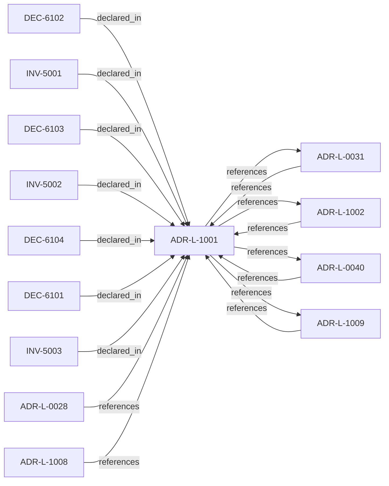

<!--
integrity_schema_version: 1
generated: deterministic_projection_v1
artifact_kind: rendered_adr_markdown
generator_id: adr-projection-markdown
generator_version: 2
hash_algorithm: sha256
source_hash: 3665e67f0826f6387b028b74dc23f03d1693dafd962170df8ee17820fe01cf28
rendered_hash: 2ba4bdf6849f6ef1d45caf9d718118a900b6024309eb1b7a864139a6c9d3f786
-->

# ADR-L-1001: Architecture Action Model

**Status:** proposed  
**Created:** 2026-03-28  
**Authors:** ste-spec  
**Domains:** governance, kernel, admission  
**Tags:** action-model, admission, kernel  
**Alias name:** architecture-action-model  

## Context

The kernel does not admit or deny systems in the abstract. Caller-facing admission
evaluates whether a **requested action** on a system (in an explicit environment and
evaluation scope) is allowed, denied, conditional, or warned under declared architecture,
evidence, posture, and rules.

This ADR-L defines the canonical **action vocabulary** and which actions participate in
admission versus informational-only evaluation. It aligns with **ADR-L-0031** (kernel as
admission authority), **ADR-L-0040** (Spine lifecycle), and `execution/STE-Kernel-Execution-Model.md`
(boot versus admission phases).

## Relationship graph

## Related ADRs

### ADR-L-0028 — AI-DOC Fabric and Gateway Authority Boundaries

**Relationships:**
- 01a04e96-1f5b-7551-992f-4be395920f16 -[:references]-> this ADR

**Context:** Fabric is the sole canonical state authority, invariant resolver, conflict detector for
attested bundles, and signer of Fabric Attestations. Gateway is a pure verifier that does
not query Fabric during eligibility evaluation. Runtime assembles and transports bundles
and attestations without substituting Fabric authority.

[Open projection](ADR-L-0028-ai-doc-fabric-and-gateway-authority-boundaries.md)
### ADR-L-0031 — Runtime and Kernel Responsibility Boundary

**Relationships:**
- 01a04e96-1f5b-7c56-bc3f-75fbbc94d42b -[:references]-> this ADR
- this ADR -[:references]-> 01a04e96-1f5b-7c56-bc3f-75fbbc94d42b

**Context:** **ste-runtime** produces factual evidence only. **ste-kernel** is the caller-facing
admission authority at the evaluated System Instance boundary (explicit environment and
evaluation scope).

[Open projection](ADR-L-0031-runtime-and-kernel-responsibility-boundary.md)
### ADR-L-0040 — STE Spine Lifecycle and Authority

**Relationships:**
- 01a04e96-1f5c-78e0-823f-3c915d07acd6 -[:references]-> this ADR
- this ADR -[:references]-> 01a04e96-1f5c-78e0-823f-3c915d07acd6

**Context:** Defines the canonical **Spine** lifecycle stages, system states, authority categories, and
precedence rules tying together ste-spec doctrine, implementation repos, publication,
Architecture IR compilation, kernel admission, runtime evidence, assessment, and
governance. Does not redefine ADR-L-0038 taxonomy, ADR-L-0035 ontology, ADR-L-0031
boundary, or ADR-L-0030 contract authority.

[Open projection](ADR-L-0040-ste-spine-lifecycle-and-authority.md)
### ADR-L-1002 — Architecture Admission Model

**Relationships:**
- 01a04e96-1f5c-73c9-ad1f-df05ef43cae1 -[:references]-> this ADR
- this ADR -[:references]-> 01a04e96-1f5c-73c9-ad1f-df05ef43cae1

**Context:** Admission decides whether a **requested action** may proceed under declared
architecture truth (IR), factual evidence, governance posture, and active rules.
This ADR-L defines the semantic meaning of allowed, denied, conditional, and warned
admission postures and the **input closure** required to reach a decision.

[Open projection](ADR-L-1002-architecture-admission-model.md)
### ADR-L-1008 — Decision Outcome Model

**Relationships:**
- 01a04e96-1f5d-7300-b13f-588156097d46 -[:references]-> this ADR

**Context:** Caller-facing admission emits a small set of canonical outcomes. Each outcome carries
meaning for whether the **requested action** may execute, what remediation is required,
and how warnings differ from hard gates.

[Open projection](ADR-L-1008-decision-outcome-model.md)
### ADR-L-1009 — Kernel Decision Contract

**Relationships:**
- 01a04e96-1f5d-7793-873c-136f29f470be -[:references]-> this ADR
- this ADR -[:references]-> 01a04e96-1f5d-7793-873c-136f29f470be

**Context:** This ADR-L defines the normative **inputs** and **outputs** of a kernel admission
decision and the invariants that make decisions auditable and reproducible. It is the
architectural predecessor to future schemas and integration contracts; it does not specify wire formats.

[Open projection](ADR-L-1009-kernel-decision-contract.md)

## Invariants

### INV-5001

**Statement:** Admission evaluation MUST identify a requested_action from the canonical vocabulary
(design, change, build, deploy, operate, assess, promote) or an explicitly documented
extension; omission MUST be treated as invalid input per the Kernel Decision Contract
fail-closed rules.
  
**Scope:** global  
**Enforcement:** must (policy)  
**Verification:** automated

**Rationale:**
Without a named action, admission cannot be deterministic or explainable per ADR-L-1009.

### INV-5002

**Statement:** Informational-only actions MUST NOT emit caller-facing allow/deny semantics at the
admission boundary; they MAY produce reports, findings, and explanations only.
  
**Scope:** global  
**Enforcement:** must (design)  
**Verification:** manual

**Rationale:**
Prevents assessment outputs from being mistaken for admission authority at the kernel boundary.

### INV-5003

**Statement:** Actions design, change, build, deploy, operate, and promote are subject to admission
decisions unless explicitly routed to assessment-only mode; assess is informational
for admission authority and MUST use the assessment pipeline outputs instead of
admission allow/deny semantics.
  
**Scope:** global  
**Enforcement:** must (policy)  
**Verification:** manual

**Rationale:**
Separates operational gating from informational evaluation per ADR-L-1002 and ste-kernel ADR-PS assessment pipeline.

## Decisions

### DEC-6101: Define canonical requested-action verbs for kernel evaluation

**Rationale:**
Without a closed vocabulary, tools and policies cannot classify what is being
evaluated or map outcomes deterministically.

**Consequences:**

**Positive:**
- Shared semantics across repositories and assistants

**Negative:**
- New verbs require ADR-L revision or explicit extension rules

### DEC-6102: Require every admission decision to name a requested action in context

**Rationale:**
Admission without an action is undefined; context (system instance, environment,
scope) is part of the decision input closure.

### DEC-6103: Classify assess as informational for admission authority

**Rationale:**
Assessment and reporting must not be conflated with allow/deny for operational actions;
see ste-kernel ADR-PS for the assessment pipeline boundary.

### DEC-6104: Enumerate canonical requested actions for kernel evaluation

**Rationale:**
Provides a minimal closed verb set; extensions require explicit documentation.

**Consequences:**

**Positive:**
- Deterministic policy mapping per action category

**Negative:**
- New verbs need governance updates

## Gaps

### GAP-5001: Formal machine encoding of action payloads and extension registration

**Impact:** medium  
**Blocking:** No

---

*Generated from ADR-L-1001 by ADR Architecture Kit*