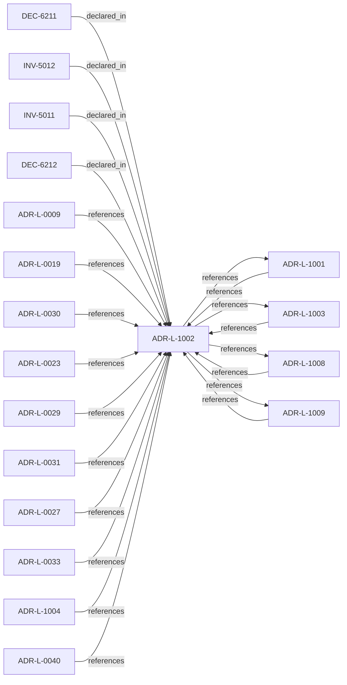

<!--
integrity_schema_version: 1
generated: deterministic_projection_v1
artifact_kind: rendered_adr_markdown
generator_id: adr-projection-markdown
generator_version: 2
hash_algorithm: sha256
source_hash: 572e50f7504ccdce68849616436f69ffa418981524080bbdfbf9726bbf305b22
rendered_hash: d101d28d3c893c6b5ee80c161f2ea7f1c9aa462684cd7dc4337b567dd0869ab8
-->

# ADR-L-1002: Architecture Admission Model

**Status:** proposed  
**Created:** 2026-03-28  
**Authors:** ste-spec  
**Domains:** governance, kernel, admission  
**Tags:** admission, allow, deny  
**Alias name:** architecture-admission-model  

## Context

Admission decides whether a **requested action** may proceed under declared
architecture truth (IR), factual evidence, governance posture, and active rules.
This ADR-L defines the semantic meaning of allowed, denied, conditional, and warned
admission postures and the **input closure** required to reach a decision.

IR validation versus admission evaluation follows ADR-031 and the STE kernel execution
model: invalid IR is a boot/integration failure surface, not a disguised policy waiver.

## Relationship graph

## Related ADRs

### ADR-L-0009 — Assertion Precedence Model

**Relationships:**
- 01a04e96-1f5a-70b0-a91f-0d25282f542c -[:references]-> this ADR

**Context:** Manual assertions and deterministic extraction can describe the same elements. The model
preserves both with provenance, surfaces contradictions, requires evidence for human
claims, and supports time-bounded validity.

[Open projection](ADR-L-0009-assertion-precedence-model.md)
### ADR-L-0019 — Gateway Authority and Signing Model

**Relationships:**
- 01a04e96-1f5a-7af0-a138-a306f7b93157 -[:references]-> this ADR

**Context:** STE Gateway verifies ORG-signed inputs and enforces eligibility; it does **not** attest
canonical truth or sign canonical artifacts. Eligibility outcomes are ephemeral and
unsigned.

[Open projection](ADR-L-0019-gateway-authority-and-signing-model.md)
### ADR-L-0023 — Validation Timing and Responsibility

**Relationships:**
- 01a04e96-1f5b-788c-8306-d10c9fe24eaa -[:references]-> this ADR

**Context:** Validation occurs at merge-time (ADF), pre-execution (Gateway), and locally (Runtime).
Only Gateway may authorize execution; ADF blocks canonical promotion; Runtime checks are
advisory for eligibility. Normalized outcomes treat INDETERMINATE as blocking for
authoritative paths.

[Open projection](ADR-L-0023-validation-timing-and-responsibility.md)
### ADR-L-0027 — Scope Semantics and Versioning

**Relationships:**
- 01a04e96-1f5b-7d37-8038-1c811fc5261b -[:references]-> this ADR

**Context:** Scope is a colon-delimited hierarchical identifier participating in authority checks.
Version 1 uses exact string equality; version 2 uses segment-prefix matching with
most-specific authority resolution and denial on equal-depth ambiguity. Trust Registry
and Context Bundle must declare `scope_semantics_version` consistently.

[Open projection](ADR-L-0027-scope-semantics-and-versioning.md)
### ADR-L-0029 — Gateway Enforcement Authority

**Relationships:**
- 01a04e96-1f5b-797b-b73b-27a64590210d -[:references]-> this ADR

**Context:** Gateway holds Enforcement Authority: verify ORG-signed material, consult trust registry,
evaluate eligibility prerequisites, emit ephemeral unsigned decisions. It is distinct
from ORG attestation authority which signs durable canonical artifacts.

[Open projection](ADR-L-0029-gateway-enforcement-authority.md)
### ADR-L-0030 — Contract Authority in ste-spec

**Relationships:**
- 01a04e96-1f5b-752a-bb27-9bfbb872ffc6 -[:references]-> this ADR

**Context:** Cross-repository handoff contracts are governed in **ste-spec**: shape in `contracts/`,
rules in `invariants/`, rationale in ADRs. Runtime and kernel repos remain subordinate
implementation surfaces.

[Open projection](ADR-L-0030-contract-authority-in-ste-spec.md)
### ADR-L-0031 — Runtime and Kernel Responsibility Boundary

**Relationships:**
- 01a04e96-1f5b-7c56-bc3f-75fbbc94d42b -[:references]-> this ADR

**Context:** **ste-runtime** produces factual evidence only. **ste-kernel** is the caller-facing
admission authority at the evaluated System Instance boundary (explicit environment and
evaluation scope).

[Open projection](ADR-L-0031-runtime-and-kernel-responsibility-boundary.md)
### ADR-L-0033 — Closed-Object Discipline

**Relationships:**
- 01a04e96-1f5b-7efb-a818-9534da2c4cd4 -[:references]-> this ADR

**Context:** Runtime/kernel handoff objects are **closed by default**: undeclared fields are not
contract-valid and cannot become hidden semantic or policy channels across repositories.

[Open projection](ADR-L-0033-closed-object-discipline.md)
### ADR-L-0040 — STE Spine Lifecycle and Authority

**Relationships:**
- 01a04e96-1f5c-78e0-823f-3c915d07acd6 -[:references]-> this ADR

**Context:** Defines the canonical **Spine** lifecycle stages, system states, authority categories, and
precedence rules tying together ste-spec doctrine, implementation repos, publication,
Architecture IR compilation, kernel admission, runtime evidence, assessment, and
governance. Does not redefine ADR-L-0038 taxonomy, ADR-L-0035 ontology, ADR-L-0031
boundary, or ADR-L-0030 contract authority.

[Open projection](ADR-L-0040-ste-spine-lifecycle-and-authority.md)
### ADR-L-1001 — Architecture Action Model

**Relationships:**
- 01a04e96-1f5c-7eef-9c36-e3ff0be7a77d -[:references]-> this ADR
- this ADR -[:references]-> 01a04e96-1f5c-7eef-9c36-e3ff0be7a77d

**Context:** The kernel does not admit or deny systems in the abstract. Caller-facing admission
evaluates whether a **requested action** on a system (in an explicit environment and
evaluation scope) is allowed, denied, conditional, or warned under declared architecture,
evidence, posture, and rules.

[Open projection](ADR-L-1001-architecture-action-model.md)
### ADR-L-1003 — Governance Posture State Model

**Relationships:**
- 01a04e96-1f5c-7ff0-b23d-2ed1f789092f -[:references]-> this ADR
- this ADR -[:references]-> 01a04e96-1f5c-7ff0-b23d-2ed1f789092f

**Context:** Governance posture constrains what is allowed, what requires explicit approval, what is
restricted, and what is denied independent of any single rule. This model composes with
active rules and promotion flows defined elsewhere (ADR-040 Spine, ste-rules-library).

[Open projection](ADR-L-1003-governance-posture-state-model.md)
### ADR-L-1004 — Architecture Freshness Model

**Relationships:**
- 01a04e96-1f5c-70ba-9337-084a88667cc5 -[:references]-> this ADR

**Context:** Freshness distinguishes whether integration-state (Architecture IR) and observational
state (evidence) are current enough for the decision at hand. IR freshness and evidence
freshness are distinct signals and MUST NOT be conflated.

[Open projection](ADR-L-1004-architecture-freshness-model.md)
### ADR-L-1008 — Decision Outcome Model

**Relationships:**
- 01a04e96-1f5d-7300-b13f-588156097d46 -[:references]-> this ADR
- this ADR -[:references]-> 01a04e96-1f5d-7300-b13f-588156097d46

**Context:** Caller-facing admission emits a small set of canonical outcomes. Each outcome carries
meaning for whether the **requested action** may execute, what remediation is required,
and how warnings differ from hard gates.

[Open projection](ADR-L-1008-decision-outcome-model.md)
### ADR-L-1009 — Kernel Decision Contract

**Relationships:**
- 01a04e96-1f5d-7793-873c-136f29f470be -[:references]-> this ADR
- this ADR -[:references]-> 01a04e96-1f5d-7793-873c-136f29f470be

**Context:** This ADR-L defines the normative **inputs** and **outputs** of a kernel admission
decision and the invariants that make decisions auditable and reproducible. It is the
architectural predecessor to future schemas and integration contracts; it does not specify wire formats.

[Open projection](ADR-L-1009-kernel-decision-contract.md)

## Invariants

### INV-5011

**Statement:** Admission input closure MUST include validated Architecture IR slice (or compiled IR
handle), evidence bundle reference, governance posture, active ruleset identity,
requested_action, environment, and evaluation scope sufficient to reproduce the decision.
  
**Scope:** global  
**Enforcement:** must (policy)  
**Verification:** automated

**Rationale:**
Reproducible admission requires explicit inputs aligned with ADR-L-1009 determinism invariant.

### INV-5012

**Statement:** DENY and CONDITIONAL outcomes MUST NOT be represented as successful boot or successful
unvalidated IR consumption.
  
**Scope:** global  
**Enforcement:** must (policy)  
**Verification:** automated

**Rationale:**
Preserves separation between IR validation/boot integrity and policy-layer admission outcomes.

## Decisions

### DEC-6211: Treat admission as evaluation of requested_action in context

**Rationale:**
Aligns all admission semantics with ADR-L-1001; forbids abstract system-only checks.

### DEC-6212: Separate IR validation failure semantics from policy denial semantics

**Rationale:**
Preserves fail-closed boot while keeping admission outcomes honest for policy layers.

---

*Generated from ADR-L-1002 by ADR Architecture Kit*