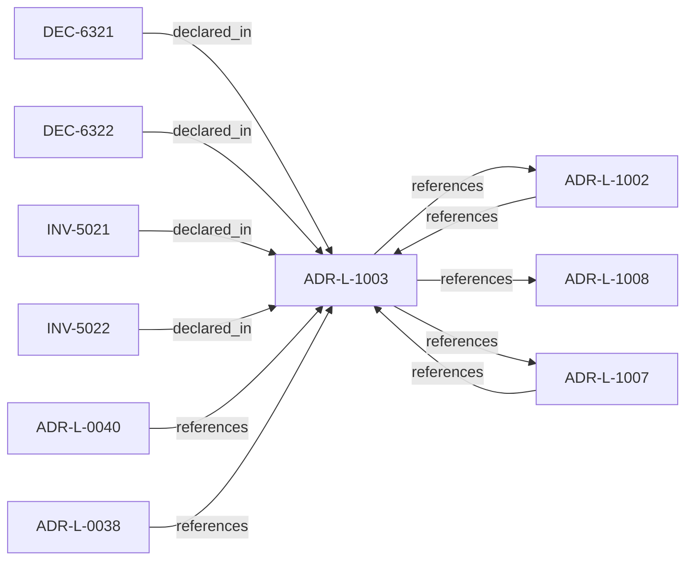

<!--
integrity_schema_version: 1
generated: deterministic_projection_v1
artifact_kind: rendered_adr_markdown
generator_id: adr-projection-markdown
generator_version: 2
hash_algorithm: sha256
source_hash: ac8993b11da143abcc5a3b75a53bba20998907a74a28702b1375b174b7788b8c
rendered_hash: 153a3c2b5745581632c6705da68f48edcaea9b39eab8a141f6cf355d0766738b
-->

# ADR-L-1003: Governance Posture State Model

**Status:** proposed  
**Created:** 2026-03-28  
**Authors:** ste-spec  
**Domains:** governance, kernel  
**Tags:** posture, golden, experimental  
**Alias name:** governance-posture-state-model  

## Context

Governance posture constrains what is allowed, what requires explicit approval, what is
restricted, and what is denied independent of any single rule. This model composes with
active rules and promotion flows defined elsewhere (ADR-040 Spine, ste-rules-library).

Posture states are not a substitute for architecture truth; they modulate enforcement
strictness and approval requirements on top of IR and evidence.

## Relationship graph

## Related ADRs

### ADR-L-0038 — Artifact Taxonomy and Versioning Posture

**Relationships:**
- 01a04e96-1f5c-7bf8-893f-f5279ec1ec75 -[:references]-> this ADR

**Context:** STE assigns each artifact a taxonomy **kind** per the ste-spec architecture document that
defines artifact taxonomy and versioning posture (under `architecture/`).
Version-control posture follows that kind, not repository or team preference.
This ADR is canonical for taxonomy and versioning posture; ADR-L-0040 maps kinds into
Spine stages without redefining the taxonomy.

[Open projection](ADR-L-0038-artifact-taxonomy-and-versioning-posture.md)
### ADR-L-0040 — STE Spine Lifecycle and Authority

**Relationships:**
- 01a04e96-1f5c-78e0-823f-3c915d07acd6 -[:references]-> this ADR

**Context:** Defines the canonical **Spine** lifecycle stages, system states, authority categories, and
precedence rules tying together ste-spec doctrine, implementation repos, publication,
Architecture IR compilation, kernel admission, runtime evidence, assessment, and
governance. Does not redefine ADR-L-0038 taxonomy, ADR-L-0035 ontology, ADR-L-0031
boundary, or ADR-L-0030 contract authority.

[Open projection](ADR-L-0040-ste-spine-lifecycle-and-authority.md)
### ADR-L-1002 — Architecture Admission Model

**Relationships:**
- 01a04e96-1f5c-73c9-ad1f-df05ef43cae1 -[:references]-> this ADR
- this ADR -[:references]-> 01a04e96-1f5c-73c9-ad1f-df05ef43cae1

**Context:** Admission decides whether a **requested action** may proceed under declared
architecture truth (IR), factual evidence, governance posture, and active rules.
This ADR-L defines the semantic meaning of allowed, denied, conditional, and warned
admission postures and the **input closure** required to reach a decision.

[Open projection](ADR-L-1002-architecture-admission-model.md)
### ADR-L-1007 — Golden System Model

**Relationships:**
- 01a04e96-1f5d-7507-ba3f-41979e12af8f -[:references]-> this ADR
- this ADR -[:references]-> 01a04e96-1f5d-7507-ba3f-41979e12af8f

**Context:** A Golden system is a designated reference or production-grade posture with stricter
eligibility, evidence, and promotion gates. Golden status is not merely descriptive;
it changes what future promotions and dependent systems may assume.

[Open projection](ADR-L-1007-golden-system-model.md)
### ADR-L-1008 — Decision Outcome Model

**Relationships:**
- this ADR -[:references]-> 01a04e96-1f5d-7300-b13f-588156097d46

**Context:** Caller-facing admission emits a small set of canonical outcomes. Each outcome carries
meaning for whether the **requested action** may execute, what remediation is required,
and how warnings differ from hard gates.

[Open projection](ADR-L-1008-decision-outcome-model.md)

## Invariants

### INV-5021

**Statement:** Posture MUST modulate admission outcomes only through declared, deterministic rules;
posture MUST NOT override normative architecture authority in ste-spec.
  
**Scope:** global  
**Enforcement:** must (policy)  
**Verification:** manual

**Rationale:**
Normative architecture remains authoritative; posture only modulates enforcement strictness.

### INV-5022

**Statement:** Golden and locked postures MUST impose stricter or equal constraints compared to
governed baseline for the same action class unless explicitly documented exceptions exist.
  
**Scope:** global  
**Enforcement:** should (design)  
**Verification:** manual

**Rationale:**
Golden and locked names imply elevated assurance; weakening defaults would mislead consumers.

## Decisions

### DEC-6321: Define posture states experimental, governed, restricted, locked, golden

**Rationale:**
Provides a shared vocabulary for progressive assurance and promotion.

### DEC-6322: Bind posture transitions to auditable authority and evidence

**Rationale:**
Prevents silent escalation or relaxation of enforcement posture.

## Gaps

### GAP-5021: Exact matrix of posture x action class defaults

**Impact:** high  
**Blocking:** No

---

*Generated from ADR-L-1003 by ADR Architecture Kit*