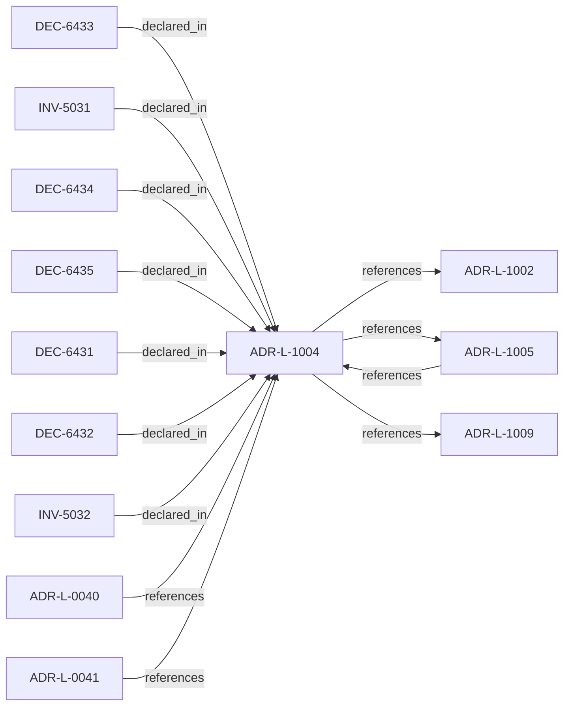

<!--
integrity_schema_version: 1
generated: deterministic_projection_v1
artifact_kind: rendered_adr_markdown
generator_id: adr-projection-markdown
generator_version: 2
hash_algorithm: sha256
source_hash: f2a1f535f671a70537848c1be1b8941b42542392184e30901e433aa95b1d9ccc
rendered_hash: 90a23fd1183c12eff45963887f997dcce88f1cadf4bdc41526b3d8b0662b009b
-->

# ADR-L-1004: Architecture Freshness Model

**Status:** proposed  
**Created:** 2026-03-28  
**Authors:** ste-spec  
**Domains:** governance, kernel, evidence  
**Tags:** freshness, staleness  
**Alias name:** architecture-freshness-model  

## Context

Freshness distinguishes whether integration-state (Architecture IR) and observational
state (evidence) are current enough for the decision at hand. IR freshness and evidence
freshness are distinct signals and MUST NOT be conflated.

Failure modes MUST align with ADR-031 and `execution/STE-Kernel-Execution-Model.md`:
invalid IR blocks boot; admission operates only on validated IR projections.

## Relationship graph

## Related ADRs

### ADR-L-0040 — STE Spine Lifecycle and Authority

**Relationships:**
- 01a04e96-1f5c-78e0-823f-3c915d07acd6 -[:references]-> this ADR

**Context:** Defines the canonical **Spine** lifecycle stages, system states, authority categories, and
precedence rules tying together ste-spec doctrine, implementation repos, publication,
Architecture IR compilation, kernel admission, runtime evidence, assessment, and
governance. Does not redefine ADR-L-0038 taxonomy, ADR-L-0035 ontology, ADR-L-0031
boundary, or ADR-L-0030 contract authority.

[Open projection](ADR-L-0040-ste-spine-lifecycle-and-authority.md)
### ADR-L-0041 — Compiler, Evidence, and Merge Authority

**Relationships:**
- 01a04e96-1f5c-7e5b-9837-1dea58886565 -[:references]-> this ADR

**Context:** Non-overlapping compiler roles: **adr-architecture-kit** is the authoring compiler for
ADR registries/manifest/rendered views (not a second compiler-of-record for
`ArchitectureEvidence` or normative `Compiled_IR_Document`). **ste-runtime** is runtime
evidence compiler of record. **ste-kernel** merges publication fragments, validates IR,
and emits `KernelAdmissionAssessment` while consuming ste-spec contracts.

[Open projection](ADR-L-0041-compiler-evidence-and-merge-authority.md)
### ADR-L-1002 — Architecture Admission Model

**Relationships:**
- this ADR -[:references]-> 01a04e96-1f5c-73c9-ad1f-df05ef43cae1

**Context:** Admission decides whether a **requested action** may proceed under declared
architecture truth (IR), factual evidence, governance posture, and active rules.
This ADR-L defines the semantic meaning of allowed, denied, conditional, and warned
admission postures and the **input closure** required to reach a decision.

[Open projection](ADR-L-1002-architecture-admission-model.md)
### ADR-L-1005 — Architecture Drift Model

**Relationships:**
- 01a04e96-1f5c-7b1e-943d-6db525f77bf0 -[:references]-> this ADR
- this ADR -[:references]-> 01a04e96-1f5c-7b1e-943d-6db525f77bf0

**Context:** Drift means observable divergence between declared architecture (IR and normative
doctrine), implementation or runtime behavior, and evidence. The kernel MUST categorize
drift into named kinds and map each kind to default admission-aligned outcomes; it
MUST NOT silently reinterpret drift ad hoc.

[Open projection](ADR-L-1005-architecture-drift-model.md)
### ADR-L-1009 — Kernel Decision Contract

**Relationships:**
- this ADR -[:references]-> 01a04e96-1f5d-7793-873c-136f29f470be

**Context:** This ADR-L defines the normative **inputs** and **outputs** of a kernel admission
decision and the invariants that make decisions auditable and reproducible. It is the
architectural predecessor to future schemas and integration contracts; it does not specify wire formats.

[Open projection](ADR-L-1009-kernel-decision-contract.md)

## Invariants

### INV-5031

**Statement:** IR validation failure MUST surface as boot/integration failure, not as a successful
admission ALLOW outcome.
  
**Scope:** global  
**Enforcement:** must (policy)  
**Verification:** automated

**Rationale:**
Matches STE kernel execution model: invalid IR cannot underpin successful admission.

### INV-5032

**Statement:** Freshness interpretations for identical inputs MUST be stable for deterministic replay
of admission outcomes.
  
**Scope:** global  
**Enforcement:** must (design)  
**Verification:** manual

**Rationale:**
Deterministic replay and audit require stable freshness classification for identical inputs.

## Decisions

### DEC-6431: Define IR invalid as boot failure preventing operational kernel use

**Rationale:**
Unvalidated IR cannot be a trustworthy substrate for admission or orchestration.

### DEC-6432: Map IR stale to CONDITIONAL or DENY per posture and rules

**Rationale:**
Stale declared architecture may still be structurally valid but untrustworthy for action.

### DEC-6433: Map evidence stale to WARNING or CONDITIONAL default bands

**Rationale:**
Evidence lag may warn or gate without necessarily invalidating IR structure.

### DEC-6434: Map evidence missing to CONDITIONAL or DENY per required evidence classes

**Rationale:**
Missing required observations cannot be treated as silent assent.

### DEC-6435: Treat IR and evidence mismatch as drift classification input

**Rationale:**
Mismatch is not resolved by picking a winner; it is classified per ADR-L-1005.

## Gaps

### GAP-5031: Required evidence classes per action and environment

**Impact:** high  
**Blocking:** No

---

*Generated from ADR-L-1004 by ADR Architecture Kit*