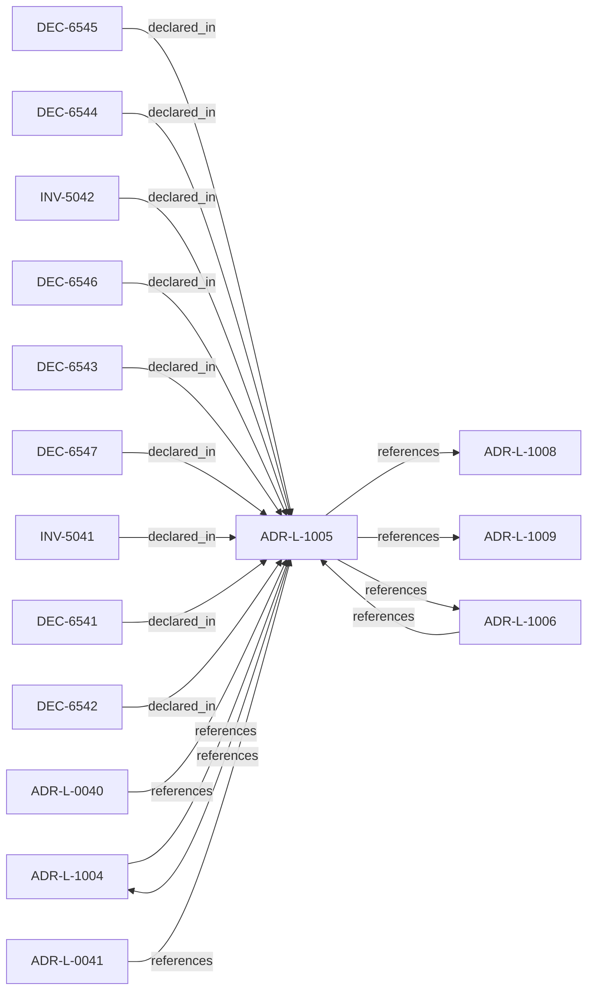

<!--
integrity_schema_version: 1
generated: deterministic_projection_v1
artifact_kind: rendered_adr_markdown
generator_id: adr-projection-markdown
generator_version: 2
hash_algorithm: sha256
source_hash: 523964dced1fd9c7ce043f20b79f7a8a9e60ae9e905301db65b6eeafb2feaea3
rendered_hash: 2e22523a8bbe83db45667b85a952daf0fd1e8b94ae7a2250ee61cc501fee5ca0
-->

# ADR-L-1005: Architecture Drift Model

**Status:** proposed  
**Created:** 2026-03-28  
**Authors:** ste-spec  
**Domains:** governance, kernel  
**Tags:** drift, categorization  
**Alias name:** architecture-drift-model  

## Context

Drift means observable divergence between declared architecture (IR and normative
doctrine), implementation or runtime behavior, and evidence. The kernel MUST categorize
drift into named kinds and map each kind to default admission-aligned outcomes; it
MUST NOT silently reinterpret drift ad hoc.

Default outcomes below are baseline semantics; posture, rules, and Golden requirements
MAY tighten but MUST NOT weaken fail-closed guarantees without explicit governance
exception artifacts per ADR-040.

## Relationship graph

## Related ADRs

### ADR-L-0040 — STE Spine Lifecycle and Authority

**Relationships:**
- 01a04e96-1f5c-78e0-823f-3c915d07acd6 -[:references]-> this ADR

**Context:** Defines the canonical **Spine** lifecycle stages, system states, authority categories, and
precedence rules tying together ste-spec doctrine, implementation repos, publication,
Architecture IR compilation, kernel admission, runtime evidence, assessment, and
governance. Does not redefine ADR-L-0038 taxonomy, ADR-L-0035 ontology, ADR-L-0031
boundary, or ADR-L-0030 contract authority.

[Open projection](ADR-L-0040-ste-spine-lifecycle-and-authority.md)
### ADR-L-0041 — Compiler, Evidence, and Merge Authority

**Relationships:**
- 01a04e96-1f5c-7e5b-9837-1dea58886565 -[:references]-> this ADR

**Context:** Non-overlapping compiler roles: **adr-architecture-kit** is the authoring compiler for
ADR registries/manifest/rendered views (not a second compiler-of-record for
`ArchitectureEvidence` or normative `Compiled_IR_Document`). **ste-runtime** is runtime
evidence compiler of record. **ste-kernel** merges publication fragments, validates IR,
and emits `KernelAdmissionAssessment` while consuming ste-spec contracts.

[Open projection](ADR-L-0041-compiler-evidence-and-merge-authority.md)
### ADR-L-1004 — Architecture Freshness Model

**Relationships:**
- 01a04e96-1f5c-70ba-9337-084a88667cc5 -[:references]-> this ADR
- this ADR -[:references]-> 01a04e96-1f5c-70ba-9337-084a88667cc5

**Context:** Freshness distinguishes whether integration-state (Architecture IR) and observational
state (evidence) are current enough for the decision at hand. IR freshness and evidence
freshness are distinct signals and MUST NOT be conflated.

[Open projection](ADR-L-1004-architecture-freshness-model.md)
### ADR-L-1006 — Evidence Authority Model

**Relationships:**
- 01a04e96-1f5d-78e4-b527-64a4a9e9e2b5 -[:references]-> this ADR
- this ADR -[:references]-> 01a04e96-1f5d-78e4-b527-64a4a9e9e2b5

**Context:** Runtime evidence is authoritative as **factual observation** within its contract, not as
a replacement for normative architecture declared in ste-spec and documentation-state.
When evidence contradicts IR or ADR meaning, the kernel MUST categorize contradiction as
drift or assessment finding; it MUST NOT silently rewrite normative sources.

[Open projection](ADR-L-1006-evidence-authority-model.md)
### ADR-L-1008 — Decision Outcome Model

**Relationships:**
- this ADR -[:references]-> 01a04e96-1f5d-7300-b13f-588156097d46

**Context:** Caller-facing admission emits a small set of canonical outcomes. Each outcome carries
meaning for whether the **requested action** may execute, what remediation is required,
and how warnings differ from hard gates.

[Open projection](ADR-L-1008-decision-outcome-model.md)
### ADR-L-1009 — Kernel Decision Contract

**Relationships:**
- this ADR -[:references]-> 01a04e96-1f5d-7793-873c-136f29f470be

**Context:** This ADR-L defines the normative **inputs** and **outputs** of a kernel admission
decision and the invariants that make decisions auditable and reproducible. It is the
architectural predecessor to future schemas and integration contracts; it does not specify wire formats.

[Open projection](ADR-L-1009-kernel-decision-contract.md)

## Invariants

### INV-5041

**Statement:** Drift categorization MUST be exhaustive for known inputs; unknown drift MUST be
surfaced as a primary-tier finding, not ignored.
  
**Scope:** global  
**Enforcement:** must (policy)  
**Verification:** automated

**Rationale:**
Unknown drift must be visible to preserve explainability and fail-closed posture.

### INV-5042

**Statement:** Default drift outcomes MUST be documented per drift kind; tightening by posture or Golden
status MUST remain deterministic.
  
**Scope:** global  
**Enforcement:** must (design)  
**Verification:** manual

**Rationale:**
Prevents informal waiver of drift handling across environments with different postures.

## Decisions

### DEC-6541: Define drift categories with default outcomes

**Rationale:**
Deterministic categorization enables explainable automation and audit.

**Consequences:**

**Positive:**
- Uniform handling across STE systems

**Negative:**
- Exception paths must be explicit, not informal

### DEC-6542: Implementation drift defaults to CONDITIONAL or DENY for deploy/change actions

**Rationale:**
Code or config that diverges from declared architecture cannot be promoted blindly.

### DEC-6543: Runtime drift defaults to WARNING or CONDITIONAL

**Rationale:**
Live behavior variance may warn first when safety allows, else gate action.

### DEC-6544: Evidence drift defaults to WARNING or CONDITIONAL

**Rationale:**
Observation divergence should surface without pretending architecture changed.

### DEC-6545: Undocumented component defaults to DENY for high-risk actions, CONDITIONAL otherwise

**Rationale:**
Unknown structure must not gain implicit authority.

### DEC-6546: Invariant violation defaults to DENY

**Rationale:**
Broken invariants are fail-closed for actions that depend on them.

### DEC-6547: Freshness drift defaults to CONDITIONAL or WARNING

**Rationale:**
Timeliness mismatches gate or warn per ADR-L-1004 interplay.

## Gaps

### GAP-5041: Machine labels for drift kinds at IR/evidence boundary

**Impact:** medium  
**Blocking:** No

---

*Generated from ADR-L-1005 by ADR Architecture Kit*