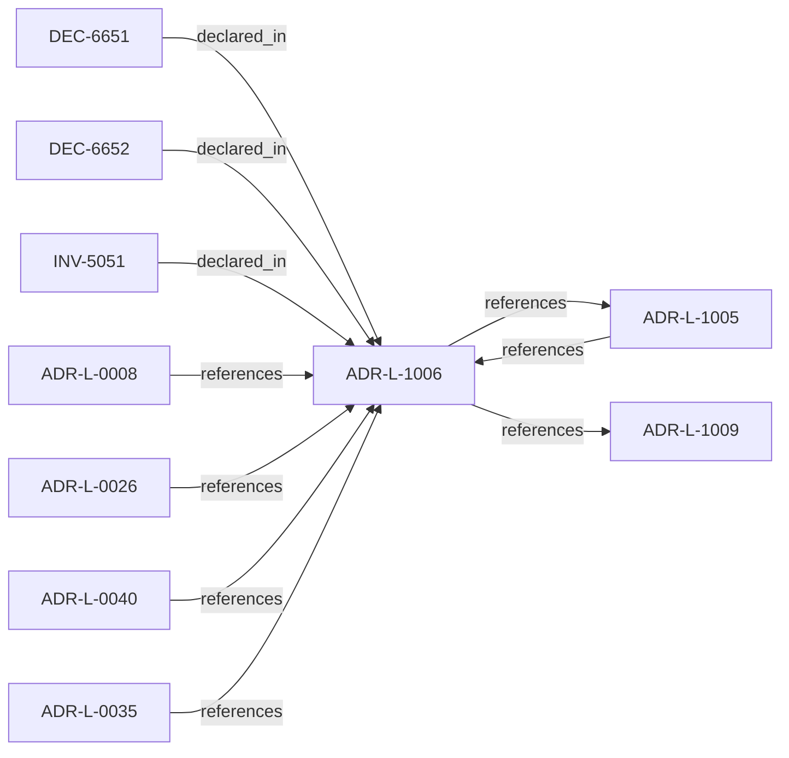

<!--
integrity_schema_version: 1
generated: deterministic_projection_v1
artifact_kind: rendered_adr_markdown
generator_id: adr-projection-markdown
generator_version: 2
hash_algorithm: sha256
source_hash: 2e58a87f43c369b44e22734018d7079915f5a059ab3891bdcdbbdf09741554ca
rendered_hash: b295723cc4e5c47ad8751affa7d4e4bf35043762eb1106cada6e36bc91d357ad
-->

# ADR-L-1006: Evidence Authority Model

**Status:** proposed  
**Created:** 2026-03-28  
**Authors:** ste-spec  
**Domains:** governance, kernel, evidence  
**Tags:** evidence, authority  
**Alias name:** evidence-authority-model  

## Context

Runtime evidence is authoritative as **factual observation** within its contract, not as
a replacement for normative architecture declared in ste-spec and documentation-state.
When evidence contradicts IR or ADR meaning, the kernel MUST categorize contradiction as
drift or assessment finding; it MUST NOT silently rewrite normative sources.

Governance authority may authorize exceptions through explicit artifacts per ADR-040;
raw runtime truth does not override architecture by default.

## Relationship graph

## Related ADRs

### ADR-L-0008 — Correctness and Consistency Contract

**Relationships:**
- 01a04e96-1f5a-7a29-b11e-4fe242be290c -[:references]-> this ADR

**Context:** Defines user-visible **correctness** and **consistency** guarantees for Fabric
documentation-state queried over extracted and asserted facts, including partial
failures, overlapping reconciliation jobs, provenance coexistence, and multi-region
eventual consistency.

[Open projection](ADR-L-0008-correctness-and-consistency-contract.md)
### ADR-L-0026 — Invariant Conflict Detection Semantics

**Relationships:**
- 01a04e96-1f5b-7f70-b03f-807ea0fe6694 -[:references]-> this ADR

**Context:** For v1, Fabric performs conflict detection when creating attestations and signs a
`conflict_status` field (`none` or `detected`). Gateway verifies the attestation and
enforces denial when conflicts are attested; Gateway MUST NOT implement independent
invariant content parsing for conflict detection.

[Open projection](ADR-L-0026-invariant-conflict-detection-semantics.md)
### ADR-L-0035 — Architecture IR Ontology Authority in ste-spec

**Relationships:**
- 01a04e96-1f5c-7fd4-bf3e-ddca6103eae1 -[:references]-> this ADR

**Context:** `architecture/STE-Architecture-Intermediate-Representation.md` is the canonical **semantic**
specification of Architecture IR. Mechanical JSON Schema and compiled enumerations publish
under `contracts/architecture-ir/` per the contract pin. ste-kernel consumes the bundle;
it does not own normative mechanical definitions. Compiler roles are further constrained
by ADR-L-0041.

[Open projection](ADR-L-0035-architecture-ir-ontology-authority-in-ste-spec.md)
### ADR-L-0040 — STE Spine Lifecycle and Authority

**Relationships:**
- 01a04e96-1f5c-78e0-823f-3c915d07acd6 -[:references]-> this ADR

**Context:** Defines the canonical **Spine** lifecycle stages, system states, authority categories, and
precedence rules tying together ste-spec doctrine, implementation repos, publication,
Architecture IR compilation, kernel admission, runtime evidence, assessment, and
governance. Does not redefine ADR-L-0038 taxonomy, ADR-L-0035 ontology, ADR-L-0031
boundary, or ADR-L-0030 contract authority.

[Open projection](ADR-L-0040-ste-spine-lifecycle-and-authority.md)
### ADR-L-1005 — Architecture Drift Model

**Relationships:**
- 01a04e96-1f5c-7b1e-943d-6db525f77bf0 -[:references]-> this ADR
- this ADR -[:references]-> 01a04e96-1f5c-7b1e-943d-6db525f77bf0

**Context:** Drift means observable divergence between declared architecture (IR and normative
doctrine), implementation or runtime behavior, and evidence. The kernel MUST categorize
drift into named kinds and map each kind to default admission-aligned outcomes; it
MUST NOT silently reinterpret drift ad hoc.

[Open projection](ADR-L-1005-architecture-drift-model.md)
### ADR-L-1009 — Kernel Decision Contract

**Relationships:**
- this ADR -[:references]-> 01a04e96-1f5d-7793-873c-136f29f470be

**Context:** This ADR-L defines the normative **inputs** and **outputs** of a kernel admission
decision and the invariants that make decisions auditable and reproducible. It is the
architectural predecessor to future schemas and integration contracts; it does not specify wire formats.

[Open projection](ADR-L-1009-kernel-decision-contract.md)

## Invariants

### INV-5051

**Statement:** Evidence MUST NOT be interpreted as normative architecture authority; overrides MUST
flow from governance artifacts, not from raw observations alone.
  
**Scope:** global  
**Enforcement:** must (policy)  
**Verification:** automated

**Rationale:**
Preserves documentation-state authority while still using factual runtime observations.

## Decisions

### DEC-6651: Enumerate authoritative evidence sources by contract family

**Rationale:**
Admission must know which observations count and under what provenance kinds.

### DEC-6652: Contradiction yields drift or assessment output, not silent IR mutation

**Rationale:**
Preserves documentation-state authority and auditability.

## Gaps

### GAP-5051: Cross-contract evidence bundle completeness rules

**Impact:** medium  
**Blocking:** No

---

*Generated from ADR-L-1006 by ADR Architecture Kit*