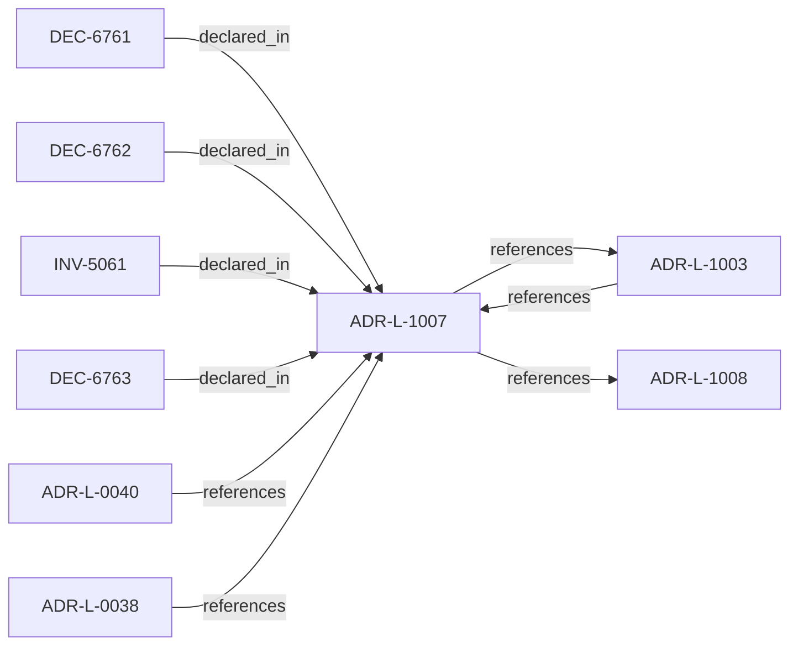

<!--
integrity_schema_version: 1
generated: deterministic_projection_v1
artifact_kind: rendered_adr_markdown
generator_id: adr-projection-markdown
generator_version: 2
hash_algorithm: sha256
source_hash: 6298f580e5c60ad69637f5e14fb9cbb81b717cfc519a7c13d7c998d08010b98b
rendered_hash: a5ddc5c9868635747603a0961752c30ee66336fb050b1caa6bbf1c4c21cca38c
-->

# ADR-L-1007: Golden System Model

**Status:** proposed  
**Created:** 2026-03-28  
**Authors:** ste-spec  
**Domains:** governance, kernel  
**Tags:** golden, promotion  
**Alias name:** golden-system-model  

## Context

A Golden system is a designated reference or production-grade posture with stricter
eligibility, evidence, and promotion gates. Golden status is not merely descriptive;
it changes what future promotions and dependent systems may assume.

Promotion to Golden MUST be auditable and MUST bind to explicit authority (human
governance decision and/or deterministic automated gates declared in policy), not to
informal convention.

## Relationship graph

## Related ADRs

### ADR-L-0038 — Artifact Taxonomy and Versioning Posture

**Relationships:**
- 01a04e96-1f5c-7bf8-893f-f5279ec1ec75 -[:references]-> this ADR

**Context:** STE assigns each artifact a taxonomy **kind** per the ste-spec architecture document that
defines artifact taxonomy and versioning posture (under `architecture/`).
Version-control posture follows that kind, not repository or team preference.
This ADR is canonical for taxonomy and versioning posture; ADR-L-0040 maps kinds into
Spine stages without redefining the taxonomy.

[Open projection](ADR-L-0038-artifact-taxonomy-and-versioning-posture.md)
### ADR-L-0040 — STE Spine Lifecycle and Authority

**Relationships:**
- 01a04e96-1f5c-78e0-823f-3c915d07acd6 -[:references]-> this ADR

**Context:** Defines the canonical **Spine** lifecycle stages, system states, authority categories, and
precedence rules tying together ste-spec doctrine, implementation repos, publication,
Architecture IR compilation, kernel admission, runtime evidence, assessment, and
governance. Does not redefine ADR-L-0038 taxonomy, ADR-L-0035 ontology, ADR-L-0031
boundary, or ADR-L-0030 contract authority.

[Open projection](ADR-L-0040-ste-spine-lifecycle-and-authority.md)
### ADR-L-1003 — Governance Posture State Model

**Relationships:**
- 01a04e96-1f5c-7ff0-b23d-2ed1f789092f -[:references]-> this ADR
- this ADR -[:references]-> 01a04e96-1f5c-7ff0-b23d-2ed1f789092f

**Context:** Governance posture constrains what is allowed, what requires explicit approval, what is
restricted, and what is denied independent of any single rule. This model composes with
active rules and promotion flows defined elsewhere (ADR-040 Spine, ste-rules-library).

[Open projection](ADR-L-1003-governance-posture-state-model.md)
### ADR-L-1008 — Decision Outcome Model

**Relationships:**
- this ADR -[:references]-> 01a04e96-1f5d-7300-b13f-588156097d46

**Context:** Caller-facing admission emits a small set of canonical outcomes. Each outcome carries
meaning for whether the **requested action** may execute, what remediation is required,
and how warnings differ from hard gates.

[Open projection](ADR-L-1008-decision-outcome-model.md)

## Invariants

### INV-5061

**Statement:** Promotion to Golden MUST be reproducibly justified from IR, evidence, posture, and
explicit promotion records; silent promotion MUST be forbidden.
  
**Scope:** global  
**Enforcement:** must (policy)  
**Verification:** audit

**Rationale:**
Golden status must be evidence-backed and reviewable, not a cosmetic label.

## Decisions

### DEC-6761: Define Golden eligibility prerequisites

**Rationale:**
Golden without criteria becomes a hollow label.

### DEC-6762: Define who or what may promote to Golden

**Rationale:**
Separates governance authority from tooling automation boundaries.

### DEC-6763: State implications for downstream systems and templates

**Rationale:**
Golden systems act as reference baselines for stricter inheritance or copying rules.

## Gaps

### GAP-5061: Automated versus human-only promotion gates per environment

**Impact:** medium  
**Blocking:** No

---

*Generated from ADR-L-1007 by ADR Architecture Kit*