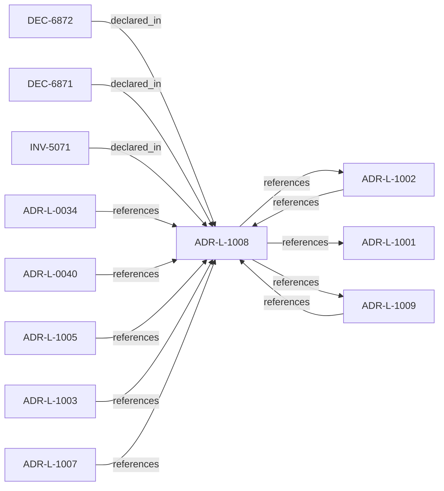

<!--
integrity_schema_version: 1
generated: deterministic_projection_v1
artifact_kind: rendered_adr_markdown
generator_id: adr-projection-markdown
generator_version: 2
hash_algorithm: sha256
source_hash: 24799ccbe0fb86324643a510a2aca058a3660e54be7ff91fadc5a704827f19d2
rendered_hash: 1c8cba1e2fab2c93b6c9b225d4edf825994cec4d6542d3073ef5dea23b848740
-->

# ADR-L-1008: Decision Outcome Model

**Status:** proposed  
**Created:** 2026-03-28  
**Authors:** ste-spec  
**Domains:** governance, kernel  
**Tags:** outcomes, allow, deny  
**Alias name:** decision-outcome-model  

## Context

Caller-facing admission emits a small set of canonical outcomes. Each outcome carries
meaning for whether the **requested action** may execute, what remediation is required,
and how warnings differ from hard gates.

This model aligns with ADR-031: only ste-kernel emits caller-facing admission
semantics; ste-runtime remains evidence-only.

## Relationship graph

## Related ADRs

### ADR-L-0034 — Rule Projection Envelope Authority

**Relationships:**
- 01a04e96-1f5b-76a7-9f3e-74a771a33e46 -[:references]-> this ADR

**Context:** ste-spec will own the interchange envelope for ADR-bound rule projections and related
attestations under `contracts/rule-projection/` when promoted from draft. Semantic rules
live in `invariants/` (e.g. INV-0010). ste-kernel must not be treated as authoritative
signer or compiler of rule text for these envelopes.

[Open projection](ADR-L-0034-rule-projection-envelope-authority.md)
### ADR-L-0040 — STE Spine Lifecycle and Authority

**Relationships:**
- 01a04e96-1f5c-78e0-823f-3c915d07acd6 -[:references]-> this ADR

**Context:** Defines the canonical **Spine** lifecycle stages, system states, authority categories, and
precedence rules tying together ste-spec doctrine, implementation repos, publication,
Architecture IR compilation, kernel admission, runtime evidence, assessment, and
governance. Does not redefine ADR-L-0038 taxonomy, ADR-L-0035 ontology, ADR-L-0031
boundary, or ADR-L-0030 contract authority.

[Open projection](ADR-L-0040-ste-spine-lifecycle-and-authority.md)
### ADR-L-1001 — Architecture Action Model

**Relationships:**
- this ADR -[:references]-> 01a04e96-1f5c-7eef-9c36-e3ff0be7a77d

**Context:** The kernel does not admit or deny systems in the abstract. Caller-facing admission
evaluates whether a **requested action** on a system (in an explicit environment and
evaluation scope) is allowed, denied, conditional, or warned under declared architecture,
evidence, posture, and rules.

[Open projection](ADR-L-1001-architecture-action-model.md)
### ADR-L-1002 — Architecture Admission Model

**Relationships:**
- 01a04e96-1f5c-73c9-ad1f-df05ef43cae1 -[:references]-> this ADR
- this ADR -[:references]-> 01a04e96-1f5c-73c9-ad1f-df05ef43cae1

**Context:** Admission decides whether a **requested action** may proceed under declared
architecture truth (IR), factual evidence, governance posture, and active rules.
This ADR-L defines the semantic meaning of allowed, denied, conditional, and warned
admission postures and the **input closure** required to reach a decision.

[Open projection](ADR-L-1002-architecture-admission-model.md)
### ADR-L-1003 — Governance Posture State Model

**Relationships:**
- 01a04e96-1f5c-7ff0-b23d-2ed1f789092f -[:references]-> this ADR

**Context:** Governance posture constrains what is allowed, what requires explicit approval, what is
restricted, and what is denied independent of any single rule. This model composes with
active rules and promotion flows defined elsewhere (ADR-040 Spine, ste-rules-library).

[Open projection](ADR-L-1003-governance-posture-state-model.md)
### ADR-L-1005 — Architecture Drift Model

**Relationships:**
- 01a04e96-1f5c-7b1e-943d-6db525f77bf0 -[:references]-> this ADR

**Context:** Drift means observable divergence between declared architecture (IR and normative
doctrine), implementation or runtime behavior, and evidence. The kernel MUST categorize
drift into named kinds and map each kind to default admission-aligned outcomes; it
MUST NOT silently reinterpret drift ad hoc.

[Open projection](ADR-L-1005-architecture-drift-model.md)
### ADR-L-1007 — Golden System Model

**Relationships:**
- 01a04e96-1f5d-7507-ba3f-41979e12af8f -[:references]-> this ADR

**Context:** A Golden system is a designated reference or production-grade posture with stricter
eligibility, evidence, and promotion gates. Golden status is not merely descriptive;
it changes what future promotions and dependent systems may assume.

[Open projection](ADR-L-1007-golden-system-model.md)
### ADR-L-1009 — Kernel Decision Contract

**Relationships:**
- 01a04e96-1f5d-7793-873c-136f29f470be -[:references]-> this ADR
- this ADR -[:references]-> 01a04e96-1f5d-7793-873c-136f29f470be

**Context:** This ADR-L defines the normative **inputs** and **outputs** of a kernel admission
decision and the invariants that make decisions auditable and reproducible. It is the
architectural predecessor to future schemas and integration contracts; it does not specify wire formats.

[Open projection](ADR-L-1009-kernel-decision-contract.md)

## Invariants

### INV-5071

**Statement:** DENY MUST prohibit execution of the requested_action; ALLOW MUST explicitly clear the
action subject to downstream enforcement surfaces; CONDITIONAL MUST require documented
preconditions before execution; WARNING MUST surface non-blocking findings without
implying allow unless paired with ALLOW or CONDITIONAL clearance.
  
**Scope:** global  
**Enforcement:** must (policy)  
**Verification:** automated

**Rationale:**
Clients must interpret outcomes consistently for the same requested_action semantics.

## Decisions

### DEC-6871: Define ALLOW, DENY, CONDITIONAL, WARNING semantics for requested_action

**Rationale:**
Shared vocabulary prevents incompatible client interpretations.

### DEC-6872: Bind execution permission to outcome and action class jointly

**Rationale:**
Some informational actions never imply execution permission changes.

---

*Generated from ADR-L-1008 by ADR Architecture Kit*