<!--
integrity_schema_version: 1
generated: deterministic_projection_v1
artifact_kind: rendered_adr_markdown
generator_id: adr-projection-markdown
generator_version: 2
hash_algorithm: sha256
source_hash: ef4b476536374ca9585e62ede2feadcbaaa20f771f88511d4810f75a3db86c81
rendered_hash: 2094a9723822fc96beef863617228d09fbdd12bcf9828b8d2719f3bbd208becc
-->

# ADR-L-1009: Kernel Decision Contract

**Status:** proposed  
**Created:** 2026-03-28  
**Authors:** ste-spec  
**Domains:** governance, kernel, contract  
**Tags:** decision-contract, determinism  
**Alias name:** kernel-decision-contract  

## Context

This ADR-L defines the normative **inputs** and **outputs** of a kernel admission
decision and the invariants that make decisions auditable and reproducible. It is the
architectural predecessor to future schemas and integration contracts; it does not specify wire formats.

**requested_action** is a required input and MUST conform to ADR-L-1001. Assessment-only
flows follow ste-kernel ADR-PS for the assessment path and MUST NOT use this contract
for allow/deny semantics.

Repository roles and kernel fail-closed evidence gating are anchored by **ADR-L-0031** and
**ADR-L-0032** (migrated from published ADR-031 / ADR-032).

## Relationship graph

```mermaid
flowchart LR
  n_01a04e96_1f5a_70b0_a91f_0d25282f542c["ADR-L-0009"]
  n_01a04e96_1f5a_720a_bc3f_d1ce4bde0816["ADR-L-0020"]
  n_01a04e96_1f5a_7a29_b11e_4fe242be290c["ADR-L-0008"]
  n_01a04e96_1f5a_7af0_a138_a306f7b93157["ADR-L-0019"]
  n_01a04e96_1f5b_74cc_9a3d_921d80842047["ADR-L-0022"]
  n_01a04e96_1f5b_7551_992f_4be395920f16["ADR-L-0028"]
  n_01a04e96_1f5b_788c_8306_d10c9fe24eaa["ADR-L-0023"]
  n_01a04e96_1f5b_797b_b73b_27a64590210d["ADR-L-0029"]
  n_01a04e96_1f5b_7a30_ad3e_e3e11989eed7["ADR-L-0021"]
  n_01a04e96_1f5b_7c56_bc3f_75fbbc94d42b["ADR-L-0031"]
  n_01a04e96_1f5b_7d37_8038_1c811fc5261b["ADR-L-0027"]
  n_01a04e96_1f5b_7e90_9f2d_79f60b81c807["ADR-L-0024"]
  n_01a04e96_1f5b_7ece_bf1f_4f6ac80361f5["ADR-L-0032"]
  n_01a04e96_1f5c_70ba_9337_084a88667cc5["ADR-L-1004"]
  n_01a04e96_1f5c_73c9_ad1f_df05ef43cae1["ADR-L-1002"]
  n_01a04e96_1f5c_78e0_823f_3c915d07acd6["ADR-L-0040"]
  n_01a04e96_1f5c_7b1e_943d_6db525f77bf0["ADR-L-1005"]
  n_01a04e96_1f5c_7eef_9c36_e3ff0be7a77d["ADR-L-1001"]
  n_01a04e96_1f5d_70ae_b717_dd800d661b13["INV-5081"]
  n_01a04e96_1f5d_7300_b13f_588156097d46["ADR-L-1008"]
  n_01a04e96_1f5d_7672_a51f_eff6163e36a0["DEC-6981"]
  n_01a04e96_1f5d_7720_8e2f_bc5a00b54ae5["DEC-6982"]
  n_01a04e96_1f5d_7793_873c_136f29f470be["ADR-L-1009"]
  n_01a04e96_1f5d_78e4_b527_64a4a9e9e2b5["ADR-L-1006"]
  n_01a04e96_1f5d_790f_8c39_084c55a0208c["INV-5083"]
  n_01a04e96_1f5d_7ec2_a43f_156b4b2fcb9b["INV-5082"]
  n_01a04e96_1f5d_70ae_b717_dd800d661b13 -->|"declared_in"| n_01a04e96_1f5d_7793_873c_136f29f470be
  n_01a04e96_1f5d_7672_a51f_eff6163e36a0 -->|"declared_in"| n_01a04e96_1f5d_7793_873c_136f29f470be
  n_01a04e96_1f5d_7720_8e2f_bc5a00b54ae5 -->|"declared_in"| n_01a04e96_1f5d_7793_873c_136f29f470be
  n_01a04e96_1f5d_790f_8c39_084c55a0208c -->|"declared_in"| n_01a04e96_1f5d_7793_873c_136f29f470be
  n_01a04e96_1f5d_7ec2_a43f_156b4b2fcb9b -->|"declared_in"| n_01a04e96_1f5d_7793_873c_136f29f470be
  n_01a04e96_1f5a_70b0_a91f_0d25282f542c -->|"references"| n_01a04e96_1f5d_7793_873c_136f29f470be
  n_01a04e96_1f5a_720a_bc3f_d1ce4bde0816 -->|"references"| n_01a04e96_1f5d_7793_873c_136f29f470be
  n_01a04e96_1f5a_7a29_b11e_4fe242be290c -->|"references"| n_01a04e96_1f5d_7793_873c_136f29f470be
  n_01a04e96_1f5a_7af0_a138_a306f7b93157 -->|"references"| n_01a04e96_1f5d_7793_873c_136f29f470be
  n_01a04e96_1f5b_74cc_9a3d_921d80842047 -->|"references"| n_01a04e96_1f5d_7793_873c_136f29f470be
  n_01a04e96_1f5b_7551_992f_4be395920f16 -->|"references"| n_01a04e96_1f5d_7793_873c_136f29f470be
  n_01a04e96_1f5b_788c_8306_d10c9fe24eaa -->|"references"| n_01a04e96_1f5d_7793_873c_136f29f470be
  n_01a04e96_1f5b_797b_b73b_27a64590210d -->|"references"| n_01a04e96_1f5d_7793_873c_136f29f470be
  n_01a04e96_1f5b_7a30_ad3e_e3e11989eed7 -->|"references"| n_01a04e96_1f5d_7793_873c_136f29f470be
  n_01a04e96_1f5b_7c56_bc3f_75fbbc94d42b -->|"references"| n_01a04e96_1f5d_7793_873c_136f29f470be
  n_01a04e96_1f5b_7d37_8038_1c811fc5261b -->|"references"| n_01a04e96_1f5d_7793_873c_136f29f470be
  n_01a04e96_1f5b_7e90_9f2d_79f60b81c807 -->|"references"| n_01a04e96_1f5d_7793_873c_136f29f470be
  n_01a04e96_1f5b_7ece_bf1f_4f6ac80361f5 -->|"references"| n_01a04e96_1f5d_7793_873c_136f29f470be
  n_01a04e96_1f5c_70ba_9337_084a88667cc5 -->|"references"| n_01a04e96_1f5d_7793_873c_136f29f470be
  n_01a04e96_1f5c_73c9_ad1f_df05ef43cae1 -->|"references"| n_01a04e96_1f5d_7793_873c_136f29f470be
  n_01a04e96_1f5c_78e0_823f_3c915d07acd6 -->|"references"| n_01a04e96_1f5d_7793_873c_136f29f470be
  n_01a04e96_1f5c_7b1e_943d_6db525f77bf0 -->|"references"| n_01a04e96_1f5d_7793_873c_136f29f470be
  n_01a04e96_1f5c_7eef_9c36_e3ff0be7a77d -->|"references"| n_01a04e96_1f5d_7793_873c_136f29f470be
  n_01a04e96_1f5d_7300_b13f_588156097d46 -->|"references"| n_01a04e96_1f5d_7793_873c_136f29f470be
  n_01a04e96_1f5d_7793_873c_136f29f470be -->|"references"| n_01a04e96_1f5b_7c56_bc3f_75fbbc94d42b
  n_01a04e96_1f5d_7793_873c_136f29f470be -->|"references"| n_01a04e96_1f5b_7ece_bf1f_4f6ac80361f5
  n_01a04e96_1f5d_7793_873c_136f29f470be -->|"references"| n_01a04e96_1f5c_73c9_ad1f_df05ef43cae1
  n_01a04e96_1f5d_7793_873c_136f29f470be -->|"references"| n_01a04e96_1f5c_7eef_9c36_e3ff0be7a77d
  n_01a04e96_1f5d_7793_873c_136f29f470be -->|"references"| n_01a04e96_1f5d_7300_b13f_588156097d46
  n_01a04e96_1f5d_78e4_b527_64a4a9e9e2b5 -->|"references"| n_01a04e96_1f5d_7793_873c_136f29f470be
```

## Related ADRs

### ADR-L-0008 — Correctness and Consistency Contract

**Relationships:**
- 01a04e96-1f5a-7a29-b11e-4fe242be290c -[:references]-> this ADR

**Context:** Defines user-visible **correctness** and **consistency** guarantees for Fabric
documentation-state queried over extracted and asserted facts, including partial
failures, overlapping reconciliation jobs, provenance coexistence, and multi-region
eventual consistency.

[Open projection](ADR-L-0008-correctness-and-consistency-contract.md)
### ADR-L-0009 — Assertion Precedence Model

**Relationships:**
- 01a04e96-1f5a-70b0-a91f-0d25282f542c -[:references]-> this ADR

**Context:** Manual assertions and deterministic extraction can describe the same elements. The model
preserves both with provenance, surfaces contradictions, requires evidence for human
claims, and supports time-bounded validity.

[Open projection](ADR-L-0009-assertion-precedence-model.md)
### ADR-L-0019 — Gateway Authority and Signing Model

**Relationships:**
- 01a04e96-1f5a-7af0-a138-a306f7b93157 -[:references]-> this ADR

**Context:** STE Gateway verifies ORG-signed inputs and enforces eligibility; it does **not** attest
canonical truth or sign canonical artifacts. Eligibility outcomes are ephemeral and
unsigned.

[Open projection](ADR-L-0019-gateway-authority-and-signing-model.md)
### ADR-L-0020 — ORG-Level Signing Scope

**Relationships:**
- 01a04e96-1f5a-720a-bc3f-d1ce4bde0816 -[:references]-> this ADR

**Context:** ORG-level signing applies only to artifacts that establish or ratify **canonical truth**;
ephemeral enforcement outputs, workspace-local bundles, and derived indexes are out of
scope for ORG signing.

[Open projection](ADR-L-0020-org-level-signing-scope.md)
### ADR-L-0021 — Gateway Trust Verification Model

**Relationships:**
- 01a04e96-1f5b-7a30-ad3e-e3e11989eed7 -[:references]-> this ADR

**Context:** Gateway is not a trust-registry principal; trust checks run per eligibility evaluation;
registry outages fail execution closed; bootstrap material only anchors registry
verification; cached trust cannot authorize execution.

[Open projection](ADR-L-0021-gateway-trust-verification-model.md)
### ADR-L-0022 — Fail-Closed Semantics and Enforcement Scope

**Relationships:**
- 01a04e96-1f5b-74cc-9a3d-921d80842047 -[:references]-> this ADR

**Context:** Authoritative execution eligibility and canonical promotion require complete, successful
validation. Fail-closed halts authoritative actions when prerequisites cannot be verified;
it does not require total system unavailability. Non-authoritative inspection may continue
under explicit degraded labeling.

[Open projection](ADR-L-0022-fail-closed-semantics-and-enforcement-scope.md)
### ADR-L-0023 — Validation Timing and Responsibility

**Relationships:**
- 01a04e96-1f5b-788c-8306-d10c9fe24eaa -[:references]-> this ADR

**Context:** Validation occurs at merge-time (ADF), pre-execution (Gateway), and locally (Runtime).
Only Gateway may authorize execution; ADF blocks canonical promotion; Runtime checks are
advisory for eligibility. Normalized outcomes treat INDETERMINATE as blocking for
authoritative paths.

[Open projection](ADR-L-0023-validation-timing-and-responsibility.md)
### ADR-L-0024 — Cross-Component Contracts and Execution Eligibility Interface

**Relationships:**
- 01a04e96-1f5b-7e90-9f2d-79f60b81c807 -[:references]-> this ADR

**Context:** Gateway is a pure validator over a complete Context Bundle; Runtime (with ADF-produced
artifacts) supplies completeness. Requests use references and integrity bindings; responses
are structured with stable reason codes. Execution blocks synchronously until ALLOW.

[Open projection](ADR-L-0024-cross-component-contracts-and-execution-eligibility-interface.md)
### ADR-L-0027 — Scope Semantics and Versioning

**Relationships:**
- 01a04e96-1f5b-7d37-8038-1c811fc5261b -[:references]-> this ADR

**Context:** Scope is a colon-delimited hierarchical identifier participating in authority checks.
Version 1 uses exact string equality; version 2 uses segment-prefix matching with
most-specific authority resolution and denial on equal-depth ambiguity. Trust Registry
and Context Bundle must declare `scope_semantics_version` consistently.

[Open projection](ADR-L-0027-scope-semantics-and-versioning.md)
### ADR-L-0028 — AI-DOC Fabric and Gateway Authority Boundaries

**Relationships:**
- 01a04e96-1f5b-7551-992f-4be395920f16 -[:references]-> this ADR

**Context:** Fabric is the sole canonical state authority, invariant resolver, conflict detector for
attested bundles, and signer of Fabric Attestations. Gateway is a pure verifier that does
not query Fabric during eligibility evaluation. Runtime assembles and transports bundles
and attestations without substituting Fabric authority.

[Open projection](ADR-L-0028-ai-doc-fabric-and-gateway-authority-boundaries.md)
### ADR-L-0029 — Gateway Enforcement Authority

**Relationships:**
- 01a04e96-1f5b-797b-b73b-27a64590210d -[:references]-> this ADR

**Context:** Gateway holds Enforcement Authority: verify ORG-signed material, consult trust registry,
evaluate eligibility prerequisites, emit ephemeral unsigned decisions. It is distinct
from ORG attestation authority which signs durable canonical artifacts.

[Open projection](ADR-L-0029-gateway-enforcement-authority.md)
### ADR-L-0031 — Runtime and Kernel Responsibility Boundary

**Relationships:**
- 01a04e96-1f5b-7c56-bc3f-75fbbc94d42b -[:references]-> this ADR
- this ADR -[:references]-> 01a04e96-1f5b-7c56-bc3f-75fbbc94d42b

**Context:** **ste-runtime** produces factual evidence only. **ste-kernel** is the caller-facing
admission authority at the evaluated System Instance boundary (explicit environment and
evaluation scope).

[Open projection](ADR-L-0031-runtime-and-kernel-responsibility-boundary.md)
### ADR-L-0032 — Fail-Closed Enforcement Model

**Relationships:**
- 01a04e96-1f5b-7ece-bf1f-4f6ac80361f5 -[:references]-> this ADR
- this ADR -[:references]-> 01a04e96-1f5b-7ece-bf1f-4f6ac80361f5

**Context:** Invalid, unavailable, malformed, or semantically inconsistent runtime evidence and
related publication inputs are fail-closed at the **kernel** boundary before permissive
admission outcomes. Schema validity alone is insufficient for conformance.

[Open projection](ADR-L-0032-fail-closed-enforcement-model.md)
### ADR-L-0040 — STE Spine Lifecycle and Authority

**Relationships:**
- 01a04e96-1f5c-78e0-823f-3c915d07acd6 -[:references]-> this ADR

**Context:** Defines the canonical **Spine** lifecycle stages, system states, authority categories, and
precedence rules tying together ste-spec doctrine, implementation repos, publication,
Architecture IR compilation, kernel admission, runtime evidence, assessment, and
governance. Does not redefine ADR-L-0038 taxonomy, ADR-L-0035 ontology, ADR-L-0031
boundary, or ADR-L-0030 contract authority.

[Open projection](ADR-L-0040-ste-spine-lifecycle-and-authority.md)
### ADR-L-1001 — Architecture Action Model

**Relationships:**
- 01a04e96-1f5c-7eef-9c36-e3ff0be7a77d -[:references]-> this ADR
- this ADR -[:references]-> 01a04e96-1f5c-7eef-9c36-e3ff0be7a77d

**Context:** The kernel does not admit or deny systems in the abstract. Caller-facing admission
evaluates whether a **requested action** on a system (in an explicit environment and
evaluation scope) is allowed, denied, conditional, or warned under declared architecture,
evidence, posture, and rules.

[Open projection](ADR-L-1001-architecture-action-model.md)
### ADR-L-1002 — Architecture Admission Model

**Relationships:**
- 01a04e96-1f5c-73c9-ad1f-df05ef43cae1 -[:references]-> this ADR
- this ADR -[:references]-> 01a04e96-1f5c-73c9-ad1f-df05ef43cae1

**Context:** Admission decides whether a **requested action** may proceed under declared
architecture truth (IR), factual evidence, governance posture, and active rules.
This ADR-L defines the semantic meaning of allowed, denied, conditional, and warned
admission postures and the **input closure** required to reach a decision.

[Open projection](ADR-L-1002-architecture-admission-model.md)
### ADR-L-1004 — Architecture Freshness Model

**Relationships:**
- 01a04e96-1f5c-70ba-9337-084a88667cc5 -[:references]-> this ADR

**Context:** Freshness distinguishes whether integration-state (Architecture IR) and observational
state (evidence) are current enough for the decision at hand. IR freshness and evidence
freshness are distinct signals and MUST NOT be conflated.

[Open projection](ADR-L-1004-architecture-freshness-model.md)
### ADR-L-1005 — Architecture Drift Model

**Relationships:**
- 01a04e96-1f5c-7b1e-943d-6db525f77bf0 -[:references]-> this ADR

**Context:** Drift means observable divergence between declared architecture (IR and normative
doctrine), implementation or runtime behavior, and evidence. The kernel MUST categorize
drift into named kinds and map each kind to default admission-aligned outcomes; it
MUST NOT silently reinterpret drift ad hoc.

[Open projection](ADR-L-1005-architecture-drift-model.md)
### ADR-L-1006 — Evidence Authority Model

**Relationships:**
- 01a04e96-1f5d-78e4-b527-64a4a9e9e2b5 -[:references]-> this ADR

**Context:** Runtime evidence is authoritative as **factual observation** within its contract, not as
a replacement for normative architecture declared in ste-spec and documentation-state.
When evidence contradicts IR or ADR meaning, the kernel MUST categorize contradiction as
drift or assessment finding; it MUST NOT silently rewrite normative sources.

[Open projection](ADR-L-1006-evidence-authority-model.md)
### ADR-L-1008 — Decision Outcome Model

**Relationships:**
- 01a04e96-1f5d-7300-b13f-588156097d46 -[:references]-> this ADR
- this ADR -[:references]-> 01a04e96-1f5d-7300-b13f-588156097d46

**Context:** Caller-facing admission emits a small set of canonical outcomes. Each outcome carries
meaning for whether the **requested action** may execute, what remediation is required,
and how warnings differ from hard gates.

[Open projection](ADR-L-1008-decision-outcome-model.md)

## Invariants

### INV-5081

**Statement:** Determinism — Given the same Architecture IR bundle, evidence bundle, governance
posture, active rules, and requested_action (plus fixed evaluation scope and
environment), the kernel MUST produce the same decision outcome and the same structured
explanation skeleton.
  
**Scope:** global  
**Enforcement:** must (policy)  
**Verification:** automated

**Rationale:**
Enables audit, replay, and cross-environment parity for admission automation.

### INV-5082

**Statement:** Explainability — Every admission decision MUST cite the specific ADRs, IR elements,
rules, invariants, posture, or evidence observations that caused the outcome; vague
summaries without pointers are non-conformant.
  
**Scope:** global  
**Enforcement:** must (policy)  
**Verification:** manual

**Rationale:**
Explanations without citations are indistinguishable from opaque denial of service.

### INV-5083

**Statement:** Fail-closed — Missing, invalid, or unverifiable required inputs MUST yield DENY or
CONDITIONAL outcomes that do not allow the requested_action; silent ALLOW is forbidden.
  
**Scope:** global  
**Enforcement:** must (policy)  
**Verification:** automated

**Rationale:**
Prevents silent success when prerequisites are unknown or untrusted.

## Decisions

### DEC-6981: Require requested_action in the admission decision input closure

**Rationale:**
Admission without an action is undefined and fail-closed per invariants below.

### DEC-6982: Enumerate decision outputs including violations, drift, remediation, explanations

**Rationale:**
Consumers need both human and structured machine narratives tied to cited causes.

## Gaps

### GAP-5081: Formal schema for machine-readable explanation graph

**Impact:** medium  
**Blocking:** No

---

*Generated from ADR-L-1009 by ADR Architecture Kit*