# STE Architecture Intermediate Representation (Architecture IR)

## Purpose

This document is the **normative semantic specification** of the STE **Architecture Intermediate Representation** (Architecture IR): the canonical ontology by which STE names architecture entities, relationships, provenance, lifecycle, completeness, governance, evidence, gaps, reviews, overrides, remediation, and the **Architecture Index**.

**Conformance:** The key words **MUST**, **MUST NOT**, **SHOULD**, and **MAY** are to be interpreted as described in BCP 14 ([RFC 2119](https://www.rfc-editor.org/rfc/rfc2119), [RFC 8174](https://www.rfc-editor.org/rfc/rfc8174)) when, and only when, they appear in all capitals, as in this document.

**Authority split:**

- **Normative in this document:** meaning of Architecture IR terms; allowed semantic entity and relationship types; provenance, lifecycle, completeness, and governance classifications; architecture control loop; Architecture Index responsibilities.
- **Mechanical authority (referenced, not duplicated):** JSON Schema shape, merge order, identity hashing, and compiled relationship `type` enums for `Compiled_IR_Document` are **versioned in `ste-kernel`** and **pinned** from `ste-spec` per [`contracts/README.md`](../contracts/README.md) and [`contracts/architecture-ir-kernel-contract-pin.json`](../contracts/architecture-ir-kernel-contract-pin.json).

**MUST NOT:** Treat this document as the mechanical JSON Schema for `Compiled_IR_Document`. **MUST NOT:** Treat `Compiled_IR_Document` as a substitute for declared documentation-state in repositories; it is **integration-state** (see [`glossary.md`](../glossary.md), [`STE-Foundations.md`](./STE-Foundations.md) §2.3a).

**Story (informative):** end-to-end integration narrative: [`STE-Integration-Model.md`](./STE-Integration-Model.md), [`STE-Worked-Example-Walkthrough.md`](./STE-Worked-Example-Walkthrough.md).

## Canon Status

This file is **canonical** for the **semantic** Architecture IR in `ste-spec`. Update [`STE-Manifest.md`](./STE-Manifest.md) and cross-links when this ontology or authority split changes.

---

## 1. Architecture Intermediate Representation (Architecture IR)

**Architecture IR** is the canonical **machine-oriented model** of architecture knowledge used across STE. It is composed of:

| Dimension | Role |
|-----------|------|
| **Entities** | Typed nodes in the architecture model (requirements, decisions, components, evidence, gaps, etc.). |
| **Relationships** | Typed directed edges between entities (see §3). |
| **Provenance** | How a record came to be trusted or computed (see §4). |
| **Lifecycle state** | Where an architecture record sits in its approval and retirement history (see §5). |
| **Completeness state** | How fully the architecture model describes a subject (see §6). |
| **Governance state** | Outstanding risk, review outcomes, accepted exceptions, and remediation (see §7). |
| **Evidence** | Observable material supporting claims (runtime, attribution, measurements). |
| **Gaps** | Declared unknowns, conflicts, or missing linkage in the model (often surfaced via an **Unresolved Registry**). |
| **Reviews** | Structured challenge of proposals or state (e.g. **Steelman Review**). |
| **Overrides** | Explicit acceptance of residual risk or disagreement (**Objection Override**). |
| **Remediation** | Tracked corrective actions (**Remediation Ledger**). |
| **Architecture Index** | A time-bounded snapshot of overall architecture system state (see §9). |

**MUST:** Treat Architecture IR as the **single conceptual graph** that ADR-authored artifacts, implementation attribution, and runtime observations **compile into**, subject to adapter mapping and the **realization** rules in §10.

**Informative boundary:** `adr-architecture-kit` defines **artifact structure**; `ste-kernel` **compiles** publication surfaces into **`Compiled_IR_Document`**; `ste-runtime` produces **factual** evidence payloads; `ste-rules-library` supplies **rules** that **evaluate** projected material. This document defines **what those artifacts mean** in the Architecture IR.

---

## 2. Canonical entity types

Each **semantic** entity type below is a **canonical STE** notion. §10 describes how these types **realize** onto mechanical `kind` values and registry surfaces at a pinned `ir_version`.

### 2.1 `requirement`

A **requirement** is a declared obligation, outcome, or need the system or architecture must satisfy. Requirements typically originate in a **Requirements Snapshot** or equivalent structured capture and **MUST** be traceable to decisions or capabilities when the model is **complete** for that scope.

### 2.2 `capability`

A **capability** is an externally meaningful ability or architectural outcome the organization claims the system provides or will provide. Capabilities anchor decision rationale and implementation attribution.

### 2.3 `constraint`

A **constraint** is a binding limit on design or behavior (policy, resource, compatibility, or scope). **MUST NOT** conflate **constraint** with **invariant**: constraints are architecture-facing obligations; **invariants** (below) are normative STE or domain rules expressed in the invariant hierarchy or ADR material.

### 2.4 `invariant`

An **invariant** is a normative rule expressed as **what must hold**, including STE doctrine invariants and ADR-declared architecture invariants. In integration mechanics, invariant-shaped records often map to the mechanical `invariant` entity where adapters emit them.

### 2.5 `decision`

A **decision** is a recorded architecture choice, typically backed by a **Logical ADR** or **Physical ADR** and indexed through a **Decision Ledger**. Decisions carry authority tier, status, and supersession linkage in documentation-state.

### 2.6 `component`

A **component** is a logical or deployable building block of the system under architecture. Components participate in implementation and evidence linkage.

### 2.7 `interface`

An **interface** is an explicit boundary contract between parts of the system (APIs, events, data contracts, protocols). It **MAY** be modeled as a specialized component or as annotated metadata on components and integrations depending on authoring practice; semantically it remains a first-class architecture notion.

### 2.8 `integration`

An **integration** is a declared dependency or coupling between this system and an external system, service, or data source. It **MAY** be modeled as a component with integration semantics or as registry rows that reference external identities.

### 2.9 `system`

A **system** is the bounded whole under architecture governance (the product, platform, or program). It is the implicit or explicit root scope for namespaces, indices, and coverage summaries.

### 2.10 `evidence`

**Evidence** is observable material (measurements, attestations, build outputs, runtime bundle health) that supports truth claims. **MUST NOT** treat evidence as an admission decision at the runtime/kernel handoff; evidence is **factual input** to evaluation (see [`STE-Integration-Model.md`](./STE-Integration-Model.md), invariants INV-0001, INV-0002).

Runtime-emitted `ArchitectureEvidence` **MUST** identify the subject or
subjects it validates or invalidates. Those subjects may be requirements,
invariants, rules, systems, components, or accepted ADR scope identifiers.
Subject linkage identifies what the evidence is about. It does not make
evidence a decision authority.

### 2.11 `gap`

A **gap** is a declared absence of required linkage, missing artifact, unknown freshness, or unresolved conflict in the architecture model. Gaps are first-class governance inputs and **SHOULD** appear in an **Unresolved Registry** when mechanical encoding does not yet provide a distinct compiled `kind`.

### 2.12 `review`

A **review** is a structured assessment of risk or conformance (e.g. **Steelman Review**). Reviews produce dispositions and **MAY** reference rule projections without substituting for them.

### 2.13 `override`

An **override** is an explicit recorded acceptance of residual risk or disagreement after review (**Objection Override**). Overrides **MUST** remain explicit and attributable; they **MUST NOT** be silent drift.

### 2.14 `remediation`

**Remediation** is a tracked corrective action recorded in a **Remediation Ledger**, closing or reducing gaps, conflicts, or review findings.

---

## 3. Canonical relationship types (architecture relationship grammar)

This section defines the **semantic** relationship grammar used in architecture registries and authoring. At a pinned `ir_version`, adapters **MUST** project semantic edges into the **compiled** relationship set documented in `ste-kernel` (currently five `type` values). The table in §3.3 summarizes **informative** projection expectations.

Unless otherwise stated, relationships are **directed**: **from** the subject **to** the object.

### 3.1 `declared_in`

The subject is **authored or canonically located in** the object artifact (for example a decision **declared_in** a logical ADR file, or a requirement **declared_in** a Requirements Snapshot). **Cardinality:** many-to-one per declaration surface is typical.

### 3.2 `references`

The subject **cites or depends on** the object for meaning or validity (non-specific dependency). Use a more specific type when available.

### 3.3 `related_to`

A general association for grouping, traceability, or human navigation when no stronger predicate applies. **SHOULD** be avoided when a precise type exists.

### 3.4 `enforces`

The subject **makes mandatory** a property or behavior on the object (policy or rule force). Often aligns with invariant or rule material **enforcing** a component, capability, or decision scope.

### 3.5 `enabled_by`

The subject is **permitted or unlocked by** the object (prerequisite, flag, environment, or enabling decision).

### 3.6 `enables`

The subject **permits or unlocks** the object (forward dual of `enabled_by` when documenting from enabler to enabled).

### 3.7 `governs`

The subject **sets authority, scope, or policy** over the object (governance artifact over architecture element).

### 3.8 `implemented_by`

The subject (typically a decision or capability) is **realized in** the object (typically a component or integration). **Mechanical projection (informative):** aligns with compiled `component_implements_decision` when the adapter normalizes direction to component → decision per `ste-kernel` documentation.

### 3.9 `embodied_in`

The subject’s semantics **live in** or are **materialized by** the object (documentation or code location), including **implementation attribution** targets.

### 3.10 `supersedes`

The subject **replaces** the object; the object **SHOULD** transition toward `deprecated` or `superseded` lifecycle (§5).

### 3.11 `superseded_by`

Inverse of `supersedes` when recording from the retired record’s perspective.

### 3.12 `refines`

The subject **adds detail** without necessarily retiring the object (narrowing scope, physical elaboration of logical intent).

### 3.13 Projection to compiled IR edges (informative)

`ste-kernel` fixes a **small** compiled edge set. Adapters **MUST** collapse richer registries **deterministically** into that set for a given `ir_version`. The following aligns with `ste-kernel` ADR mapping documentation:

| Semantic / adr-kit style | Typical compiled `type` (kernel) |
|--------------------------|----------------------------------|
| Decision **supports** capability | `decision_supports_capability` |
| **implemented_by** (component realizes decision) | `component_implements_decision` (normalized to component → decision) |
| Invariant **constrains** component | `invariant_constrains_component` |
| Rule **evaluates** decision | `rule_evaluates_decision` |
| Evidence **supports** component | `evidence_supports_component` |

Other semantic types in §3.1–3.12 **MAY** serialize as registry metadata, index sections, or future IR versions; **MUST NOT** alter compiled `id`, `kind`, or merge semantics at a pinned `ir_version` without a contract bump in `ste-kernel`.

---

## 4. Provenance model

### 4.1 Provenance classes

**MUST** classify architecture claims by **provenance class**:

| Class | Definition |
|-------|------------|
| **explicit** | Stated directly in authoritative documentation-state (human-authored ADR text, manifest rows, spec contracts) with identifiable artifact identity. |
| **derived** | Computed from explicit inputs by deterministic or versioned rules (merged IR, normalized registry, compiled graph, validation summaries). |
| **heuristic** | Inferred by tooling or models with documented uncertainty; **MUST** be labeled as heuristic and **MUST NOT** be treated as equivalent to explicit authority without uplift. |

### 4.2 Application

**MUST** apply provenance class to:

- **Entities** — whether the node is authored, compiled, or inferred.
- **Relationships** — whether the edge was declared in a registry, projected from authoring, or inferred.
- **Gaps** — whether unknowns were declared explicitly or detected by analysis.
- **Evidence** — whether observations are direct measurements, derived aggregates, or estimated signals.
- **Normalized entities** — normalized rows **MUST** record derivation from source entities and retain **derived** (or **heuristic**) class as appropriate.

**Mechanical note:** `Compiled_IR_Document` requires a `provenance` object on entities and relationships; its fields (for example `derivation_chain`) are **specified in `ste-kernel`**. This document **MUST NOT** redefine those fields; it **MUST** classify their **semantic** role using §4.1.

---

## 5. Lifecycle model

**Lifecycle** here applies to **architecture records** (decisions, capabilities, components, requirements, etc.), not to Cognitive Execution Model stages.

### 5.1 States

| State | Meaning |
|-------|---------|
| **proposed** | Under drafting or review; not yet authoritative for enforcement. |
| **active** | Authoritative for its scope until retired. |
| **deprecated** | Still legible for history but **MUST NOT** be extended as the locus of new work; successors **SHOULD** be identified. |
| **superseded** | Replaced by another record; **MUST** link via `supersedes` / `superseded_by` where the model is **complete**. |

### 5.2 Transitions

**Typical transitions:** `proposed` → `active` (acceptance or promotion); `active` → `deprecated` (soft retirement); `active` → `superseded` (hard replacement). **MAY** revert `proposed` to withdrawn without activation. **MUST NOT** treat lifecycle transitions as implicit; they **SHOULD** be visible in Decision Ledger, ADR status, or index snapshots.

---

## 6. Completeness model

**Completeness** refers to **architecture model completeness** for a declared scope: whether the graph contains required nodes, edges, provenance, and governance fields. **MUST NOT** confuse this with implementation or delivery completion.

### 6.1 States

| State | Meaning |
|-------|---------|
| **complete** | Required entities and relationships for the declared scope are present, consistent, and backed by appropriate provenance. |
| **partial** | Known missing pieces; gaps may be explicit or implicit. |
| **reference_only** | Pointer or stub exists without full elaboration (allowed only when scope rules say so). |
| **conflicted** | Mutually incompatible claims or edges coexist; **MUST** be resolved or explicitly governed (gap, review, override, remediation). |

---

## 7. Governance model

### 7.1 Governance artifacts

| Artifact | Role |
|----------|------|
| **Unresolved Registry** | Authoritative list of architecture **gaps**: missing links, unknowns, stale references, or open questions. |
| **Steelman Review** | Structured adversarial review to surface risk and conformance issues before commitment. |
| **Objection Override** | Explicit record that a finding or objection is accepted, waived, or countermanded under authority. |
| **Remediation Ledger** | Tracked corrective actions with owners and expected resolution state. |

**Integration note:** durable storage and attestation of review outcomes **MAY** compose with **rule projections** and adjudication paths described in [`STE-Integration-Model.md`](./STE-Integration-Model.md); Architecture IR names the **semantic** roles.

### 7.2 Severity levels

**MUST** use one of:

| Level | Meaning |
|-------|---------|
| **critical** | Blocks promotion, deployment, or admission under policy until resolved or explicitly overridden. |
| **important** | Must be scheduled; does not always block all paths depending on policy. |
| **advisory** | Informational; does not block by default. |

### 7.3 Review dispositions

**MUST** record one of:

| Disposition | Meaning |
|-------------|---------|
| **closed** | Review complete; findings addressed or accepted with no remaining blockers. |
| **deferred_with_authority** | Conscious deferral under named authority and expiry or trigger. |
| **blocking** | Cannot proceed until resolved or remediated (or explicit override recorded). |

---

## 8. Architecture lifecycle (control loop)

Architecture work **SHOULD** operate as a **closed loop**: declared intent, compiled model, evidence, validation, gap detection, review, override/remediation, and publication of an **Architecture Index** that feeds the next cycle.

**Informative ordering:**

1. **Requirements Snapshot** — capture obligations and outcomes.
2. **Decision Ledger** — register decisions and status.
3. **Logical ADR** — record intent, tradeoffs, and logical structure.
4. **Physical ADR** — refine deployment, interfaces, and realization.
5. **Entity Registry** and **Relationship Registry** — explicit graph in documentation-state.
6. **Normalized Entity Registry** — deterministic normalization across sources.
7. **Implementation Attribution Evidence** — link decisions and components to code or build artifacts.
8. **Runtime Evidence** — factual observations (`ArchitectureEvidence` class).
9. **Validation / Rules** — mechanical and governance checks on projections.
10. **Unresolved Registry** — consolidated gaps from validation and review.
11. **Steelman Review** — adversarial pass.
12. **Objection Override** / **Remediation Ledger** — explicit acceptance or corrective work.
13. **Architecture Index** — snapshot of system state (§9).

```mermaid
flowchart TB
  subgraph loop [Architecture_governance_loop]
    RS[RequirementsSnapshot]
    DL[DecisionLedger]
    LADR[LogicalADR]
    PADR[PhysicalADR]
    ERR[EntityRelationshipRegistries]
    NORM[NormalizedModel]
    IAE[ImplementationAttributionEvidence]
    RTEV[RuntimeEvidence]
    VAL[ValidationRules]
    UNR[UnresolvedGaps]
    SR[SteelmanReview]
    OR[OverridesRemediation]
    AIX[ArchitectureIndex]
  end
  RS --> DL --> LADR --> PADR --> ERR --> NORM --> IAE --> RTEV --> VAL --> UNR --> SR --> OR --> AIX
  AIX -.->|"feeds_next_cycle"| RS
```

---

## 9. Architecture Index

The **Architecture Index** is the **canonical snapshot** of architecture **system state** at a point in time (or for a named revision). It **MUST** be interpretable without private oral knowledge.

### 9.1 Contents

An Architecture Index **SHOULD** include:

- **Entity registry** — authoritative identifiers and types for architecture entities in scope.
- **Relationship registry** — semantic or compiled-perspective edges as defined by publication policy.
- **Unresolved registry** — open gaps and conflicts.
- **Validation summary** — outcomes of mechanical validation and material rule evaluation relevant to the snapshot.
- **Source coverage** — mapping from index entries to originating artifacts and publication surfaces.
- **Registry locations** — stable paths, URIs, or fragment identifiers for reproduction.

### 9.2 Relationship to integration-state

**MUST** distinguish:

- **Architecture Index** — documentation-state and product-facing **summary** of architecture governance (may span multiple files or generated indices).
- **`Compiled_IR_Document`** — merged, validated **integration-state** consumed by `ste-kernel` for orchestration and admission per [`STE-Integration-Model.md`](./STE-Integration-Model.md).

They **MAY** overlap in content but **MUST NOT** be conflated as identical authorities.

---

## 10. Realization and non-duplication

At the **pinned** `ir_version` referenced from `ste-spec`:

- **Mechanical** entity `kind` and relationship `type` enumerations **MUST** match `ste-kernel` (`architecture-ir` bundle).
- **Semantic** Architecture IR **MAY** be **wider** than those enumerations. Wider notions **MUST** realize through:
  - documentation-state artifact classes (see [`STE-Canonical-Project-Artifacts.md`](./STE-Canonical-Project-Artifacts.md)),
  - registry rows and index sections,
  - adapter projection and normalization rules,
  - and future `ir_version` bumps that extend mechanical enums.

**MUST NOT:** Duplicate normative JSON Schema definitions from `ste-kernel` in `ste-spec` prose as a second mechanical source.

**MUST:** When extending semantics, preserve deterministic merge and identity discipline described in `ste-kernel` documentation until a new contract version is published.

---

## Related documents

- [`STE-Integration-Model.md`](./STE-Integration-Model.md)
- [`STE-Foundations.md`](./STE-Foundations.md) §2.3a
- [`STE-Canonical-Project-Artifacts.md`](./STE-Canonical-Project-Artifacts.md)
- [`STE-Determinism-and-Canonical-Identity.md`](./STE-Determinism-and-Canonical-Identity.md)
- [`../execution/STE-Kernel-Execution-Model.md`](../execution/STE-Kernel-Execution-Model.md)
- [`../contracts/README.md`](../contracts/README.md)
- [`../glossary.md`](../glossary.md)
- [`../adr/ADR-035-architecture-ir-ontology-authority.md`](../adr/ADR-035-architecture-ir-ontology-authority.md)
