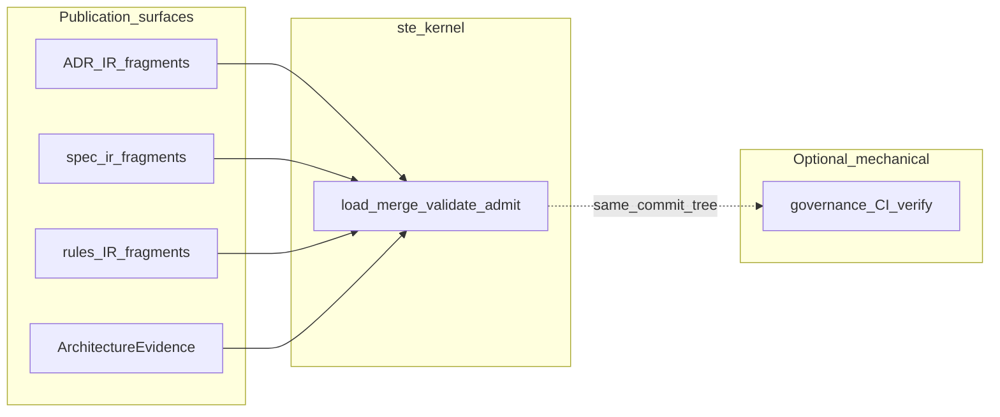

# STE Architecture  
## Canonical System Architecture of the System of Thought Engineering  
### System of Thought Engineering (STE)

## Publication Notice

This architecture description references several detailed protocol and schema documents that exist in the working repository but are not included in the v1.0.0 public release:

**RECON Protocol Documents:**
- `STE-RECON-Protocol.md` — Comprehensive RECON phase definitions and procedures
- `RECON-Extraction-Rules.md` — Artifact extraction and parsing rules

**AI-DOC Technical Specifications:**
- `STE-AI-DOC-Schema.md` — Schema definition for AI-DOC artifacts
- `STE-AI-DOC-Sliceability-Protocol.md` — Sliceability rules for AI-DOC artifacts
- `STE-AI-DOC-Invariants.md` — AI-DOC-specific invariant constraints

**Prime and system invariants (doctrine):** Enumerated constraints (PRIME-1–5, SYS-1–16) appear in [`invariants/STE-Invariant-Hierarchy.md`](../invariants/STE-Invariant-Hierarchy.md) (section 2, Layers 1–2). Standalone `STE-Prime-Invariant.md` and `STE-System-Invariants.md` files are not included in the v1.0.0 public release bundle for this repository.

The architectural principles and operational concepts for RECON and AI-DOC are described in this document. Detailed implementation protocols may be published in future releases.

**Technology References:** All technology references throughout this document (cloud providers, CI systems, platforms) are informative examples only and are not required for conformance.

**Integration plane:** For the converged **multi-repository** model (Architecture IR,
`ste-kernel` boot and admission, `ArchitectureEvidence` handoff), use
[`STE-Integration-Model.md`](./STE-Integration-Model.md),
[`../execution/STE-Kernel-Execution-Model.md`](../execution/STE-Kernel-Execution-Model.md),
and [`STE-System-Components-and-Responsibilities.md`](./STE-System-Components-and-Responsibilities.md). The
**`ste-runtime` repository** implements RECON/RSS-style tooling and evidence
production; it **does not** by itself realize the organizational **Fabric /
Gateway / Trust Registry** services described later in this document unless a
separate deployment explicitly provides them.

---

# 1. Purpose of This Document
This file defines the **canonical system architecture** of STE — how components connect, data flows, and governance is enforced across the system.

This document serves as:

- **AI-DOC for STE itself** — Agents load this to understand STE when evolving the framework  
- **System reference** — Canonical source for component relationships and integration points  
- **Architectural truth** — Single document showing how all pieces connect  

This file must be updated whenever changes affect system component relationships, data flows, governance surfaces, or integration points (per SYS-10).

This file is canonical and must remain synchronized with:

- [`STE-Manifest.md`](./STE-Manifest.md) (STE-Manifest)  
- [`STE-Foundations.md`](./STE-Foundations.md) (STE-Foundations)  
- **STE-Prime-Invariant** and **STE-System-Invariants (SYS-1 through SYS-16)** — enumerated in [`STE-Invariant-Hierarchy.md`](../invariants/STE-Invariant-Hierarchy.md); standalone prime/system invariant files are not published in this repository (see Publication Notice)  
- [`STE-Cognitive-Execution-Model.md`](../execution/STE-Cognitive-Execution-Model.md) (STE-Cognitive-Execution-Model)  
- [`STE-Invariant-Hierarchy.md`](../invariants/STE-Invariant-Hierarchy.md) (STE-Invariant-Hierarchy)  
- **STE-AI-DOC-Schema**, **STE-AI-DOC-Sliceability-Protocol**, **STE-AI-DOC-Invariants** — not published as standalone files in this repository (see Publication Notice); concepts are reflected in this document and related architecture prose  

---

# 2. The Operating System Analogy

STE operates as an **AI Operating System** — a governance layer that transforms raw LLM execution into bounded, deterministic cognition.

## 2.1 OS Component Mapping

| OS Component | STE Equivalent | Function |
|--------------|----------------|----------|
| **CPU** | LLM Core | Raw execution engine — executes any instruction without inherent safety |
| **Kernel** | Invariant Hierarchy | Foundational rules that govern what reasoning is allowed |
| **Filesystem** | AI-DOC | Explicit, structured, machine-interpretable truth |
| **System Calls** | Validators | Gates that enforce constraints before operations proceed |
| **Error Handling** | Divergence Taxonomy | Fault classification and controlled interrupts |
| **Runtime** | Cognitive Execution Model | Deterministic lifecycle governing how reasoning occurs |

## 2.2 Why This Mapping Matters

Traditional LLMs execute tokens.  
STE executes a **governed cognitive cycle**.

Without STE:
- LLM performs raw execution  
- No safety boundaries  
- No state awareness  
- Drift accumulates silently  

With STE:
- Kernel loads invariants before reasoning  
- AI-DOC provides explicit state  
- Validators enforce constraints  
- Divergence halts unsafe operations  
- CEM ensures deterministic execution  

---

# 3. System Overview

STE operates across **two distinct governance boundaries**: workspace development and runtime execution. Both boundaries enforce constraints but through different mechanisms and at different trust levels.

**Scope note (reference repositories):** Diagrams under **runtime execution** (Fabric, Gateway, Trust Registry, and service boxes labeled like **STE RUNTIME**) describe **organizational / production-style deployment patterns**. They are **not** a claim that the public **`ste-runtime` repository** implements every box shown. For the **reference multi-repository integration** path (IR merge, evidence, admission), use the **Integration plane** paragraph in the Publication Notice above and `architecture/STE-Integration-Model.md`.

## 3.1 Workspace Development Boundary

The workspace boundary governs local development, experimentation, and provisional reasoning:

```
┌─────────────────────────────────────────────────────────────────┐
│              WORKSPACE DEVELOPMENT BOUNDARY                     │
│                                                                 │
│   ┌─────────────────────────────────────────────────────────┐   │
│   │                    CURSOR (Governed)                    │   │
│   │  • Rules injection (STE invariants, security)           │   │
│   │  • MCP configuration (domain validators)                │   │
│   │  • Workflow enforcement                                 │   │
│   │  • Context assembly via RSS                             │   │
│   └─────────────────────────────────────────────────────────┘   │
│                              │                                  │
│                              ▼                                  │
│   ┌─────────────────────────────────────────────────────────┐   │
│   │                     LLM (Governed)                      │   │
│   │  • CEM defines execution stages                         │   │
│   │  • Invariants constrain reasoning                       │   │
│   │  • Self-validation against constraints                  │   │
│   └─────────────────────────────────────────────────────────┘   │
│                              │                                  │
│                              ▼                                  │
│   ┌─────────────────────────────────────────────────────────┐   │
│   │                  TOOLCHAIN (Governed)                   │   │
│   │  • Static analysis, unit tests                          │   │
│   │  • MCP domain validators (IAM, AWS, etc.)               │   │
│   │  • DAST, Playwright                                     │   │
│   │  • Automated enforcement                                │   │
│   └─────────────────────────────────────────────────────────┘   │
│                              │                                  │
│                              ▼                                  │
│   ┌─────────────────────────────────────────────────────────┐   │
│   │                    HUMAN (Oversight)                    │   │
│   │  • Final approval gate                                  │   │
│   │  • Override authority                                   │   │
│   │  • Invariant evolution                                  │   │
│   └─────────────────────────────────────────────────────────┘   │
│                                                                 │
└─────────────────────────────────────────────────────────────────┘
```

**View (informative):** The ASCII diagram above emphasizes **workspace cognition**
(IDE, CEM, toolchain, human). The same workspace also participates in the **STE
integration plane**: **adapter publication surfaces** (ADR, spec, and rules **IR
fragments**, plus **`ArchitectureEvidence`** from `ste-runtime`) feed **`ste-kernel`**
for deterministic **load → merge → validate → admit**—without implying the kernel
**owns** rule semantics (those remain with `ste-rules-library` / **rules-engine**;
see `architecture/STE-Integration-Model.md`, `execution/STE-Kernel-Execution-Model.md`,
and `architecture/STE-Worked-Example-Walkthrough.md`). An optional **governance**
verify (for example attestation reconstruction in **CI**) is **mechanical** at the
merge path and **composes** with kernel integration; it is not a sixth adapter unless
published in `ste-kernel/contracts/adapter-contracts.yaml` with merge policy.

**Integration plane slice (informative diagram):**



**Enforcement Characteristics:**
- **Soft enforcement** (LLM instruction-following) surrounded by **hard enforcement** (configuration, validation, human approval)
- Operates on **provisional state** (uncommitted changes, experimental reasoning)
- Validation occurs **post-reasoning** (toolchain checks output)
- Trust model: Verify after execution

## 3.2 Runtime Execution Boundary

The runtime boundary governs production reasoning with cryptographic enforcement and fail-closed admission control:

```
┌─────────────────────────────────────────────────────────────────┐
│              RUNTIME EXECUTION BOUNDARY                         │
│          (Cryptographic Enforcement, Fail-Closed)               │
│                                                                 │
│   ┌─────────────────┐                                           │
│   │ Agent/Workspace │                                           │
│   │  (Task Request) │                                           │
│   └────────┬────────┘                                           │
│            │                                                    │
│            ▼                                                    │
│   ┌─────────────────────────────────────────────────────────┐   │
│   │              STE RUNTIME                                │   │
│   │  • Assembles Minimally Viable Context (MVC)             │   │
│   │  • Constructs Context Bundle (scope, environment)       │   │
│   │  • Requests attestation from Fabric                     │   │
│   │  • Constructs Eligibility Proposal                      │   │
│   │  • Transports attestation verbatim (no modification)    │   │
│   └────────────────────┬────────────────────────────────────┘   │
│                        │ (requests attestation)                │
│                        ▼                                        │
│   ┌─────────────────────────────────────────────────────────┐   │
│   │              AI-DOC FABRIC                              │   │
│   │  **Attestation Authority**                              │   │
│   │  • Resolves canonical semantic state                    │   │
│   │  • Detects conflicts (invariant violations)             │   │
│   │  • Signs attestation cryptographically                  │   │
│   │  • Returns signed attestation to Runtime                │   │
│   └────────────────────┬────────────────────────────────────┘   │
│                        │ (signed attestation)                  │
│                        ▼                                        │
│   ┌─────────────────────────────────────────────────────────┐   │
│   │              STE RUNTIME                                │   │
│   │  • Receives signed attestation                          │   │
│   │  • Constructs Eligibility Proposal                      │   │
│   │  • Submits to Gateway (no attestation modification)     │   │
│   └────────────────────┬────────────────────────────────────┘   │
│                        │ (Eligibility Proposal)                │
│                        ▼                                        │
│   ┌─────────────────────────────────────────────────────────┐   │
│   │              STE GATEWAY                                │   │
│   │  **Enforcement Authority**                              │   │
│   │  • Verifies attestation signature (Trust Registry)      │   │
│   │  • Validates scope, environment, TTL                    │   │
│   │  • Checks conflict_status field                         │   │
│   │  • Enforces binary decision: ALLOW or DENY              │   │
│   │  • No reasoning, no semantic validation                 │   │
│   └────────────────────┬────────────────────────────────────┘   │
│                        │                                        │
│                        ├─── DENY ───► Execution Blocked        │
│                        │                                        │
│                        └─── ALLOW ───┐                          │
│                                       │ (decision + payload)   │
│                                       ▼                         │
│   ┌─────────────────────────────────────────────────────────┐   │
│   │              MODEL PROVIDER                             │   │
│   │  **Execution Authority**                                │   │
│   │  • Receives context only after Gateway ALLOW            │   │
│   │  • Executes reasoning with provided context             │   │
│   │  • No access to Fabric or canonical state directly      │   │
│   └─────────────────────────────────────────────────────────┘   │
│                                                                 │
└─────────────────────────────────────────────────────────────────┘
```

**Enforcement Characteristics:**
- **Cryptographic enforcement** (signatures, fail-closed gates)
- Operates on **canonical state** (signed, verified, authoritative)
- Validation occurs **pre-reasoning** (Gateway blocks before LLM access)
- Trust model: Verify before execution
- **Authority separation**: Fabric signs, Gateway verifies, Runtime transports, Model Provider executes

**Key Architectural Principles** (from ADR-028):
- **Knowledge flows forward only**: No backward queries from Gateway to Fabric
- **No semantic reasoning at Gateway**: Gateway verifies structure, not content
- **Attestations are non-negotiable**: Missing or invalid attestation = immediate DENY
- **Runtime never signs**: Only Fabric has attestation authority
- **Gateway never reasons**: Only Fabric performs semantic validation

## 3.3 Boundary Comparison

| Aspect | Workspace Boundary | Runtime Boundary |
|--------|-------------------|------------------|
| **State Type** | Provisional, experimental | Canonical, authoritative |
| **Enforcement** | Soft (LLM) + Hard (tools/human) | Cryptographic (Gateway/Fabric) |
| **Validation** | Post-reasoning | Pre-reasoning (admission control) |
| **Trust Model** | Verify after execution | Verify before execution |
| **Failure Mode** | Human catches errors | Gateway blocks execution |
| **Authority** | Human approval | Cryptographic signatures |
| **Use Case** | Development, local reasoning | Production, organizational decisions |
| **Canonization Path** | Local commits only | Commit → Version Control → CI/CD (SAST/DAST/review) → Merge → RECON → Fabric → Gateway |

Both boundaries enforce STE invariants but at different trust levels and for different operational contexts.

---

## 3.4 State Transition: Provisional to Canonical

Workspace state becomes canonical state through organizational version control and validation processes. RECON operates on canonical state only.

### Canonization Flow

```
┌─────────────────────────────────────────────────────────────┐
│ 1. WORKSPACE BOUNDARY (Provisional State)                  │
│    • Developer + STE-governed tooling                       │
│    • Local feature branch                                   │
│    • Fast iteration with soft enforcement                   │
└──────────────────┬──────────────────────────────────────────┘
                   │ Developer commits and pushes changes
                   ▼
┌─────────────────────────────────────────────────────────────┐
│ 2. VERSION CONTROL (Organizational Boundary)               │
│    • Push to remote repository                              │
│    • Branch protection policies                             │
│    • Audit trail of all changes                             │
└──────────────────┬──────────────────────────────────────────┘
                   │ CI/CD pipeline triggers
                   ▼
┌─────────────────────────────────────────────────────────────┐
│ 3. CI/CD SECURITY GATES (Hard Enforcement)                 │
│    • Static analysis (SAST)                                 │
│    • Dynamic analysis (DAST)                                │
│    • Dependency scanning                                    │
│    • Secret scanning                                        │
│    • Unit and integration tests                             │
│    • Code review and approval                               │
│    • Merge authorization                                    │
│    └─ BLOCKS merge if security gates fail                   │
└──────────────────┬──────────────────────────────────────────┘
                   │ Only after ALL gates pass
                   ▼
┌─────────────────────────────────────────────────────────────┐
│ 4. CANONICAL STATE (Target Branch)                         │
│    • Security-vetted artifacts                              │
│    • Organizational source of truth                         │
│    • Authoritative state for RECON                          │
└──────────────────┬──────────────────────────────────────────┘
                   │ RECON operates on this state
                   ▼
┌─────────────────────────────────────────────────────────────┐
│ 5. AI-DOC (Semantic Documentation)                         │
│    • RECON extracts from canonical artifacts                │
│    • Populates 13-domain structure                          │
│    • Builds semantic graph                                  │
└──────────────────┬──────────────────────────────────────────┘
                   │ Fabric attests to this state
                   ▼
┌─────────────────────────────────────────────────────────────┐
│ 6. RUNTIME BOUNDARY (Cryptographic Enforcement)            │
│    • Fabric signs attestations                              │
│    • Gateway verifies cryptographically                     │
│    • Model Provider executes with verified context          │
└─────────────────────────────────────────────────────────────┘
```

### Security Properties

**Workspace changes do NOT directly reach production reasoning.**

Changes made in workspace mode must transit through:
1. Version control (auditability)
2. CI/CD security gates (organizational validation)
3. Merge approval (authorization)
4. RECON extraction (semantic documentation)
5. Fabric attestation (canonical state signing)
6. Gateway verification (cryptographic enforcement)

**RECON operates on post-CI/CD canonical state only.**

RECON extracts semantic state from artifacts that have passed organizational security validation. RECON does not perform security scanning; it documents canonical state as it exists after security vetting.

**Organizational Responsibility:**

Organizations must ensure robust CI/CD security gates exist before adopting STE. The architecture assumes canonical state (target branch) is security-vetted through organizational processes.

**CI/CD implementation examples:**
- GitHub Actions with CodeQL, Dependabot, code review workflows
- GitLab CI with SAST/DAST scanners, merge request approvals
- Jenkins with SonarQube, OWASP ZAP, approval gates
- Azure DevOps with Defender for DevOps, pipeline approvals
- AWS CodePipeline with CodeGuru, manual approval actions

See Section 3.5 for multi-environment deployment patterns and SECURITY.md for trust assumptions.

---

## 3.5 Multi-Environment Deployment Model

Organizations typically maintain multiple environments (nonprod, production) with separate canonical states. STE supports this through a single Fabric instance that resolves environment-specific canonical state based on attestation requests.

### Single Fabric Control Plane, Multi-Key Data Planes

**Recommended Architecture:**

```
┌─────────────────────────────────────────────────────────────┐
│         FABRIC CONTROL PLANE (Single Service)               │
│                                                             │
│  Request Router:                                           │
│  • Receives: {scope, environment, requested_by}            │
│  • Routes to appropriate data plane                        │
│  • Returns signed attestation                              │
│                                                             │
├─────────────────────────────────────────────────────────────┤
│                                                             │
│  ┌─────────────────────┐       ┌─────────────────────┐     │
│  │ NONPROD DATA PLANE  │       │  PROD DATA PLANE    │     │
│  │                     │       │                     │     │
│  │ • Signing Key:      │       │ • Signing Key:      │     │
│  │   (nonprod)         │       │   (production)      │     │
│  │ • Auth Scope:       │       │ • Auth Scope:       │     │
│  │   nonprod role      │       │   production role   │     │
│  │ • Storage:          │       │ • Storage:          │     │
│  │   nonprod bucket    │       │   production bucket │     │
│  │ • Branch:           │       │ • Branch:           │     │
│  │   develop           │       │   master            │     │
│  │ • AI-DOC: nonprod   │       │ • AI-DOC: prod      │     │
│  └─────────────────────┘       └─────────────────────┘     │
│           │                             │                   │
│           ▼                             ▼                   │
│    Signs with NONPROD_KEY        Signs with PROD_KEY       │
│                                                             │
└─────────────────────────────────────────────────────────────┘
```

**Non-normative implementation examples (specific platforms not required):**

**AWS:**
- Key Service: AWS KMS (separate key per environment)
- Authorization: IAM roles with kms:Sign permission
- Storage: S3 buckets per environment
- Audit: CloudTrail logs all signing operations

**Azure:**
- Key Service: Azure Key Vault with managed HSM
- Authorization: Managed Identities with key signing permission
- Storage: Blob Storage containers per environment
- Audit: Azure Monitor logs all key operations

**GCP:**
- Key Service: Cloud KMS (separate key per environment)
- Authorization: Service Accounts with cloudkms.cryptoKeyVersions.useToSign
- Storage: Cloud Storage buckets per environment
- Audit: Cloud Audit Logs track all signing operations

**On-Premises:**
- Key Service: Hardware Security Module (Thales, Gemalto, etc.)
- Authorization: LDAP/AD groups with signing permissions
- Storage: Object storage per environment
- Audit: HSM audit logs and SIEM integration

### Attestation Request Flow

1. Runtime requests attestation with (scope, environment)
2. Fabric control plane extracts environment parameter
3. Fabric routes to appropriate data plane:
   - `environment: "nonprod"` → nonprod data plane
   - `environment: "production"` → production data plane
4. Data plane resolves canonical state:
   - Reads from environment-specific branch/storage/config
   - Detects conflicts within environment state
5. Data plane signs with environment-specific key (via key management service)
6. Fabric returns signed attestation to Runtime

### Multi-Environment Deployment Flow

**Development → Nonprod → Production:**

```
Feature Branch (workspace)
     │
     ├─ CI/CD gates (nonprod validation)
     ▼
Develop Branch (nonprod canonical)
     │
     ├─ RECON extracts → Nonprod AI-DOC
     │
     ├─ Fabric nonprod data plane attests
     │    (signs with NONPROD_KEY, environment: "nonprod")
     │
     ├─ Nonprod Gateway enforces
     │
     ├─ Nonprod testing/validation
     │
     ├─ Promotion approval gates
     ▼
Master Branch (production canonical)
     │
     ├─ RECON extracts → Production AI-DOC
     │
     ├─ Fabric production data plane attests
     │    (signs with PROD_KEY, environment: "production")
     │
     ├─ Production Gateway enforces
     │
     └─ Production reasoning
```

### Environment Isolation Properties

**Cryptographic isolation:**
- Separate signing keys per environment (managed by key service)
- Nonprod key compromise cannot forge production attestations
- Authorization policies prevent cross-environment data access
- Trust Registry maps signing identities to authorized environments

**Separate canonical states:**
- Each environment has its own branch (develop, master)
- Each environment has its own storage (separate buckets/containers)
- RECON runs independently per environment
- Configuration and invariants may differ per environment

**Environment-scoped attestations:**
- Attestations include explicit `environment` field
- Gateway verifies signature with environment-specific public key
- Gateway checks signing authority authorized for claimed environment
- Nonprod attestation cannot be used in production (AUTHORITY_MISMATCH)

### Gateway Multi-Environment Verification

Gateway verification includes:

1. **Signature verification:** Verify cryptographic signature with public key
2. **Authority lookup:** Query Trust Registry for signing authority
3. **Authority-environment check:** Verify authority authorized for claimed environment
4. **Environment field check:** Verify attestation environment matches claimed environment
5. **Temporal validity:** Verify current_time ≤ expires_at

**Example denial scenarios:**

```
Scenario 1: Nonprod key signs production attestation
  - Attestation environment: "production"
  - Signing identity: fabric-nonprod-signing-authority
  - Trust Registry: nonprod authority authorized for ["nonprod"] only
  - Result: DENY (AUTHORITY_MISMATCH)

Scenario 2: Valid nonprod attestation submitted to production Gateway
  - Attestation environment: "nonprod"
  - Claimed environment: "production"
  - Result: DENY (ENVIRONMENT_MISMATCH)
```

### Operational Benefits

**Single Fabric service:**
- One deployment to manage
- Unified routing and coordination logic
- Shared infrastructure (load balancers, DNS, monitoring)

**Separate keys per environment:**
- Cryptographic blast radius containment
- Independent key rotation per environment
- Authorization policy isolation
- Different security posture per environment

This architecture combines operational simplicity (single service) with cryptographic isolation (separate keys).

See ADR-028 (Fabric-Gateway Authority Boundaries) for attestation verification requirements.

---

# 4. Component Model

**Note on Directory Paths**: The "Location" columns in the following tables show example directory structures (e.g., `/.ste/core/`, `/.ste/invariants/`) to illustrate how components might be organized in an implementation. These paths are **illustrative, not normative**. Implementations may use different directory structures, naming conventions, or storage mechanisms as long as they maintain the architectural relationships and constraints defined in this specification.

## 4.1 Framework Components (The Kernel)

| Component | Location | Function |
|-----------|----------|----------|
| **STE-Prime-Invariant** | `/.ste/core/` | Foundational axioms (PRIME-1 through PRIME-5) |
| **STE-System-Invariants** | `/.ste/core/` | System-wide constraints (SYS-1 through SYS-16) |
| **STE-Invariant-Hierarchy** | `/.ste/core/` | Layer ordering and precedence rules |
| **STE-Cognitive-Execution-Model** | `/.ste/core/` | Execution lifecycle (9 stages) |
| **STE-Divergence-Taxonomy** | `/.ste/core/` | Fault classification system |
| **STE-Manifest** | `/.ste/core/` | Reference architecture and required components |
| **STE-Foundations** | `/.ste/core/` | Conceptual philosophy and principles |
| **STE-Architecture** | `/.ste/core/` | This document — system architecture |
| **STE-AI-DOC-Schema** | `/.ste/core/` | Canonical schema for AI-DOC (13 domains) |

## 4.2 Invariant Components

| Component | Location | Function |
|-----------|----------|----------|
| **STE-Invariant-Template** | `/.ste/invariants/` | Schema for invariant files |
| **Domain Invariants** | `/.ste/invariants/domain/` | Domain-specific constraints |
| **STE-AI-DOC-Invariants** | `/.ste/invariants/domain/` | AI-DOC graph and sliceability constraints (DOC-1 through DOC-15) |
| **Artifact Invariants** | `/.ste/invariants/artifact/` | Artifact structure constraints |
| **Meta Invariants** | `/.ste/invariants/meta/` | Framework evolution constraints |

## 4.3 Protocol Components

| Component | Location | Function |
|-----------|----------|----------|
| **STE-RECON-Protocol** | `/.ste/protocols/` | Bootstrap process with 13-domain extraction |
| **STE-Task-Analysis-Protocol** | `/.ste/protocols/` | Entry point discovery for RSS traversal |
| **STE-AI-DOC-Sliceability-Protocol** | `/.ste/protocols/` | Graph-native traversal for RSS |
| **STE-Incremental-RECON-Protocol** | `/.ste/protocols/` | Incremental AI-DOC updates (O(changed files)) |
| **STE-Lazy-Population-Protocol** | `/.ste/protocols/` | Progressive AI-DOC population (Phase 0-3) |
| **STE-Hybrid-Context-Assembly-Protocol** | `/.ste/protocols/` | Graceful degradation (Tier 1-3 context) |
| **STE-AI-DOC-Merge-Protocol** | `/.ste/protocols/` | AI-DOC merge conflict resolution |
| **STE-Plan-Validation-Protocol** | `/.ste/protocols/` | Pre-execution validation for multi-artifact changes |
| **STE-Invariant-Lifecycle-Protocol** | `/.ste/protocols/` | Invariant creation/modification/deprecation |
| **STE-Divergence-Communication-Protocol** | `/.ste/protocols/` | Agent-user interaction during divergence |
| **STE-Documentation-Checkpoint-Protocol** | `/.ste/protocols/` | Pre/post-task validation |
| **STE-AI-DOC-Update-Workflow-Protocol** | `/.ste/protocols/` | State mutation workflow |
| **STE-Contributor-Workflow** | `/.ste/protocols/` | Framework modification workflow |

## 4.4 Validation Components

| Component | Location | Function |
|-----------|----------|----------|
| **Framework Validator** | `/.ste/validation/` | Verifies framework structure, inventory, and reference resolution |
| **Documentation Validator** | `/.ste/validation/` | Verifies AI-DOC integrity |
| **AI-DOC Graph Validator** | `/.ste/validation/` | Verifies sliceability, relationships, and graph integrity |
| **AI-DOC Currency Validator** | `/.ste/validation/` | Verifies AI-DOC currency (staleness detection) |
| **Incremental RECON Validator** | `/.ste/validation/` | Verifies incremental update correctness (equivalence, complexity) |
| **Lazy Population Validator** | `/.ste/validation/` | Verifies lazy population phases and equivalence |
| **Hybrid Context Validator** | `/.ste/validation/` | Verifies hybrid context compliance (confidence, notification) |
| **Task Analysis Validator** | `/.ste/validation/` | Verifies task decomposition and entry point discovery |
| **Domain Validator** | `/.ste/validation/` | Verifies domain constraint compliance |
| **Plan Validator** | Implicit | Verifies multi-artifact plans before execution (SYS-15, SYS-16) |
| **RECON Validator** | Implicit | Verifies RECON completion |
| **Cognitive Validator** | Implicit | Verifies reasoning constraint compliance |

## 4.5 State Components

| Component | Location | Function |
|-----------|----------|----------|
| **AI-DOC** | `/.ste/state/` | Explicit documentation-state (cognitive filesystem) |
| **RECON Artifacts** | `/.ste/state/recon/` | Bootstrap phase outputs |
| **HUMAN-DOC** | `/.ste/human/` | Human-readable derived documentation |

### AI-DOC 13-Domain Structure

AI-DOC is organized into 13 domains per STE-AI-DOC-Schema:

| Domain | Directory | Purpose |
|--------|-----------|---------|
| Project Identity | `project/` | Runtime, language, framework, versions |
| Entry Points | `entrypoints/` | Service boundaries, main entry |
| API Surface | `api/` | Endpoints, contracts, schemas |
| Data Models | `data/` | Entities, DTOs, queries |
| Internal Dependencies | `graph/internal/` | Module graph, layers |
| External Integrations | `graph/external/` | Outbound APIs, queues, cloud |
| Consumers | `graph/consumers/` | Downstream services |
| Configuration | `config/` | Environment, secrets |
| Error Taxonomy | `errors/` | Exceptions, error codes |
| Testing Landscape | `testing/` | Frameworks, coverage |
| Business Domain | `domain/` | Entities, rules, glossary |
| Code Conventions | `conventions/` | Patterns, naming |
| Observability | `observability/` | Logging, metrics, tracing |

All AI-DOC items include `_slice` metadata for graph traversal per STE-AI-DOC-Sliceability-Protocol.

## 4.6 Runtime Components

| Component | Description | Function |
|-----------|-------------|----------|
| **RSS (Runtime State-Slicing)** | Graph traversal engine | Discovers entry points via Task Analysis, assembles task-relevant AI-DOC slices |
| **Cursor** | IDE/agent tooling | Governed execution environment |
| **LLM** | Language model | Reasoning engine operating under CEM |
| **MCP Servers** | Domain validators | Hard enforcement of domain rules |
| **Toolchain** | Static analysis, tests, DAST | Automated validation stack |

### RSS (Runtime State-Slicing)

RSS is the mechanism that transforms comprehensive AI-DOC into bounded, task-relevant context:

**Purpose:**
- Prevent context window overflow for large projects
- Ensure only relevant state enters LLM reasoning
- Enable deterministic graph traversal vs. probabilistic search

**Operations:**
- `lookup(domain, id)` — Direct item retrieval
- `dependencies(item, depth)` — Forward traversal (what does this depend on?)
- `dependents(item, depth)` — Backward traversal (what depends on this?)
- `blast_radius(item, depth)` — Bidirectional traversal (full impact surface)
- `by_tag(tag)` — Cross-domain query
- `assemble_context(task)` — Main context assembly function

**Integration:**
- Invoked at CEM Stage 2 (State Loading)
- Traverses `_slice` metadata per STE-AI-DOC-Sliceability-Protocol
- Outputs bounded context for LLM consumption

RSS ensures AI-DOC size and context size are decoupled.

### Task Analysis Integration

Task Analysis bridges natural language requests and deterministic RSS traversal:

**Input:** Natural language task request  
**Output:** Structured entry points (domain, type, id tuples)

**Process:**
1. Decompose task into structured components
2. Resolve to AI-DOC domains
3. Discover candidates via index search
4. Rank candidates by multi-factor scoring
5. Select entry points (auto/assisted/clarification)
6. Feed to RSS for graph traversal

**Key Insight:** Accept bounded probabilism at entry point discovery; achieve determinism at graph traversal.

Task Analysis operates on structured AI-DOC indexes, not raw code embeddings, ensuring bounded search space and explicit scoring.

## 4.7 Runtime Execution Services

These services provide cryptographic enforcement and admission control for production reasoning:

| Component | Type | Function |
|-----------|------|----------|
| **AI-DOC Fabric** | Attestation Service | Canonical semantic state authority, conflict detection, cryptographic signing |
| **STE Gateway** | Enforcement Service | Eligibility verification, admission control, fail-closed enforcement |
| **STE Runtime** | Context Service | MVC assembly, attestation transport, proposal construction |
| **Trust Registry** | Verification Service | Public key distribution, signature verification, authority management |

### AI-DOC Fabric (Attestation Authority)

**Responsibilities:**
- Resolve canonical semantic state (invariants, AI-DOC, configuration)
- Detect conflicts between invariants or within semantic state
- Sign attestations cryptographically with organizational authority
- Return signed attestations containing scope, environment, conflict_status, timestamps

**Authority:**
- ONLY component that can sign attestations
- Canonical source of truth for semantic state
- Conflict detection is authoritative (Gateway trusts Fabric's determination)

**Prohibited:**
- Cannot execute operations
- Cannot access Model Providers directly
- Cannot modify Runtime proposals

**Data Structures:**
- **Fabric Attestation** (signed):
  - `scope` (what reasoning applies to)
  - `environment` (prod, staging, workspace)
  - `conflict_status` (none, detected)
  - `issued_at`, `expires_at` (temporal validity)
  - `signature` (cryptographic binding)

### STE Gateway (Enforcement Authority)

**Responsibilities:**
- Verify attestation signatures via Trust Registry
- Validate attestation structure (required fields, formats)
- Check temporal validity (current_time ≤ expires_at)
- Enforce binary eligibility decision (ALLOW or DENY)
- Return decision with category (if DENY)

**Authority:**
- ONLY component that grants Model Provider access
- Fail-closed enforcement (missing/invalid attestation = DENY)
- No override mechanism (attestations are non-negotiable)

**Prohibited:**
- Cannot query Fabric for canonical state
- Cannot parse or reason about invariant content (structure-only validation)
- Cannot recompute conflict_status (trusts Fabric determination)
- Cannot fill gaps in attestations (no defaults, no inference)
- Cannot cache attestations for reuse

**Enforcement Rules:**
- Invalid signature → DENY (SIGNATURE_INVALID)
- Expired attestation → DENY (ATTESTATION_EXPIRED)
- Conflict detected by Fabric → DENY (INVARIANT_CONFLICT)
- Scope mismatch → DENY (SCOPE_MISMATCH)
- Environment mismatch → DENY (ENVIRONMENT_MISMATCH)
- Missing required fields → DENY (CONTEXT_INCOMPLETE)

### STE Runtime (Context Assembly & Transport)

**Responsibilities:**
- Assemble Minimally Viable Context (MVC) via RSS
- Construct Context Bundle (scope, environment metadata)
- Request attestation from Fabric for specific scope/environment
- Receive signed attestation from Fabric
- Construct Eligibility Proposal (context + attestation)
- Transport attestation to Gateway verbatim (no modification)

**Authority:**
- Context assembly and packaging
- Determines what gets submitted for eligibility evaluation
- Transport layer only (not decision-making layer)

**Prohibited:**
- Cannot sign attestations (only Fabric)
- Cannot modify Fabric attestations
- Cannot override Gateway decisions
- Cannot perform semantic normalization or conflict reconciliation
- Cannot substitute for Fabric authority

**Data Structures:**
- **Context Bundle**: MVC + scope + environment metadata
- **Eligibility Proposal**: Context Bundle + Fabric Attestation

### Trust Registry (Verification Service)

**Responsibilities:**
- Distribute public keys for signature verification
- Maintain list of authorized signing authorities
- Map signing identities to authorized environments
- Enable Gateway to verify Fabric attestation signatures
- Manage key lifecycle (issuance, rotation, revocation)

**Authority:**
- Defines who can sign attestations for which environments
- Provides cryptographic verification foundation
- Enforces environment-specific signing authority

**Data Structures:**

```yaml
Signing Authority (abstract):
  identity: <authority identifier>
  key_reference: <key service reference>
  authorized_environments: [list of environment strings]
  public_key: <base64-encoded public key>
  valid_from: <timestamp>
  valid_until: <timestamp>
  revoked: <boolean>
```

**Multi-Environment Key Management:**

Organizations MAY use separate signing keys per environment for stronger cryptographic isolation. In this model:

- Single Fabric control plane coordinates multiple data planes
- Each data plane uses environment-specific signing key (managed by key service)
- Each data plane has environment-specific authorization scope
- Each data plane accesses environment-specific storage
- Trust Registry maps signing identities to authorized environments
- Gateway verifies both signature validity AND signing authority

**Benefits of multi-key architecture:**
- Blast radius containment (nonprod key compromise doesn't affect prod)
- Cryptographic environment enforcement (not just field validation)
- Authorization policy isolation per environment
- Independent key rotation per environment
- Operational simplicity (single Fabric service)

**Example Trust Registry entries:**

**AWS implementation:**
```yaml
Nonprod Authority:
  identity: "arn:aws:iam::ACCOUNT:role/fabric-nonprod-signing-role"
  key_reference: "arn:aws:kms:REGION:ACCOUNT:key/nonprod-key-id"
  authorized_environments: ["nonprod", "develop", "staging"]
  public_key: "base64-encoded-key..."
  
Production Authority:
  identity: "arn:aws:iam::ACCOUNT:role/fabric-prod-signing-role"
  key_reference: "arn:aws:kms:REGION:ACCOUNT:key/prod-key-id"
  authorized_environments: ["production"]
  public_key: "base64-encoded-key..."
```

**Azure implementation:**
```yaml
Nonprod Authority:
  identity: "/subscriptions/SUB/resourceGroups/RG/providers/Microsoft.ManagedIdentity/userAssignedIdentities/fabric-nonprod"
  key_reference: "https://keyvault.vault.azure.net/keys/fabric-nonprod/version"
  authorized_environments: ["nonprod", "develop", "staging"]
  public_key: "base64-encoded-key..."

Production Authority:
  identity: "/subscriptions/SUB/resourceGroups/RG/providers/Microsoft.ManagedIdentity/userAssignedIdentities/fabric-prod"
  key_reference: "https://keyvault.vault.azure.net/keys/fabric-prod/version"
  authorized_environments: ["production"]
  public_key: "base64-encoded-key..."
```

**Gateway verification with multi-key model:**

1. Verify signature with signing authority's public key
2. Query Trust Registry for signing authority details
3. Check signing authority authorized for claimed environment
4. Check attestation environment field matches claimed environment
5. Verify temporal validity (expires_at)

This provides defense-in-depth: even if an attacker forges an attestation with the correct environment field, they must use the correct signing key (verified via Trust Registry and authorized_environments check) or Gateway will deny with AUTHORITY_MISMATCH.

### Knowledge Flow Model

**Forward-Only Flow** (ADR-028, INV-FLOW-1):
```
Agent/Workspace
    → Runtime (assembles MVC, constructs bundle)
    → Fabric (resolves state, detects conflicts, signs)
    → Runtime (transports attestation)
    → Gateway (verifies signature, validates structure)
    → Model Provider (executes reasoning)
```

**Prohibited Flows:**
- Gateway → Fabric (no backward queries for canonical state)
- Gateway → Runtime (no canonical state discovery)
- Runtime → Fabric (no canonical determinations by Runtime)
- Model Provider → Fabric (no direct access to canonical state)

**Rationale:** Backward flow reintroduces discovery, violates verifier-only posture, creates availability coupling.

---

# 5. Data Flows

## 5.1 Bootstrap Flow (RECON)

```
┌─────────────────┐
│ Project         │
│ Artifacts       │
│ (code, config,  │
│  schemas, etc.) │
└────────┬────────┘
         │
         ▼
┌─────────────────────────────────────┐
│            RECON (6 phases)         │
│                                     │
│ 1. Discovery    - Enumerate files   │
│ 2. Extraction   - Parse structures  │
│ 3. Inference    - Infer invariants  │
│ 4. Normalization- Align to schema   │
│ 5. Population   - Fill 13 domains   │
│ 6. Divergence   - Map inconsistency │
└────────────────┬────────────────────┘
                 │
                 ▼
┌─────────────────────────────────────┐
│      AI-DOC (13 Domains)            │
│                                     │
│ ┌─────────┐ ┌─────────┐ ┌────────┐  │
│ │ Project │ │  API    │ │  Data  │  │
│ │Identity │ │ Surface │ │ Models │  │
│ └─────────┘ └─────────┘ └────────┘  │
│ ┌─────────┐ ┌─────────┐ ┌────────┐  │
│ │Internal │ │External │ │Consum- │  │
│ │  Deps   │ │Integrat.│ │  ers   │  │
│ └─────────┘ └─────────┘ └────────┘  │
│ ┌─────────┐ ┌─────────┐ ┌────────┐  │
│ │ Config  │ │ Errors  │ │Testing │  │
│ └─────────┘ └─────────┘ └────────┘  │
│ ┌─────────┐ ┌─────────┐ ┌────────┐  │
│ │Business │ │ Code    │ │Observ- │  │
│ │ Domain  │ │ Conv.   │ │ability │  │
│ └─────────┘ └─────────┘ └────────┘  │
│                                     │
│ All items include _slice metadata   │
│ for RSS graph traversal             │
└─────────────────────────────────────┘
```

## 5.2 Workspace Reasoning Flow

This flow describes reasoning in workspace/development contexts with post-reasoning validation:

```
┌──────────────────┐
│  Human Request   │
└────────┬─────────┘
         │
         ▼
┌──────────────────┐
│   RSS (Runtime   │
│  State-Slicing)  │◄──── AI-DOC
│                  │
│ Selects relevant │
│ state for task   │
└────────┬─────────┘
         │
         ▼
┌──────────────────┐
│ Context Assembly │
│                  │
│ • Sliced AI-DOC  │
│ • CEM            │
│ • Invariants     │
│ • Task request   │
└────────┬─────────┘
         │
         ▼
┌──────────────────┐
│  LLM Reasoning   │
│  (CEM-governed)  │
│                  │
│ Stages 1-9       │
└────────┬─────────┘
         │
         ▼
┌──────────────────┐
│ Candidate Output │
└────────┬─────────┘
         │
         ▼
┌──────────────────────────────────────────────────────┐
│                 VALIDATION STACK                     │
│                                                      │
│  ┌────────────┐  ┌────────────┐  ┌────────────┐     │
│  │ CEM Self-  │  │  Static    │  │    MCP     │     │
│  │ Validation │  │  Analysis  │  │ Validators │     │
│  └────────────┘  └────────────┘  └────────────┘     │
│                                                      │
│  ┌────────────┐  ┌────────────┐  ┌────────────┐     │
│  │   Unit     │  │   DAST     │  │ Playwright │     │
│  │   Tests    │  │            │  │            │     │
│  └────────────┘  └────────────┘  └────────────┘     │
│                                                      │
└────────────────────────┬─────────────────────────────┘
                         │
                         ▼
              ┌──────────────────┐
              │ Human Validation │
              │   (Approval)     │
              └────────┬─────────┘
                       │
                       ▼
              ┌──────────────────┐
              │ Accepted Output  │
              │                  │
              │ • Updates AI-DOC │
              │   if state-      │
              │   mutating       │
              └──────────────────┘
```

**Characteristics:**
- Validation occurs **after reasoning**
- Soft enforcement (LLM) + Hard enforcement (toolchain + human)
- Suitable for provisional, experimental reasoning

## 5.3 Runtime Execution Flow

This flow describes production reasoning with pre-reasoning cryptographic enforcement:

```
┌──────────────────┐
│ Agent/Workspace  │
│ (Task Request)   │
└────────┬─────────┘
         │
         ▼
┌─────────────────────────────────────┐
│        STE RUNTIME SERVICE          │
│                                     │
│ 1. Assemble MVC via RSS             │
│ 2. Construct Context Bundle         │
│    • Scope (invariant set)          │
│    • Environment (prod/staging)     │
│    • Context payload                │
└────────┬────────────────────────────┘
         │
         │ (Request attestation)
         ▼
┌─────────────────────────────────────┐
│        AI-DOC FABRIC                │
│    (Attestation Authority)          │
│                                     │
│ 1. Resolve canonical semantic state │
│    • Load invariants for scope      │
│    • Load AI-DOC for environment    │
│    • Load configuration             │
│                                     │
│ 2. Detect conflicts                 │
│    • Check invariant consistency    │
│    • Validate semantic coherence    │
│                                     │
│ 3. Sign attestation                 │
│    • scope, environment             │
│    • conflict_status                │
│    • issued_at, expires_at          │
│    • cryptographic signature        │
└────────┬────────────────────────────┘
         │
         │ (Signed Fabric Attestation)
         ▼
┌─────────────────────────────────────┐
│        STE RUNTIME SERVICE          │
│                                     │
│ 1. Receive signed attestation       │
│ 2. Construct Eligibility Proposal   │
│    • Context Bundle                 │
│    • Fabric Attestation (verbatim)  │
│ 3. Submit to Gateway                │
│    (no modification to attestation) │
└────────┬────────────────────────────┘
         │
         │ (Eligibility Proposal)
         ▼
┌─────────────────────────────────────┐
│        STE GATEWAY                  │
│    (Enforcement Authority)          │
│                                     │
│ 1. Verify attestation signature     │
│    (via Trust Registry)             │
│                                     │
│ 2. Validate structure                │
│    • Required fields present        │
│    • scope matches claimed scope    │
│    • environment matches claimed    │
│                                     │
│ 3. Check temporal validity          │
│    • current_time ≤ expires_at      │
│                                     │
│ 4. Check conflict_status            │
│    • "none" → proceed               │
│    • "detected" → DENY              │
│                                     │
│ 5. Enforce eligibility decision     │
└────────┬────────────────────────────┘
         │
         ├─── DENY ───► Execution Blocked
         │              (return category)
         │
         └─── ALLOW ──┐
                      │
                      │ (decision + context payload)
                      ▼
         ┌─────────────────────────────────┐
         │      MODEL PROVIDER             │
         │   (Execution Authority)         │
         │                                 │
         │ 1. Receive context only after   │
         │    Gateway ALLOW                │
         │                                 │
         │ 2. Execute reasoning with       │
         │    provided context             │
         │                                 │
         │ 3. Return reasoning output      │
         └─────────────────────────────────┘
```

**Characteristics:**
- Validation occurs **before reasoning** (admission control)
- Cryptographic enforcement (signatures, fail-closed gates)
- Suitable for production, canonical reasoning
- Missing or invalid attestation = immediate DENY (no fallback)

**Key Differences from Workspace Flow:**
- **Pre-reasoning enforcement** vs post-reasoning validation
- **Cryptographic binding** vs instruction-following
- **Fail-closed admission** vs best-effort compliance
- **Canonical state** vs provisional state
- **No human in loop** vs human approval required

## 5.3 Operational AI-DOC Maintenance Flow

```
┌──────────────────┐
│ Source Code      │
│ Change Detected  │
│ (file watcher,   │
│  git hook, user) │
└────────┬─────────┘
         │
         ▼
┌──────────────────┐
│ Incremental      │
│ RECON Protocol   │
│                  │
│ • Identify       │
│   affected items │
│ • Re-extract     │
│ • Update refs    │
│ • Validate       │
└────────┬─────────┘
         │
         ▼
┌──────────────────┐
│ Currency         │
│ Validator        │
│                  │
│ Check: timestamp │
│ Source < Extract │
└────────┬─────────┘
         │
         ├─── PASS ───► AI-DOC Current
         │
         └─── FAIL ───┐
                      │
                      ▼
           ┌──────────────────┐
           │ Doc-State-       │
           │ Staleness        │
           │ Divergence       │
           └──────────────────┘
```

**Lazy Population Flow (Phase 0-3):**

```
Phase 0 (Minimal RECON)
        │ (~10-30 seconds)
        ▼
┌──────────────────┐
│ Minimal AI-DOC   │
│ • project/       │
│ • entrypoints/   │
│ • api/           │
└────────┬─────────┘
         │
         ├───────► STE Enters Governed Mode
         │
         ▼
Phase 1 (Background)
        │ (Critical path domains)
        ▼
Phase 2 (On-Demand)
        │ (User consent per domain)
        ▼
Phase 3 (Background)
        │ (Remaining domains)
        ▼
Full RECON Equivalence
```

**Hybrid Context Assembly Flow:**

```
┌──────────────────┐
│ Task Request     │
└────────┬─────────┘
         │
         ▼
┌──────────────────┐
│ Task Analysis    │
│ (Entry Points)   │
└────────┬─────────┘
         │
         ▼
┌──────────────────┐
│ Check AI-DOC     │
│ Availability     │
└────────┬─────────┘
         │
         ├─── All Populated ───► Tier 1 (Full RSS, 100% confidence)
         │
         ├─── Some Populated ──► Tier 2 (RSS + Semantic, 70-90% confidence)
         │                          │
         │                          └──► ⚠️ User Notification
         │
         └─── None Populated ───► Tier 3 (Semantic only, 30-60% confidence)
                                     │
                                     └──► 🔴 User Warning + Consent
```

## 5.4 Invariant Lifecycle Flow

```
┌──────────────────┐
│  Gap Identified  │
│  (human/agent)   │
└────────┬─────────┘
         │
         ▼
┌──────────────────┐
│  Agent Loads     │
│  Context         │
│                  │
│ • Architecture   │
│ • Hierarchy      │
│ • Template       │
│ • Existing inv.  │
└────────┬─────────┘
         │
         ▼
┌──────────────────┐
│  Agent Proposes  │
│  Invariant(s)    │
└────────┬─────────┘
         │
         ▼
┌──────────────────┐
│ Human Reviews    │
│ & Approves       │
└────────┬─────────┘
         │
         ▼
┌──────────────────┐
│ Agent Authors    │
│ (using template) │
└────────┬─────────┘
         │
         ▼
┌──────────────────┐
│ Integration      │
│                  │
│ • Inventory      │
│ • Directory      │
│ • Cross-refs     │
│ • Architecture   │
└────────┬─────────┘
         │
         ▼
┌──────────────────┐
│ Validation &     │
│ Reconvergence    │
└──────────────────┘
```

---

# 6. Authority Boundaries

STE's runtime execution architecture enforces strict separation of authorities to prevent single-point failures, eliminate concentrated power, and enable cryptographic verification at each decision point.

This separation is defined in ADR-028 (Fabric-Gateway Authority Boundaries) and ADR-029 (Gateway Enforcement Authority).

## 6.1 The Three Authorities

| Authority | Component | Responsibility | Cryptographic Binding |
|-----------|-----------|----------------|----------------------|
| **Attestation** | AI-DOC Fabric | Sign canonical state claims | Private key signing |
| **Enforcement** | STE Gateway | Verify signatures, enforce eligibility | Public key verification |
| **Execution** | Model Provider, Runtime | Perform operations, transport | None (receives verified context) |

### Why Three Authorities

**Single authority concentration creates failure modes:**
- An entity that can both sign and verify becomes self-authorizing
- An entity that can both reason and enforce can override its own constraints
- An entity that can both attest and execute can bypass verification

**Separation creates architectural resilience:**
- Fabric cannot execute operations (no direct Model Provider access)
- Gateway cannot create attestations (no signing keys)
- Runtime cannot attest to canonical state (no signing authority)
- Model Provider cannot access canonical state directly (gated by Gateway)

## 6.2 Attestation Authority (AI-DOC Fabric)

**What Fabric IS:**
- Canonical semantic state authority (invariants, AI-DOC, configuration)
- Conflict detector (identifies invariant violations and inconsistencies)
- Cryptographic signer (binds attestations with organizational private key)
- Resolution service (determines what canonical state applies to scope/environment)

**What Fabric Can Do:**
- Resolve canonical semantic state for requested scope and environment
- Detect conflicts between invariants or within semantic state
- Sign attestations containing: scope, environment, conflict_status, timestamps
- Maintain history of attestations and conflict resolutions
- Revoke or expire attestations based on policy

**What Fabric CANNOT Do:**
- Execute operations or access Model Providers
- Override Gateway decisions (Gateway is independent verifier)
- Modify Runtime proposals (Runtime constructs, Fabric only attests)
- Bypass enforcement (cannot grant execution directly)
- Sign on behalf of other entities

**Why This Matters:**
- Fabric establishes truth claims but cannot act on them
- Attestation is distinct from execution (claim vs action)
- Compromise of Fabric reveals what was attested, not what was executed
- Gateway independently verifies every attestation (Fabric cannot bypass)

## 6.3 Enforcement Authority (STE Gateway)

**What Gateway IS:**
- Admission control gate (only path to Model Provider reasoning)
- Signature verifier (validates Fabric attestations via Trust Registry)
- Structural validator (checks attestation format, not content semantics)
- Binary decision enforcer (ALLOW or DENY, no partial states)

**What Gateway Can Do:**
- Verify attestation signatures using Trust Registry public keys
- Validate attestation structure (required fields, format compliance)
- Check temporal validity (current_time ≤ expires_at)
- Enforce binary eligibility (ALLOW permits access, DENY blocks)
- Return DENY categories (SIGNATURE_INVALID, ATTESTATION_EXPIRED, etc.)

**What Gateway CANNOT Do:**
- Query Fabric for canonical state (no backward discovery)
- Parse or reason about invariant content (structure-only validation)
- Recompute conflict_status (trusts Fabric's determination)
- Fill gaps in attestations (no defaults, no inference, no substitution)
- Cache attestations for reuse (each request evaluated independently)
- Provide fallback paths (missing/invalid attestation = immediate DENY)
- Dispute Fabric determinations (Fabric is authoritative)

**Why This Matters:**
- Gateway enforces without reasoning (verification, not interpretation)
- Fail-closed by design (missing attestation blocks execution)
- No discovery dependencies (cannot query Fabric during enforcement)
- Deterministic across instances (same inputs → same decision)
- Compromise of Gateway blocks execution but cannot forge attestations

## 6.4 Execution Authority (Runtime & Model Provider)

**STE Runtime:**
- Context assembly service (assembles MVC via RSS)
- Attestation transport (requests from Fabric, submits to Gateway)
- Proposal construction (packages context + attestation into Eligibility Proposal)
- No decision-making authority (transport layer, not reasoning layer)

**Model Provider:**
- Reasoning execution (performs cognition with provided context)
- Receives context only after Gateway ALLOW
- No direct access to Fabric or canonical state
- No awareness of enforcement mechanisms

**What Runtime Can Do:**
- Assemble Minimally Viable Context using RSS
- Construct Context Bundle (scope, environment, payload)
- Request attestation from Fabric for specific scope/environment
- Receive signed attestation from Fabric
- Construct Eligibility Proposal (bundle + attestation)
- Transport attestation to Gateway verbatim

**What Runtime CANNOT Do:**
- Sign attestations (only Fabric has signing authority)
- Modify Fabric attestations (transport verbatim)
- Override Gateway decisions (Gateway is independent)
- Substitute for Fabric authority (cannot self-attest)
- Perform semantic normalization or conflict reconciliation

**What Model Provider Can Do:**
- Execute reasoning with context provided after Gateway ALLOW
- Generate outputs based on provided constraints and state

**What Model Provider CANNOT Do:**
- Access Fabric directly (no canonical state queries)
- Bypass Gateway (no alternate execution paths)
- Verify attestations (relies on Gateway verification)

**Why This Matters:**
- Runtime transports but does not validate or create authority
- Model Provider reasons but does not determine eligibility
- Execution is gated, not self-authorizing
- Compromise of Runtime cannot forge attestations or bypass Gateway

## 6.5 Trust Registry Authority

**What Trust Registry IS:**
- Public key distribution service
- Signing authority registry
- Key lifecycle manager (issuance, rotation, revocation)

**What Trust Registry Can Do:**
- Distribute public keys for signature verification
- Maintain list of authorized signing authorities
- Enable Gateway to verify Fabric attestation signatures
- Manage key rotation and revocation

**What Trust Registry CANNOT Do:**
- Sign attestations (only distributes public keys, not private keys)
- Enforce eligibility (Gateway's responsibility)
- Resolve semantic state (Fabric's responsibility)

**Why This Matters:**
- Verification is independent from attestation
- Gateway trusts Trust Registry for keys, not for decisions
- Key compromise detected through Trust Registry, not through Gateway logic

## 6.6 Authority Separation Prevents Single-Point Failures

### Scenario 1: Fabric Compromise

**What Adversary Gains:**
- Ability to sign attestations with organizational key
- Knowledge of canonical semantic state
- Visibility into conflict detection logic

**What Adversary Does NOT Gain:**
- Ability to bypass Gateway (Gateway independently verifies signatures)
- Ability to execute operations (no Model Provider access)
- Ability to modify Runtime proposals

**Containment:**
- Trust Registry revokes compromised signing key
- Gateway begins rejecting attestations signed with revoked key
- Execution stops until new key established

### Scenario 2: Gateway Compromise

**What Adversary Gains:**
- Ability to ALLOW or DENY execution requests
- Visibility into eligibility proposals
- Knowledge of enforcement logic

**What Adversary Does NOT Gain:**
- Ability to sign attestations (no signing keys)
- Ability to modify canonical state (Fabric is authoritative)
- Ability to forge Fabric determinations

**Containment:**
- Gateway compromise blocks execution but cannot forge canonical truth
- Fabric attestations remain cryptographically bound
- Audit trail shows unauthorized ALLOW/DENY patterns

### Scenario 3: Runtime Compromise

**What Adversary Gains:**
- Ability to construct malicious Eligibility Proposals
- Visibility into context assembly logic
- Ability to request arbitrary attestations from Fabric

**What Adversary Does NOT Gain:**
- Ability to sign attestations (only Fabric)
- Ability to bypass Gateway (proposals still verified)
- Ability to modify Fabric attestations (transport only)

**Containment:**
- Malicious proposals rejected by Gateway (invalid or missing attestations)
- Runtime cannot self-authorize execution
- Fabric attestations remain bound to legitimate scopes

### Scenario 4: Model Provider Compromise

**What Adversary Gains:**
- Ability to generate malicious reasoning outputs
- Visibility into reasoning execution

**What Adversary Does NOT Gain:**
- Ability to access canonical state directly (Fabric gated by Gateway)
- Ability to bypass Gateway (no alternate paths)
- Ability to alter enforcement decisions

**Containment:**
- Outputs subject to validation (workspace flow) or audit (runtime flow)
- Cannot expand eligibility beyond Gateway ALLOW
- Cannot access semantic state not provided in context

## 6.7 Knowledge Flow Model (Forward-Only)

**Permitted Flow:**
```
Agent → Runtime → Fabric → Runtime → Gateway → Model Provider
```

**Prohibited Flows:**
- Gateway → Fabric (no backward queries for canonical state)
- Gateway → Runtime (no canonical state discovery)
- Runtime → Fabric (for canonical determinations, only attestation requests)
- Model Provider → Fabric (no direct access to canonical state)
- Model Provider → Gateway (no re-verification requests)

**Rationale:**
- Backward flow reintroduces discovery (violates verifier-only posture)
- Discovery creates availability coupling (Gateway dependent on Fabric uptime)
- Forward-only flow enables Gateway statelessness
- Request-scoped enforcement (each request independently verified)

## 6.8 Architectural Invariants Enforced by Authority Separation

From ADR-028:

**INV-FLOW-1: Knowledge Flows Forward Only**
No backward knowledge flow from Gateway to Fabric, Gateway to Runtime, or Runtime to Fabric for canonical determinations.

**INV-FLOW-2: Gateway Never Enriches Knowledge**
Gateway verifies explicit claims in attestations, never augments with external sources.

**INV-FLOW-3: Gateway Never Fills Gaps in Attestations**
Missing fields, invalid formats, or expired TTLs result in DENY (no defaults, no inference).

**INV-FLOW-4: Gateway Never Compensates for Missing Fabric Output**
Missing or invalid Fabric Attestations result in immediate DENY (no cached data, no fallback).

**INV-FLOW-5: Runtime Never Substitutes for Fabric Authority**
Runtime never substitutes judgment, heuristics, or cached data for Fabric authority.

**INV-FLOW-6: Canonical Knowledge Must Not Be Replayed Outside Validity Window**
Attestations have explicit validity windows (issued_at, expires_at). Historical attestations do not confer current authority.

## 6.9 Summary

**Authority separation is architectural resilience:**
- No single component can both claim and verify truth
- Compromise of one authority does not compromise others
- Cryptographic binding prevents impersonation
- Fail-closed enforcement prevents unauthorized execution
- Forward-only flow prevents discovery attacks

**This model differs from traditional architectures:**
- Traditional: Single service authorizes and executes
- STE: Attestation, verification, and execution are separate

**Reference Documents:**
- ADR-028: Fabric-Gateway Authority Boundaries (complete authority model)
- ADR-029: Gateway Enforcement Authority (enforcement rules and prohibited behaviors)

---

# 7. Governance Surfaces

## 6.1 Cursor Governance

Cursor (or Cursor-like agents) are governed by STE through:

| Mechanism | What It Provides |
|-----------|------------------|
| **Rules injection** | STE invariants, security policies injected into every interaction |
| **MCP configuration** | Domain validators (IAM, AWS, etc.) operate as hard enforcement |
| **Workflow enforcement** | Required validation before accepting changes |
| **Context management** | RSS determines what AI-DOC state gets sent |

**Cursor operates INSIDE STE governance, not outside it.**

## 6.2 LLM Governance

The LLM is governed by STE through:

| Mechanism | What It Provides |
|-----------|------------------|
| **CEM in context** | Execution stages constrain reasoning flow |
| **Invariants in context** | Prime, System, Domain constraints loaded |
| **Self-validation** | LLM checks outputs against stated constraints |
| **Divergence surfacing** | LLM must surface detected inconsistencies |

**This is soft enforcement** — the LLM follows instructions probabilistically.

## 6.3 Toolchain Governance

The toolchain is governed by STE through:

| Mechanism | What It Provides |
|-----------|------------------|
| **Static analysis** | Code structure, type, pattern enforcement |
| **Unit tests** | Behavioral regression prevention |
| **MCP validators** | Domain rule enforcement (IAM policies, etc.) |
| **DAST** | Security vulnerability detection |
| **Playwright** | UI/integration regression prevention |

**This is hard enforcement** — automated checks that block non-compliant outputs.

## 6.4 Human Governance

Humans govern and are governed:

| Role | Function |
|------|----------|
| **Final approval** | No output accepted without human validation |
| **Override authority** | Humans can override STE (explicitly) |
| **Invariant evolution** | Humans approve invariant changes |
| **STE governance** | STE checks human-proposed changes against invariants |

**Humans retain ultimate authority but operate within STE visibility.**

## 7.5 Fabric Governance (Runtime)

AI-DOC Fabric governs canonical semantic state:

| Mechanism | What It Provides |
|-----------|------------------|
| **Semantic resolution** | Determines canonical invariants, AI-DOC, configuration for scope/environment |
| **Conflict detection** | Identifies invariant violations and semantic inconsistencies |
| **Cryptographic signing** | Binds attestations with organizational authority |
| **Temporal validity** | Enforces attestation expiration (issued_at, expires_at) |

**This is cryptographic enforcement** — attestations are non-repudiable claims about canonical state.

**Governance Scope:**
- What canonical state applies to reasoning requests
- Whether conflicts exist in semantic state
- Attestation validity windows

**Not Governed by Fabric:**
- Execution decisions (Gateway's authority)
- Context assembly (Runtime's responsibility)
- Reasoning outputs (Model Provider's execution)

## 7.6 Gateway Governance (Runtime)

STE Gateway governs execution eligibility:

| Mechanism | What It Provides |
|-----------|------------------|
| **Signature verification** | Validates Fabric attestations via Trust Registry |
| **Structural validation** | Ensures attestation format compliance |
| **Temporal enforcement** | Blocks expired attestations |
| **Conflict enforcement** | Denies execution when Fabric detects conflicts |
| **Binary admission** | ALLOW or DENY, no partial execution states |

**This is fail-closed cryptographic enforcement** — missing or invalid attestation = immediate DENY.

**Governance Scope:**
- Who gets access to Model Provider
- Whether attestations are cryptographically valid
- Whether requests meet structural requirements

**Not Governed by Gateway:**
- Semantic correctness of invariants (Fabric's authority)
- Context assembly quality (Runtime's responsibility)
- Reasoning output validity (validation layer's responsibility)

## 7.7 Trust Registry Governance (Runtime)

Trust Registry governs cryptographic verification:

| Mechanism | What It Provides |
|-----------|------------------|
| **Public key distribution** | Enables Gateway to verify Fabric signatures |
| **Authority registry** | Defines who can sign attestations |
| **Key lifecycle management** | Handles issuance, rotation, revocation |

**This is cryptographic foundation** — establishes trust anchor for verification.

**Governance Scope:**
- Which signing authorities are valid
- Which public keys correspond to authorities
- When keys are compromised or expired

---

# 8. Enforcement Distribution

## 8.1 Hard vs Soft Enforcement

| Component | Enforcement Type | Reliability |
|-----------|------------------|-------------|
| **Workspace Boundary** | | |
| Cursor Rules | Hard | Configuration-enforced |
| RSS Context Selection | Hard | Process-enforced |
| MCP Domain Validators | Hard | API-enforced |
| CEM in Context | Soft | Instruction-following |
| Static Analysis | Hard | Tool-enforced |
| Unit Tests | Hard | Test-enforced |
| DAST | Hard | Scan-enforced |
| Playwright | Hard | Test-enforced |
| Human Approval | Hard | Gate-enforced |
| **Runtime Boundary** | | |
| Fabric Attestation Signing | Hard (Cryptographic) | Private key signing |
| Gateway Signature Verification | Hard (Cryptographic) | Public key verification |
| Gateway Structural Validation | Hard (Cryptographic) | Format enforcement |
| Gateway Temporal Enforcement | Hard (Cryptographic) | Timestamp validation |
| Gateway Admission Control | Hard (Fail-Closed) | Binary ALLOW/DENY |
| Trust Registry Key Management | Hard (Cryptographic) | Key distribution |

## 8.2 Defense in Depth

The soft enforcement (LLM) is surrounded by hard enforcement at every layer:

```
┌─────────────────────────────────────────────────────────────────┐
│                   CRYPTOGRAPHIC LAYER                           │
│         (Runtime: Fabric → Gateway → Trust Registry)            │
│  ┌───────────────────────────────────────────────────────────┐  │
│  │              WORKSPACE HARD ENFORCEMENT                   │  │
│  │              (Cursor Rules, RSS Selection)                │  │
│  │  ┌─────────────────────────────────────────────────────┐  │  │
│  │  │              SOFT: LLM (CEM)                        │  │  │
│  │  └─────────────────────────────────────────────────────┘  │  │
│  │              WORKSPACE HARD ENFORCEMENT                   │  │
│  │         (Validation Stack, Human Approval)                │  │
│  └───────────────────────────────────────────────────────────┘  │
│                   CRYPTOGRAPHIC LAYER                           │
└─────────────────────────────────────────────────────────────────┘
```

**LLM compliance is probabilistic, but non-compliant outputs are caught by surrounding hard enforcement.**

**Cryptographic layer provides strongest enforcement:**
- Cannot be bypassed (fail-closed admission)
- Cannot be forged (signature-based)
- Cannot be outdated (temporal validity)
- Cannot be compromised without key access

## 8.3 Enforcement Hierarchy

**Weakest to Strongest:**

1. **Soft Enforcement (LLM)** — Instruction-following, probabilistic
   - CEM defines stages
   - Invariants constrain reasoning
   - Self-validation expected but not guaranteed

2. **Hard Enforcement (Configuration)** — Process-enforced, deterministic
   - Cursor rules
   - RSS context selection
   - Workflow requirements

3. **Hard Enforcement (Validation)** — Tool-enforced, deterministic
   - Static analysis
   - Unit tests
   - MCP validators
   - DAST scans
   - Playwright tests

4. **Hard Enforcement (Human Gates)** — Judgment-enforced
   - Final approval
   - Override decisions
   - Invariant evolution

5. **Cryptographic Enforcement (Signatures)** — Mathematically-enforced
   - Fabric signing (private key)
   - Gateway verification (public key)
   - Trust Registry authority

6. **Cryptographic Enforcement (Fail-Closed)** — Admission control
   - Gateway ALLOW/DENY
   - No fallback paths
   - Missing attestation = blocked execution

**Principle**: Never rely solely on weaker enforcement when stronger enforcement is available.

---

# 8. Bootstrap Mode

## 8.1 Pre-Governance State

During RECON, AI-DOC doesn't yet exist. STE operates in **Bootstrap Mode**:

| Mode | When | Governance Level |
|------|------|------------------|
| **Bootstrap Mode** | RECON in progress | Reduced — RECON-Invariants + Prime + Human oversight |
| **Governed Mode** | RECON complete | Full — All invariants apply |

## 8.2 Bootstrap Mode Characteristics

- Prime Invariant applies (no implicit assumptions even during bootstrap)  
- System Invariants partially apply (SYS-5, SYS-6 suspended)  
- RECON-Invariants govern the bootstrap process  
- Enhanced human oversight required  
- Mode transition is explicit  

---

# 9. Integration Points

## 9.1 MCP Integration

MCP (Model Context Protocol) servers provide domain-specific validation:

| MCP Server | Domain | Function |
|------------|--------|----------|
| IAM MCP | AWS IAM | Validates IAM policies against AWS rules |
| Playwright MCP | UI/Integration | Validates UI behavior |
| Custom Domain MCPs | Project-specific | Project domain rule enforcement |

## 9.2 External Tool Integration

External tools integrate through the validation stack:

| Tool Type | Integration Point | Function |
|-----------|-------------------|----------|
| Linters | Static analysis | Code quality enforcement |
| Type checkers | Static analysis | Type safety enforcement |
| Security scanners | DAST | Vulnerability detection |
| Test frameworks | Unit/integration tests | Behavioral verification |

## 9.3 Runtime Service Integration

Runtime execution services integrate through cryptographic protocols and APIs:

### Fabric Integration

**How Services Request Attestations:**

| Integration Point | Protocol | Function |
|-------------------|----------|----------|
| Attestation Request API | HTTP/gRPC | Runtime requests attestation for scope/environment |
| Canonical State Resolution | Internal | Fabric resolves invariants, AI-DOC, configuration |
| Conflict Detection | Internal | Fabric validates semantic coherence |
| Attestation Response | HTTP/gRPC | Returns signed attestation with scope, environment, conflict_status, timestamps |

**Request Format:**
```json
{
  "scope": "invariant-set-id",
  "environment": "production|staging|workspace",
  "requested_by": "runtime-instance-id"
}
```

**Response Format:**
```json
{
  "scope": "invariant-set-id",
  "environment": "production",
  "conflict_status": "none|detected",
  "issued_at": "2026-01-03T12:00:00Z",
  "expires_at": "2026-01-03T12:05:00Z",
  "signature": "base64-encoded-signature"
}
```

### Gateway Integration

**How Services Request Eligibility:**

| Integration Point | Protocol | Function |
|-------------------|----------|----------|
| Eligibility Evaluation API | HTTP/gRPC | Runtime submits Eligibility Proposal |
| Signature Verification | Internal | Gateway verifies via Trust Registry |
| Structural Validation | Internal | Gateway validates attestation format |
| Decision Response | HTTP/gRPC | Returns ALLOW or DENY with category |

**Request Format (Eligibility Proposal):**
```json
{
  "context_bundle": {
    "scope": "invariant-set-id",
    "environment": "production",
    "payload": "base64-encoded-context"
  },
  "fabric_attestation": {
    "scope": "invariant-set-id",
    "environment": "production",
    "conflict_status": "none",
    "issued_at": "2026-01-03T12:00:00Z",
    "expires_at": "2026-01-03T12:05:00Z",
    "signature": "base64-encoded-signature"
  }
}
```

**Response Format:**
```json
{
  "decision": "ALLOW|DENY",
  "category": "SIGNATURE_INVALID|ATTESTATION_EXPIRED|INVARIANT_CONFLICT|...",
  "payload": "base64-encoded-context-if-ALLOW"
}
```

### Trust Registry Integration

**How Gateway Verifies Signatures:**

| Integration Point | Protocol | Function |
|-------------------|----------|----------|
| Public Key Lookup API | HTTP/gRPC | Gateway retrieves public keys for signing authorities |
| Authority Verification | Internal | Gateway checks if signer is authorized |
| Key Validity Check | Internal | Gateway verifies key not revoked or expired |

**Request Format:**
```json
{
  "authority_id": "fabric-signing-authority",
  "key_purpose": "attestation-signing"
}
```

**Response Format:**
```json
{
  "public_key": "base64-encoded-public-key",
  "valid_from": "2026-01-01T00:00:00Z",
  "valid_until": "2027-01-01T00:00:00Z",
  "revoked": false
}
```

### Model Provider Integration

**How Model Provider Receives Context:**

| Integration Point | Protocol | Function |
|-------------------|----------|----------|
| Context Delivery | Varies by provider | Gateway forwards context after ALLOW |
| Reasoning Execution | Provider-specific | Model executes with provided context |
| Output Return | Varies by provider | Model returns reasoning output |

**Context Format:**
```json
{
  "context": "base64-encoded-mvc",
  "scope": "invariant-set-id",
  "environment": "production",
  "metadata": {
    "gateway_decision_timestamp": "2026-01-03T12:00:00Z",
    "attestation_validity": "2026-01-03T12:05:00Z"
  }
}
```

**Key Integration Principles:**
- Runtime never modifies Fabric attestations (transport only)
- Gateway never queries Fabric during enforcement (forward-only flow)
- Model Provider never accesses Fabric directly (gated by Gateway)
- All attestations have explicit validity windows (no indefinite authority)
- Signature verification is independent from attestation (Trust Registry separation)

## 9.4 CI/CD Integration (Future)

Reserved for future specification:

- Continuous RECON for evolving projects  
- Automated divergence detection in pipelines  
- STE validation as deployment gate  

---

# 10. Architectural Invariants

The following System Invariants and ADR requirements directly govern architecture:

## 10.1 Framework Invariants

| Invariant | What It Governs |
|-----------|-----------------|
| SYS-8 | Framework Coherence — structure must match specification |
| SYS-9 | Invariant Lifecycle — changes must follow protocol |
| SYS-10 | Architecture Currency — this document must stay current |
| SYS-12 | AI-DOC Sliceability — all items must include `_slice` metadata |
| SYS-13 | Graph Completeness — bidirectional relationships required |
| SYS-14 | Index Currency — indexes must reflect all domain items |
| SYS-15 | Framework Reference Resolution — all references must resolve |
| SYS-16 | Cascade Update Requirement — multi-artifact changes must be complete |

## 10.2 Runtime Execution Invariants (from ADR-028, ADR-029)

### Authority Separation

**INV-AUTH-1: Attestation Authority Is Exclusive to Fabric**
Only AI-DOC Fabric can sign attestations. Runtime, Gateway, and Model Provider cannot sign.

**INV-AUTH-2: Enforcement Authority Is Exclusive to Gateway**
Only STE Gateway can enforce eligibility decisions. Fabric, Runtime, and Model Provider cannot grant access.

**INV-AUTH-3: Execution Authority Requires Gateway ALLOW**
Model Provider receives context only after Gateway ALLOW. No alternate execution paths exist.

### Knowledge Flow

**INV-FLOW-1: Knowledge Flows Forward Only**
No backward knowledge flow from Gateway to Fabric, Gateway to Runtime, or Runtime to Fabric for canonical determinations.

**INV-FLOW-2: Gateway Never Enriches Knowledge**
Gateway verifies explicit claims in attestations, never augments with external sources.

**INV-FLOW-3: Gateway Never Fills Gaps in Attestations**
Missing fields, invalid formats, or expired TTLs result in DENY (no defaults, no inference).

**INV-FLOW-4: Gateway Never Compensates for Missing Fabric Output**
Missing or invalid Fabric Attestations result in immediate DENY (no cached data, no fallback).

**INV-FLOW-5: Runtime Never Substitutes for Fabric Authority**
Runtime never substitutes judgment, heuristics, or cached data for Fabric authority.

**INV-FLOW-6: Canonical Knowledge Must Not Be Replayed Outside Validity Window**
Attestations have explicit validity windows (issued_at, expires_at). Historical attestations do not confer current authority.

### Gateway Enforcement

**INV-GW-1: Gateway Enforces Binary Decisions**
Gateway returns ALLOW or DENY. No partial execution states, no INDETERMINATE for execution.

**INV-GW-2: Gateway Is Stateless**
Gateway does not track retry attempts, maintain request history, or apply retry-specific logic. Each request evaluated independently.

**INV-GW-3: Gateway Does Not Parse Invariant Content**
Gateway validates attestation structure (fields, format) but does not parse or reason about invariant semantics.

**INV-GW-4: Missing Attestation Results in DENY**
Missing or invalid Fabric Attestation results in immediate DENY. No compensating controls, no best-effort enforcement.

### Fabric Responsibilities

**INV-FAB-1: Fabric Is Canonical Semantic State Authority**
Fabric resolves canonical state for scope/environment. Gateway trusts Fabric determinations.

**INV-FAB-2: Fabric Detects Conflicts**
Fabric detects invariant violations and semantic inconsistencies. Gateway enforces Fabric's conflict_status determination.

**INV-FAB-3: Fabric Signs Attestations Cryptographically**
Attestations are signed with organizational private key. Signatures are non-repudiable.

### Runtime Responsibilities

**INV-RT-1: Runtime Transports Attestations Verbatim**
Runtime transports Fabric attestations without modification. No semantic normalization or conflict reconciliation.

**INV-RT-2: Runtime Cannot Sign Attestations**
Only Fabric has signing authority. Runtime constructs proposals but does not attest.

**INV-RT-3: Runtime Assembles Context via RSS**
Runtime uses RSS graph traversal for deterministic context assembly. No semantic search substitutions.

---

# 11. Dependencies

This file depends on:

## 11.1 Core Framework Documents

- STE-Prime-Invariant  
- STE-System-Invariants (SYS-1 through SYS-16)
- STE-Manifest  
- STE-Cognitive-Execution-Model  
- STE-Invariant-Hierarchy  
- STE-Divergence-Taxonomy  
- STE-Foundations

## 11.2 Protocol Documents

- STE-RECON-Protocol
- STE-Task-Analysis-Protocol
- STE-Incremental-RECON-Protocol
- STE-Lazy-Population-Protocol
- STE-Hybrid-Context-Assembly-Protocol
- STE-AI-DOC-Merge-Protocol
- STE-AI-DOC-Schema
- STE-AI-DOC-Sliceability-Protocol
- STE-AI-DOC-Invariants
- STE-Incremental-RECON-Invariants
- STE-Lazy-Population-Invariants
- STE-Hybrid-Context-Invariants
- STE-Plan-Validation-Protocol  

## 11.3 Architectural Decision Records (Critical Dependencies)

**Runtime Execution Architecture:**
- **ADR-028: Fabric-Gateway Authority Boundaries** (Authority separation model, knowledge flow invariants)
- **ADR-029: Gateway Enforcement Authority** (Enforcement rules, prohibited behaviors, fail-closed admission)
- **ADR-019: Gateway Authority and Signing Model** (Cryptographic signing and verification)

**Framework Architecture:**
- **ADR-001: Deterministic Extraction Over ML-Based Inference** (RECON determinism)
- **ADR-006: Explicit Unknowns** (Uncertainty handling)
- **ADR-008: Correctness and Consistency Contract** (System guarantees)

These ADRs define binding architectural constraints that govern how the system operates. Changes to these ADRs may require corresponding updates to this architecture document.

---

# 12. Hierarchy Placement

This file resides at:

**Layer 2 — System Layer (Core)**

Location: `/.ste/core/`

As the canonical system architecture document, it belongs alongside other foundational core documents.

---

# 13. Canon Status

This file is **canonical**.

Modifications require:

- Framework Validator approval  
- Consistency review with Manifest and CEM  
- Inventory update  
- Reconvergence  

Per SYS-10, this file must be updated whenever changes affect system component relationships, data flows, governance surfaces, or integration points.


