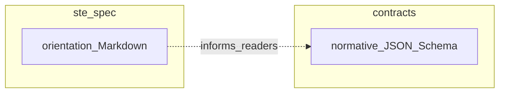

# STE Diagram Conventions
## Mermaid vs box diagrams in `ste-spec`

## Purpose

This document sets **editorial conventions** for diagrams in Markdown across
`ste-spec`.

Canonical diagram policy and projection doctrine are defined in
[`STE-Diagram-Standards.md`](./STE-Diagram-Standards.md). This file provides
editorial Orientation guidance only. It does not define doctrine, integration,
or enforcement rules; those remain in [`contracts/`](../contracts/README.md),
[`invariants/`](../invariants/STE-Cross-Component-Contract-Invariants.md), and
binding [`adrs/published/`](../adrs/published/README.md).

## Normative vs informative figures

Unless a document **explicitly** states that a specific figure is normative,
treat every diagram as **informative** (orientation only).

**MUST / MUST NOT / SHOULD** requirements belong in **prose**, **contracts**,
or **invariants** rather than in a graphic alone. Diagrams clarify; they do
not replace normative text.

Diagrams are Derived projection artifacts and are non-authoritative. A diagram
must not be the sole location where a rule, requirement, or invariant is
defined.

## When to use Mermaid

Prefer **Mermaid** (`flowchart`, `sequenceDiagram`, `stateDiagram-v2`, etc.)
when:

- control flow or sequencing is the main idea
- the diagram is new or you are already rewriting the surrounding section
- you need a compact directed graph with modest label density per node
- the diagram is a canonical architecture diagram governed by
  [`STE-Diagram-Standards.md`](./STE-Diagram-Standards.md)

## When to keep box / monospace diagrams

Prefer **Unicode box-drawing** or **ASCII** layouts when:

- the figure is a floor plan with alignment that matters in plain text
- the figure reads better in terminal or email contexts
- the figure is illustrative rather than a canonical architecture diagram
- Mermaid would require awkward subgraphs, tiny unreadable nodes, or excessive
  line count for a non-canonical figure

Not all illustrative box diagrams need conversion. Canonical diagrams follow
[`STE-Diagram-Standards.md`](./STE-Diagram-Standards.md), while small
illustrative ASCII or Unicode figures may remain when they are not canonical
architecture diagrams.

## Rendering assumptions

Reference renderers for Mermaid in this repository:

- **GitHub** (Markdown preview for `.md` on the default branch and PRs)
- **Cursor / VS Code** with a Mermaid-capable Markdown preview

Some environments show Mermaid as a source block only. Do not rely on graphics
alone for essential readability in those contexts. Keep a one-line prose
summary where helpful.

## Mermaid authoring guardrails

- No explicit colors, `style`, `classDef`, or theme overrides.
- Use stable node IDs without spaces.
- For labels that contain parentheses, commas, or colons, use quoted node
  text.
- Avoid reserved words as bare node IDs.
- For edge labels with special characters, wrap the label in double quotes on
  the edge.
- Keep each diagram reviewable in a PR. If Mermaid source becomes too large,
  split the diagram or keep the figure illustrative rather than canonical.

## Example (informative)

This example is illustrative only; it is not a conformance artifact.

## Related

- Reading legend (normative vs orientation): [`STE-Manifest.md`](./STE-Manifest.md)
- Canonical diagram doctrine: [`STE-Diagram-Standards.md`](./STE-Diagram-Standards.md)
- Integration diagrams (existing Mermaid): [`STE-Integration-Model.md`](./STE-Integration-Model.md)
- Broad architecture figures: [`STE-Architecture.md`](./STE-Architecture.md)
