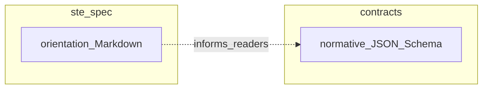

# STE Diagram Conventions  
## Mermaid vs box diagrams in `ste-spec`

## Purpose

This document sets **editorial conventions** for diagrams in Markdown across
`ste-spec`. It does not define integration or enforcement rules; those remain in
[`contracts/`](../contracts/README.md), [`invariants/`](../invariants/STE-Cross-Component-Contract-Invariants.md), and binding [`adr/`](../adr/README.md).

## Normative vs informative figures

Unless a document **explicitly** states that a specific figure is normative,
treat every diagram as **informative** (orientation only).

**MUST / MUST NOT / SHOULD** requirements belong in **prose**, **contracts**,
or **invariants**—not in a graphic alone. Diagrams clarify; they do not replace
normative text.

## When to use Mermaid

Prefer **Mermaid** (`flowchart`, `sequenceDiagram`, `stateDiagram-v2`, etc.)
when:

- **Control flow or sequencing** is the main idea (for example workspace →
  kernel → runtime, merge order, allow/deny gates).
- The diagram is **new** or you are **already rewriting** the surrounding
  section.
- You need a **compact directed graph** with **modest** label density per node.

## When to keep box / monospace diagrams

Prefer **Unicode box-drawing** or **ASCII** layouts when:

- The figure is a **floor plan**: nested rectangles, many labels inside regions,
  or alignment that matters in plain text.
- The figure is **stable** and already reads well in `cat`, email, or diff
  review.
- Mermaid would require **awkward subgraphs**, tiny unreadable nodes, or
  excessive line count.

**Non-goal:** There is **no** requirement to convert existing box diagrams to
Mermaid. Bulk conversion needs dedicated visual QA and is intentionally out of
scope unless separately planned.

## Rendering assumptions

Reference renderers for Mermaid in this repository:

- **GitHub** (Markdown preview for `.md` on the default branch and PRs)
- **Cursor / VS Code** with a Mermaid-capable Markdown preview

Some environments (plain terminals, certain CI logs, minimal editors) show
Mermaid as a **source block only**. Do not rely on graphics alone for essential
readability in those contexts—keep a one-line prose summary where helpful.

## Mermaid authoring guardrails

- **No** explicit colors, `style`, `classDef`, or theme overrides (dark/light
  compatibility).
- Use **stable node IDs** without spaces (for example `SteKernel`, `rules_engine`).
- For **labels** that contain parentheses, commas, or colons, use **quoted**
  node text, for example `nodeId["Step 1: load fragments"]`.
- Avoid reserved words as bare node IDs (for example do not use `end` as an ID;
  use `endNode` instead).
- For **edge labels** with special characters, wrap the label in **double
  quotes** on the edge.
- Keep each diagram **reviewable in a PR**: if Mermaid source is much beyond
  roughly **40–60 lines**, consider splitting diagrams or keeping a box diagram.

## Example (informative)

This example is illustrative only; it is not a conformance artifact.

## Related

- Reading legend (normative vs orientation): [`STE-Manifest.md`](./STE-Manifest.md)
- Integration diagrams (existing Mermaid): [`STE-Integration-Model.md`](./STE-Integration-Model.md)
- Broad architecture figures (often box-style): [`STE-Architecture.md`](./STE-Architecture.md)
