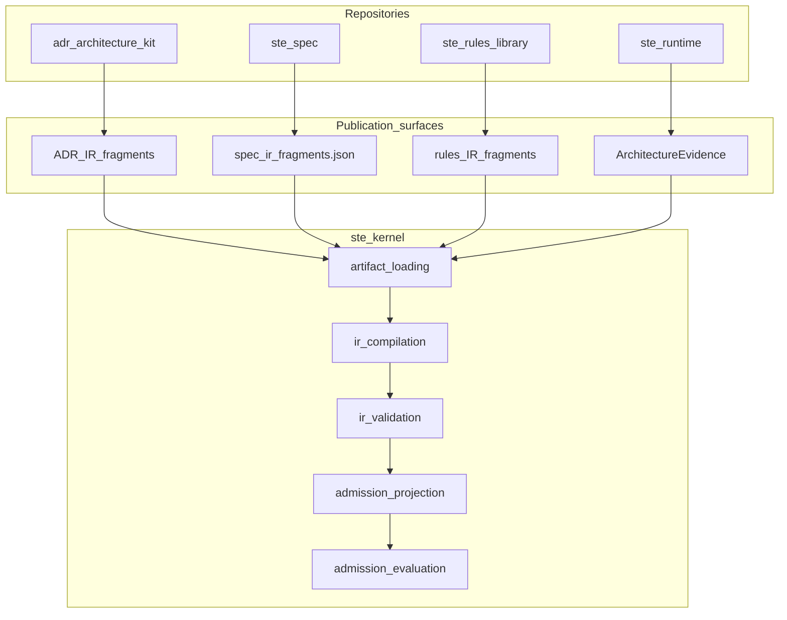
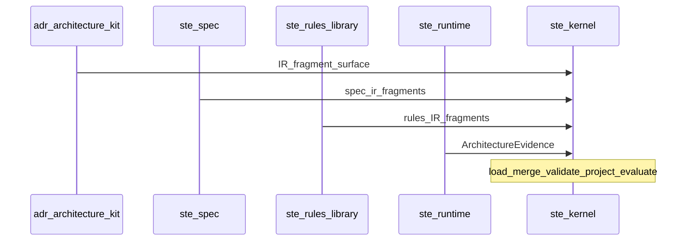
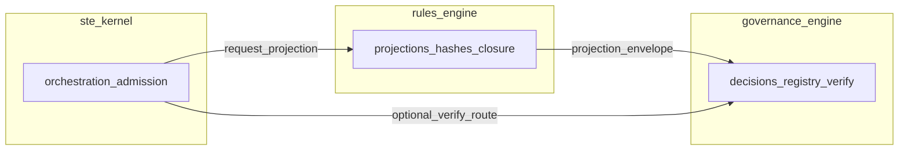

# STE Multi-Repository Integration Model

## Purpose

This document defines the **conceptual integration model** for how
`adr-architecture-kit`, `ste-spec`, `ste-runtime`, `ste-rules-library`, and
`ste-kernel` interoperate. It is normative at the **boundary** level; mechanical
details of merge and validation are **referenced** to the Architecture IR
contract bundle in `ste-kernel`.

**Semantic Architecture IR:** canonical ontology and rules (entities,
relationships, provenance, lifecycle, completeness, governance, Architecture
Index) are **normative** in
[`STE-Architecture-Intermediate-Representation.md`](./STE-Architecture-Intermediate-Representation.md);
see `adr/ADR-035-architecture-ir-ontology-authority.md`.

**Story (informative):** for one narrative that moves from workspace discipline through
publication surfaces to `ste-kernel`, read
`architecture/STE-Worked-Example-Walkthrough.md`.

**Kernel vision (informative):** `ste-kernel` **ADR-V-0001** (**V** = **vision** ADR)
describes **IR-mediated control plane** evolution; see
`execution/STE-Kernel-Execution-Model.md` (**Kernel control plane vision**) and
`glossary.md` (**ADR-V**).

---

## Conformance scope

**STE integration conformance** names the combination of: `ste-spec` handoff
schemas, declared adapter **publication surfaces**, the kernel-owned Architecture IR
bundle (merge order, JCS, sorting, identity), and `ste-kernel` boot and admission
behavior per its documentation.

**MUST NOT:** Treat adapter merge precedence or canonical IR serialization as
optional “how much STE applies” controls for arbitrary downstream applications.
**Workspace adoption maturity** (CEM depth, rules usage) does not rewrite integration
MUSTs.

---

## Normative Model

### Adapters

An **adapter** is a bounded role that supplies **`ste-kernel`** with
kernel-consumable artifacts through **publication surfaces** only. Adapter
names and import policy are expressed in **`ste-kernel/contracts/adapter-contracts.yaml`**.

**MUST NOT:** `ste-kernel` MUST NOT depend on sibling repository source trees or
undocumented paths.

### Publication surfaces

A **publication surface** is a stable, contract-backed file path (or explicit
caller override) from which `ste-kernel` loads fragments or evidence.

**MUST:** Fragments MUST be UTF-8 JSON arrays of IR records with required
`provenance` matching the adapter identity (see kernel boot contract).

### Artifact flow (informative diagram)

### IR fragment publication and consumption

**Publishers:** `adr-architecture-kit`, `ste-spec`, `ste-rules-library` publish
**IR fragments**. **`ste-runtime`** participates as **RuntimeAdapter** input
material for evidence-backed IR projection per Architecture IR mapping policy
(referenced).

**Consumer:** `ste-kernel` loads fragments, normalizes, **merges** in fixed
adapter precedence, **validates** to `Compiled_IR_Document`, then **projects**
an admission slice.

**Merge order (normative):** ADR → Spec → Runtime → Rules (see
`ste-kernel/architecture-ir/architecture-ir.yaml`, mirrored in kernel docs).

**Adapter handoff sequence (informative diagram):** complements the artifact
flow figure above; same legend as [`STE-Diagram-Conventions.md`](./STE-Diagram-Conventions.md).

### Runtime evidence flow

**`ste-runtime`** produces **`ArchitectureEvidence`** (schema in
`ste-spec/contracts/`). Evidence flows into kernel artifact loading, informs
freshness and bundle health projection, and **MUST NOT** carry admission
decision semantics.

### Kernel orchestration role

**`ste-kernel`** is the **sole** integration orchestrator for merge, IR
validation, and admission evaluation at this boundary. It **MUST** fail closed
when boot or IR validation fails (see `execution/STE-Kernel-Execution-Model.md`).
It is also the deterministic enforcement point for execution eligibility at the
admission boundary: it verifies required authority, lifecycle state, evidence,
and governance-side prerequisites before allowing execution. It approves
boundary execution eligibility; it does not replace runtime systems, direct
business execution, or CI/CD.

At this boundary, `ste-kernel` evaluates a System Instance: the active System
as resolved in one explicit Environment under the active evaluation scope.
Environment remains orthogonal to scope and is part of instance-level
eligibility rather than incidental metadata.

### Adjudicator boundary (rules-engine → governance; `ste-kernel` orchestrates)

**Informative.** **Rule closure materialization** (projection envelopes with **hashes**,
**identifiers**, **ruleset pins**, and **encoded closure** for replay) is owned by the
**rules-engine** (`ste-rules-library` operational component). **Durable decisions**
(attestations accepted, steelman verdicts recorded, registry rows, human overrides) are
owned by a **governance-engine / adjudicator** service (name TBD)—a **consumer** of
those projections, not the rules-engine’s job to store long-term. **`ste-kernel`**
**orchestrates** requests and verify routes and **MUST NOT** normatively become the
system of record for either rule text or governance decisions.

**Transitional:** Implementations **MAY** colocate projection and decision storage **in-process** for prototypes; treat that as **non-normative** until expressed in published
contracts (draft envelope: `contracts/rule-projection/`; adapter surfaces only via
`ste-kernel/contracts/adapter-contracts.yaml` + merge policy).

**Optional:** Mechanical **checks** **MAY** align with **rules IR fragments** or a future
**adapter IR** surface so CI and kernel share one encoded check structure—same merge-policy
caveat as above.

**Governance / CI** at merge **SHOULD** stay **mechanical** (reconstruct closure from the
**same git tree**, verify signatures)—see `architecture/STE-Worked-Example-Walkthrough.md`
step **7** and `glossary.md` (**Adjudicator**).

**Projection vs governance slice (informative diagram):**

---

## Related Documents

- `architecture/STE-Architecture-Intermediate-Representation.md`
- `adr/ADR-035-architecture-ir-ontology-authority.md`
- `architecture/STE-System-Components-and-Responsibilities.md`
- `execution/STE-Kernel-Execution-Model.md`
- `architecture/STE-Determinism-and-Canonical-Identity.md`
- `invariants/STE-Failure-Taxonomy-Boundaries.md`
- `contracts/README.md`
- `contracts/rule-projection/README.md` (draft envelope scope)
- `contracts/governance-decision-record/README.md` (draft decision rows referencing projections)
- `adr/ADR-034-rule-projection-envelope-authority.md` (proposed)

**RulesAdapter governance sub-surface (informative):** Prototype **projection + verify** CLIs may ship **inside** `ste-rules-library`; kernel consumption of those artifacts remains **out of scope** until **`adapter-contracts.yaml`** merge policy and **publication paths** are extended deliberately (see `ste-kernel/contracts/adapter-contracts.yaml` **RulesAdapter** responsibility string).

## Canon Status

This file is **canonical** for the STE integration viewpoint in `ste-spec`.
