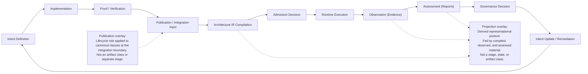

# STE Spine Lifecycle

## Purpose and Scope

This document is normative supporting doctrine for the STE Spine lifecycle.

## Authority Boundary

This document explains and maps the lifecycle defined canonically in
[`../adrs/published/ADR-040-ste-spine-lifecycle-and-authority.md`](../adrs/published/ADR-040-ste-spine-lifecycle-and-authority.md).
ADR-040 remains canonical for the Spine lifecycle and authority-transition
model. This document uses ADR-040 for Spine-local terminology and does not
redefine artifact taxonomy, which remains canonical in
[`../adrs/published/ADR-038-artifact-classification-and-versioning.md`](../adrs/published/ADR-038-artifact-classification-and-versioning.md).

## Core Model

### Canonical Spine Diagram

### How to read this diagram

- Read the stages from left to right in the exact lifecycle order defined by
  ADR-040.
- The figure shows lifecycle flow, not artifact taxonomy; the node labels are
  lifecycle stages, not artifact classes.
- Artifact classes are defined by ADR-038 and are not shown here as separate
  stages.
- The Spine shows how artifacts move through lifecycle boundaries, are
  evaluated, and influence downstream decisions.
- Authority shifts happen at named lifecycle boundaries defined by doctrine,
  not by diagram styling alone.
- Normative authority defines intent, implementation produces implementation
  truth, proof produces verification results, and governance decisions can feed
  the next cycle of intent change.
- `ste-kernel` performs deterministic validation, compilation, and
  caller-facing admission at the integration boundary.
- Runtime produces evidence only; it does not emit caller-facing admission
  decisions.
- `Publication` and `Projection` are overlays or postures in this model, not
  standalone artifact classes or lifecycle stages.
- Authority and canonicity are defined by the ADRs and doctrine text, not by
  this diagram.
- If this diagram and ADR-040 ever differ, ADR-040 governs and this diagram
  must be corrected.

Early lifecycle segments are dominated by authored normative intent,
implementation truth, and proof results. Later lifecycle segments include
derived integration-state, evidence, reports, and projections. This is a
posture distinction across the lifecycle, not a new lifecycle partition or
taxonomy.

This diagram is a projection of the canonical lifecycle defined in ADR-040. If
this figure and ADR-040 ever differ, ADR-040 is authoritative and this diagram
must be updated.

### Lifecycle Stages

### Stage Overview

| Stage | Responsible repository | Artifact classes present | Authority type | Primary state result |
| --- | --- | --- | --- | --- |
| Intent Definition | `ste-spec` | Normative, Orientation | Normative Authority | Accepted |
| Implementation | `ste-kernel`, `ste-runtime`, `ste-rules-library`, `adr-architecture-kit` | Implementation | Implementation Truth | Implemented |
| Proof / Verification | `ste-kernel`, `ste-runtime`, `ste-rules-library`, `adr-architecture-kit` | Proof Logic, Reports | Proof Authority | Verified |
| Publication / Integration Input | `adr-architecture-kit`, `ste-spec`, `ste-runtime`, `ste-rules-library` | Derived, Evidence, Normative | Derived Artifact, Observational Authority | Published |
| Architecture IR Compilation | `ste-kernel` | Derived | Derived Artifact | Compiled |
| Admission Decision | `ste-kernel` | Derived | Decision Authority (Admission) | Admitted |
| Runtime Execution | `ste-runtime` | Implementation, Evidence | Implementation Truth, Observational Authority | Executed |
| Observation (Evidence) | `ste-runtime` | Evidence | Observational Authority (Evidence) | Observed |
| Assessment (Reports) | `ste-kernel`, `ste-rules-library`, governance-side consumers | Reports, Derived | Interpretive Output (Reports) | Assessed |
| Governance Decision | `ste-spec`, `ste-rules-library`, governance-side consumers | Normative, Reports, Internal | Governance Authority | Remediated |
| Intent Update / Remediation | `ste-spec` with affected implementation repositories | Normative, Implementation, Proof Logic, Internal | Governance Authority leading back to Normative Authority | Drafted or Accepted |

### Stage Details

#### Intent Definition

- Description: Normative intent is written and accepted through ADRs,
  invariants, contracts, and canonical doctrine. Doctrine often speaks of
  contract authority, invariant surfaces, and architecture decisions rather
  than "intent definition" as a stage label.
- Inputs: Prior doctrine, change need, accepted constraints.
- Outputs: ADRs, invariants, contracts, doctrine updates.
- Entry criteria: Need for new or revised intent is identified.
- Exit criteria: Accepted authoritative intent exists in accepted doctrine or
  accepted contract shape.

#### Implementation

- Description: Executable behavior is realized in repository source. Doctrine
  defines this as versioned implementation truth rather than normative
  authority.
- Inputs: Accepted doctrine and repository-local implementation work.
- Outputs: Source changes and executable logic.
- Entry criteria: Accepted intent exists for the affected scope.
- Exit criteria: Implementation exists as versioned source and is ready for
  proof / verification.

#### Proof / Verification

- Description: Proof logic verifies or certifies expected behavior. Doctrine
  uses "Proof Logic", validation, and deterministic baselines rather than one
  universal verification stage label.
- Inputs: Accepted doctrine, implementation source, proof harnesses.
- Outputs: Tests, deterministic baselines, proof outcomes, validation
  summaries.
- Entry criteria: Implementation or doctrine requiring proof is present.
- Exit criteria: Verification outcome exists and the verified scope is ready
  for publication / integration input.

#### Publication / Integration Input

- Description: Contract-backed publication surfaces expose fragments and
  evidence to the integration boundary. Publication is a lifecycle role
  applied to canonical classes; it does not create a new artifact class.
- Inputs: Published fragments, `ArchitectureEvidence`, contract-backed paths.
- Outputs: Kernel-consumable fragments and evidence.
- Entry criteria: Declared publication surfaces are available and required
  proof for the publication surface has completed.
- Exit criteria: Required integration inputs are available to `ste-kernel` for
  downstream compilation.

#### Architecture IR Compilation

- Description: `ste-kernel` loads, merges, and validates a compiled IR
  candidate from publication inputs. Doctrine speaks of merge, validation, and
  `Compiled_IR_Document` semantics.
- Inputs: Publication surfaces, merge policy, pinned IR contract references.
- Outputs: Validated `Compiled_IR_Document` or fail-closed boot failure.
- Entry criteria: Required inputs are loaded.
- Exit criteria: Validated compiled integration-state exists or boot aborts
  fail-closed.

#### Admission Decision

- Description: `ste-kernel` projects the admission slice and emits the
  caller-facing admission decision. Doctrine uses "admission evaluation" and
  `KernelAdmissionAssessment`.
- Inputs: Validated IR snapshot, projected admission slice, policy context.
- Outputs: `KernelAdmissionAssessment`.
- Entry criteria: Validated IR exists; admission has not yet run.
- Exit criteria: Caller-facing admission output exists or execution is
  blocked.

#### Runtime Execution

- Description: Runtime performs execution work within its repository boundary.
  Doctrine places runtime as execution and evidence production only.
- Inputs: Runtime implementation, admitted or operative runtime path, runtime
  context.
- Outputs: Runtime activity and factual observations.
- Entry criteria: Runtime execution path is invoked from an admitted or
  operative path.
- Exit criteria: Execution has occurred and runtime facts are ready to be
  emitted as evidence.

#### Observation (Evidence)

- Description: Runtime produces factual evidence only. Doctrine uses
  `ArchitectureEvidence`, runtime evidence, bundle health, and freshness.
- Inputs: Runtime execution facts, bundle health, freshness state.
- Outputs: `ArchitectureEvidence` and related factual observations.
- Entry criteria: Runtime has observable facts to report.
- Exit criteria: Evidence exists without caller-facing decision semantics and
  is ready for assessment.

#### Assessment (Reports)

- Description: Validation, review, and assessment outputs interpret evidence
  and compiled or projected material. Projection is a representational posture
  generated from compiled, observed, or assessed material; it is not a
  state-bearing class.
- Inputs: Evidence, compiled IR, projections, review inputs.
- Outputs: Assessments, validation summaries, reviews, report outputs.
- Entry criteria: Evidence or compiled/projected material is available.
- Exit criteria: Interpretive outputs exist and are ready for governance
  consumption.

#### Governance Decision

- Description: Governance review, override, and remediation decide how
  unresolved issues are accepted, deferred, or corrected. Accepted doctrine is
  strongest in the Architecture IR governance model and does not promote draft
  governance-decision contracts here.
- Inputs: Reviews, unresolved gaps, override and remediation inputs.
- Outputs: Overrides, remediation records, accepted governance outcomes.
- Entry criteria: Assessment or review has produced governance-relevant
  findings.
- Exit criteria: Governance outcome is explicit and recorded for the next
  cycle.

#### Intent Update / Remediation

- Description: Governance feedback modifies authoritative intent or drives
  corrective implementation work for the next cycle. Doctrine uses the
  Architecture Index feedback loop and remediation ledger rather than one fixed
  title for this stage.
- Inputs: Governance outcome, remediation work, next-cycle architecture
  inputs.
- Outputs: Updated doctrine, supersession, implementation follow-up.
- Entry criteria: Governance outcome requires doctrine or implementation
  change.
- Exit criteria: Next-cycle intent is re-entered in Drafted or Accepted form
  in the authoritative layer.

## Interpretation Notes

### Stage Notes

- `Publication` is a lifecycle role applied to canonical classes. It marks
  declared boundary material as available for integration input and downstream
  compilation.
- `Assessment (Reports)` includes report-like and review-like outputs already
  present in accepted doctrine. Those outputs remain interpretive rather than
  caller-facing admission artifacts.
- `Projection` is a derived representational posture generated from compiled,
  observed, or assessed material. It is not a state-bearing class or taxonomy
  class.
- `Governance Decision` is limited to accepted review, override, remediation,
  and governance-loop doctrine. Draft governance-decision contracts are not
  promoted here.

### Stage and State Interpretation

- Lifecycle stages describe ordered system segments.
- Spine lifecycle states describe readiness or result posture within that
  ordered system.
- Conformance states are an execution-eligibility overlay on top of the locked
  Spine lifecycle states. They do not replace those states.
- Stage completion does not change authority ownership. It changes what
  downstream work is eligible to occur.
- Evidence and lifecycle feedback use a conformance-state overlay on top of the
  locked Spine states. That overlay affects execution eligibility without
  replacing the canonical Spine lifecycle.
- The same System may occupy different lifecycle and conformance postures in
  different Environments because evaluation is instance-scoped.

| Concept | Meaning in this document | Example question it answers |
| --- | --- | --- |
| Lifecycle stage | Where evaluated scope sits in the ordered Spine flow | "Is this scope in `Proof / Verification` or `Assessment (Reports)`?" |
| Lifecycle state | Readiness or result posture within the Spine model | "Is this scope `Accepted`, `Verified`, or `Observed`?" |
| Authority | Who governs truth or transition meaning within a boundary | "Does `ste-kernel`, `ste-runtime`, or accepted doctrine control this result?" |
| Canonical status | Whether a surface is source truth or derived from source truth | "Is this accepted doctrine, implementation truth, evidence, or a derived projection?" |

## Related Documents

- [`STE-Spine-Extracted-Doctrine.md`](./STE-Spine-Extracted-Doctrine.md)
- [`STE-Spine-Authority.md`](./STE-Spine-Authority.md)
- [`STE-Spine-Artifact-Mapping.md`](./STE-Spine-Artifact-Mapping.md)
- [`STE-Spine-State-Model.md`](./STE-Spine-State-Model.md)
- [`../adrs/published/ADR-040-ste-spine-lifecycle-and-authority.md`](../adrs/published/ADR-040-ste-spine-lifecycle-and-authority.md)
