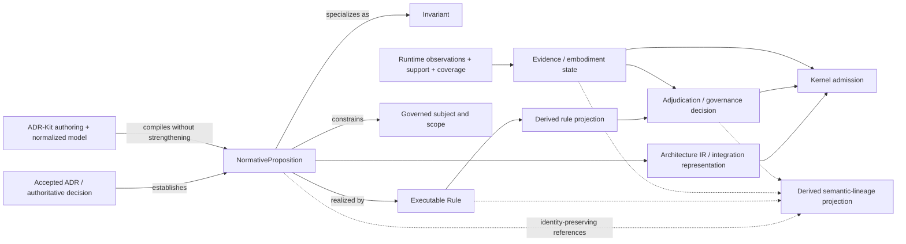

# STE Semantic Re-Baseline — Normative Reasoning, Epistemic State, and Concept Evolution

> **NON-NORMATIVE DESIGN JOURNAL — This document reconstructs, evaluates, and proposes evolution of STE concepts. It does not establish architectural authority, amend accepted ADRs, redefine contracts, or promote any proposed semantic decision.**

## Status and non-authority notice

**Status:** candidate design input for senior architectural review. This journal is not an ADR, contract, invariant, glossary definition, Architecture IR amendment, Runtime contract, or Kernel admission rule. Its recommendations have no force until promoted through the repository that owns the affected authority.

The journal is stacked on the Slice 4 authority survey at [`intent-embodiment-epistemic-authority-design-inputs.md`](intent-embodiment-epistemic-authority-design-inputs.md). It does not repeat or replace that survey. Proposed ADRs and draft contracts are evidence of design direction, not accepted authority. Runtime source and contracts establish Runtime-owned embodiment semantics only. Historical STE prose is design history unless an accepted ADR gives it authority.

This journal uses two independent labels:

- **Disposition:** `UPHOLD`, `REFINE`, `DECOMPOSE`, `RETIRE`, `RENAME`, or `INTRODUCE`.
- **Evidence class:** `SOURCE_GROUNDED_CONTINUATION`, `RECOVERED_DESIGN_CONVERGENCE`, `NECESSARY_RECONCILIATION`, `NEW_DESIGN_PROPOSAL`, or `HISTORICAL_ONLY`.

Confidence is `HIGH`, `MEDIUM`, or `LOW`; it measures the strength of this journal's recommendation, not architectural truth.

## Executive synthesis

STE already has the pieces of a coherent modern semantic model, but they are distributed across different authority owners and generations of vocabulary. Accepted ste-spec ADRs establish repository and contract authority, scoped lifecycle, invariant semantics, Architecture IR ownership, compiler/evidence boundaries, and Runtime/Kernel separation. ADR-Kit establishes UUID identity, deterministic compilation, a normalized model, consumer extensions, and bounded intent-attribution evidence. The successor Runtime establishes a rich, multidimensional embodiment-evidence model without acquiring intent authority. Historical CEM, AI-DOC, RSS, and MVC prose supplies useful design aims but also carries claims of total knowledge and universal determinism that no longer fit the accepted boundaries.

The recommended re-baseline is:

1. Introduce a first-class **`NormativeProposition`**: an identity-bearing, scoped proposition established by an authoritative decision and carrying strength, lifecycle, provenance, and lineage.
2. Treat **Invariant** as a constrained kind of normative proposition; treat **Rule** as an evaluable realization or policy input; stop using **Constraint** as an untyped machine-semantic bucket.
3. Model epistemics on independent axes: authority, support basis, knowledge state, and derivation/provenance. Never compress these into one confidence or truth label.
4. Preserve the successor Runtime's authority over observation, support, coverage, reconstruction, snapshots, and embodiment identity. STE may standardize universal dimensions and composition boundaries, but must not silently take over Runtime-owned schemes.
5. Replace totalizing historical language—complete truth, no unknowns, universal nine-stage execution, one deterministic answer—with scoped, versioned, evidence-bounded semantics.
6. Preserve CEM as a governed reasoning lifecycle concept; rename RSS to **Reasoning State Slicing**; retain MVC as experimental task-scoped context sufficiency with distinct definition, candidate, and admitted-materialization stages.
7. Add a generated **semantic-lineage projection** only after the underlying accepted decisions and identities exist. The projection must never become a second authority surface.

**Major recommendation:** introduce `NormativeProposition` and the four-axis epistemic model together; either one without the other would preserve ambiguity about what a claim means and how it is known. **Disposition:** `INTRODUCE`. **Evidence class:** `NECESSARY_RECONCILIATION`. **Confidence:** `HIGH`.

## Why this journal exists

Slice 4 established that no current accepted source is in direct authority conflict, yet the repositories do not share one precise vocabulary for intent, embodiment, evidence, epistemic state, and executable enforcement. It also identified stale documentation-state language, lifecycle terminology collisions, and the absence of a first-class semantic carrier for individual normative statements.

That gap is now operationally important. ADR decisions contain many independently meaningful `MUST`, `SHOULD`, and `MAY` statements; ADR-Kit exposes decisions, invariants, constraints, and extension entities; Runtime ADRs use stable rule labels such as `R###`; Kernel consumes active rule inputs; attribution declarations can say `implements`, `enforces`, or `embodies`; and design journals need to trace candidate rules into accepted authority. Without a scoped proposition identity, those connections remain prose, position, or repository-specific convention.

This journal therefore reconstructs the conceptual model before any normative schema change. It is intentionally broader than a schema proposal: the schema is downstream of decisions about meaning, authority, lifecycle, identity, and epistemic composition.

## Authority and evidence posture

The following precedence governs every recommendation here:

1. Accepted ADRs in the repository that owns the subject establish architectural authority.
2. Normative ste-spec contracts and invariants establish only the authority assigned to them by accepted ADRs.
3. ADR-Kit's accepted ADRs and released schemas govern ADR authoring, compilation, normalized representation, identity, and attribution.
4. Runtime accepted ADRs govern embodiment observation, reconstruction, support, coverage, and Runtime services.
5. Kernel owns orchestration and caller-facing admission within accepted contracts; it does not own intent, rule closure, or evidence truth.
6. Proposed ADRs, draft contracts, design journals, generated projections, handbooks, glossaries, and historical documents are non-authoritative unless separately promoted.

Material source groups reviewed beyond the Slice 4 matrix include the historical [`STE-Cognitive-Execution-Model.md`](../execution/STE-Cognitive-Execution-Model.md), current [`STE-Kernel-Execution-Model.md`](../execution/STE-Kernel-Execution-Model.md), [`glossary.md`](../glossary.md), proposed ADR-L-0043 and its draft MVC/context contracts, ADR-Kit ADR-L-0013/0019/0020/0023/0025 and authoring/normalized schemas, and the successor Runtime semantic replacement journal and v1 contracts at the Slice 4 recorded Runtime revision.

Historical and proposed sources are used for recovery, never silent promotion. Where accepted sources define only a boundary and several later sources converge on a detailed shape, this journal labels the result `RECOVERED_DESIGN_CONVERGENCE`. Where existing accepted concepts cannot compose without a new distinction, it uses `NECESSARY_RECONCILIATION`. Truly new concepts are `NEW_DESIGN_PROPOSAL`.

## Reconstructed causal chain

The historical-to-modern chain is:

```text
raw model output
  → explicit documentation/state substrate
  → governed reasoning lifecycle
  → task-scoped state selection
  → validation and divergence handling
  → admitted action/output
  → observed embodiment evidence
  → comparison with declared intent
  → governed change and semantic lineage
```

The durable insight is causal, not product-naming specific: reasoning becomes governable when its inputs, authorities, transformations, uncertainty, checks, and outputs are explicit and inspectable. AI-DOC, Fabric, RECON, RSS, MVC, CEM, Architecture IR, Runtime snapshots, and Kernel admission are successive attempts to carry different portions of that chain.

The historical error was to collapse the chain into one “complete truth” surface. The modern repositories instead establish separations: documentation declares; compilers normalize; Runtime observes and reconstructs embodiment; Architecture IR integrates with provenance; rule engines materialize rule projections; adjudication records decisions; Kernel admits or denies; projections explain but do not authorize.

**Major recommendation:** keep the causal chain as STE orientation while assigning every arrow to an explicit owner and contract. **Disposition:** `REFINE`. **Evidence class:** `SOURCE_GROUNDED_CONTINUATION`. **Confidence:** `HIGH`.

## Cross-repository architecture already established

The following architecture is already sufficiently established that this journal does not reopen it:

| Concern | Current carrier | Boundary preserved by this journal |
|---|---|---|
| Architectural intent | accepted ADRs at their owning repositories | Derived state cannot create or broaden intent. |
| ADR authoring and normalized architecture model | ADR-Kit | Consumers do not fork schemas, identity, or compiler meaning. |
| Universal Architecture IR semantics and contracts | ste-spec | Mechanical realization may be versioned and incomplete without changing semantic ownership. |
| Embodiment observation and reconstruction | successor Runtime | Observation and support do not become intent authority. |
| Integration and caller-facing admission | Kernel | Admission consumes validated inputs; it does not become rule, evidence, or ADR authority. |
| Rule closure/projection | rules-engine role | A projection is derived and is not a durable governance decision. |
| Governance verdict/history | adjudicator/governance role | A decision record does not rewrite the rule source or evidence. |

`NormativeProposition` must fit these boundaries. It is authored through ADR authority, compiled by ADR-Kit, represented in normalized/IR surfaces, optionally realized by rules or implementation, evaluated by the proper enforcement owner, and supported or challenged by evidence. No downstream carrier inherits the proposition's authority merely by copying it.

## The lossy-reasoning / semantic-lineage case study

Consider an accepted ADR decision containing five `MUST` clauses, two `SHOULD` clauses, and one exception. Today a human can read them, but machine surfaces may preserve only the parent decision, a coarse invariant, or a Runtime rule label. An implementation declaration may target the ADR or invariant, and a test may prove one behavior, yet there is no stable identity for the exact proposition being implemented. If the ADR is amended, a diff can show text change but not reliably state which proposition was refined, split, superseded, or preserved.

Loss occurs at each transformation:

```text
decision prose
  → extracted constraint/rule
  → normalized entity
  → executable rule projection
  → implementation attribution
  → evidence and verdict
```

Identity by line number, array position, label alone, or content hash fails under legitimate editing. Identity by parent ADR alone is too coarse. Treating a Runtime `R###` label or generated projection as authority reverses the boundary. Treating execution success as proof of compliance confuses evidence with adjudication.

The proposed repair is stable proposition identity plus explicit lineage:

- the authoritative ADR establishes a UUID-bearing proposition;
- a proposition may be narrowed, refined, decomposed, superseded, or retired only by an authoritative decision;
- derived rule/projection/implementation/evidence records reference that UUID and preserve their own identity and authority class;
- generated lineage shows transformations without becoming editable authority;
- absence of a link is `unknown` or `unassessed`, never automatic non-conformance.

**Major recommendation:** preserve semantic identity across transformations and represent loss or unresolved mapping explicitly. **Disposition:** `INTRODUCE`. **Evidence class:** `NECESSARY_RECONCILIATION`. **Confidence:** `HIGH`.

## Candidate modern STE conceptual model



The diagram is a candidate conceptual model, not a deployment architecture. In particular, it does not require every proposition to have an executable rule, every evidence record to reach Kernel, or every Runtime observation to be an Architecture IR entity.

**Major recommendation:** use the diagram's separations as design-lock criteria, not as permission to create a monolithic semantic service. **Disposition:** `INTRODUCE`. **Evidence class:** `NEW_DESIGN_PROPOSAL`. **Confidence:** `MEDIUM`.

## Normative proposition model

### Historical constraint model

Historical STE uses “constraint” broadly for invariant statements, policies, schema restrictions, lifecycle requirements, validation conditions, and natural-language prohibitions. ADR authoring also has concrete `invariants` and, in some schema generations, `constraints`. Kernel documentation defines `Rule` as a declared policy or constraint input. These meanings overlap but are not interchangeable.

The recommendation is to retain **constraint** as an ordinary-language umbrella and compatibility term, while deprecating it as an unqualified canonical entity type for new machine semantics. Existing constraint entities remain valid and must be migrated only through explicit mapping: to a normative proposition, invariant, executable rule, structural schema restriction, or nonnormative design constraint.

**Disposition:** `DECOMPOSE`. **Evidence class:** `NECESSARY_RECONCILIATION`. **Confidence:** `HIGH`.

### NormativeRule or successor concept

The recommended canonical name is **`NormativeProposition`**, not `NormativeRule`. “Proposition” describes the authoritative semantic claim; “rule” already names an executable/evaluable input and rule-projection ecosystem. The model should answer these design-lock questions:

1. **What is it?** An identity-bearing proposition prescribing, permitting, recommending, or forbidding a condition, action, state, transition, or relationship.
2. **Who can create it?** Only an authority already empowered to establish the proposition's subject and scope, normally through an accepted ADR decision.
3. **What gives it authority?** The establishing authoritative artifact and decision, not the proposition record, compiler, projection, or label by itself.
4. **What is its identity?** A canonical UUIDv7 minted through the authoritative authoring lifecycle; aliases are noncanonical conveniences.
5. **What is its scope?** An explicit qualified scope, never inferred solely from repository location.
6. **What is its strength?** A controlled modality such as `MUST`, `SHOULD`, or `MAY`, with prohibition represented explicitly rather than by parsing prose.
7. **What is its lifecycle?** At minimum proposed/effective/deprecated/superseded/retired semantics aligned to, but not confused with, the lifecycle of its establishing authority.
8. **When is it effective?** Only when its establishing authority is effective for the evaluated scope and any explicit effective-time/version conditions hold.
9. **Can it outlive its ADR?** Not as active authority unless a later authoritative decision explicitly rehomes or preserves it.
10. **Can it be amended independently?** Its text or meaning may change only through an authoritative decision; editorial projections cannot amend it.
11. **Can one proposition replace another?** Yes, through explicit lineage such as `supersedes`, `refines`, `narrows`, `decomposes`, or `retires`.
12. **Can it point to another proposition?** Yes, with acyclic, typed, authority-preserving relationships; references do not automatically inherit scope or strength.
13. **Can it be composite?** A composite may group propositions, but each independently attributable or enforceable semantic claim should retain identity.
14. **Must it be executable?** No. Evaluability and automatic enforcement are separate realization properties.
15. **What counts as conformance?** A governed assessment against the proposition's meaning, scope, version, and applicable evidence—not mere implementation declaration or test passage.
16. **What can Runtime say about it?** Runtime may supply observations, embodiment identity, support, coverage, and external bindings; it does not decide intent meaning by default.
17. **What can Kernel do with it?** Kernel may consume a validated, applicable projection or adjudication result for admission; it does not author or reinterpret the proposition.
18. **How is it represented?** First-class in authoring and normalized semantics after design lock; references in Architecture IR, projections, attribution, and lineage must preserve identity, source authority, version, and provenance.

Candidate minimal fields are: `id`, `alias_id`, `statement`, `modality`, `polarity`, `subject_kind`, `subject_refs`, `scope`, `applicability`, `effective_lifecycle`, `established_by_decision`, `source_ref`, `rationale`, `verification_expectation`, and typed lineage references. Exact fields and enums remain ADR-Kit design work.

**Disposition:** `INTRODUCE` (`NormativeRule` as working historical label, `NormativeProposition` as recommended successor name). **Evidence class:** `NEW_DESIGN_PROPOSAL`. **Confidence:** `HIGH` for the semantic need, `MEDIUM` for the final name and field set.

### Invariant

An **Invariant** is a normative proposition asserting a condition that must hold throughout a declared state space, lifecycle interval, operation, or transition set. It is not merely any sentence containing `MUST`, and its persistence domain must be explicit. Existing accepted invariant identity and conflict semantics remain authoritative.

An invariant may be design-, test-, schema-, or runtime-enforced. The enforcement mechanism does not change its authority. A failed check is evidence of a possible or established violation under the applicable adjudication contract; it is not itself the invariant.

**Disposition:** `REFINE`. **Evidence class:** `SOURCE_GROUNDED_CONTINUATION`. **Confidence:** `HIGH`.

### Rule

A **Rule** is an evaluable declaration used by a rules engine, validator, governance mechanism, or Kernel enforcement path. It has an applicability function, input contract, outcome vocabulary, version, and ruleset identity. A rule may realize one or more normative propositions, but it may also implement nonnormative operational policy where an owning authority permits that.

Rule source, compiled closure, projection envelope, evaluation result, adjudication verdict, and durable decision are distinct records. A rule projection is derived and cannot self-authorize. Existing Runtime `R###` labels are useful local aliases, not canonical cross-repository normative identity.

**Disposition:** `REFINE`. **Evidence class:** `SOURCE_GROUNDED_CONTINUATION`. **Confidence:** `HIGH`.

### Relationships among them

Recommended relationships are:

| Source | Relationship | Target | Meaning |
|---|---|---|---|
| Decision | `establishes` | NormativeProposition | Transfers only the decision's existing authority into the scoped proposition. |
| NormativeProposition | `specializes_as` | Invariant | States that the proposition has invariant semantics. |
| Rule | `realizes` | NormativeProposition | Declares evaluable realization; does not prove semantic correctness. |
| Implementation | `implements` | NormativeProposition or Rule | Attribution claim under a governed target matrix and authority ceiling. |
| Mechanism | `enforces` | Invariant/NormativeProposition | Evidence-bearing enforcement claim, not proof of conformance. |
| Evidence | `supports` / `challenges` | Assessment subject | Carries bounded epistemic support without mutating authority. |
| Proposition | typed lineage verb | Proposition | Preserves semantic evolution and explicit replacement. |

The exact vocabulary requires a cross-repository lock. In particular, ADR-Kit's current accepted attribution target matrix permits `enforces` only toward invariants and does not contain `NormativeProposition`; this journal does not reinterpret that contract.

**Disposition:** `INTRODUCE`. **Evidence class:** `NECESSARY_RECONCILIATION`. **Confidence:** `HIGH` for typed separation, `MEDIUM` for verb names.

### Authority, scope, lifecycle, and identity

A proposition's authority is a tuple, not a boolean:

```text
authority = establishing authority
          × effective lifecycle
          × declared scope
          × applicable version/time/environment
          × unresolved conflict disposition
```

Canonical identity must remain stable across editorial wording changes that preserve meaning, while semantic replacement must mint a new identity and link lineage. A content hash may prove byte or normalized-content equivalence but cannot be canonical identity. A proposition copied to a projection carries a reference, not transferred authority. A proposed ADR may contain candidate propositions, but they are nonbinding until the ADR is accepted; “architectural commitment” should therefore refer to effective accepted decisions, not ADRs in all lifecycle states.

**Major recommendation:** bind proposition effectiveness to explicit authority, scope, lifecycle, and version context; prohibit “floating” normative statements. **Disposition:** `INTRODUCE`. **Evidence class:** `NECESSARY_RECONCILIATION`. **Confidence:** `HIGH`.

## Epistemic model

No single enum can answer “is this true?” for STE. The same claim may be authoritative intent, directly observed embodiment, inferred relation, incompletely covered, disputed, and supported with high scheme-qualified confidence at the same time. These are not contradictions because they answer different questions.

**Major recommendation:** standardize four orthogonal dimensions and composition rules, while leaving domain-specific taxonomies with their owning repositories. **Disposition:** `INTRODUCE`. **Evidence class:** `RECOVERED_DESIGN_CONVERGENCE`. **Confidence:** `HIGH`.

### Authority dimension

The authority dimension asks **who is entitled to establish this meaning for this scope?** Candidate categories are:

- `authoritative`: established by an effective authority for the scope;
- `delegated`: established under an explicit bounded delegation;
- `derived`: computed from authoritative or evidentiary inputs but not itself authoritative;
- `advisory`: orientation, recommendation, or assessment without governing force;
- `unknown_authority`: authority cannot be resolved.

These values are illustrative and require lock. Authority must include source identity, scope, lifecycle, version/fingerprint, and any authority ceiling. “Explicit” is not synonymous with authoritative; a source can explicitly declare something it has no authority to govern.

### Support-basis dimension

The support-basis dimension asks **what kind of support exists?** The successor Runtime's `declared`, `observed`, and `inferred` bases may coexist through separate support paths. STE should preserve that insight without claiming those exact labels universally where another authority owns them.

- `declared`: a source asserts the claim;
- `observed`: bounded observation directly establishes the relevant fact under an observation contract;
- `inferred`: a versioned derivation produces the claim from supports;
- `attested`: an identified authority signs or asserts an assessment;
- `tested`: a governed test provides evidence for a bounded behavior;
- `adjudicated`: a decision process records a verdict.

These bases must not be collapsed into confidence. Observing declaration syntax supports “the declaration exists,” not necessarily the declared semantic claim. Multiple supports do not imply independent corroboration unless their roots are materially independent.

### Knowledge-state dimension

The knowledge-state dimension asks **what is presently known within a declared boundary?** Recommended cross-domain concepts are:

- `known_supported`;
- `known_challenged`;
- `conflicted`;
- `unknown`;
- `unassessed`;
- `out_of_scope`;
- `not_observable_under_current_capability`;
- `absent_within_demonstrated_coverage`.

Absence requires successful capability and coverage for the exact observation question. Missing data, a failed run, an excluded path, a pruned snapshot, or a truncated projection is not evidence of semantic absence. Partial knowledge may still be valid canonical Runtime state.

### Derivation/provenance dimension

The derivation/provenance dimension asks **how was this record produced and from what exact state?** It must capture:

- source artifact and stable identity;
- source version, revision, snapshot, or authority fingerprint;
- producer/resolver/compiler identity and version;
- transformation or rule-set version;
- direct support roots and transitive derivation path;
- coverage, exclusions, diagnostics, and negative-space boundary;
- time and environment context where material;
- whether the record is explicit, derived, heuristic, projected, or adjudicated.

Derivation must be explainable and acyclic. Re-evaluating historical source with new machinery produces a new derivation and provenance; it does not resurrect an old snapshot's identity.

### Universal versus Runtime-owned semantics

STE-spec should own only the universal composition contract: dimensions remain distinct; authority does not arise from evidence; support does not silently strengthen external authority; unknown is not false; provenance and coverage bound conclusions; projections remain derived.

Runtime should continue to own its concrete observation contracts, support records, coverage evaluations, reconstruction snapshots, resolver assessments, admission dispositions, and embodiment confidence schemes. ADR-Kit owns its attribution evidence vocabulary and ceilings. A future STE integration contract may map or compose these without flattening them.

**Major recommendation:** standardize interoperability constraints before shared enums. **Disposition:** `REFINE`. **Evidence class:** `SOURCE_GROUNDED_CONTINUATION`. **Confidence:** `HIGH`.

## Historical concept evolution

### System of Thought Engineering

The durable meaning is engineering systems in which reasoning inputs, authority, uncertainty, transformations, checks, and outcomes are explicit and governable. STE is not a claim that generative reasoning becomes mechanically deterministic in all respects. It is a governance framework over bounded reasoning and system change, not a product, model, or universal runtime implementation.

**Disposition:** `REFINE`. **Evidence class:** `SOURCE_GROUNDED_CONTINUATION`. **Confidence:** `HIGH`.

### AI-DOC

Historically, AI-DOC meant a YAML-based, explicit, sliceable system-state substrate generated by RECON and used as cognition's truth surface. Current architecture separates documentation-state, normalized authoring projections, Architecture IR, Runtime snapshots, and evidence. No single artifact should reclaim all of those roles.

Retain AI-DOC only as a historical umbrella and migration vocabulary. Decompose its capabilities into explicit documentation-state, authority source, normalized model, Architecture IR, linkage, evidence, and context-selection surfaces. Do not mint a new canonical `AI-DOC` artifact class.

**Disposition:** `DECOMPOSE` and `RETIRE` as a current canonical abstraction. **Evidence class:** `NECESSARY_RECONCILIATION`. **Confidence:** `HIGH`.

### AI-DOC Fabric

AI-DOC Fabric historically connected structured documentation, references, graph traversal, validation, and incremental maintenance. Those capabilities survive, but their authority and ownership now span ADR-Kit, ste-spec contracts, Runtime reconstruction, and projections.

**Disposition:** `DECOMPOSE` and `RETIRE` as a current subsystem name, preserving historical traceability. **Evidence class:** `HISTORICAL_ONLY`. **Confidence:** `MEDIUM` because accepted historical ADR references may require explicit amendment before orientation cleanup.

### Architecture Discovery Fabric

Architecture Discovery Fabric is a later name for discovery, extraction, linkage, graph, and reconstruction capability. The successor Runtime provides the current carrier for observation and embodiment reconstruction; Architecture IR and ADR-Kit retain their own distinct responsibilities. The “Fabric” name obscures those boundaries.

**Disposition:** `DECOMPOSE` and `RETIRE`; refer directly to Runtime observation/reconstruction, ADR-Kit compilation, Architecture IR integration, and derived graph/linkage services. **Evidence class:** `NECESSARY_RECONCILIATION`. **Confidence:** `MEDIUM` pending amendment of accepted ADR-L-0028 and any dependent references.

### Documentation-State

Documentation-State should mean the explicit declared substrate at an authority source. It can be authoritative for what was declared, not for whether implementation embodies the declaration or whether a derived graph is complete. The glossary's later state-plane definition already moves in this direction; its older “complete, consistent, validated truth” definition should be retired.

**Disposition:** `REFINE`. **Evidence class:** `SOURCE_GROUNDED_CONTINUATION`. **Confidence:** `HIGH`.

### Integration-State

Integration-State is the validated, compiled, merged Architecture IR envelope used for integration and admission. It is the sole merged input to its declared Kernel path, not a replacement authority for source ADRs, documentation-state, or Runtime evidence.

**Disposition:** `UPHOLD`. **Evidence class:** `SOURCE_GROUNDED_CONTINUATION`. **Confidence:** `HIGH`.

### Runtime-State

“Runtime-State” historically invited a broad, singular truth interpretation. Current usage narrows it to observed workspace/tooling signals and the successor Runtime distinguishes observations, embodiment entities, relationship state, coverage, runs, and snapshots.

**Disposition:** `DECOMPOSE`; reserve `Runtime observation`, `Runtime embodiment state`, `reconstruction run`, and `Runtime snapshot` for precise uses. **Evidence class:** `RECOVERED_DESIGN_CONVERGENCE`. **Confidence:** `HIGH`.

### Architecture IR

Architecture IR remains the canonical machine-oriented integration model governed by ste-spec. It preserves identity, relationships, authority class, provenance, lifecycle, completeness, and evidence references. It does not manufacture intent authority, and a mechanical schema version may realize only a governed subset of semantic types.

**Disposition:** `UPHOLD` with a future proposition/lineage impact assessment. **Evidence class:** `SOURCE_GROUNDED_CONTINUATION`. **Confidence:** `HIGH`.

### Architectural Reality

The term correctly signals that architecture is more than a document index, but “reality” overstates scope and invites conflation of declared intent, observed embodiment, and derived models. Where retained, it must always be qualified as **modeled architectural state for a declared scope and snapshot**.

**Disposition:** `RENAME` in normative surfaces; use `modeled architectural state` or the exact plane-specific term. Preserve `Architectural Reality` as an orientation alias only if explicitly qualified. **Evidence class:** `NECESSARY_RECONCILIATION`. **Confidence:** `MEDIUM`.

### RECON

RECON's durable capability is evidence-bounded observation, extraction, reconstruction, and reconciliation of embodiment state. It must not generate “domain truth,” infer architectural intent, or be a universal precondition for reasoning. In the successor architecture this is primarily Runtime-owned capability.

**Disposition:** `REFINE`; retain as a named protocol only if its contract and owner are made explicit. **Evidence class:** `RECOVERED_DESIGN_CONVERGENCE`. **Confidence:** `HIGH`.

### CEM

CEM's durable role is to specify governed reasoning-lifecycle obligations: resolve authority and scope, assemble bounded context, make uncertainty visible, validate applicable constraints, surface divergence, perform the task, and assess the result. CEM does not own ADR authority, Runtime observation semantics, rule closure, Kernel admission, or one mandatory implementation pipeline.

The fixed nine stages remain valuable historical scaffolding, but a universal “no stage may be skipped” claim is too rigid for varied tools and workflows. Implementations may fuse or reorder mechanical phases if they preserve governed preconditions, evidence, checkpoints, and outcomes.

**Disposition:** `REFINE`; govern lifecycle obligations and authority boundaries rather than a fixed count of mandatory implementation stages. **Evidence class:** `NECESSARY_RECONCILIATION`. **Confidence:** `HIGH`.

### RSS

Historical Runtime State Slicing combined task analysis, graph traversal, depth bounds, context assembly, and overlap heuristics. Modern context work is broader than Runtime state and can consume declared authority, Architecture IR, graph/linkage surfaces, and task policy.

Rename RSS to **Reasoning State Slicing**: a reproducible, task-scoped selection process that assembles a candidate context surface while retaining provenance, rationale, freshness, exclusions, and negative space. It should specify semantic obligations, not one graph algorithm or a universal 70% overlap threshold.

**Disposition:** `RENAME` and `REFINE`. **Evidence class:** `RECOVERED_DESIGN_CONVERGENCE`. **Confidence:** `MEDIUM`; the final name and ownership require senior lock.

### MVC

MVC should mean **Minimally Viable Context**: the smallest faithful, sufficient context for a declared question under explicit authority, policy, freshness, coverage, budget, and admission constraints. “Minimal” is not smallest token count; “viable” is task-relative sufficiency; “context” is a derived bundle, not authority.

The proposed MVC-D / MVC-S / MVC-M lifecycle is coherent: definition, candidate surface, and admitted materialization. It preserves Runtime candidate production and Kernel caller-facing admission. Because ADR-L-0043 and the contracts are proposed/draft, the model remains experimental and must not be described as current authority.

**Disposition:** `REFINE`. **Evidence class:** `RECOVERED_DESIGN_CONVERGENCE`. **Confidence:** `MEDIUM`.

### Divergence

Divergence should mean an explicit mismatch between two comparable, scope- and version-qualified semantic claims or states, or a violation of an applicable normative proposition. It is not a synonym for unknown, ordinary parser/schema failure, missing optional data, or any undesirable result. A divergence record must name its planes, comparison basis, expected proposition, observed/derived state, scope, and assessment status.

**Disposition:** `REFINE`. **Evidence class:** `NECESSARY_RECONCILIATION`. **Confidence:** `HIGH`.

### Drift

Drift is divergence that emerges or persists across time relative to a pinned baseline and comparison rule. It is not automatically prohibited: some drift is authorized evolution, some is unresolved change, and some is non-conformance. Temporal evidence and authority determine the disposition.

**Disposition:** `REFINE`. **Evidence class:** `NECESSARY_RECONCILIATION`. **Confidence:** `HIGH`.

### Reconvergence

Reconvergence is the scoped restoration of an explicitly stated consistency or conformance condition after divergence. It does not require elimination of all unknowns or completion of all documentation. A reconverged scope may remain partially known if the applicable acceptance conditions allow that.

**Disposition:** `REFINE`. **Evidence class:** `NECESSARY_RECONCILIATION`. **Confidence:** `HIGH`.

### Determinism

STE needs two explicit meanings:

- **mechanical determinism:** pinned equivalent inputs and versions produce equivalent semantic outputs, identities, ordering where material, and diagnostics;
- **semantically bounded acceptable outcome:** generative or human reasoning may produce multiple valid results, each constrained by authority, evidence, scope, and acceptance criteria.

Canonical compilation, hashing, merge, traversal semantics, and admission evaluation should be mechanically deterministic where specified. Open-ended reasoning should be governed and reproducible in inputs/provenance, not falsely promised to yield one identical answer. “Deterministic cognition” and “deterministic reasoning” should therefore be replaced by “governed bounded reasoning” except where a specific mechanical contract is meant.

**Disposition:** `DECOMPOSE` and `REFINE`. **Evidence class:** `NECESSARY_RECONCILIATION`. **Confidence:** `HIGH`.

### ADR terminology

An **ADR** is a lifecycle-bearing decision record. A **proposed ADR** is a candidate authority container and is not binding. An **accepted ADR** establishes architectural authority for its declared scope. A **decision** is a specific resolution inside or represented by an ADR. An **architectural commitment** is an effective accepted decision or other explicitly authorized commitment, not every ADR regardless of status. A **lock** is design-review disposition and has no repository authority unless mapped to the owning repository's promotion process. **Promotion** is the governed transition or integration action that makes a candidate effective; merging alone has only the meaning assigned by that lifecycle.

**Disposition:** `REFINE`. **Evidence class:** `NECESSARY_RECONCILIATION`. **Confidence:** `HIGH`.

## Additional glossary concepts requiring disposition

Review found several adjacent concepts whose ambiguity would otherwise leak into the re-baseline:

| Concept | Disposition | Recommended modern meaning | Evidence class | Confidence |
|---|---|---|---|---|
| System-of-Interest | `REFINE` | Declared subject boundary to which STE governance is applied; not STE itself in every context. | `SOURCE_GROUNDED_CONTINUATION` | `HIGH` |
| Governance Framework | `UPHOLD` | Authorities, policies, contracts, lifecycle, assessment, adjudication, and audit that bound reasoning and system change. | `SOURCE_GROUNDED_CONTINUATION` | `HIGH` |
| Architecture Index | `UPHOLD` | Time-bounded governance/system-state index; neither source authority nor identical to compiled integration IR. | `SOURCE_GROUNDED_CONTINUATION` | `HIGH` |
| Completeness | `REFINE` | Coverage of required model elements for declared scope; never implementation completeness or omniscience. | `SOURCE_GROUNDED_CONTINUATION` | `HIGH` |
| Provenance class | `REFINE` | Coarse production classification; must be accompanied by exact source and derivation details where decisions depend on it. | `SOURCE_GROUNDED_CONTINUATION` | `HIGH` |
| Graph Domain Definition | `REFINE` | Declarative, non-materialized view/materialization contract; currently draft. | `RECOVERED_DESIGN_CONVERGENCE` | `MEDIUM` |
| Graph Domain | `REFINE` | Derived materialized graph for exploration/selection; traversability never proves authority. | `RECOVERED_DESIGN_CONVERGENCE` | `MEDIUM` |
| Context Domain | `REFINE` | Declarative semantic context requirement; currently draft. | `RECOVERED_DESIGN_CONVERGENCE` | `MEDIUM` |
| Context Domain Bundle | `REFINE` | Pinned materialization of a context definition with provenance, inclusion/exclusion rationale, and negative space. | `RECOVERED_DESIGN_CONVERGENCE` | `MEDIUM` |
| Linkage Surface | `REFINE` | Derived, provenance-bearing relationship surface for discovery and selection; not a truth or authority surface. | `RECOVERED_DESIGN_CONVERGENCE` | `MEDIUM` |
| Persona | `REFINE` | Named context-selection policy, not biography or authority principal; currently draft. | `RECOVERED_DESIGN_CONVERGENCE` | `MEDIUM` |
| Convergence Validation | `DECOMPOSE` | Specific reproducibility/coherence assessments; retire universal three-entry/70% semantic proof. | `HISTORICAL_ONLY` | `HIGH` |
| Final Convergence | `RETIRE` | Replace universal terminal perfection with scoped completion, validation, assessment, or admission outcomes. | `NECESSARY_RECONCILIATION` | `HIGH` |
| Adjudicator | `REFINE` | Governance role that records/serves verdicts; distinct from rule projection and Kernel orchestration. | `SOURCE_GROUNDED_CONTINUATION` | `HIGH` |
| Attestation Authority | `UPHOLD` | Authority that signs qualified claims; signature proves attribution/integrity, not unrestricted semantic truth. | `SOURCE_GROUNDED_CONTINUATION` | `HIGH` |
| Enforcement Authority | `UPHOLD` | Authority that evaluates eligibility under governed inputs; does not author those inputs. | `SOURCE_GROUNDED_CONTINUATION` | `HIGH` |
| Execution Authority | `UPHOLD` | Authority that performs an allowed operation after required enforcement. | `SOURCE_GROUNDED_CONTINUATION` | `HIGH` |

## Concept evolution matrix

The matrix is the coverage ledger for the mandatory concepts. “Carrier” names the current or recommended capability owner, not necessarily an authority source. Compact rows do not override the fuller analyses above.

Each row is a compact concept record: the second column records historical meaning, current usage, and the problem; the third identifies the present/recommended capability carrier and modern meaning; the disposition plus the before/after contrast supplies the rationale; the fifth records authority impact and migration consequence; and the final columns record evidence class and confidence.

| Concept | Historical/current meaning and problem | Carrier and modern meaning | Disposition | Authority / migration impact | Evidence class | Confidence |
|---|---|---|---|---|---|---|
| System of Thought Engineering | Deterministic constrained AI cognition; overclaims single-output determinism. | ste-spec orientation: governance of bounded reasoning and system change. | `REFINE` | Foundations/glossary wording after ADR lock. | `SOURCE_GROUNDED_CONTINUATION` | `HIGH` |
| System-of-Interest | Sometimes conflated with the governance framework itself. | Explicit governed subject boundary. | `REFINE` | Glossary clarification only unless scope ADR changes. | `SOURCE_GROUNDED_CONTINUATION` | `HIGH` |
| Governance Framework | Constraints, validators, protocols, execution semantics. | Authority, lifecycle, policy, assessment, adjudication, audit. | `UPHOLD` | Orientation refinement. | `SOURCE_GROUNDED_CONTINUATION` | `HIGH` |
| deterministic cognition | Claimed transformation to deterministic cognition. | Use only for specifically mechanical cognition operations. | `RENAME` | Foundations/glossary change likely. | `NECESSARY_RECONCILIATION` | `HIGH` |
| deterministic reasoning | Same inputs imply one reasoning result. | Governed bounded reasoning with reproducible inputs/provenance. | `RENAME` | CEM/orientation change likely. | `NECESSARY_RECONCILIATION` | `HIGH` |
| acceptable reasoning / acceptable outcome space | Implicit bounded-output idea without explicit carrier. | Explicit constraints defining a set of permissible outcomes. | `INTRODUCE` | Likely new ADR/proposition semantics. | `NEW_DESIGN_PROPOSAL` | `MEDIUM` |
| Documentation-State | Both declared substrate and “complete truth.” | Source-qualified declarations; no embodiment claim. | `REFINE` | ADR-L-0006/glossary amendment likely. | `SOURCE_GROUNDED_CONTINUATION` | `HIGH` |
| Integration-State | Compiled merged IR for Kernel. | Validated sole merged input to declared admission path. | `UPHOLD` | No authority movement. | `SOURCE_GROUNDED_CONTINUATION` | `HIGH` |
| Runtime-State | Broad runtime truth or observed evidence. | Decompose into observations, embodiment, runs, snapshots. | `DECOMPOSE` | Runtime/orientation migration. | `RECOVERED_DESIGN_CONVERGENCE` | `HIGH` |
| Architecture IR | Canonical machine-oriented architecture model. | Provenance-preserving integration representation. | `UPHOLD` | Possible new entity/relationship representation. | `SOURCE_GROUNDED_CONTINUATION` | `HIGH` |
| Architectural Reality | Modeled scope but rhetorically totalizing. | “Modeled architectural state” qualified by scope/snapshot. | `RENAME` | Glossary/MVC drafts. | `NECESSARY_RECONCILIATION` | `MEDIUM` |
| Architecture Index | Time-bounded system-state index. | Governance/discovery index, not source authority or IR synonym. | `UPHOLD` | No semantic change expected. | `SOURCE_GROUNDED_CONTINUATION` | `HIGH` |
| completeness | Model-required nodes/edges or older total completeness. | Declared-scope model/coverage property. | `REFINE` | Glossary and validation taxonomy. | `SOURCE_GROUNDED_CONTINUATION` | `HIGH` |
| provenance class | Explicit/derived/heuristic coarse classification. | Classification plus exact derivation record. | `REFINE` | IR/Runtime mapping review. | `SOURCE_GROUNDED_CONTINUATION` | `HIGH` |
| AI-DOC | YAML system truth, generated and sliceable. | Historical umbrella only. | `DECOMPOSE` | Accepted historical ADR amendments before retirement. | `NECESSARY_RECONCILIATION` | `HIGH` |
| AI-DOC Fabric | Unified documentation/graph machinery. | Explicit compilation, reconstruction, IR, linkage capabilities. | `RETIRE` | Orientation and accepted-reference migration. | `HISTORICAL_ONLY` | `MEDIUM` |
| Architecture Discovery Fabric | Discovery/extraction/linkage subsystem. | Runtime observation/reconstruction plus governed projections. | `DECOMPOSE` | Likely ADR-L-0028 amendment. | `NECESSARY_RECONCILIATION` | `MEDIUM` |
| RECON | Generates explicit domain truth; prerequisite to reasoning. | Bounded embodiment observation/reconstruction protocol. | `REFINE` | Runtime-owned detailed contract; glossary amendment. | `RECOVERED_DESIGN_CONVERGENCE` | `HIGH` |
| Cognitive Execution Model (CEM) | Fixed universal nine-stage lifecycle. | Governed reasoning obligations and boundaries. | `REFINE` | Likely new/amended ADR and CEM rewrite. | `NECESSARY_RECONCILIATION` | `HIGH` |
| Stage | Mandatory indivisible phase. | Named lifecycle responsibility that implementations may compose. | `REFINE` | CEM orientation only after authority lock. | `NECESSARY_RECONCILIATION` | `HIGH` |
| Initialization | Load prime/system invariants and require RECON. | Resolve authority, scope, capabilities, and preconditions. | `REFINE` | CEM specification. | `NECESSARY_RECONCILIATION` | `HIGH` |
| State Loading | Deterministic AI-DOC traversal. | Assemble pinned candidate inputs with provenance/negative space. | `RENAME` | Prefer context preparation/assembly. | `RECOVERED_DESIGN_CONVERGENCE` | `MEDIUM` |
| Pre-Task Validation | Universal stage before reasoning. | Validate applicable preconditions before consequential action. | `REFINE` | May be fused but obligation preserved. | `SOURCE_GROUNDED_CONTINUATION` | `HIGH` |
| Post-Task Validation | Universal output validation stage. | Validate applicable outputs/mutations at governed checkpoints. | `REFINE` | May be fused but obligation preserved. | `SOURCE_GROUNDED_CONTINUATION` | `HIGH` |
| Divergence Detection | Any inconsistency blocks reasoning. | Typed comparison/violation assessment with scope. | `REFINE` | Failure taxonomy and ADR impacts likely. | `NECESSARY_RECONCILIATION` | `HIGH` |
| Reconvergence | Eliminate all divergence before proceeding. | Restore a declared scoped condition. | `REFINE` | CEM/glossary changes. | `NECESSARY_RECONCILIATION` | `HIGH` |
| Final Convergence | Perfect terminal state; no unknowns. | Use scoped completion/assessment/admission. | `RETIRE` | CEM/glossary change; no replacement entity required. | `NECESSARY_RECONCILIATION` | `HIGH` |
| RSS | Runtime State Slicing by deterministic graph traversal. | Reasoning State Slicing with policy/provenance/coverage. | `RENAME` | Human lock then proposed ADR/contracts. | `RECOVERED_DESIGN_CONVERGENCE` | `MEDIUM` |
| MVC | Smallest explicit deterministic state set. | Smallest faithful sufficient task context. | `REFINE` | Experimental; no current authority change. | `RECOVERED_DESIGN_CONVERGENCE` | `MEDIUM` |
| MVC-D / MVC-S / MVC-M | Proposed definition/candidate/admitted lifecycle. | Preserve three-layer lifecycle and authority boundaries. | `UPHOLD` | Promote only through ADR-L-0043 or successor. | `RECOVERED_DESIGN_CONVERGENCE` | `MEDIUM` |
| Context Domain | Sometimes definition and materialization conflated. | Declarative semantic context requirement. | `REFINE` | Draft contract/ADR promotion. | `RECOVERED_DESIGN_CONVERGENCE` | `MEDIUM` |
| Context Domain Bundle | Materialized instance. | Pinned derived bundle with rationale and negative space. | `REFINE` | Draft contract/ADR promotion. | `RECOVERED_DESIGN_CONVERGENCE` | `MEDIUM` |
| Graph Domain | Traversable derived graph. | Derived materialization, never authority by traversal. | `REFINE` | Draft contract/ADR promotion. | `RECOVERED_DESIGN_CONVERGENCE` | `MEDIUM` |
| Graph Domain Definition | View/materialization contract. | Declarative, versioned source/selector/provenance contract. | `REFINE` | Draft contract/ADR promotion. | `RECOVERED_DESIGN_CONVERGENCE` | `MEDIUM` |
| Linkage Surface | Cross-domain traversal edges. | Derived provenance-bearing discovery surface. | `REFINE` | Possible contract change; no authority promotion. | `RECOVERED_DESIGN_CONVERGENCE` | `MEDIUM` |
| context assembly | Deterministic graph traversal output. | Policy-driven candidate construction with explicit exclusions. | `REFINE` | Runtime/context contracts. | `RECOVERED_DESIGN_CONVERGENCE` | `MEDIUM` |
| Persona / context-selection semantics | Role profile or biography. | Named context-selection policy without authority persona. | `REFINE` | Draft contract/ADR promotion. | `RECOVERED_DESIGN_CONVERGENCE` | `MEDIUM` |
| constraint | Untyped umbrella across prose, schema, policy, and invariant. | Compatibility/ordinary-language term mapped to precise semantic kind. | `DECOMPOSE` | ADR-Kit migration mapping needed. | `NECESSARY_RECONCILIATION` | `HIGH` |
| Prime Invariant | Historical absolute root invariant. | Retain only if an accepted authority defines its scope and precedence. | `REFINE` | Likely retire universal singleton; senior judgment. | `HISTORICAL_ONLY` | `MEDIUM` |
| System Invariant | Invariant applying across a system. | Invariant with explicit system scope. | `REFINE` | Map to proposition scope, not separate ontology if redundant. | `NECESSARY_RECONCILIATION` | `HIGH` |
| Domain Invariant | Invariant applying to a domain. | Invariant with explicit domain/subject scope. | `REFINE` | Map to proposition scope, not separate ontology if redundant. | `NECESSARY_RECONCILIATION` | `HIGH` |
| Invariant | Persistent `MUST` condition with identity. | Normative proposition over declared state/transition domain. | `REFINE` | Likely invariant taxonomy/ADR amendment. | `SOURCE_GROUNDED_CONTINUATION` | `HIGH` |
| Rule | Policy/constraint evaluated by Kernel or rules engine. | Versioned evaluable realization/input with applicability. | `REFINE` | Attribution/rule contract mapping. | `SOURCE_GROUNDED_CONTINUATION` | `HIGH` |
| Rule Projection | Derived rule closure/envelope. | Reproducible derived input; never source authority or verdict. | `UPHOLD` | Proposed ADR-L-0034 must be promoted separately. | `SOURCE_GROUNDED_CONTINUATION` | `HIGH` |
| NormativeRule or equivalent missing primitive | Working label for individual normative meaning. | First-class `NormativeProposition` recommended. | `INTRODUCE` | New ADR; ADR-Kit schema/model/compiler impacts. | `NEW_DESIGN_PROPOSAL` | `HIGH` |
| contract requirement | Often prose or JSON Schema condition. | Proposition established by contract authority; realization remains separate. | `REFINE` | Contract attribution and lineage impacts. | `NECESSARY_RECONCILIATION` | `HIGH` |
| policy | Sometimes rule, preference, or governance direction. | Qualified policy; normative only when established by competent authority. | `REFINE` | Avoid universal `policy` entity without owner/scope. | `NECESSARY_RECONCILIATION` | `HIGH` |
| declared | Source asserts a claim. | Support basis or declaration fact, not proof or authority. | `REFINE` | Runtime/ADR-Kit mapping must remain qualified. | `RECOVERED_DESIGN_CONVERGENCE` | `HIGH` |
| documented | Present in documentation. | Provenance/location property, not epistemic truth class. | `RETIRE` as truth label | Glossary changes. | `NECESSARY_RECONCILIATION` | `HIGH` |
| asserted | Claim made by an identified source. | Support act with source/authority; neither validation nor truth. | `REFINE` | Epistemic contract vocabulary. | `NECESSARY_RECONCILIATION` | `HIGH` |
| extracted | Produced by an extractor. | Production method/provenance; support depends on observation contract. | `REFINE` | Runtime-owned details. | `RECOVERED_DESIGN_CONVERGENCE` | `HIGH` |
| observed | Directly established within a governed observation boundary. | Support basis with capability, coverage, context, and diagnostics. | `REFINE` | Runtime-owned details; universal boundary only. | `RECOVERED_DESIGN_CONVERGENCE` | `HIGH` |
| reconstructed | Resolved embodiment/model state from observations. | Derived state with snapshot and reconciliation provenance. | `REFINE` | Runtime-owned. | `RECOVERED_DESIGN_CONVERGENCE` | `HIGH` |
| inferred | Derived through a versioned reasoning/resolver step. | Support basis preserving inputs and resolver. | `REFINE` | Runtime-owned scheme; no silent ADR-Kit mapping. | `RECOVERED_DESIGN_CONVERGENCE` | `HIGH` |
| derived | Computed from other records. | Authority/provenance class, not automatically inferred or weak. | `REFINE` | Cross-contract definition needed. | `SOURCE_GROUNDED_CONTINUATION` | `HIGH` |
| heuristic | Produced by bounded non-authoritative heuristic. | Provenance/capability class with uncertainty and coverage ceiling. | `REFINE` | Runtime/IR mapping review. | `SOURCE_GROUNDED_CONTINUATION` | `HIGH` |
| evidence | Factual or attested material relevant to assessment. | Qualified record with subject, method, boundary, freshness, provenance. | `REFINE` | Existing evidence ADRs remain authority. | `SOURCE_GROUNDED_CONTINUATION` | `HIGH` |
| supported | Has one or more valid support paths. | Knowledge assessment, not equivalent to authoritative or conformant. | `REFINE` | Epistemic ADR needed. | `RECOVERED_DESIGN_CONVERGENCE` | `HIGH` |
| support | Evidence/derivation path for a claim. | First-class, snapshot-qualified, acyclic path. | `REFINE` | Runtime owns concrete records. | `RECOVERED_DESIGN_CONVERGENCE` | `HIGH` |
| support basis | Declared/observed/inferred etc. | Orthogonal classification per support path. | `UPHOLD` | Universal separation; schemes authority-qualified. | `RECOVERED_DESIGN_CONVERGENCE` | `HIGH` |
| corroborated | Sometimes treated as authored status. | Derived assessment requiring materially independent support roots. | `REFINE` | Runtime-owned assessment scheme. | `RECOVERED_DESIGN_CONVERGENCE` | `HIGH` |
| unknown | Truth/support not established within boundary. | Valid knowledge state; not false, divergent, or failed. | `UPHOLD` | Universal epistemic rule. | `NECESSARY_RECONCILIATION` | `HIGH` |
| unobserved | No qualifying observation available. | Observation-state fact, not absence. | `REFINE` | Runtime capability/coverage context required. | `RECOVERED_DESIGN_CONVERGENCE` | `HIGH` |
| unsupported | No admitted support path for the claim. | Support-state assessment; not disproved. | `REFINE` | Epistemic ADR needed. | `NECESSARY_RECONCILIATION` | `HIGH` |
| unresolved | Candidate cannot be uniquely/validly admitted. | Resolution disposition separate from confidence and truth. | `UPHOLD` | Runtime-owned concrete vocabulary. | `RECOVERED_DESIGN_CONVERGENCE` | `HIGH` |
| absent | Historically inferred from no record. | Only `absent within demonstrated coverage` is admissible. | `REFINE` | Coverage contract required. | `RECOVERED_DESIGN_CONVERGENCE` | `HIGH` |
| negative space | What was excluded, unavailable, unsupported, or absent. | Structured boundary information; never fabricated negative graph edges. | `REFINE` | Context/Runtime contract impact. | `RECOVERED_DESIGN_CONVERGENCE` | `HIGH` |
| confidence | Often universal high/medium/low truth score. | Optional scheme-qualified assessment of a named subject/question. | `REFINE` | No cross-authority numeric/band flattening. | `RECOVERED_DESIGN_CONVERGENCE` | `HIGH` |
| freshness | “Current enough” without a reference. | Time/version validity relative to consumer policy and source fingerprint. | `REFINE` | Contract and admission impacts. | `SOURCE_GROUNDED_CONTINUATION` | `HIGH` |
| coverage | Sometimes confused with completeness. | Demonstrated capability execution over a declared observation scope. | `REFINE` | Runtime owns detailed evaluation. | `RECOVERED_DESIGN_CONVERGENCE` | `HIGH` |
| validated | Passed a named validator. | Result qualified by contract/version/input/scope; not semantic truth generally. | `REFINE` | Glossary and result contracts. | `NECESSARY_RECONCILIATION` | `HIGH` |
| resolved | Candidate mapped or question decided. | Qualified resolution disposition; does not imply correct/authoritative. | `REFINE` | Runtime/governance qualifier required. | `NECESSARY_RECONCILIATION` | `HIGH` |
| assessed | Evaluated under a named scheme. | Assessment event/result with subject, criteria, authority, and provenance. | `REFINE` | Epistemic/adjudication contracts. | `NECESSARY_RECONCILIATION` | `HIGH` |
| admitted | Accepted into a named canonical or caller-facing surface. | Admission disposition scoped to contract; not universal truth. | `REFINE` | Runtime candidate vs Kernel admission must stay distinct. | `SOURCE_GROUNDED_CONTINUATION` | `HIGH` |
| divergence | Broad inconsistency or any failure. | Typed mismatch/violation between comparable scoped states. | `REFINE` | Likely divergence ADR/taxonomy amendment. | `NECESSARY_RECONCILIATION` | `HIGH` |
| drift | Any gradual change from documentation truth. | Temporal divergence against pinned baseline; may be authorized. | `REFINE` | Epistemic/lifecycle tie required. | `NECESSARY_RECONCILIATION` | `HIGH` |
| reconvergence | Elimination of all inconsistency. | Restoration of named scoped condition. | `REFINE` | CEM/glossary. | `NECESSARY_RECONCILIATION` | `HIGH` |
| convergence validation | Triple-entry overlap threshold as semantic proof. | Specific reproducibility/coherence assessment with governed metric. | `DECOMPOSE` | Retire universal 70% rule. | `HISTORICAL_ONLY` | `HIGH` |
| validation failure | Often routed as divergence. | Mechanical contract/check failure; divergence only after explicit assessment. | `REFINE` | Preserve failure taxonomy boundaries. | `SOURCE_GROUNDED_CONTINUATION` | `HIGH` |
| assessment | Generic evaluation. | Typed, scheme/version/subject/authority-qualified result. | `REFINE` | Cross-repository composition contract. | `NECESSARY_RECONCILIATION` | `HIGH` |
| admission | Candidate entry or execution allowance. | Owner- and surface-qualified decision; Runtime semantic admission differs from Kernel caller admission. | `REFINE` | Boundary ADRs upheld. | `SOURCE_GROUNDED_CONTINUATION` | `HIGH` |
| ADR | Sometimes synonym for accepted architecture. | Lifecycle-bearing decision record. | `REFINE` | Orientation terminology. | `NECESSARY_RECONCILIATION` | `HIGH` |
| proposed ADR | Candidate design sometimes cited as authority. | Nonbinding candidate until promotion. | `UPHOLD` | Enforce citation posture. | `SOURCE_GROUNDED_CONTINUATION` | `HIGH` |
| accepted ADR | Accepted record. | Effective authority for declared scope, subject to supersession/lifecycle. | `UPHOLD` | No change. | `SOURCE_GROUNDED_CONTINUATION` | `HIGH` |
| architectural commitment | Sometimes any recorded intent. | Effective accepted decision or explicitly equivalent authority. | `REFINE` | Glossary/orientation. | `NECESSARY_RECONCILIATION` | `HIGH` |
| decision | ADR or nested resolution ambiguously. | Identity-bearing resolution established by an ADR. | `REFINE` | ADR-Kit normalized semantics already support it. | `SOURCE_GROUNDED_CONTINUATION` | `HIGH` |
| lock | Working-session agreement treated as quasi-status. | Review disposition only, unless lifecycle explicitly maps it. | `REFINE` | Design-journal templates. | `NECESSARY_RECONCILIATION` | `HIGH` |
| promotion | Merge, accept, publish, or schema release ambiguously. | Explicit owner-specific transition into effective authority/support. | `REFINE` | Governance documentation. | `NECESSARY_RECONCILIATION` | `HIGH` |

The matrix's dominant result is refinement rather than wholesale replacement: most capabilities survive, but their scope, authority, and epistemic meaning become explicit. The genuine ontology additions are the scoped normative proposition, semantic lineage, and an interoperable multidimensional epistemic composition model.

## Semantic lineage model

Semantic lineage answers: **what authoritative meaning existed, what changed it, and how did its downstream realizations track the change?** It is not a general file-history graph.

Recommended lineage nodes are authoritative decision, normative proposition, invariant specialization, executable rule, contract requirement, projection version, implementation attribution, evidence assessment, adjudication decision, and migration record. Recommended lineage edges include `established_by`, `refines`, `narrows`, `broadens` (requiring competent authority), `decomposes_into`, `supersedes`, `retires`, `realized_by`, `projected_as`, `attributed_to`, and `assessed_by`.

Lineage rules:

- canonical semantic nodes use authoritative UUID identity;
- editorial changes that preserve meaning retain identity and record source revision;
- material meaning changes create a new identity and explicit lineage;
- derived nodes retain their own identity and never inherit authority merely through an edge;
- lineage is versioned and snapshot-qualified;
- unresolved migration maps remain explicit gaps;
- no compiler or migration tool mints a semantic replacement on its own initiative;
- every generated lineage surface is reproducible from accepted sources and declared derived inputs;
- a missing edge is not evidence that no relationship exists.

A semantic-lineage surface should be generated as a reviewable projection from ADR-Kit normalized records plus governed external references. Human edits belong in the authoritative source artifacts, not the projection. Its manifest must pin compiler, schemas, inputs, authority fingerprints, and generation time. Consumers must tolerate omission as unknown and must not use the projection as a fallback authority source.

**Major recommendation:** introduce lineage only with fail-closed source references and explicit non-authority metadata. **Disposition:** `INTRODUCE`. **Evidence class:** `NEW_DESIGN_PROPOSAL`. **Confidence:** `HIGH` for the boundary, `MEDIUM` for physical packaging.

## Cross-repository representation consequences

The impact labels below are planning classifications, not authorization. They intentionally use the complete Slice 5 vocabulary:

`LIKELY_ADR_AMENDMENT`, `LIKELY_NEW_ADR`, `LIKELY_ADR_KIT_SCHEMA_CHANGE`, `LIKELY_NORMALIZED_MODEL_CHANGE`, `LIKELY_COMPILER_CHANGE`, `LIKELY_ATTRIBUTION_CHANGE`, `LIKELY_CONTRACT_CHANGE`, `LIKELY_GLOSSARY_CHANGE`, `LIKELY_FOUNDATIONS_CHANGE`, `LIKELY_ARCHITECTURE_IR_CHANGE`, `LIKELY_INVARIANT_TAXONOMY_CHANGE`, `LIKELY_RUNTIME_CONSUMER_CHANGE`, `LIKELY_KERNEL_CHANGE`, `LIKELY_LINEAGE_ARTIFACT`, `LIKELY_ORIENTATION_ONLY`, `LIKELY_NO_CHANGE`, and `UNKNOWN_UNTIL_LOCK`.

### ste-spec

| Candidate consequence | Impact classification | Reason |
|---|---|---|
| Cross-authority semantic/epistemic model | `LIKELY_NEW_ADR` | No accepted ADR currently establishes the full four-axis composition model. |
| CEM, documentation-state, divergence, and historical Fabric clarifications | `LIKELY_ADR_AMENDMENT` | Accepted concepts need scoped evolution rather than prose-only reversal. |
| Normative proposition vs invariant taxonomy | `LIKELY_INVARIANT_TAXONOMY_CHANGE` | The relation must be normative before schema work. |
| Architecture IR representation for proposition identity/lineage | `LIKELY_ARCHITECTURE_IR_CHANGE` | Only if design lock makes these universal integration concepts. |
| Draft MVC/context/linkage surfaces | `UNKNOWN_UNTIL_LOCK` | Their promotion should not be bundled merely to support the re-baseline. |
| Glossary cleanup | `LIKELY_GLOSSARY_CHANGE` | Current duplicate and totalizing definitions cannot remain after promotion. |
| STE purpose/determinism wording | `LIKELY_FOUNDATIONS_CHANGE` | Only after accepted ADRs authorize the semantic change. |
| Generated lineage | `LIKELY_LINEAGE_ARTIFACT` | Derived review/traceability surface, not new authority. |

The current branch must make none of these changes; this journal is the design input.

### ADR-Kit

| Candidate consequence | Impact classification | Reason |
|---|---|---|
| Authoring representation for `NormativeProposition` and typed lineage | `LIKELY_ADR_KIT_SCHEMA_CHANGE` | Current authoring structures have decisions/invariants/constraints/extensions but no first-class proposition. |
| Canonical normalized entity and relationships | `LIKELY_NORMALIZED_MODEL_CHANGE` | Current v2.2 permits consumer-qualified extensions but lacks a canonical proposition type/meaning. |
| Deterministic extraction, validation, projection, migration | `LIKELY_COMPILER_CHANGE` | First-class semantics require compiler checks and lossless round trip. |
| `implements` / `enforces` target matrix and evidence adapters | `LIKELY_ATTRIBUTION_CHANGE` | Current accepted matrix excludes the proposed entity and restricts `enforces` to invariant. |
| Existing UUID identity | `LIKELY_NO_CHANGE` | UUIDv7 identity and non-authoritative aliases already fit the proposal. |

ADR-Kit's accepted consumer extension contract can preserve a qualified experimental entity such as `ste_spec:normative_proposition` and qualified edges without interpreting them. That is enough for fixtures and lossless exploration. It is not by itself enough for a universal first-class authoring promise, canonical validation rules, native attribution targets, or stable cross-consumer semantics.

### Runtime

| Candidate consequence | Impact classification | Reason |
|---|---|---|
| Consume proposition identity in external bindings | `LIKELY_RUNTIME_CONSUMER_CHANGE` | Runtime may need to preserve the new external target kind/version without owning it. |
| Change Runtime support/coverage ontology | `LIKELY_NO_CHANGE` | The re-baseline should compose with, not replace, Runtime-owned semantics. |
| Add intent-conformance verdict authority | `LIKELY_NO_CHANGE` | Explicitly rejected; a designated verifier/adjudicator remains separate. |
| Rename legacy RSS references in Runtime-facing orientation | `LIKELY_ORIENTATION_ONLY` | Unless Runtime elects to own a formal slicing contract later. |

Runtime must not translate evidence into stronger intent confidence, infer proposition identities, graph-admit external bindings as Runtime semantic relationships, or treat old validation against one authority fingerprint as current after intent changes.

### Kernel / admission

| Candidate consequence | Impact classification | Reason |
|---|---|---|
| Consume proposition-qualified rule/adjudication inputs | `LIKELY_KERNEL_CHANGE` | Only if the accepted admission contract requires those references. |
| Author or compile normative propositions | `LIKELY_NO_CHANGE` | Remains outside Kernel authority. |
| Interpret Runtime support semantics | `LIKELY_NO_CHANGE` | Kernel consumes validated projections/evidence contracts without inventing epistemic meaning. |
| Distinguish scoped completion from historical Final Convergence | `LIKELY_ORIENTATION_ONLY` | Existing admission is already scoped; terminology should align after authority lock. |

### Handbook / orientation

The handbook and orientation documents should eventually explain the causal chain, four dimensions, state planes, and modern concept names. They must cite the accepted ADRs/contracts that own each claim, label historical vocabulary, and avoid turning examples into normative workflows.

| Candidate consequence | Impact classification | Reason |
|---|---|---|
| Handbook conceptual update | `LIKELY_ORIENTATION_ONLY` | Handbook remains explanatory and non-authoritative. |
| Glossary canonical definitions | `LIKELY_GLOSSARY_CHANGE` | Glossary must follow promoted authority, not lead it. |
| Foundations purpose/determinism phrasing | `LIKELY_FOUNDATIONS_CHANGE` | Requires prior accepted ADR authority. |

## ADR-Kit representation dependency

The dependency is semantic before it is mechanical. Senior architecture must first lock:

1. whether a first-class normative proposition exists;
2. its final name and relation to decision, invariant, rule, constraint, and contract requirement;
3. its authority, scope, lifecycle, identity, modality, and lineage semantics;
4. which concepts are universal ADR-Kit semantics versus ste-spec-qualified consumer extensions;
5. whether attribution verbs expand, new verbs are introduced, or separate assessment relationships carry conformance.

ADR-Kit can then design the narrowest representation. Three options require explicit evaluation:

| Option | Benefit | Cost / risk | Recommendation |
|---|---|---|---|
| Consumer-qualified extensions only | Available now; lossless; no universal ontology change. | No native authoring fields, validation, attribution target semantics, or universal consumer promise. | Use only for prototypes/fixtures. |
| First-class universal entity and typed relationships | Stable cross-consumer semantics and compiler validation. | Requires ADR, schema, normalized-model, compiler, migration, and compatibility work. | Preferred if senior review confirms cross-repository universality. |
| First-class ste-spec profile compiled through generic extension support | Keeps domain ownership in ste-spec while using ADR-Kit envelopes. | Needs a governed profile mechanism and may fragment tooling behavior. | Viable alternative requiring ADR-Kit design. |

The authoring schema version and the attribution evidence contract version must remain independently named. ADR-Kit's current authoring v1.5 does not make “attribution evidence v1.5/v1.6” the same version family, nor does either imply a normalized-model 3.0. This journal assumes no future version number.

**Major recommendation:** do not migrate ste-spec authoring merely to gain an extension slot and then immediately migrate again for canonical proposition support. **Disposition:** `UPHOLD` dependency sequencing. **Evidence class:** `SOURCE_GROUNDED_CONTINUATION`. **Confidence:** `HIGH`.

## STE-SPEC ADR authoring migration dependency

ste-spec currently uses ADR-Kit authoring v1.3 while ADR-Kit's current accepted authoring line is v1.5. The semantic re-baseline should sequence migration as follows:

```text
senior semantic lock
  → ADR-Kit authority and representation design
  → ADR-Kit implementation + compatibility/migration support
  → ste-spec migration plan and semantic-parity evidence
  → ste-spec proposition/epistemic ADR promotion
  → dependent IR/contracts/glossary/orientation updates
```

Therefore, the recommendation is **migrate ste-spec after ADR-Kit provides the locked normative representation**, unless ADR-Kit explicitly determines that the existing accepted schema plus a governed profile is the permanent representation. Migrating first would either encode a premature ontology or force a second schema transition. Experimental fixtures may use qualified extensions on a throwaway or non-authoritative basis, but those fixtures must not become canonical ste-spec ADR content.

Migration acceptance should prove:

- every existing decision, invariant, and constraint retains identity and meaning;
- proposition extraction is explicit, reviewed, and never inferred merely from modal verbs;
- aliases and source references remain traceable;
- cross-references and attribution targets are complete or explicitly unresolved;
- generated projections are deterministic and fresh;
- no proposed ADR gains effective authority;
- normalized-model adapters preserve older consumers or fail with explicit incompatibility;
- lineage differentiates preserved, refined, decomposed, superseded, and retired meaning.

## Strong candidate decisions

These recommendations are developed enough for senior acceptance, refinement, or rejection:

1. **Adopt a first-class scoped normative proposition semantic primitive.** Recommended name: `NormativeProposition`. `INTRODUCE`; `NECESSARY_RECONCILIATION`; confidence `HIGH`.
2. **Keep authority, support basis, knowledge state, and derivation/provenance orthogonal.** `INTRODUCE`; `RECOVERED_DESIGN_CONVERGENCE`; confidence `HIGH`.
3. **Define Invariant as a proposition over an explicit state/transition domain and Rule as an evaluable realization/input.** `REFINE`; `NECESSARY_RECONCILIATION`; confidence `HIGH`.
4. **Treat Constraint as a compatibility umbrella, not the new canonical machine primitive.** `DECOMPOSE`; `NECESSARY_RECONCILIATION`; confidence `HIGH`.
5. **Preserve Runtime ownership of observation, support, coverage, reconstruction, and embodiment semantics.** `UPHOLD`; `SOURCE_GROUNDED_CONTINUATION`; confidence `HIGH`.
6. **Replace universal deterministic cognition with mechanical determinism plus bounded acceptable outcomes.** `DECOMPOSE`; `NECESSARY_RECONCILIATION`; confidence `HIGH`.
7. **Refine CEM to lifecycle obligations and authority boundaries rather than nine mandatory implementation stages.** `REFINE`; `NECESSARY_RECONCILIATION`; confidence `HIGH`.
8. **Retire Final Convergence as a universal state and scope divergence/reconvergence explicitly.** `RETIRE` / `REFINE`; `NECESSARY_RECONCILIATION`; confidence `HIGH`.
9. **Generate semantic lineage only as a reproducible, non-authoritative projection.** `INTRODUCE`; `NEW_DESIGN_PROPOSAL`; confidence `HIGH`.
10. **Sequence ste-spec authoring migration after ADR-Kit representation lock/support.** `UPHOLD`; `SOURCE_GROUNDED_CONTINUATION`; confidence `HIGH`.

## Decisions requiring senior architectural judgment

The remaining human decisions are deliberately narrow:

1. Final name: `NormativeProposition`, `NormativeStatement`, or another term; and whether `NormativeRule` remains an alias.
2. Whether normative proposition is universal ADR-Kit ontology, a governed ste-spec profile, or a hybrid with universal envelope and domain semantics.
3. Whether Invariant is formally a subtype/specialization of normative proposition or a peer linked by `expresses`/`realizes`.
4. Exact modality and polarity model, including the semantics of `SHOULD`, exceptions, waivers, and conflict precedence.
5. Exact lifecycle coupling: whether proposition lifecycle is always inherited or can be independently rehomed by an accepted decision.
6. Which lineage verbs are canonical and which are derived views.
7. Whether `Architectural Reality` survives as a qualified orientation term or is fully retired.
8. Whether RSS is renamed to Reasoning State Slicing and which repository owns its eventual normative contract.
9. Exact modern CEM obligation set and whether CEM remains the preferred name.
10. Whether MVC-D/S/M is promoted with the re-baseline, after it, or remains experimental pending fixtures.
11. Which authority owns cross-intent/embodiment alignment assessment when Runtime supplies evidence but does not own the verdict.
12. Whether semantic lineage is an ADR-Kit generated family, an Architecture IR projection, or a separately manifested cross-repository artifact.

## Evidence gaps

The journal found no blocker to senior review, but these gaps must remain explicit:

- No accepted ADR currently establishes the normative proposition primitive or its final name.
- No accepted cross-authority ADR establishes the four-axis epistemic composition model.
- Proposed ADR-L-0043 and MVC/context/graph/persona contracts are pre-normative and lack promoted interoperability fixtures.
- Proposed ADR-L-0034 and the rule-projection envelope remain pre-normative.
- The historical corpus does not provide one authoritative lineage mapping from AI-DOC/Fabric concepts to current capability carriers.
- Existing `constraint` records have not been semantically classified one by one; automatic migration would be unsafe.
- Modal clauses embedded in decisions have not been inventoried, identity-mapped, or reviewed for proposition granularity.
- The exact designated authority for intent-versus-embodiment alignment verdicts remains open.
- ADR-Kit has not selected universal type, governed profile, or hybrid representation.
- Architecture IR impact cannot be locked until the primitive and cross-repository consumption requirements are accepted.
- No migration fixture yet proves round-trip compatibility across authoring, normalized model, attribution, Runtime binding, IR, projection, and lineage.

These are design and implementation follow-ons, not reasons to hide uncertainty or broaden this branch.

## Recommended promotion sequence

1. Senior review locks or rejects the core concept distinctions and remaining naming/taxonomy choices.
2. ste-spec records the accepted cross-authority semantic and epistemic model in a new ADR; targeted accepted ADR amendments handle CEM, state, divergence, and historical vocabulary.
3. ADR-Kit makes its own accepted representation decision, including compatibility, normalized semantics, compiler validation, attribution, and migration posture.
4. ADR-Kit implements and releases the required representation with fixtures and deterministic parity checks.
5. ste-spec plans and executes an isolated authoring migration using sealed identity/semantic maps and reviewed proposition granularity.
6. ste-spec updates Architecture IR and contract surfaces only where the accepted model requires machine interchange.
7. Runtime adds only bounded consumer support for new external identities/relationships; its epistemic model and authority boundary remain intact.
8. Kernel consumes new proposition-qualified projections or adjudication only where an accepted admission contract requires it.
9. Generate and verify the semantic-lineage projection from authoritative sources.
10. Update glossary, Foundations, CEM, handbook, and orientation last, after normative surfaces are accepted and mechanically represented.

This order prevents glossary or generated artifacts from becoming de facto authority and prevents ste-spec from migrating into an ontology ADR-Kit has not yet accepted.

## Design-lock readiness assessment

The design is ready for senior architectural review because:

- every mandatory concept has a disposition, modern meaning, carrier/authority posture, migration consequence, evidence class, and confidence;
- the normative proposition trigger is answered at semantic, identity, scope, lifecycle, relationship, representation, and migration levels;
- Invariant, Rule, Constraint, contract requirement, rule projection, evidence, assessment, and admission remain distinct;
- the epistemic model composes current accepted boundaries with successor Runtime design without taking over Runtime authority;
- historical concepts are recovered where durable and retired or renamed where they conflict with scoped modern semantics;
- mechanical determinism is separated from acceptable generative outcomes;
- ADR lifecycle terminology is neutral and proposal-safe;
- the semantic-lineage surface cannot become a second authority under the proposed rules;
- cross-repository impacts and ADR-Kit sequencing are explicit;
- unresolved questions are narrow enough for deliberate human judgment.

Readiness does **not** mean accepted architecture. No recommendation should be implemented until the owning authority promotes it.

READY FOR SENIOR ARCHITECT REVIEW
